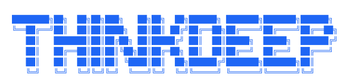

A study platform built around one idea: the mental model comes first, the code second.

Most DSA and frontend content teaches you to produce correct output. thinkdeep teaches you to _recognize the pattern_ — so that when you see a new problem, you already know which tool to reach for.

---

## How learning works here

Every topic follows the same progression:

**Fundamentals** — before a single problem is touched, you read a deep-dive guide built around analogy and intuition. Not "here's the algorithm." More like "here's why this structure exists and what problem it was invented to solve."

**Problems** — a curated first pass of problems that build the core pattern. Each one has a mental model hook, a reference implementation, and an embedded code environment so you can run and modify the solution without leaving the page.

**Reinforcement** — a second set of problems for after the concept has started to solidify. These surface the pattern's variations and edge cases, and deepen what the first pass started.

---

## The tracks

thinkdeep covers Data Structures & Algorithms, Frontend Engineering, Frontend Interview Prep, and System Design — all following the same fundamentals-first structure.

---

## The core belief

Most study content is written for people who already understand the concept. Explanations that lead with code don't build intuition — they give you something to copy.

thinkdeep inverts that. The goal isn't to produce correct output on a practice problem. It's to recognize the pattern well enough that a novel problem feels familiar.
