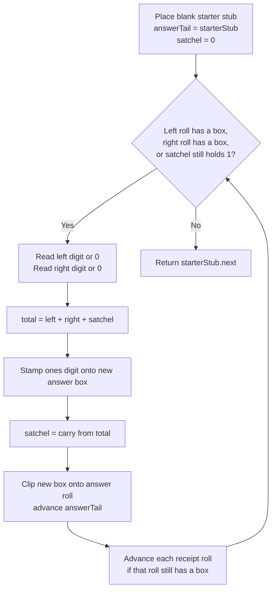

# Add Two Numbers - Mental Model

## The Problem

You are given two non-empty linked lists representing two non-negative integers. The digits are stored in reverse order, and each of their nodes contains a single digit. Add the two numbers and return the sum as a linked list.

You may assume the two numbers do not contain any leading zero, except the number 0 itself.

**Example 1:**
```
Input: l1 = [2,4,3], l2 = [5,6,4]
Output: [7,0,8]
```

**Example 2:**
```
Input: l1 = [0], l2 = [0]
Output: [0]
```

**Example 3:**
```
Input: l1 = [9,9,9,9,9,9,9], l2 = [9,9,9,9]
Output: [8,9,9,9,0,0,0,1]
```

## The Receipt Roll Adder Analogy

Imagine two cashiers hand you two receipt rolls. Each box on a roll holds one digit, but the rolls are printed backward: the ones place comes first, then tens, then hundreds. That sounds odd until you realize it matches exactly how you do grade-school addition. You start at the ones column, then move one column left at a time. On these rolls, "moving left" just means walking forward along the linked list.

Your job is to build a brand-new result roll. At each stop, you line up the current boxes from both receipt rolls, add those digits, and stamp one box onto the answer roll. If the sum is 10 or more, you keep the ones digit on the answer roll and tuck the extra 1 into an **overflow satchel** to carry into the next column.

To assemble the answer roll cleanly, you put down a **blank starter stub** before the first real answer box. That stub is not part of the final receipt. It is just a safe place to clip the first stamped digit, the second stamped digit, and every one after that without treating the first digit as a special case.

The key insight is that the backward storage order makes the addition natural, not awkward. The current boxes on the two rolls are already the next column you need to add. So the whole problem becomes: walk the two receipt rolls together, remember the overflow satchel between columns, and keep clipping stamped digits onto the answer roll.

## Understanding the Analogy

### The Setup

You have two receipt rolls and an empty answer roll. Each move forward on a roll reveals the next more-significant column. Sometimes one receipt roll runs out earlier than the other, but that does not stop the addition. An empty roll simply contributes a zero for every later column.

The answer roll is built one stamped box at a time. After each stamp, the clip point moves to the new end of the answer roll so the next box can attach there. The process ends only when both receipt rolls are exhausted and the overflow satchel is empty.

### The Blank Starter Stub and the Overflow Satchel

The blank starter stub solves a construction problem, not a math problem. Before the first answer digit exists, there is nowhere to clip a new box. The starter stub gives you that fixed clip point. After the work is done, you tear the stub off and keep everything after it as the real answer roll.

The overflow satchel is the memory of the previous column. If a column adds up to 13, you stamp `3` now and carry `1` in the satchel to the next column. That carried digit matters just as much as the digits on the rolls themselves. A later column might be `0 + 0 + carried 1`, which still produces a real answer box.

These two tools remove almost every awkward branch. The stub removes the "how do I start the answer roll?" branch. The satchel removes the "how do I remember overflow from the last column?" branch. With both in place, every column follows the same rhythm.

### Why This Approach

The obvious but wasteful alternative is to rebuild the full numbers, add them, then break the sum back into digits. That ignores the fact that the receipt rolls are already arranged in the exact order column addition wants. Walking the rolls directly turns the linked-list structure into an advantage.

Each box from each receipt roll is visited once, each answer box is stamped once, and the overflow satchel holds only a single digit. That makes the work linear in the total number of boxes, with constant extra bookkeeping beyond the new answer roll itself.

## How I Think Through This

I start by placing the blank starter stub and aiming `answerTail` at it. I also set `overflowSatchel = 0`. My loop condition is not just "while both rolls have boxes." It is "while at least one roll still has a box or the satchel still holds overflow." Inside the loop, I read `leftDigit` from `l1` if it exists, otherwise 0, and `rightDigit` from `l2` if it exists, otherwise 0. Then I total `leftDigit + rightDigit + overflowSatchel`, stamp the ones digit onto a new answer box, update `overflowSatchel` to the carry for the next round, clip the new box onto `answerTail.next`, and advance `answerTail`.

After stamping the answer box, I move each receipt roll forward if that roll still has a box. The invariant is: after every round, the answer roll contains every finished column so far in the correct order, and `overflowSatchel` holds the only unfinished piece from the most recent column. When the loop ends, there are no more boxes to read and no overflow left to settle, so `starterStub.next` is the full answer roll.

Take `[2,4,3]` and `[5,6,4]`.

:::trace-ll
[
  {"nodes":[{"val":"2|5"},{"val":"4|6"},{"val":"3|4"}],"pointers":[{"index":0,"label":"column","color":"blue"}],"action":null,"label":"Start at the ones column. Satchel=0, so the first stamp uses only 2 and 5."},
  {"nodes":[{"val":"7"},{"val":"4|6"},{"val":"3|4"}],"pointers":[{"index":1,"label":"column","color":"blue"}],"action":"rewire","label":"Stamped 7 from 2+5. Move to the next column with satchel still 0."},
  {"nodes":[{"val":"7"},{"val":"0"},{"val":"3|4"}],"pointers":[{"index":2,"label":"column","color":"blue"},{"index":2,"label":"carry=1","color":"purple"}],"action":"rewire","label":"4+6 makes 10. Stamp 0 now, tuck 1 into the satchel for the next column."},
  {"nodes":[{"val":"7"},{"val":"0"},{"val":"8"}],"pointers":[{"index":3,"label":"column","color":"blue"}],"action":"done","label":"3+4+1 makes 8. Stamp 8, both rolls end, satchel empties. Answer roll: [7,0,8] ✓"}
]
:::

---

## Building the Algorithm

Each step introduces one concept from the Receipt Roll Adder, then a StackBlitz embed to try it.

### Step 1: Stamp Columns While the Satchel Stays Empty

First build the answer-roll scaffolding: the blank starter stub, the answer clip point, and the loop that walks while either receipt roll still has boxes. In this first version, only handle the cases where every column total stays below 10, so the overflow satchel never needs to hold anything.

That still gives you real mileage. It solves `[2,4,3] + [5,4,1]` because the column sums are `7`, `8`, and `4`, all without overflow. It also solves cases where one roll is shorter, because a missing box can already count as zero. The question for this step is: how do you keep stamping answer boxes in the right order when the arithmetic itself is still simple?

:::stackblitz{file="step1-problem.ts" step=1 total=2 solution="step1-solution.ts"}

<details>
  <summary>Hints & gotchas</summary>

  - **Missing box means zero**: If one receipt roll has ended, that column still exists. Treat the missing side as `0` instead of stopping the whole stamping machine.
  - **Return after the starter stub**: The blank stub is scaffolding. The real answer roll starts at `starterStub.next`.
  - **Clip, then move the clip point**: After creating a new answer box, link it with `answerTail.next = ...`, then advance `answerTail = answerTail.next`.
  - **Step 1 assumes no overflow**: The tests for this step avoid any column sum of 10 or more. If you try to solve carry here, you are already doing step 2.
</details>

### Step 2: Carry the Overflow Satchel Forward

Now make the stamping machine realistic. Every column total may include the satchel from the previous column. When a total reaches 10 or more, stamp only the ones digit on the answer roll and keep the carried `1` in the satchel for the next column.

This is what allows a chain like `9 + 1` to become `0` now and "one extra for later," and it is what creates the final extra box in cases like `[9,9,9] + [1]`. Without the satchel, the machine forgets unfinished value between columns. With it, every round still follows the same routine; the only difference is that each total now includes the carried overflow and may produce a new one.

:::trace-ll
[
  {"nodes":[{"val":"2|5"},{"val":"4|6"},{"val":"3|4"}],"pointers":[{"index":0,"label":"column","color":"blue"}],"action":null,"label":"Satchel starts at 0. Stamp 7 from the first column and move on."},
  {"nodes":[{"val":"7"},{"val":"0"},{"val":"3|4"}],"pointers":[{"index":2,"label":"column","color":"blue"},{"index":2,"label":"carry=1","color":"purple"}],"action":"rewire","label":"Second column makes 10. Stamp 0 on the answer roll and carry 1 in the satchel."},
  {"nodes":[{"val":"7"},{"val":"0"},{"val":"8"}],"pointers":[{"index":2,"label":"column","color":"blue"}],"action":"rewire","label":"Third column adds 3 + 4 + satchel 1. Stamp 8 and empty the satchel."},
  {"nodes":[{"val":"7"},{"val":"0"},{"val":"8"}],"pointers":[{"index":3,"label":"column","color":"blue"}],"action":"done","label":"Both receipt rolls are finished and the satchel is empty. Tear off the stub and return [7,0,8] ✓"}
]
:::

:::stackblitz{file="step2-problem.ts" step=2 total=2 solution="step2-solution.ts"}

<details>
  <summary>Hints & gotchas</summary>

  - **Loop while the satchel still matters**: Even if both receipt rolls are empty, a leftover carry still has to stamp one more answer box.
  - **Two outputs from one total**: `total % 10` is the box you stamp now; `Math.floor(total / 10)` is what stays in the satchel for the next column.
  - **Advance each roll independently**: One receipt roll may end earlier. Move `l1` only if `l1 !== null`, and the same for `l2`.
  - **Do not mutate the input boxes into the answer roll**: This guide builds a fresh receipt roll with new nodes, one stamped box per finished column.
</details>

## Receipt Roll Adder at a Glance



## Tracing through an Example

Input: `l1 = [2,4,3]`, `l2 = [5,6,4]`

| Step | Left Receipt (`l1`) | Right Receipt (`l2`) | Overflow Satchel (`carry`) | Column Total | Stamped Box | Action | Answer Roll |
| ----- | ----- | ----- | ----- | ----- | ----- | ----- | ----- |
| Start | 2 | 5 | 0 | — | — | place starter stub and set answerTail there | [] |
| 1 | 2 | 5 | 0 | 7 | 7 | stamp 7, carry stays 0, advance both rolls | [7] |
| 2 | 4 | 6 | 0 | 10 | 0 | stamp 0, carry becomes 1, advance both rolls | [7,0] |
| 3 | 3 | 4 | 1 | 8 | 8 | stamp 8, carry returns to 0, advance both rolls | [7,0,8] |
| Done | null | null | 0 | — | — | both rolls empty and no overflow left; return after starter stub | [7,0,8] |

---

## Common Misconceptions

**"Because the digits are backward, I need to reverse the receipt rolls first."** — The backward order is already the friendly order for column addition. The ones column is at the front, exactly where the stamping machine wants to start. The correct mental model is: walking forward on the rolls is the same as moving leftward through handwritten addition.

**"The work stops as soon as one receipt roll ends."** — A missing box just means that side contributes zero for later columns. The other roll and the overflow satchel may still have work left. The correct mental model is: the machine stops only when both rolls are empty and the satchel is empty too.

**"If a column makes 14, I should stamp 14 as one node."** — Each box on a receipt roll can hold only a single digit. A two-digit column total must be split: the ones digit gets stamped now, and the extra 1 rides in the satchel. The correct mental model is: one finished box per column, overflow deferred to the next stop.

**"The starter stub should be part of the final answer."** — The stub is only the clip point that lets the first real answer box attach cleanly. Keeping it would add a fake leading box. The correct mental model is: build from the stub, then tear it off by returning `starterStub.next`.

## Complete Solution

:::stackblitz{file="solution.ts" step=2 total=2 solution="solution.ts"}
