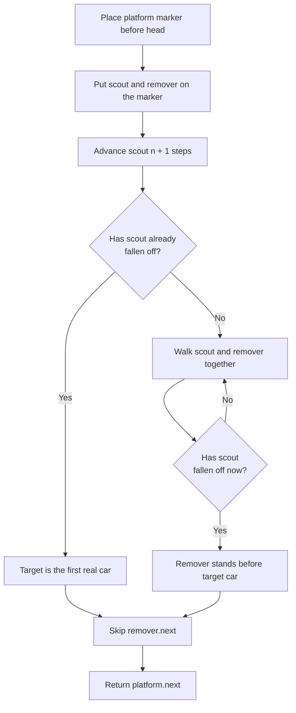

# Remove Nth Node From End of List - Mental Model

## The Problem

Given the `head` of a linked list, remove the `nth` node from the end of the list and return its head.

**Example 1:**
```
Input: head = [1,2,3,4,5], n = 2
Output: [1,2,3,5]
```

**Example 2:**
```
Input: head = [1], n = 1
Output: []
```

**Example 3:**
```
Input: head = [1,2], n = 1
Output: [1]
```

## The Train Platform Analogy

Imagine a train standing at a platform, one car after another. You need to uncouple one specific car, but the rule is awkward: not "the 3rd car from the front," but "the 3rd car from the back." You are not allowed to count the whole train first and then walk back. You want to identify the right uncoupling point in one smooth pass.

So you assign two railway workers. The first is the **scout**. The second is the **remover**. They both start on a special little platform marker placed just before the first real car. That marker is not part of the train; it is just a safe place to stand, especially useful when the first real car might be the one that gets removed.

The scout walks ahead first, creating a fixed gap of `n + 1` positions between the two workers. Once that gap is set, both workers walk forward together at the same speed. Because the gap never changes, when the scout finally steps off the far end of the train, the remover is standing exactly one car *before* the car that must be uncoupled.

That platform marker is the key insight. Without it, removing the very first car would be awkward because there would be no "car before the first car" to stand on. With the marker, every removal looks the same: the remover always stands in a valid place, then skips over the target car with one pointer change.

## Understanding the Analogy

### The Setup

There is a line of train cars, and one car must be removed based on how far it is from the caboose. The workers do not care about the front-number of the target car. They care only about building a reliable distance from the back.

The challenge is that a singly linked train only lets you walk forward. Once you move ahead, you cannot step backward to fix an earlier decision. That means the workers need a way to carry "distance from the end" information with them as they move.

### The Platform Marker and the Fixed Gap

The platform marker is the stand-in spot before the first real car. It gives both workers a legal place to begin, even if the very first car eventually gets removed.

The fixed gap is the real trick. The scout walks `n + 1` steps ahead. Why `n + 1` instead of `n`? Because the remover must stop one car *before* the target, not on the target itself. That extra step converts "target car" into "the car right before the target," which is exactly where the uncoupling work happens.

If the scout falls off the train immediately after setting the gap, that means the target is the first real car. The remover is still standing on the platform marker, which is perfect: the marker can skip over the first car just as easily as it can skip over any middle car.

### Why This Approach

The obvious alternative is to measure the entire train first, then walk again to the removal point. That works, but it uses two passes and treats the list like something you can easily index from both ends. You cannot.

The scout-remover method turns "count from the end" into "maintain a constant distance while walking forward." Each worker only moves forward, every node is visited at most once, and the platform marker removes the messy special case at the head. The whole job finishes in linear time with constant extra space.

## How I Think Through This

I start by placing a platform marker before `head`, then I put both pointers on it: `scout = platform` and `remover = platform`. My first phase is to create the fixed gap. I advance `scout` exactly `n + 1` times so the distance between the workers matches "one car before the target." The invariant after this phase is: there are always exactly `n` real cars between `remover.next` and the end of the train.

My second phase is the synchronized walk. While `scout !== null`, I move both workers one step at a time. Because the gap never changes, the moment `scout` steps off the train, `remover` is standing immediately before the car that must be removed. Then the uncoupling is one line: `remover.next = remover.next.next`. The final train begins at `platform.next`.

Take `[1,2,3,4,5]` with `n = 2`.

:::trace-ll
[
  {"nodes":[{"val":"P"},{"val":"1"},{"val":"2"},{"val":"3"},{"val":"4"},{"val":"5"}],"pointers":[{"index":0,"label":"remover","color":"blue"},{"index":0,"label":"scout","color":"orange"}],"action":null,"label":"Both workers start on the platform marker P."},
  {"nodes":[{"val":"P"},{"val":"1"},{"val":"2"},{"val":"3"},{"val":"4"},{"val":"5"}],"pointers":[{"index":0,"label":"remover","color":"blue"},{"index":3,"label":"scout","color":"orange"}],"action":null,"label":"Scout walks 3 steps ahead (n + 1). Gap set: remover at P, scout at car 3."},
  {"nodes":[{"val":"P"},{"val":"1"},{"val":"2"},{"val":"3"},{"val":"4"},{"val":"5"}],"pointers":[{"index":1,"label":"remover","color":"blue"},{"index":4,"label":"scout","color":"orange"}],"action":null,"label":"Both walk together. Remover reaches car 1, scout reaches car 4."},
  {"nodes":[{"val":"P"},{"val":"1"},{"val":"2"},{"val":"3"},{"val":"4"},{"val":"5"}],"pointers":[{"index":2,"label":"remover","color":"blue"},{"index":5,"label":"scout","color":"orange"}],"action":null,"label":"Both walk again. Remover reaches car 2, scout reaches car 5."},
  {"nodes":[{"val":"P"},{"val":"1"},{"val":"2"},{"val":"3"},{"val":"4"},{"val":"5"}],"pointers":[{"index":3,"label":"remover","color":"blue"},{"index":6,"label":"scout","color":"orange"}],"action":"delete","label":"Scout steps off the train. Remover stands before car 4, so skip car 4. Result: [1,2,3,5] ✓"}
]
:::

---

## Building the Algorithm

Each step introduces one concept from the Train Platform, then a StackBlitz embed to try it.

### Step 1: The Platform Marker and the Scout Gap

First, create the platform marker and place both workers there. Then send the scout ahead `n + 1` steps. At that point you already know one important family of cases: if the scout has stepped off the train immediately after the gap is created, then the target car must be the very first real car.

That means step 1 can already solve every "remove the head" case. The remover is still standing on the platform marker, so one uncoupling action skips the first real car and returns the rest of the train.

:::trace-ll
[
  {"nodes":[{"val":"P"},{"val":"1"},{"val":"2"},{"val":"3"}],"pointers":[{"index":0,"label":"remover","color":"blue"},{"index":0,"label":"scout","color":"orange"}],"action":null,"label":"Start both workers on platform marker P."},
  {"nodes":[{"val":"P"},{"val":"1"},{"val":"2"},{"val":"3"}],"pointers":[{"index":0,"label":"remover","color":"blue"},{"index":4,"label":"scout","color":"orange"}],"action":"delete","label":"For n = 3, scout walks n + 1 = 4 steps and immediately falls off. The first real car must be removed."}
]
:::

:::stackblitz{file="step1-problem.ts" step=1 total=2 solution="step1-solution.ts"}

<details>
  <summary>Hints & gotchas</summary>

  - **Why `n + 1`**: The remover must stand one car *before* the target, not on it. That extra step is what turns the scout's lead into an uncoupling position.
  - **Why the platform exists**: If the first real car is the target, there still has to be somewhere legal for the remover to stand. The platform marker is that safe standing spot.
  - **What step 1 can solve**: Only the cases where the target is the head. If the target is deeper in the train, the remover still has to walk forward with the scout later.
</details>

### Step 2: The Synchronized Walk and the Uncoupling

Now add the part that handles every non-head removal. Once the scout gap is established, march both workers forward together until the scout falls off the train. Because they move in lockstep, the gap never changes, and the remover arrives exactly one car before the target.

After that, the uncoupling is the same as in step 1: skip the next car. The difference is that step 2 earns the right place to do that skip by walking the remover into position.

:::trace-ll
[
  {"nodes":[{"val":"P"},{"val":"1"},{"val":"2"},{"val":"3"},{"val":"4"},{"val":"5"}],"pointers":[{"index":0,"label":"remover","color":"blue"},{"index":3,"label":"scout","color":"orange"}],"action":null,"label":"Gap already set for n = 2: remover at P, scout at car 3."},
  {"nodes":[{"val":"P"},{"val":"1"},{"val":"2"},{"val":"3"},{"val":"4"},{"val":"5"}],"pointers":[{"index":1,"label":"remover","color":"blue"},{"index":4,"label":"scout","color":"orange"}],"action":null,"label":"Both walk one step. Gap stays fixed."},
  {"nodes":[{"val":"P"},{"val":"1"},{"val":"2"},{"val":"3"},{"val":"4"},{"val":"5"}],"pointers":[{"index":2,"label":"remover","color":"blue"},{"index":5,"label":"scout","color":"orange"}],"action":null,"label":"Both walk again. Remover is getting closer to the uncoupling point."},
  {"nodes":[{"val":"P"},{"val":"1"},{"val":"2"},{"val":"3"},{"val":"4"},{"val":"5"}],"pointers":[{"index":3,"label":"remover","color":"blue"},{"index":6,"label":"scout","color":"orange"}],"action":"delete","label":"Scout falls off. Remover is parked before car 4, so skipping remover.next removes car 4."}
]
:::

:::stackblitz{file="step2-problem.ts" step=2 total=2 solution="step2-solution.ts"}

<details>
  <summary>Hints & gotchas</summary>

  - **Walk together, not just the scout**: If only the scout keeps moving, the remover never reaches the uncoupling point for middle or tail removals.
  - **Skip `remover.next`, not `remover`**: The remover is the worker's position. The target car is the one immediately after that position.
  - **Return `platform.next`**: The platform marker is scaffolding, not part of the final train.
</details>

## The Train Platform at a Glance



## Tracing through an Example

Input: `head = [1,2,3,4,5]`, `n = 2`

| Step | Scout Position (`scout`) | Remover Position (`remover`) | Gap Mission | Action | Train State |
| ----- | ----- | ----- | ----- | ----- | ----- |
| Start | platform marker | platform marker | not set yet | place platform and both workers | [1,2,3,4,5] |
| Gap 1 | car 1 | platform marker | 1 of 3 scout steps done | scout walks | [1,2,3,4,5] |
| Gap 2 | car 2 | platform marker | 2 of 3 scout steps done | scout walks | [1,2,3,4,5] |
| Gap 3 | car 3 | platform marker | 3 of 3 scout steps done | fixed gap established | [1,2,3,4,5] |
| Walk 1 | car 4 | car 1 | gap preserved | both workers walk | [1,2,3,4,5] |
| Walk 2 | car 5 | car 2 | gap preserved | both workers walk | [1,2,3,4,5] |
| Walk 3 | end | car 3 | scout fell off | remover is now before target car 4 | [1,2,3,4,5] |
| Done | end | car 3 | mission complete | skip car 4 by linking car 3 to car 5 | [1,2,3,5] |

---

## Common Misconceptions

**"The scout only needs to walk `n` steps ahead."** — That leaves the remover standing on the target car, not before it. In the train yard, uncoupling happens from the connector *before* the target car. The correct mental model is: the scout must be `n + 1` positions ahead so the remover lands on the connector spot.

**"The platform marker is optional."** — It feels optional until the first real car is the one being removed. Then there is nowhere legal to stand before it. The correct mental model is: the platform marker is a fake starting spot that makes head removal look identical to every other removal.

**"Once the scout gap is set, I can remove immediately."** — Only if the scout has already fallen off, which means the first real car is the target. For middle and tail removals, the remover still has to walk into place. The correct mental model is: gap first, synchronized walk second, skip last.

**"I should move the remover onto the target car."** — If the remover stands on the target car, it is already too late to cleanly skip it in a singly linked train. The correct mental model is: the remover's job is to stand one car before the target so it can reconnect the train around that car.

## Complete Solution

:::stackblitz{file="solution.ts" step=2 total=2 solution="solution.ts"}
