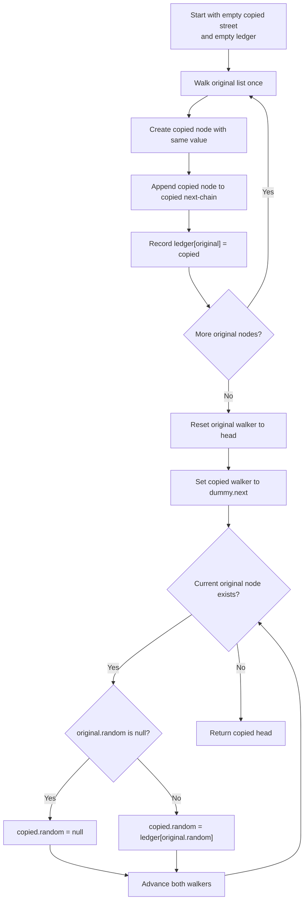

# Copy List with Random Pointer - Mental Model

## The Problem

A linked list of length `n` is given such that each node contains an additional `random` pointer, which could point to any node in the list, or `null`.

Construct a deep copy of the list. The deep copy should consist of exactly `n` brand new nodes, where each new node has its value set to the value of its corresponding original node. Both the `next` and `random` pointer of the new nodes should point to new nodes in the copied list such that the pointers in the original list and copied list represent the same list state. None of the pointers in the new list should point to nodes in the original list.

For example, if there are two nodes `X` and `Y` in the original list, where `X.random --> Y`, then for the corresponding two nodes `x` and `y` in the copied list, `x.random --> y`.

Return the head of the copied linked list.

The linked list is represented in the input/output as a list of `n` nodes. Each node is represented as a pair of `[val, random_index]` where:

- `val`: an integer representing `Node.val`
- `random_index`: the index of the node (range from `0` to `n - 1`) that the `random` pointer points to, or `null` if it does not point to any node

Your code will only be given the `head` of the original list.

**Example 1:**
```
Input: head = [[7,null],[13,0],[11,4],[10,2],[1,0]]
Output: [[7,null],[13,0],[11,4],[10,2],[1,0]]
```

**Example 2:**
```
Input: head = [[1,1],[2,1]]
Output: [[1,1],[2,1]]
```

**Example 3:**
```
Input: head = [[3,null],[3,0],[3,null]]
Output: [[3,null],[3,0],[3,null]]
```

## The Forwarding Office Analogy

Imagine an old street that is being rebuilt house by house on a brand-new street. Every old house has two kinds of arrows on its paperwork. One arrow is ordinary: it points to the next house down the street. The other is stranger: a private forwarding note that can point to any house on the street, or to nobody at all. That private note is the `random` pointer.

Your job is to rebuild the entire street without reusing a single old house. Every rebuilt house must have the same house number, the same next-house order, and the same private forwarding relationship, but all those arrows must stay inside the new street. Nothing in the rebuilt neighborhood is allowed to still point back into the demolished one.

The tricky part is that when you first build a new house, you may not yet have built the house its private note should point to. So the city planning office keeps a forwarding ledger: every time an old house gets rebuilt, the office records which brand-new house corresponds to it. Later, when you revisit the old street to copy private notes, that ledger tells you exactly which new house should receive each connection.

That leads to the key insight: make two passes. On the first pass, rebuild the ordinary street shape and fill the forwarding ledger from old house to new house. On the second pass, copy the private notes using the ledger. The ledger is what turns "find the copied version of whatever this random pointer targets" from a guessing problem into an instant lookup.

## Understanding the Analogy

### The Setup

The old street already exists. Every house has a `val`, a `next` arrow to the next house in line, and a `random` note that may jump anywhere. The new street starts empty.

As you walk the old street, you are not allowed to repaint old houses and call them new. Every house on the rebuilt street must be a fresh structure. So the real task is not "copy values." It is "build a second street whose arrows mirror the first one exactly."

### The Forwarding Ledger

The forwarding ledger records one correspondence per house:

- old house address -> new house address

This ledger is the whole strategy. Without it, when an old house says "my private note points to house 4," you would have no constant-time way to find the copied version of that target. With the ledger, `old.random` immediately becomes `ledger.get(old.random)`.

The important detail is timing. During the first pass, you may not be ready to fill a new house's private note yet, because its target house may appear later on the street. That is fine. The first pass only promises: "every old house now has a matching new house, and the ledger knows the pairing." Once that promise is true for the whole street, the second pass can safely fill every private note.

### Building the New Street in Two Passes

The first pass creates the new houses in ordinary `next` order. That gives you the correct street backbone and a complete ledger. The second pass uses both the old houses and the copied houses in lockstep: read the private note from the old house, consult the ledger, then write the corresponding private note onto the new house.

This is why the algorithm feels stable. Pass one handles construction. Pass two handles special cross-links. Nothing is guessed, and no pointer in the new street ever needs to point back into the old one.

### Why This Approach

You could try to clone each house and its private note immediately, but that breaks the moment a private note points to a house you have not rebuilt yet. The two-pass ledger approach avoids that timing trap completely.

Each old house is visited a constant number of times. The ledger stores one mapping per house. That gives `O(n)` time and `O(n)` extra space, which is the clean tradeoff for a true deep copy with arbitrary cross-links.

## How I Think Through This

I walk the old street once with `currentOld`. For each old house, I build a fresh `copiedHouse`, append it to the copied street with `copyTail.next`, and record `ledger.set(currentOld, copiedHouse)`. After this first pass, the copied street has the right values and `next` order, and the ledger knows the copied version of every original house.

Then I reset to the heads of both streets: `currentOld = head` and `currentCopy = dummy.next`. That reset matters because pass one exhausted the original walker, and the copied street must now be traversed in the same order as the original. The invariant is: once both walkers are reset, they always point at corresponding houses.

Inside the second pass, if `currentOld.random` is `null`, then `currentCopy.random` should also be `null`. Otherwise I look up `ledger.get(currentOld.random)!` and assign that copied house to `currentCopy.random`. Because the ledger was completed in pass one, every non-null target is already safe to translate.

Take `[[7,null],[13,0],[11,4],[10,2],[1,0]]`.

:::trace-map
[
  {"input":["7→∅","13→0","11→4","10→2","1→0"],"currentI":-1,"map":[],"highlight":null,"action":null,"label":"Start with an empty new street and an empty forwarding ledger.","vars":[{"name":"pass","value":"build"}]},
  {"input":["7→∅","13→0","11→4","10→2","1→0"],"currentI":0,"map":[["old0","new0"]],"highlight":"old0","action":"insert","label":"Build the first new house with value 7. Record old0 -> new0 in the ledger.","vars":[{"name":"pass","value":"build"}]},
  {"input":["7→∅","13→0","11→4","10→2","1→0"],"currentI":1,"map":[["old0","new0"],["old1","new1"]],"highlight":"old1","action":"insert","label":"Build the next house with value 13 and extend the copied street. Record old1 -> new1.","vars":[{"name":"pass","value":"build"}]},
  {"input":["7→∅","13→0","11→4","10→2","1→0"],"currentI":4,"map":[["old0","new0"],["old1","new1"],["old2","new2"],["old3","new3"],["old4","new4"]],"highlight":"old4","action":"done","label":"First pass ends with a full copied next-chain and a complete ledger from every old house to its new house.","vars":[{"name":"pass","value":"build"}]},
  {"input":["7→∅","13→0","11→4","10→2","1→0"],"currentI":1,"map":[["old0","new0"],["old1","new1"],["old2","new2"],["old3","new3"],["old4","new4"]],"highlight":"old0","action":"found","label":"Second pass: old1.random points to old0, so new1.random must point to new0 from the ledger.","vars":[{"name":"pass","value":"wire random"}]},
  {"input":["7→∅","13→0","11→4","10→2","1→0"],"currentI":2,"map":[["old0","new0"],["old1","new1"],["old2","new2"],["old3","new3"],["old4","new4"]],"highlight":"old4","action":"found","label":"old2.random points to old4, so new2.random points to new4.","vars":[{"name":"pass","value":"wire random"}]},
  {"input":["7→∅","13→0","11→4","10→2","1→0"],"currentI":-2,"map":[["old0","new0"],["old1","new1"],["old2","new2"],["old3","new3"],["old4","new4"]],"highlight":null,"action":"done","label":"Every copied private note now points only within the new street. Return the copied head. ✓","vars":[{"name":"pass","value":"wire random"}]}
]
:::

---

## Building the Algorithm

Each step introduces one concept from the Forwarding Office, then a StackBlitz embed to try it.

### Step 1: Build the New Street and Fill the Ledger

First ignore the private forwarding notes. Just rebuild the ordinary street shape from left to right. Create each new house with the same value, append it to the copied `next` chain, and record which old house maps to which new house in the forwarding ledger.

This step is already meaningful because it solves the simplest cases where the rebuilt street only needs the right values and `next` order. More importantly, it creates the one thing every later step depends on: a complete old-to-new lookup table.

:::trace-map
[
  {"input":["1→∅","2→∅","3→∅"],"currentI":-1,"map":[],"highlight":null,"action":null,"label":"Start with an empty copied street and empty ledger."},
  {"input":["1→∅","2→∅","3→∅"],"currentI":0,"map":[["old0","new0"]],"highlight":"old0","action":"insert","label":"Build the copied version of the first house and record old0 -> new0."},
  {"input":["1→∅","2→∅","3→∅"],"currentI":1,"map":[["old0","new0"],["old1","new1"]],"highlight":"old1","action":"insert","label":"Append the second copied house and extend the ledger."},
  {"input":["1→∅","2→∅","3→∅"],"currentI":2,"map":[["old0","new0"],["old1","new1"],["old2","new2"]],"highlight":"old2","action":"done","label":"Pass one ends with the copied next-chain built and every old house registered."}
]
:::

:::stackblitz{file="step1-problem.ts" step=1 total=3 solution="step1-solution.ts"}

<details>
  <summary>Hints & gotchas</summary>

  - **Use fresh houses only**: The copied street must be built from brand-new nodes, not recycled originals.
  - **A dummy head simplifies appending**: Keep `copyTail` at the end of the copied street so each new house attaches with one consistent move.
  - **Record the mapping immediately**: As soon as you create a copied house, write `ledger.set(original, copy)`.
  - **Step 1 stops after construction**: No second-pass reset and no private-note wiring yet.
</details>

### Step 2: Reset Both Walkers for the Second Pass

Pass one leaves `currentOld` at the end of the original street. Before you can copy private notes, you need to restart at the front of both neighborhoods. That means sending `currentOld` back to `head` and introducing `currentCopy` at `dummy.next`.

This step is small but real. It establishes the lockstep traversal that pass two depends on. Once both walkers are reset, the algorithm can move through the original and copied streets together, always keeping corresponding houses lined up.

:::trace-map
[
  {"input":["7→∅","13→0","11→4"],"currentI":-1,"map":[["old0","new0"],["old1","new1"],["old2","new2"]],"highlight":null,"action":null,"label":"Pass one is done. The ledger is complete, but the original walker has fallen off the end."},
  {"input":["7→∅","13→0","11→4"],"currentI":0,"map":[["old0","new0"],["old1","new1"],["old2","new2"]],"highlight":"old0","action":"found","label":"Reset `currentOld` to the original head so pass two starts at old0 again."},
  {"input":["7→∅","13→0","11→4"],"currentI":0,"map":[["old0","new0"],["old1","new1"],["old2","new2"]],"highlight":"old0","action":"done","label":"Set `currentCopy` to `dummy.next`, the head of the copied street. Now both walkers point at matching houses."}
]
:::

:::stackblitz{file="step2-problem.ts" step=2 total=3 solution="step2-solution.ts"}

<details>
  <summary>Hints & gotchas</summary>

  - **Do not smuggle this setup in for free**: resetting the walkers is part of the algorithm and belongs to the learner.
  - **The two streets have the same next-order now**: that is why `currentOld` and `currentCopy` can move together later.
  - **`dummy.next` is the copied head**: the copied street starts after the dummy, not at the dummy itself.
</details>

### Step 3: Translate the Private Notes Through the Ledger

Now the real cross-links can be copied. Walk both streets together. If the old house has no private note, write `null` on the copied house too. Otherwise translate the target through the forwarding ledger so the copied private note lands on the copied target, never the original one.

This is the whole payoff of the ledger. The second pass no longer guesses. It just translates old targets into new targets and advances both walkers until the whole street is wired.

:::trace-map
[
  {"input":["7→∅","13→0","11→4","10→2","1→0"],"currentI":0,"map":[["old0","new0"],["old1","new1"],["old2","new2"],["old3","new3"],["old4","new4"]],"highlight":"old0","action":"miss","label":"old0.random is null, so new0.random stays null.","vars":[{"name":"current old.random","value":"null"}]},
  {"input":["7→∅","13→0","11→4","10→2","1→0"],"currentI":1,"map":[["old0","new0"],["old1","new1"],["old2","new2"],["old3","new3"],["old4","new4"]],"highlight":"old0","action":"found","label":"old1.random targets old0, so write new1.random = new0.","vars":[{"name":"current old.random","value":"old0"}]},
  {"input":["7→∅","13→0","11→4","10→2","1→0"],"currentI":2,"map":[["old0","new0"],["old1","new1"],["old2","new2"],["old3","new3"],["old4","new4"]],"highlight":"old4","action":"found","label":"old2.random targets old4, so write new2.random = new4.","vars":[{"name":"current old.random","value":"old4"}]},
  {"input":["7→∅","13→0","11→4","10→2","1→0"],"currentI":4,"map":[["old0","new0"],["old1","new1"],["old2","new2"],["old3","new3"],["old4","new4"]],"highlight":"old0","action":"done","label":"The last private note is translated through the ledger. Every copied pointer now stays inside the new street.","vars":[{"name":"current old.random","value":"old0"}]}
]
:::

:::stackblitz{file="step3-problem.ts" step=3 total=3 solution="step3-solution.ts"}

<details>
  <summary>Hints & gotchas</summary>

  - **Translate, do not reuse**: `currentCopy.random` must point to a copied node from the ledger, never to `currentOld.random` directly.
  - **Null stays null**: a missing private note in the original list stays missing in the copied list.
  - **Advance both walkers together**: each old house and copied house represent the same street position during pass two.
  - **The ledger is already complete**: every non-null random target can be looked up safely.
</details>

## The Forwarding Office at a Glance



---

## Common Misconceptions

**"I can copy a house and immediately point its private note at the original target."** The forwarding office forbids that. A copied house must live entirely in the new neighborhood. The correct mental model is: every private note must be translated through the ledger from old house to new house.

**"One pass should be enough if I just do the random pointer first."** That fails whenever a private note points forward to a house you have not rebuilt yet. The correct mental model is: pass one makes the complete ledger, and only then can pass two safely wire private notes.

**"The copied street is deep as long as the values match."** Matching values is not enough. If any copied `next` or `random` pointer still lands on an old house, the clone is shallow and incorrect. The correct mental model is: structure and identity both matter.

**"If `random` is null, I should skip that copied house entirely."** Null is still real information about the pointer structure. The correct mental model is: a missing private note gets copied as a missing private note, not ignored.

## Complete Solution

:::stackblitz{file="solution.ts" step=3 total=3 solution="solution.ts"}
