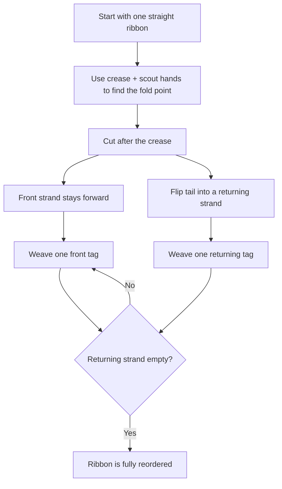

# Reorder List - Mental Model

## The Problem

You are given the head of a singly linked-list. The list can be represented as:

<pre>L<sub>0</sub> → L<sub>1</sub> → … → L<sub>n - 1</sub> → L<sub>n</sub></pre>

Reorder the list to be on the following form:

<pre>L<sub>0</sub> → L<sub>n</sub> → L<sub>1</sub> → L<sub>n - 1</sub> → L<sub>2</sub> → L<sub>n - 2</sub> → …</pre>

You may not modify the values in the list's nodes. Only nodes themselves may be changed.

**Example 1:**

```
Input: head = [1,2,3,4]
Output: [1,4,2,3]
```

**Example 2:**

```
Input: head = [1,2,3,4,5]
Output: [1,5,2,4,3]
```

## The Ribbon Fold Analogy

Imagine a long ribbon laid flat on a table, with numbered tags clipped along it in order. You are asked to restyle it into a decorative lace: first the tag at the left end, then the tag at the right end, then the next tag from the left, then the next from the right, and so on.

The awkward part is that the ribbon is stitched in one direction. Each tag only knows which tag comes after it. You cannot jump straight to the last tag whenever you want. So the trick is not to "grab from both ends" directly. Instead, you first find the ribbon's crease point, then flip the tail half back toward the front, and only then lace the two strands together.

That is the whole mental model. The first half stays facing forward on the table. The second half is turned into a **returning strand** by flipping its clips one by one. Once the tail is facing back toward the front, the two strands can be woven together naturally: front tag, returning tag, next front tag, next returning tag.

In this analogy, the midpoint pointer is your hand finding the crease, the reversal step is the tail being folded back into a returning strand, and the final merge is the actual lace pattern. The power of the method is that each phase prepares the next one. Without the crease, you do not know where to fold. Without the fold, the last tag is still trapped at the far end. Without the lace, the ribbon is only folded, not reordered.

## Understanding the Analogy

### The Setup

There is one long ribbon of tags, and the target pattern alternates from the outside inward. The leftmost tag must stay first, but after that every pick comes from the far end, then the near end, then the far end again.

Because the ribbon only points forward, the far end is not immediately usable. If you simply walk to the end, you have no backward path for weaving. The far end has to be turned around first so it can travel back toward the front.

### The Crease and the Returning Strand

The crease is the exact place where the ribbon should be folded. To find it without counting the whole ribbon first, one hand walks one tag at a time while the scout hand walks two. When the scout hand runs out of ribbon, the slower hand is resting at the crease.

Once the crease is known, you cut the ribbon into two strands. The front strand stays in place. The tail strand is then flipped so the last tag becomes the first tag on the returning strand. That flip is what turns "hard to reach the last tag" into "easy to take the next returning tag."

### Why This Approach

The brute-force instinct is to keep searching for the end over and over: take the first tag, then walk all the way to the last tag, then somehow go back near the front, then walk to the new last tag again. That wastes work and fights the one-way structure.

The crease-flip-lace approach respects how a singly linked ribbon behaves. You walk through the ribbon a constant number of times, never need extra storage for all the tags, and every pointer change has a clear purpose. First prepare the shape, then weave it.

## How I Think Through This

I start by treating `crease` and `scout` as the two hands finding where the ribbon should fold. `crease` moves one tag at a time, `scout` moves two. The invariant is: when `scout` runs out of ribbon, `crease` is at the last tag of the front strand. I cut at `crease.next`, because everything after that belongs to the tail that will be flipped back.

My second phase turns the cut tail into a returning strand. I keep `tailRibbon` on the unflipped tail and `returnRibbon` on the already-flipped part. Each pointer change flips one clip so the tail starts facing back toward the front. When `tailRibbon` becomes null, `returnRibbon` points at the old last tag, which is exactly the first tag I want to lace in next.

My final phase is the weave. `frontRibbon` walks the front strand, `returnRibbon` walks the flipped tail, and on each round I splice one returning tag after one front tag. The rule that keeps it correct is: save both "next" clips before rewiring either strand. When the returning strand is exhausted, the ribbon is fully laced in the required order.

Take `[1,2,3,4,5]`.

:::trace-ll
[
{"nodes":[{"val":"1"},{"val":"2"},{"val":"3"},{"val":"4"},{"val":"5"}],"pointers":[{"index":0,"label":"crease","color":"blue"},{"index":0,"label":"scout","color":"orange"}],"action":null,"label":"Both hands start at tag 1. crease and scout are together."},
{"nodes":[{"val":"1"},{"val":"2"},{"val":"3"},{"val":"4"},{"val":"5"}],"pointers":[{"index":1,"label":"crease","color":"blue"},{"index":2,"label":"scout","color":"orange"}],"action":null,"label":"After one move: crease reaches tag 2, scout reaches tag 3."},
{"nodes":[{"val":"1"},{"val":"2"},{"val":"3"},{"val":"4"},{"val":"5"}],"pointers":[{"index":2,"label":"crease","color":"blue"},{"index":4,"label":"scout","color":"orange"}],"action":"found","label":"After the next move: crease reaches tag 3, scout reaches tag 5. The crease is found."},
{"nodes":[{"val":"5"},{"val":"4"},{"val":"3"},{"val":"2"},{"val":"1"}],"pointers":[{"index":0,"label":"return","color":"green"},{"index":4,"label":"front","color":"blue"}],"action":"rewire","label":"Flip the tail [4,5] into a returning strand [5,4]. Front strand is still anchored from the 1 side."},
{"nodes":[{"val":"1"},{"val":"5"},{"val":"2"},{"val":"4"},{"val":"3"}],"pointers":[{"index":2,"label":"front","color":"blue"},{"index":3,"label":"return","color":"green"}],"action":"done","label":"Lace front and returning strands together: 1, then 5, then 2, then 4, with 3 left in place. Result: [1,5,2,4,3] ✓"}
]
:::

---

## Building the Algorithm

Each step introduces one concept from the Ribbon Fold, then a StackBlitz embed to try it.

### Step 1: The Crease

Before you can lace anything, you have to know where the ribbon folds. Use a crease hand and a scout hand to find the split point, then cut the ribbon into a front strand and a tail strand.

This step already handles the ribbons that are too short to need any styling at all. If there are fewer than three tags, the target pattern is identical to the original ribbon, so the correct move is to do nothing.

:::trace-ll
[
{"nodes":[{"val":"1"},{"val":"2"},{"val":"3"},{"val":"4"},{"val":"5"}],"pointers":[{"index":0,"label":"crease","color":"blue"},{"index":0,"label":"scout","color":"orange"}],"action":null,"label":"crease and scout start together at tag 1."},
{"nodes":[{"val":"1"},{"val":"2"},{"val":"3"},{"val":"4"},{"val":"5"}],"pointers":[{"index":1,"label":"crease","color":"blue"},{"index":2,"label":"scout","color":"orange"}],"action":null,"label":"crease moves one tag while scout jumps two."},
{"nodes":[{"val":"1"},{"val":"2"},{"val":"3"},{"val":"4"},{"val":"5"}],"pointers":[{"index":2,"label":"crease","color":"blue"},{"index":4,"label":"scout","color":"orange"}],"action":"done","label":"scout reaches the end. crease is at tag 3, so cut after it: front [1,2,3], tail [4,5]."}
]
:::

:::stackblitz{file="step1-problem.ts" step=1 total=2 solution="step1-solution.ts"}

<details>
  <summary>Hints & gotchas</summary>

- **Short ribbons need no fold**: `0`, `1`, or `2` tags already match the required pattern, so return immediately.
- **Cut after the crease**: the crease tag stays with the front strand; the tail begins at `crease.next`.
- **Why the scout jumps two**: the fast scout is what lets the slower crease hand discover the middle without counting the whole ribbon first.
</details>

### Step 2: The Return Weave

Now the tail has to become usable. Flip the tail strand so its last tag comes first. That creates the returning strand: the exact order needed from the back side of the ribbon.

Once the returning strand exists, lace the two strands together. After every front tag, splice in one returning tag. Save both upcoming clips before rewiring, because once you connect one tag to the other strand, the original path is no longer accessible through that tag.

:::trace-ll
[
{"nodes":[{"val":"1"},{"val":"2"},{"val":"3"},{"val":"5"},{"val":"4"}],"pointers":[{"index":0,"label":"front","color":"blue"},{"index":3,"label":"return","color":"green"}],"action":"rewire","label":"After step 1, the tail [4,5] is flipped into the returning strand [5,4]."},
{"nodes":[{"val":"1"},{"val":"5"},{"val":"2"},{"val":"3"},{"val":"4"}],"pointers":[{"index":2,"label":"front","color":"blue"},{"index":4,"label":"return","color":"green"}],"action":"rewire","label":"Weave round 1: splice returning tag 5 after front tag 1."},
{"nodes":[{"val":"1"},{"val":"5"},{"val":"2"},{"val":"4"},{"val":"3"}],"pointers":[{"index":2,"label":"front","color":"blue"},{"index":5,"label":"return","color":"green"}],"action":"done","label":"Weave round 2: splice returning tag 4 after front tag 2. Returning strand is empty, so stop. Tag 3 remains at the tail."}
]
:::

:::stackblitz{file="step2-problem.ts" step=2 total=2 solution="step2-solution.ts"}

<details>
  <summary>Hints & gotchas</summary>

- **Folding is not enough**: after the flip, you still have two separate strands. The reorder happens only during the weave.
- **Save both next clips first**: once `frontRibbon.next` or `returnRibbon.next` is rewired, the old path is gone unless you stored it.
- **Weave while the returning strand exists**: on odd-length ribbons, the front strand has one extra middle tag, and it should stay at the end automatically.
</details>

## The Ribbon Fold at a Glance



## Tracing through an Example

Input: `head = [1,2,3,4,5]`

| Step     | Crease Hand (`crease`) | Scout Hand (`scout`) | Tail Ribbon (`tailRibbon`) | Returning Strand (`returnRibbon`) | Front Strand Hand (`frontRibbon`) | Action                                                    | Ribbon State                   |
| -------- | ---------------------- | -------------------- | -------------------------- | --------------------------------- | --------------------------------- | --------------------------------------------------------- | ------------------------------ |
| Start    | tag 1                  | tag 1                | —                          | —                                 | —                                 | place both crease-finding hands at the front              | [1,2,3,4,5]                    |
| Crease 1 | tag 2                  | tag 3                | —                          | —                                 | —                                 | scout jumps two, crease moves one                         | [1,2,3,4,5]                    |
| Crease 2 | tag 3                  | tag 5                | —                          | —                                 | —                                 | crease found at tag 3                                     | [1,2,3,4,5]                    |
| Cut      | tag 3                  | tag 5                | tag 4                      | —                                 | tag 1                             | split after the crease                                    | front [1,2,3], tail [4,5]      |
| Flip 1   | tag 3                  | tag 5                | tag 5                      | tag 4                             | tag 1                             | flip tag 4 so it points back                              | front [1,2,3], returning [4]   |
| Flip 2   | tag 3                  | tag 5                | null                       | tag 5                             | tag 1                             | flip tag 5 so it becomes the head of the returning strand | front [1,2,3], returning [5,4] |
| Weave 1  | tag 3                  | tag 5                | null                       | tag 4                             | tag 2                             | splice tag 5 after tag 1                                  | [1,5,2,3] + returning [4]      |
| Weave 2  | tag 3                  | tag 5                | null                       | null                              | tag 3                             | splice tag 4 after tag 2                                  | [1,5,2,4,3]                    |
| Done     | tag 3                  | tag 5                | null                       | null                              | tag 3                             | returning strand exhausted; ribbon is finished            | [1,5,2,4,3]                    |

---

## Common Misconceptions

**"I can keep taking the last tag without folding the ribbon."** — On a one-way ribbon, the last tag is expensive to reach again and again. The correct mental model is: first turn the tail into a returning strand, then taking "from the back" becomes taking the next tag from that returned strand.

**"The crease tag should go into the tail strand."** — If the crease tag leaves the front strand, odd-length ribbons lose their middle anchor and the weave shifts out of order. The correct mental model is: the crease stays at the end of the front strand, and everything after it becomes the tail.

**"After reversing the tail, the job is done."** — A folded ribbon is still just two separate strands lying on the table. The correct mental model is: flipping prepares the material, but weaving is the step that actually creates the reorder pattern.

**"I can rewire first and remember the next tag later."** — Once a clip is redirected, the old path disappears from that tag. The correct mental model is: save the upcoming clips before every splice, or you cut off part of the ribbon by accident.

## Complete Solution

:::stackblitz{file="solution.ts" step=2 total=2 solution="solution.ts"}
