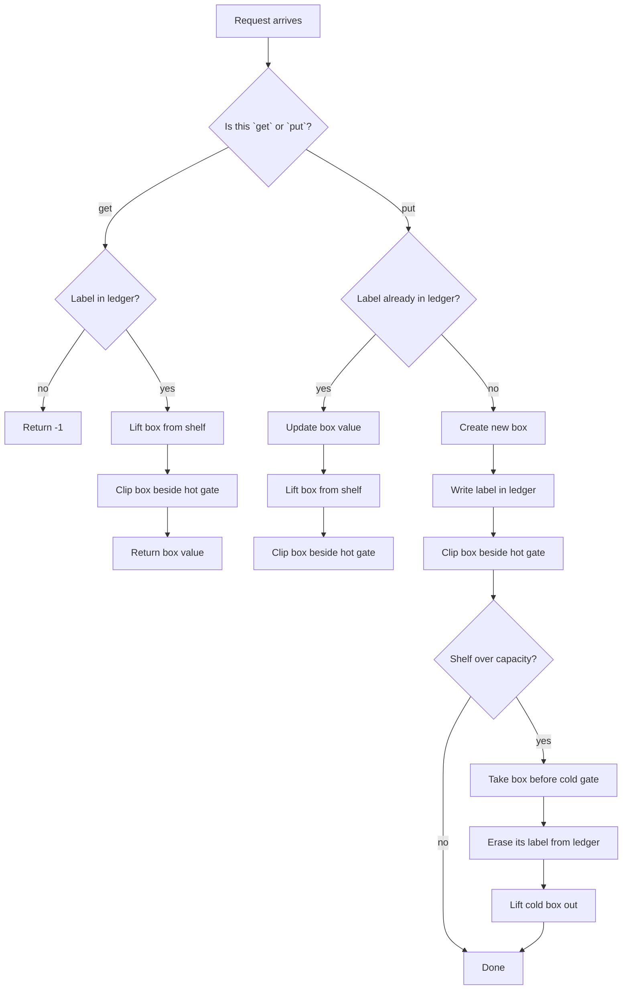

# LRU Cache - Mental Model

## The Problem

Design a data structure that follows the constraints of a Least Recently Used (LRU) cache.

Implement the `LRUCache` class:

- `LRUCache(int capacity)` Initialize the LRU cache with positive size `capacity`.
- `int get(int key)` Return the value of the `key` if the key exists, otherwise return `-1`.
- `void put(int key, int value)` Update the value of the `key` if the `key` exists. Otherwise, add the `key-value` pair to the cache. If the number of keys exceeds the `capacity` from this operation, evict the least recently used key.

The functions `get` and `put` must each run in `O(1)` average time complexity.

**Example 1:**

```
Input:
["LRUCache", "put", "put", "get", "put", "get", "put", "get", "get", "get"]
[[2], [1, 1], [2, 2], [1], [3, 3], [2], [4, 4], [1], [3], [4]]
Output:
[null, null, null, 1, null, -1, null, -1, 3, 4]
```

## The Hot Shelf Analogy

Imagine a tiny workshop shelf that can only hold a few tool boxes. The foreman wants the boxes he touched most recently to stay on the **hot shelf** right by his hands. The box he has ignored the longest belongs at the cold end, ready to be thrown out if space runs out.

The workshop needs two things at the same time. First, it needs a **ledger** so the foreman can instantly find a box by its label without scanning the whole shelf. Second, it needs a **physical shelf order** so it always knows which box is hottest and which one is coldest. The ledger answers "where is box 7?" The shelf answers "which box gets evicted next?"

That means every box lives in two worlds at once. In the ledger, each label points straight to its box. On the shelf, each box is connected to its warmer neighbor and its colder neighbor, so any touched box can be lifted out and moved to the hot end without disturbing the rest of the row.

The key insight is simple: **every touch reheats a box**. A successful `get` reheats it. A `put` for an existing label reheats it. A new `put` creates a fresh hot box. If the shelf is full, the coldest untouched box at the far end is the one that leaves.

## Understanding the Analogy

### The Setup

The workshop has a strict shelf limit. Once every slot is full, any new arrival forces one old box out. But the foreman is not allowed to stand there reading labels from left to right every time he needs something. That would be too slow.

So the workshop keeps a paper ledger by the shelf. The moment the foreman hears "bring me box 3," he looks up label 3 in the ledger and gets his hand directly onto the right box. No shelf scan. No guessing.

### The Ledger and the Shelf Rails

The ledger alone is not enough. It can find a box instantly, but it cannot tell which box has gone coldest over time. For that, the shelf itself has rails connecting the boxes from hot to cold.

The hot end sits right beside the foreman. The cold end sits by the discard bin. Every time a box is touched, it is unclipped from wherever it currently sits and snapped back onto the hot end. That makes the shelf order a live history of recent use.

Two permanent shelf stoppers make the rail work cleanly: one at the hot entrance and one at the cold exit. They are not real boxes anyone asks for. They just guarantee that every real box always has something on each side when it is clipped in or lifted out, so there are no awkward edge cases at the ends.

### Why This Approach

If the workshop used only a shelf, then finding box 42 would require a walk along the row. If it used only a ledger, it could find boxes quickly but would have no constant-time way to know which forgotten box should be evicted next.

The ledger plus the rail solves both problems at once. The ledger gives direct lookup. The rail gives direct reheating and direct eviction. A touch becomes: find the box in the ledger, unclip it, and snap it onto the hot end. An overflow becomes: grab the box nearest the cold exit and remove its label from the ledger. Everything important stays O(1).

## How I Think Through This

I think of `boxesByLabel` as the paper ledger and the linked shelf as the physical hot-to-cold order. The invariant is: the box right after `hotGate` is the most recently used real box, and the box right before `coldGate` is the eviction target. The gates themselves are just permanent shelf stoppers that make clipping operations uniform.

For `get(key)`, I first ask the ledger whether that label exists. If it does not, I return `-1` immediately. If it does, I take the recorded shelf node, lift that box out of its current slot, and snap it back beside `hotGate`. The value comes back with it, and the shelf order now reflects that this box was just touched.

For `put(key, value)`, there are two paths. If the label already exists, I update that box's contents and reheat it by moving it to the hot end. If the label is new, I build a new box, write it into the ledger, snap it onto the hot end, and then check capacity. If the shelf has overflowed, I remove the box just before `coldGate` because that is the coldest untouched one.

Take `capacity = 2` with operations `put(1,1), put(2,2), get(1), put(3,3)`.

:::trace-dll
[
{"nodes":[{"val":"HOT"},{"val":"1:1"},{"val":"COLD"}],"pointers":[{"index":1,"label":"recent","color":"green"}],"action":null,"label":"`put(1,1)` "},
{"nodes":[{"val":"HOT"},{"val":"2:2"},{"val":"1:1"},{"val":"COLD"}],"pointers":[{"index":1,"label":"recent","color":"green"},{"index":2,"label":"evict","color":"orange"}],"action":null,"label":"After `put(1,1)` and `put(2,2)`, box 2 is hottest and box 1 is coldest."},
{"nodes":[{"val":"HOT"},{"val":"1:1"},{"val":"2:2"},{"val":"COLD"}],"pointers":[{"index":1,"label":"recent","color":"green"},{"index":2,"label":"evict","color":"orange"}],"action":"found","label":"`get(1)` finds box 1 in the ledger, then reheats it onto the hot end. Now box 2 is coldest."},
{"nodes":[{"val":"HOT"},{"val":"3:3"},{"val":"1:1"},{"val":"COLD"}],"pointers":[{"index":1,"label":"recent","color":"green"},{"index":2,"label":"evict","color":"orange"}],"action":"done","label":"`put(3,3)` adds a fresh hot box. Shelf overflows, so cold box 2 is evicted. Remaining order: 3 hot, 1 cold."}
]
:::

---

## Building the Algorithm

### Step 1: Build the Box and Empty Shelf

Before the cache can move boxes around, it needs the workshop hardware. That means two things: the shape of one real shelf box, and the empty shelf that those boxes will eventually live on.

Start with the box. A `ShelfNode` stores a `key` and a `value`, but it also stores `warmer` and `colder` links. That is what allows one entry to sit in the recency line. A fresh box has not been clipped onto the shelf yet, so those links start as `null`.

Then build the empty shelf itself. The cache constructor needs a `capacity`, a ledger called `boxesByLabel`, and two permanent gate boxes: `hotGate` and `coldGate`. Those gates are not real entries. They are just structural anchors at the two ends of the shelf.

The empty shelf should look like this:

`hotGate -> coldGate`

That means:

- `hotGate.colder = coldGate`
- `coldGate.warmer = hotGate`

Now the workshop has a valid empty row even before any real boxes arrive. That is the starting point every later step depends on.

:::trace-dll
[
{"nodes":[{"val":"HOT"},{"val":"COLD"}],"pointers":[{"index":0,"label":"hotGate","color":"green"},{"index":1,"label":"coldGate","color":"orange"}],"action":null,"label":"Step 1 builds the empty shelf: two permanent gates, an empty ledger, and open space where real boxes will later be clipped in."}
]
:::

:::stackblitz{file="step1-problem.ts" step=1 total=6 solution="step1-solution.ts"}

<details>
  <summary>Hints & gotchas</summary>

- **The node and cache scaffold belong together**: the shelf boxes and the empty shelf are the foundation everything else uses.
- **A fresh real box starts detached**: `warmer` and `colder` stay `null` until the shelf clips it in later.
- **The gates are sentinels**: they are structure, not real cache entries.
- **Wire the empty shelf immediately**: the constructor should make `hotGate` and `coldGate` point at each other from the start.
</details>

### Step 2: Add the Removal Move

Now that the shelf exists, teach it its first real physical move: how to lift one box out of the row.

Picture a box somewhere between a warmer neighbor and a colder neighbor. Removing it does not mean deleting the whole shelf, shifting every box, or searching for a new place. It means doing a tiny local repair around that one box.

The node you want to remove already has two pointers:

- `box.warmer` points to the box just closer to the hot end
- `box.colder` points to the box just closer to the cold end

So "remove this box" really means: look at those two neighbors, then make them point to each other instead of to `box`.

If the shelf looks like:

`warmerBox -> box -> colderBox`

then removing `box` means:

- `warmerBox.colder = colderBox`
- `colderBox.warmer = warmerBox`

That is the entire mental model for `removeBox`. The removed box stops being part of the shelf order, and the two surrounding boxes become direct neighbors. You are not changing the whole list. You are only rewiring the two arrows that used to pass through `box`.

This is exactly why the sentinel gates matter. Even if `box` is the only real box, its neighbors are still well-defined:

`hotGate -> box -> coldGate`

Removing `box` still uses the same two assignments:

- `hotGate.colder = coldGate`
- `coldGate.warmer = hotGate`

No special case. Same move, same mental model.

:::trace-dll
[
{"nodes":[{"val":"HOT"},{"val":"3:30"},{"val":"2:20"},{"val":"1:10"},{"val":"COLD"}],"pointers":[{"index":1,"label":"warmer","color":"green"},{"index":2,"label":"remove","color":"blue"},{"index":3,"label":"colder","color":"orange"}],"action":null,"label":"Start with box 2 in the middle. Its `warmer` pointer reaches box 3, and its `colder` pointer reaches box 1."},
{"nodes":[{"val":"HOT"},{"val":"3:30"},{"val":"2:20"},{"val":"1:10"},{"val":"COLD"}],"pointers":[{"index":1,"label":"set 3.colder = 1","color":"green"},{"index":3,"label":"set 1.warmer = 3","color":"orange"}],"action":"rewire","label":"`removeBox(2)` uses box 2's two neighbors and reconnects them directly. The shelf is repaired around the gap."},
{"nodes":[{"val":"HOT"},{"val":"3:30"},{"val":"1:10"},{"val":"COLD"}],"pointers":[{"index":1,"label":"warmer side","color":"green"},{"index":2,"label":"colder side","color":"orange"}],"action":"done","label":"After removal, box 2 is no longer in the row. The visible shelf order is now HOT -> 3 -> 1 -> COLD."},
{"nodes":[{"val":"HOT"},{"val":"7:70"},{"val":"COLD"}],"pointers":[{"index":1,"label":"remove","color":"blue"}],"action":null,"label":"Same idea at the edge case: if the shelf has one real box, its neighbors are the two gates."},
{"nodes":[{"val":"HOT"},{"val":"COLD"}],"pointers":[{"index":0,"label":"hotGate","color":"green"},{"index":1,"label":"coldGate","color":"orange"}],"action":"done","label":"Removing that lone box rewires HOT directly to COLD. The exact same move still works."}
]
:::

:::stackblitz{file="step2-problem.ts" step=2 total=6 solution="step2-solution.ts"}

<details>
  <summary>Hints & gotchas</summary>

- **This step is only about removal**: no lookups, inserts, or eviction logic yet.
- **Use the neighbors, not the key**: removal is purely pointer rewiring.
- **The same rule works at the ends**: because of the gates, removing the only real box still follows the same two-link reconnection.
</details>

### Step 3: Add the Hot-Shelf Insertion Move

The second shelf move is the opposite of removal: clip a box in right after `hotGate`.

That spot always means "most recently used." So if a new box arrives, or an old box is reheated, it should snap into the first real position after the hot gate.

If the shelf starts like:

`hotGate -> firstWarmBox`

and you want to insert `box`, then after the move it should look like:

`hotGate -> box -> firstWarmBox`

That means:

- `box.warmer = hotGate`
- `box.colder = firstWarmBox`
- `hotGate.colder = box`
- `firstWarmBox.warmer = box`

:::trace-dll
[
{"nodes":[{"val":"HOT"},{"val":"1:10"},{"val":"COLD"}],"pointers":[{"index":1,"label":"recent","color":"green"}],"action":"rewire","label":"Step 3 teaches `addBoxToHotShelf`: a real box clips in immediately after `hotGate`."},
{"nodes":[{"val":"HOT"},{"val":"2:20"},{"val":"1:10"},{"val":"COLD"}],"pointers":[{"index":1,"label":"recent","color":"green"}],"action":"rewire","label":"Adding another box rewires the front of the row so the newest box becomes hottest."}
]
:::

:::stackblitz{file="step3-problem.ts" step=3 total=6 solution="step3-solution.ts"}

<details>
  <summary>Hints & gotchas</summary>

- **This step is only about insertion at the hot end**: do not add map logic yet.
- **The hot slot is always first**: insert directly after `hotGate`, never somewhere in the middle.
- **Think in local rewiring**: only the new box, the hot gate, and the old first box need to change.
</details>

### Step 4: Build `get`

Now connect the ledger to the shelf. `get` is the first full cache operation because it uses both worlds at once.

The ledger answers "does this label exist?" and gives you the exact shelf node in O(1). The shelf then updates recency order. A successful read is still a touch, so the box must leave its old position and come back right after `hotGate`.

That means `get` has two paths:

- if the label is missing, return `-1`
- if the label exists, remove that box from its current position, add it back to the hot shelf, and return its value

:::trace-dll
[
{"nodes":[{"val":"HOT"},{"val":"2:20"},{"val":"1:10"},{"val":"COLD"}],"pointers":[{"index":2,"label":"read","color":"blue"}],"action":"found","label":"Before `get(1)`, box 1 exists but sits behind a hotter box."},
{"nodes":[{"val":"HOT"},{"val":"1:10"},{"val":"2:20"},{"val":"COLD"}],"pointers":[{"index":1,"label":"recent","color":"green"}],"action":"rewire","label":"After `get(1)`, box 1 is moved back beside the hot gate because every successful touch reheats it."}
]
:::

:::stackblitz{file="step4-problem.ts" step=4 total=6 solution="step4-solution.ts"}

<details>
  <summary>Hints & gotchas</summary>

- **A successful read changes the structure**: `get` is not just lookup, it is also reheating.
- **The ledger must store nodes, not values**: `get` needs the exact box to hand to the shelf moves.
- **Do not create a new box on read**: move the existing node.
</details>

### Step 5: Build `put` for Updates and New Boxes

Now teach the cache what a `put` means before eviction enters the picture.

`put` is really two different moves hiding behind one method. Sometimes it updates a box that already exists. Sometimes it creates a brand-new box.

Start with the existing-label case. If the ledger already knows the key, then the cache already has a real physical box for it. That means you do not create another box. You update the same box's value, remove that box from its current spot, and clip it back beside `hotGate`.

Then think about the new-label case. If the ledger does not know the key, there is no old box to update. So the cache builds a fresh `ShelfNode`, writes it into the ledger, and clips it onto the hot end.

That is the whole mental model for this step:

- existing label: update the same box and reheat it
- new label: create a fresh box and place it hot

:::trace-dll
[
{"nodes":[{"val":"HOT"},{"val":"2:20"},{"val":"1:10"},{"val":"COLD"}],"pointers":[{"index":1,"label":"hottest","color":"green"},{"index":2,"label":"existingBox","color":"blue"}],"action":null,"label":"Start with label 1 already on the shelf. The ledger finds that same physical box immediately."},
{"nodes":[{"val":"HOT"},{"val":"1:15"},{"val":"2:20"},{"val":"COLD"}],"pointers":[{"index":1,"label":"updated + reheated","color":"green"}],"action":"rewire","label":"`put(1,15)` does not create a new node. It updates box 1's value, removes that same box, and clips it back beside the hot gate."},
{"nodes":[{"val":"HOT"},{"val":"1:15"},{"val":"2:20"},{"val":"COLD"}],"pointers":[{"index":1,"label":"hottest","color":"green"}],"action":null,"label":"Now try a brand-new label. There is no existing box for key 3, so the cache must create one."},
{"nodes":[{"val":"HOT"},{"val":"3:30"},{"val":"1:15"},{"val":"2:20"},{"val":"COLD"}],"pointers":[{"index":1,"label":"freshBox","color":"blue"},{"index":2,"label":"older","color":"green"}],"action":"found","label":"`put(3,30)` builds a fresh node, records it in the ledger, and clips it onto the hot end because new arrivals are hottest immediately."}
]
:::

:::stackblitz{file="step5-problem.ts" step=5 total=6 solution="step5-solution.ts"}

<details>
  <summary>Hints & gotchas</summary>

- **Existing label means same node**: update and move the old box; do not create a duplicate.
- **The early `return` matters**: once you finish the existing-label path, stop before the new-box path runs.
- **A brand-new `put` is still a touch**: a new box belongs right beside `hotGate`.
</details>

### Step 6: Evict the Cold Box on Overflow

Now add the actual LRU rule.

By this point, the cache already knows how boxes arrive and how touched boxes move. Now there is only one missing question: what happens when the shelf is too full?

You do not search for the eviction target. The shelf has already been keeping that answer ready for you. The box closest to `coldGate` is always the least recently used one.

So after a new box is clipped onto the hot end, check whether the cache is now over capacity. If it is, take the box immediately before `coldGate`, delete its label from the ledger, and remove that box from the shelf.

The eviction target is not:

- the smallest key
- the oldest inserted key
- the lowest value

It is specifically the least recently used box, which the shelf represents as the node nearest `coldGate`.

:::trace-dll
[
{"nodes":[{"val":"HOT"},{"val":"1:1"},{"val":"2:2"},{"val":"COLD"}],"pointers":[{"index":1,"label":"hotter","color":"green"},{"index":2,"label":"coldestBox","color":"orange"}],"action":null,"label":"Capacity is 2. After `get(1)`, box 1 is hot and box 2 is the coldest box because it sits nearest `coldGate`."},
{"nodes":[{"val":"HOT"},{"val":"3:3"},{"val":"1:1"},{"val":"2:2"},{"val":"COLD"}],"pointers":[{"index":1,"label":"freshBox","color":"blue"},{"index":3,"label":"coldestBox","color":"orange"}],"action":"rewire","label":"`put(3,3)` first adds the new box to the hot end. That temporarily leaves 3 real boxes on a shelf with capacity 2."},
{"nodes":[{"val":"HOT"},{"val":"3:3"},{"val":"1:1"},{"val":"2:2"},{"val":"COLD"}],"pointers":[{"index":3,"label":"delete from ledger","color":"orange"}],"action":"delete","label":"To evict, look one step before `coldGate`. That node is box 2, so label 2 is erased from the ledger."},
{"nodes":[{"val":"HOT"},{"val":"3:3"},{"val":"1:1"},{"val":"COLD"}],"pointers":[{"index":2,"label":"new cold side","color":"orange"}],"action":"done","label":"Then remove that same cold box from the shelf. The cache is back to capacity, with 3 hot and 1 cold."}
]
:::

:::stackblitz{file="step6-problem.ts" step=6 total=6 solution="step6-solution.ts"}

<details>
  <summary>Hints & gotchas</summary>

- **Evict only after overflow**: capacity is checked after the new box is added.
- **The eviction target is structural**: it is the node at `coldGate.warmer`.
- **Remove from both worlds**: delete the label from the ledger and unlink the box from the shelf.
</details>

## The Hot Shelf at a Glance



---

## Common Misconceptions

**"The map alone is the cache."** — The ledger can tell you where a labeled box is, but it cannot tell you which untouched box has gone coldest. The correct mental model is: the ledger finds boxes; the shelf order decides eviction.

**"A `get` should not change the structure because it only reads."** — On the hot shelf, reading a box is still touching it with the foreman's hand. The correct mental model is: every successful touch reheats the box and moves it to the hot end.

**"I can evict before I insert the new box."** — That treats the new box like it has not been touched yet, which is backwards. The correct mental model is: the arriving box is immediately hottest, so clip it onto the hot end first, then discard the cold box if the shelf overflowed.

**"I can store values in the ledger and search the shelf only when I need to move something."** — The moment you search the shelf, you lose O(1) behavior. The correct mental model is: each ledger entry must point directly to the physical box node so lift-and-clip stays constant time.

## Complete Solution

:::stackblitz{file="solution.ts" step=6 total=6 solution="solution.ts"}
