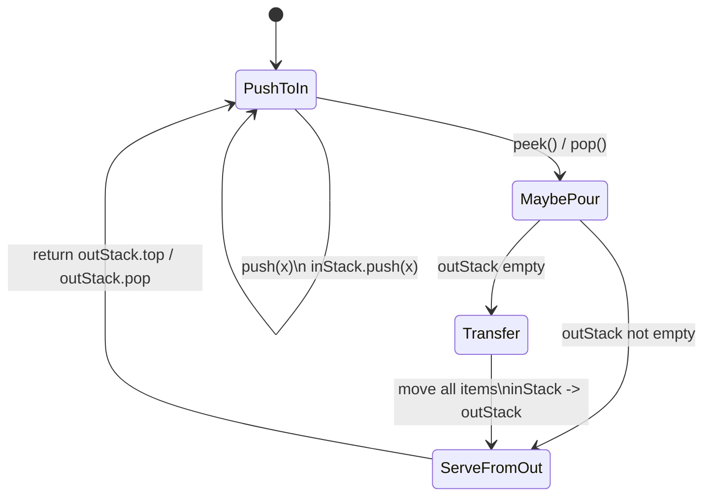

# Implement Queue using Stacks - Mental Model

## The Problem

Design a first-in, first-out queue using only standard stack operations.

You need to support:

- `push(x)` — add `x` to the back of the queue
- `pop()` — remove and return the front element
- `peek()` — return the front element without removing it
- `empty()` — report whether the queue is empty

## The Two-Shelf Analogy

Imagine a ticket line managed with two vertical shelves of trays.

The **arrival shelf** (`inStack`) is where every new ticket gets dropped. New arrivals always land on top, so this shelf is naturally last-in, first-out.

The **service shelf** (`outStack`) is where the clerk serves customers from. When the clerk needs the next ticket and the service shelf is empty, they lift every tray from the arrival shelf and place it onto the service shelf one by one. That full pour reverses the order. The oldest ticket, which was buried at the bottom of the arrival shelf, becomes the top tray on the service shelf.

That is the whole trick:

- `push` only touches the arrival shelf
- `pop` and `peek` only use the service shelf
- only when the service shelf is empty do you pour from arrival to service

The queue order is never stored separately. It is implied by both shelves together: front tickets live on top of `outStack`, and brand-new arrivals wait inside `inStack` until a future pour.

## Why This Works

A stack reverses order. Two reversals restore the original oldest-first order at the moment you need to serve.

If you poured on every `push`, you would do unnecessary work. The lazy rule is better:

- keep stacking new arrivals into `inStack`
- only pour when `outStack` is empty and someone asks for the front

That makes each element move at most twice:

1. pushed once into `inStack`
2. maybe transferred once into `outStack`

So even though one `pop` can trigger a big pour, the amortized cost is still O(1) per operation.

---

## How I Think Through This

I treat `inStack` as "new arrivals I have not reversed yet" and `outStack` as "front of the queue, ready to serve." The invariant is simple: if `outStack` has anything, its top is the true queue front.

Take the sequence `push(1), push(2), push(3), peek(), pop(), push(4)`.

:::trace-sq
[
  {
    "structures": [
      { "kind": "stack", "label": "inStack", "items": [], "color": "blue" },
      { "kind": "stack", "label": "outStack", "items": [], "color": "orange" },
      { "kind": "queue", "label": "queue view", "items": [], "color": "green" }
    ],
    "action": null,
    "label": "Setup: both stacks start empty, so the effective queue is empty too."
  },
  {
    "structures": [
      { "kind": "stack", "label": "inStack", "items": [1], "color": "blue", "activeIndices": [0], "pointers": [{ "index": 0, "label": "top" }] },
      { "kind": "stack", "label": "outStack", "items": [], "color": "orange" },
      { "kind": "queue", "label": "queue view", "items": [1], "color": "green", "activeIndices": [0], "pointers": [{ "index": 0, "label": "front" }, { "index": 0, "label": "back" }] }
    ],
    "action": "push",
    "label": "Push 1: new arrivals always land on `inStack`. Queue order is now `1`."
  },
  {
    "structures": [
      { "kind": "stack", "label": "inStack", "items": [1, 2], "color": "blue", "activeIndices": [1], "pointers": [{ "index": 1, "label": "top" }] },
      { "kind": "stack", "label": "outStack", "items": [], "color": "orange" },
      { "kind": "queue", "label": "queue view", "items": [1, 2], "color": "green", "activeIndices": [0, 1], "pointers": [{ "index": 0, "label": "front" }, { "index": 1, "label": "back" }] }
    ],
    "action": "push",
    "label": "Push 2: it stacks above 1 in `inStack`, but the queue still reads oldest → newest as `1, 2`."
  },
  {
    "structures": [
      { "kind": "stack", "label": "inStack", "items": [1, 2, 3], "color": "blue", "activeIndices": [2], "pointers": [{ "index": 2, "label": "top" }] },
      { "kind": "stack", "label": "outStack", "items": [], "color": "orange" },
      { "kind": "queue", "label": "queue view", "items": [1, 2, 3], "color": "green", "activeIndices": [0, 2], "pointers": [{ "index": 0, "label": "front" }, { "index": 2, "label": "back" }] }
    ],
    "action": "push",
    "label": "Push 3: arrivals keep piling onto `inStack`. No transfer yet because nobody has asked for the front."
  },
  {
    "structures": [
      { "kind": "stack", "label": "inStack", "items": [], "color": "blue" },
      { "kind": "stack", "label": "outStack", "items": [3, 2, 1], "color": "orange", "activeIndices": [2], "pointers": [{ "index": 2, "label": "top" }] },
      { "kind": "queue", "label": "queue view", "items": [1, 2, 3], "color": "green", "activeIndices": [0], "pointers": [{ "index": 0, "label": "front" }, { "index": 2, "label": "back" }] }
    ],
    "action": "transfer",
    "label": "Peek request: `outStack` is empty, so pour everything from `inStack` into `outStack`. One reversal exposes the oldest item, `1`, at the top."
  },
  {
    "structures": [
      { "kind": "stack", "label": "inStack", "items": [], "color": "blue" },
      { "kind": "stack", "label": "outStack", "items": [3, 2, 1], "color": "orange", "activeIndices": [2], "pointers": [{ "index": 2, "label": "top" }] },
      { "kind": "queue", "label": "queue view", "items": [1, 2, 3], "color": "green", "activeIndices": [0], "pointers": [{ "index": 0, "label": "front" }, { "index": 2, "label": "back" }] }
    ],
    "action": "peek",
    "label": "Peek: now the front lives on top of `outStack`, so return `1` without removing it."
  },
  {
    "structures": [
      { "kind": "stack", "label": "inStack", "items": [], "color": "blue" },
      { "kind": "stack", "label": "outStack", "items": [3, 2], "color": "orange", "activeIndices": [1], "pointers": [{ "index": 1, "label": "top" }] },
      { "kind": "queue", "label": "queue view", "items": [2, 3], "color": "green", "activeIndices": [0], "pointers": [{ "index": 0, "label": "front" }, { "index": 1, "label": "back" }] }
    ],
    "action": "dequeue",
    "label": "Pop: remove the top of `outStack`. Queue front advances from `1` to `2`."
  },
  {
    "structures": [
      { "kind": "stack", "label": "inStack", "items": [4], "color": "blue", "activeIndices": [0], "pointers": [{ "index": 0, "label": "top" }] },
      { "kind": "stack", "label": "outStack", "items": [3, 2], "color": "orange", "activeIndices": [1], "pointers": [{ "index": 1, "label": "top" }] },
      { "kind": "queue", "label": "queue view", "items": [2, 3, 4], "color": "green", "activeIndices": [0, 2], "pointers": [{ "index": 0, "label": "front" }, { "index": 2, "label": "back" }] }
    ],
    "action": "enqueue",
    "label": "Push 4: because `outStack` still has ready-to-serve items, the front stays `2`. The new arrival waits on `inStack` until a later transfer."
  }
]
:::

That last step is the key teaching moment. `4` is newer than `2` and `3`, so it must not jump ahead just because it was the latest push. Leaving it in `inStack` preserves FIFO order.

---

## Building the Algorithm

### Step 1: Separate Arrival from Service

Start with two stacks:

- `inStack` for every `push`
- `outStack` for the front-facing operations later

At this stage, `push` is just `inStack.push(x)`, and `empty()` is true only when both stacks are empty.

:::stackblitz{file="step1-problem.ts" step=1 total=2 solution="step1-solution.ts"}

Hints & gotchas

- **Do not push into both stacks.** `inStack` is the landing zone for every new element.
- **`empty()` must inspect both stacks.** Items might already have been transferred into `outStack`.
- **The queue is represented by the pair, not one stack alone.**

### Step 2: Pour Only When Needed

Now add one helper: if `outStack` is empty, move everything from `inStack` to `outStack`.

That helper should run before `pop()` and `peek()`. After the pour, the oldest queued item sits on top of `outStack`, exactly where a stack can serve it.

:::trace-sq
[
  {
    "structures": [
      { "kind": "stack", "label": "inStack", "items": [10, 20], "color": "blue", "activeIndices": [1], "pointers": [{ "index": 1, "label": "top" }] },
      { "kind": "stack", "label": "outStack", "items": [], "color": "orange" },
      { "kind": "queue", "label": "queue view", "items": [10, 20], "color": "green", "activeIndices": [0], "pointers": [{ "index": 0, "label": "front" }, { "index": 1, "label": "back" }] }
    ],
    "action": null,
    "label": "Before `pop`: all items still live in `inStack`, so front is hidden at the bottom."
  },
  {
    "structures": [
      { "kind": "stack", "label": "inStack", "items": [], "color": "blue" },
      { "kind": "stack", "label": "outStack", "items": [20, 10], "color": "orange", "activeIndices": [1], "pointers": [{ "index": 1, "label": "top" }] },
      { "kind": "queue", "label": "queue view", "items": [10, 20], "color": "green", "activeIndices": [0], "pointers": [{ "index": 0, "label": "front" }, { "index": 1, "label": "back" }] }
    ],
    "action": "transfer",
    "label": "Pour all trays from `inStack` to `outStack`. The oldest item, `10`, reaches the top."
  },
  {
    "structures": [
      { "kind": "stack", "label": "inStack", "items": [], "color": "blue" },
      { "kind": "stack", "label": "outStack", "items": [20], "color": "orange", "activeIndices": [0], "pointers": [{ "index": 0, "label": "top" }] },
      { "kind": "queue", "label": "queue view", "items": [20], "color": "green", "activeIndices": [0], "pointers": [{ "index": 0, "label": "front" }, { "index": 0, "label": "back" }] }
    ],
    "action": "dequeue",
    "label": "Now `pop` is just `outStack.pop()`. The front item leaves from the service shelf."
  }
]
:::

:::stackblitz{file="step2-problem.ts" step=2 total=2 solution="step2-solution.ts"}

Hints & gotchas

- **Only transfer when `outStack` is empty.** If you pour while it already has items, you will break FIFO order.
- **Transfer all items, not just one.** The full reversal is what restores oldest-first service.
- **`peek()` and `pop()` share the same prep step.** Both need the front exposed on top of `outStack`.

---

## The Invariant

The invariant is: **if `outStack` is non-empty, its top is the real queue front**.

---

## Common Misconceptions

**"I should transfer on every push so the queue is always ready."** That works logically, but it destroys the intended efficiency. New items can wait in `inStack` until the service side runs dry.

**"When `outStack` is empty, I only need to move one item."** Moving just one item exposes the oldest item once, but leaves the next-oldest item trapped under newer arrivals in `inStack`. You must move the entire stack.

**"If `outStack` already has items, new pushes should go there too."** No. That would place brand-new arrivals ahead of older items already waiting to be served. New pushes always go to `inStack`.

**"`empty()` only checks `inStack` because pushes go there."** Wrong. After a transfer, all remaining queue items may live entirely inside `outStack`.

---

## Complete Solution

:::stackblitz{file="solution.ts" step=2 total=2 solution="solution.ts"}
