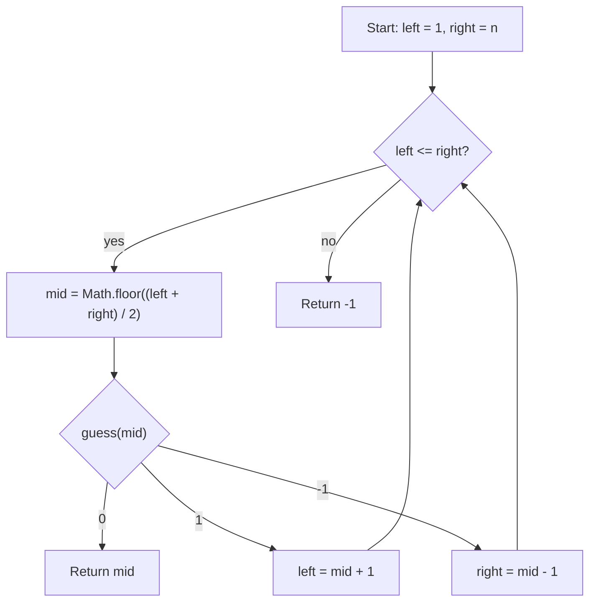

# Guess Number Higher or Lower - Mental Model

## The Problem

We are playing the Guess Game. The game is as follows:

I pick a number from `1` to `n`. You have to guess which number I picked.

Every time you guess wrong, I will tell you whether the number I picked is higher or lower than your guess.

You call a pre-defined API `guess(num)`, which returns three possible results:

- `-1`: Your guess is higher than the number I picked (that is, `num > pick`).
- `1`: Your guess is lower than the number I picked (that is, `num < pick`).
- `0`: your guess is equal to the number I picked (that is, `num == pick`).

Return the number that I picked.

**Example 1:**
```
Input: n = 10, pick = 6
Output: 6
```

**Example 2:**
```
Input: n = 1, pick = 1
Output: 1
```

**Example 3:**
```
Input: n = 2, pick = 1
Output: 1
```

## The Numbered Hallway Analogy

Imagine a long hallway of numbered doors from `1` through `n`. One door hides the prize, and a guide stands beside you. Each time you point at a door, the guide gives exactly one of three signals: "too high," "too low," or "exactly right."

That guide signal is much more powerful than a simple miss. If the guide says "too low" at door `mid`, then every door up through `mid` is ruled out at once because the prize must be farther right. If the guide says "too high," then every door from `mid` onward is ruled out because the prize must be farther left.

So this is not really a wandering guessing game. It is a hallway-shrinking game. Each midpoint guess cuts away half the remaining doors, and the guide's response tells you which half survives.

## Understanding the Analogy

### The Setup

The hallway is ordered from `1` to `n`. That ordering is what makes each guide response useful for a whole range, not just one door.

So I start with the widest live hallway possible: `left = 1` and `right = n`. The invariant is simple: if the prize door has not been found yet, it must still be somewhere between `left` and `right`, inclusive.

### Reading the Guide Signals

When I point at the midpoint door, the guide can say one of three things.

If the guide says `0`, I found the exact prize door and can return it immediately.

If the guide says `1`, my guess was too low. That means the prize must be somewhere to the right of `mid`, so the next live hallway begins at `mid + 1`.

If the guide says `-1`, my guess was too high. That means the prize must be somewhere to the left of `mid`, so the next live hallway ends at `mid - 1`.

### Why This Approach

A naive guessing strategy might move one door at a time and take up to `O(n)` guesses in the worst case.

Binary Search uses the guide's directional signal to eliminate half the hallway at every step. After one guess, half the doors are gone. After two, half of the remainder is gone again. That shrinking pattern is why the runtime becomes `O(log n)`.

## How I Think Through This

I think in terms of a live hallway. `left` and `right` surround every door where the hidden number could still be. As long as `left <= right`, I compute `mid` and ask the guide about that midpoint door.

If `guess(mid) === 0`, the search is over because the midpoint itself is the prize door. If `guess(mid) === 1`, the guide is telling me I am standing too far left, so I move `left` to `mid + 1`. If `guess(mid) === -1`, I am standing too far right, so I move `right` to `mid - 1`.

The important mental model is that the guide response always preserves one valid hallway and discards one impossible hallway. I do not "guess better" by intuition. I keep narrowing the only range that can still contain the answer until the midpoint lands on it.

Take `n = 10`, where the picked number is `6`.

:::trace-bs
[
  {"values":[1,2,3,4,5,6,7,8,9,10],"left":0,"mid":4,"right":9,"action":"check","label":"Clamp the whole hallway first. Probe door 5. The guide says too low, so every door through 5 is ruled out."},
  {"values":[1,2,3,4,5,6,7,8,9,10],"left":5,"mid":7,"right":9,"action":"discard-left","label":"Move the left clamp to door 6 and probe door 8. The guide says too high, so doors 8 through 10 are ruled out."},
  {"values":[1,2,3,4,5,6,7,8,9,10],"left":5,"mid":5,"right":6,"action":"discard-right","label":"Now only doors 6 and 7 remain alive. Probe door 6 and the guide says exact match."},
  {"values":[1,2,3,4,5,6,7,8,9,10],"left":5,"mid":5,"right":6,"action":"found","label":"The midpoint landed on the prize door, so return 6."}
]
:::

---

## Building the Algorithm

### Step 1: Build the Hallway and Recognize an Exact Midpoint

Start with the Binary Search shell: `left = 1`, `right = n`, and a loop that keeps probing the midpoint while the hallway is still alive.

For the first step, keep the behavior narrow. Compute `mid`, ask the guide once, and return `mid` only when the guide says `0`. Otherwise, for now, return `-1`. That isolates the live-range setup and the exact-hit midpoint check before teaching how to move the hallway boundaries.

Take `n = 7`, where the picked number is `4`.

:::trace-bs
[
  {"values":[1,2,3,4,5,6,7],"left":0,"mid":3,"right":6,"action":"check","label":"Step 1 sets the full hallway and probes the midpoint at door 4."},
  {"values":[1,2,3,4,5,6,7],"left":0,"mid":3,"right":6,"action":"found","label":"The guide says exact match on the first probe, so Step 1 returns door 4 immediately."}
]
:::

:::stackblitz{file="step1-problem.ts" step=1 total=2 solution="step1-solution.ts"}

<details>
  <summary>Hints & gotchas</summary>

- **The hallway is numbered from 1**: this search range is `1..n`, not array indexes.
- **Keep the live range inclusive**: as long as `left <= right`, there is still a real door to probe.
- **Only the exact-hit rule belongs in this step**: the higher/lower hallway moves come in step 2.
</details>

### Step 2: Follow the Higher/Lower Signal

Now complete the squeeze. A guide response of `1` means the midpoint guess was too low, so the next live hallway must start at `mid + 1`.

A guide response of `-1` means the midpoint guess was too high, so the next live hallway must end at `mid - 1`.

That gives the full Binary Search loop: probe the midpoint, either return it on `0` or move one boundary inward based on the guide's signal. Repeat until the exact door is found.

Take `n = 10`, where the picked number is `3`.

:::trace-bs
[
  {"values":[1,2,3,4,5,6,7,8,9,10],"left":0,"mid":4,"right":9,"action":"check","label":"Probe door 5 first. The guide says too high, so the surviving hallway must be to the left."},
  {"values":[1,2,3,4,5,6,7,8,9,10],"left":0,"mid":1,"right":3,"action":"discard-right","label":"Now probe door 2. The guide says too low, so the surviving hallway shifts right."},
  {"values":[1,2,3,4,5,6,7,8,9,10],"left":2,"mid":2,"right":3,"action":"check","label":"Probe door 3. The guide now says exact match."},
  {"values":[1,2,3,4,5,6,7,8,9,10],"left":2,"mid":2,"right":3,"action":"found","label":"The midpoint landed on the hidden number, so return 3."}
]
:::

:::stackblitz{file="step2-problem.ts" step=2 total=2 solution="step2-solution.ts"}

<details>
  <summary>Hints & gotchas</summary>

- **Do not reverse the API meaning**: `1` means your guess is too low, and `-1` means your guess is too high.
- **Always discard the midpoint itself after a miss**: move to `mid + 1` or `mid - 1`, not `mid`.
- **Only one side survives each probe**: the guide signal tells you exactly which half of the hallway remains possible.
</details>

## Numbered Hallway at a Glance



## Common Misconceptions

- **"`guess(mid) === 1` means move left"**: it is the opposite. `1` means the midpoint guess is too low, so the hidden number must be to the right.
- **"This is random guessing with a helper"**: the guide response is directional, so each guess deletes half the hallway on purpose.
- **"I should keep `mid` in the next range after a miss"**: no. The midpoint has already been disproved, so the next range must start at `mid + 1` or end at `mid - 1`.
- **"The loop should use `left < right`"**: with an inclusive hallway, one remaining door still matters, so the correct loop condition is `left <= right`.

## Complete Solution

:::stackblitz{file="solution.ts" step=2 total=2 solution="solution.ts"}
