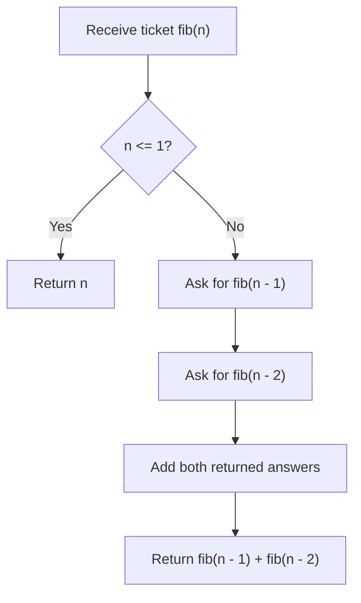

# Fibonacci Number - Mental Model

## The Problem

The Fibonacci numbers, commonly denoted `F(n)` form a sequence, called the Fibonacci sequence, such that each number is the sum of the two preceding ones, starting from `0` and `1`. That is,

- `F(0) = 0`, `F(1) = 1`
- `F(n) = F(n - 1) + F(n - 2)`, for `n > 1`

Given `n`, calculate `F(n)`.

**Example 1:**
```
Input: n = 2
Output: 1
Explanation: F(2) = F(1) + F(0) = 1 + 0 = 1.
```

**Example 2:**
```
Input: n = 3
Output: 2
Explanation: F(3) = F(2) + F(1) = 1 + 1 = 2.
```

**Example 3:**
```
Input: n = 4
Output: 3
Explanation: F(4) = F(3) + F(2) = 2 + 1 = 3.
```

## The Ticket Stack Analogy

Imagine a tiny help desk where every request arrives as a numbered ticket: "What is `fib(n)`?" The desk has one simple rule. If the ticket says `0` or `1`, the clerk already knows the answer and can reply immediately. Those are the desk's built-in answer cards.

But if the ticket asks for something larger, the clerk cannot answer directly. Instead, they split that ticket into two smaller dependency tickets: "`fib(n - 1)`" and "`fib(n - 2)`". The original ticket has to wait until both smaller tickets come back with answers.

That waiting is the heart of recursion. Unfinished tickets sit on a stack. The most recent unfinished ticket is always the one the clerk is actively working on. When a smaller ticket finishes, the clerk returns to the ticket underneath it, combines the two answers, and keeps unwinding upward.

So Fibonacci is not "jump around the sequence until you get lucky." It is "trust the ticket stack." Big tickets keep shrinking into smaller tickets until the desk reaches answer cards it already knows.

## Understanding the Analogy

### The Setup

You hand the desk a single ticket: `fib(n)`. The desk's job is to answer that ticket exactly once. It is not allowed to guess or skip steps. Every non-base ticket must be resolved by first answering two smaller tickets.

That means the real problem is not "how do I jump straight to `fib(8)`?" The real problem is "how do I reduce `fib(8)` into questions the desk already knows how to answer?" Recursion works because each smaller ticket has the exact same shape as the original question.

### The Answer Cards

The desk has two permanent answer cards:

- `fib(0) = 0`
- `fib(1) = 1`

These are the base cases. They stop the splitting process. Without them, the desk would keep making smaller and smaller tickets forever.

Every recursive problem needs a stopping rule like this. In Fibonacci, the stopping rule is wonderfully small: as soon as the ticket is `0` or `1`, return the ticket number itself.

### The Waiting Stack

When the desk sees a ticket like `fib(4)`, it cannot finish it yet. It must first ask for `fib(3)` and `fib(2)`. While those smaller tickets are being resolved, the original `fib(4)` ticket stays on the waiting stack.

That is exactly what the call stack does in code. Each unfinished function call pauses, waits for smaller recursive calls to finish, then resumes with their returned answers.

### Why This Approach

Fibonacci is one of the cleanest recursion drills because the structure of the definition already tells you the algorithm. The recurrence in the prompt is the code shape:

- if the ticket is small enough, answer directly
- otherwise, ask the same question twice on smaller inputs
- combine the two returned answers

This problem is not yet about optimization. It is about learning the recursive pattern: base case first, then trust smaller calls to solve smaller versions of the same problem.

## How I Think Through This

I look at `n` and ask one question first: is this already a base case? If `n` is `0` or `1`, I return `n` immediately. That is the whole stopping rule, and it has to come before any recursive calls.

If `n` is larger, I do not try to manually build the whole sequence. I trust recursion to handle the smaller tickets for me. I ask for `fib(n - 1)` and `fib(n - 2)`, then add those two returned values together. The invariant is: every call to `fib(k)` means "return the correct Fibonacci number for `k`," no matter who called it.

Take `fib(4)`.

:::trace-sq
[
  {
    "structures": [
      { "kind": "stack", "label": "callStack", "items": ["fib(4)"], "color": "blue", "activeIndices": [0], "pointers": [{ "index": 0, "label": "top" }] }
    ],
    "action": "push",
    "label": "Start with one ticket: `fib(4)`. It is not an answer card, so it must split."
  },
  {
    "structures": [
      { "kind": "stack", "label": "callStack", "items": ["fib(4)", "fib(3)"], "color": "blue", "activeIndices": [1], "pointers": [{ "index": 1, "label": "top" }] }
    ],
    "action": "push",
    "label": "`fib(4)` asks for `fib(3)` first, so that smaller ticket goes on top of the stack."
  },
  {
    "structures": [
      { "kind": "stack", "label": "callStack", "items": ["fib(4)", "fib(3)", "fib(2)"], "color": "blue", "activeIndices": [2], "pointers": [{ "index": 2, "label": "top" }] }
    ],
    "action": "push",
    "label": "`fib(3)` is also not a base case, so it asks for `fib(2)`."
  },
  {
    "structures": [
      { "kind": "stack", "label": "callStack", "items": ["fib(4)", "fib(3)", "fib(2)", "fib(1)"], "color": "blue", "activeIndices": [3], "pointers": [{ "index": 3, "label": "top" }] }
    ],
    "action": "push",
    "label": "`fib(2)` asks for `fib(1)`. That ticket is an answer card, so it can finish immediately with `1`."
  },
  {
    "structures": [
      { "kind": "stack", "label": "callStack", "items": ["fib(4)", "fib(3)", "fib(2)"], "color": "blue", "activeIndices": [2], "pointers": [{ "index": 2, "label": "top" }] }
    ],
    "action": "pop",
    "label": "Return from `fib(1) = 1`, then `fib(2)` asks for its second smaller ticket, `fib(0)`."
  },
  {
    "structures": [
      { "kind": "stack", "label": "callStack", "items": ["fib(4)", "fib(3)", "fib(2)", "fib(0)"], "color": "blue", "activeIndices": [3], "pointers": [{ "index": 3, "label": "top" }] }
    ],
    "action": "push",
    "label": "`fib(0)` is the other answer card, so it returns `0` immediately."
  },
  {
    "structures": [
      { "kind": "stack", "label": "callStack", "items": ["fib(4)", "fib(3)"], "color": "blue", "activeIndices": [1], "pointers": [{ "index": 1, "label": "top" }] }
    ],
    "action": "pop",
    "label": "Now `fib(2)` can finish: `fib(1) + fib(0) = 1 + 0 = 1`. Control returns upward to `fib(3)`."
  },
  {
    "structures": [
      { "kind": "stack", "label": "callStack", "items": ["fib(4)", "fib(3)", "fib(1)"], "color": "blue", "activeIndices": [2], "pointers": [{ "index": 2, "label": "top" }] }
    ],
    "action": "push",
    "label": "`fib(3)` now needs its second smaller ticket, `fib(1)`, which returns `1` immediately."
  },
  {
    "structures": [
      { "kind": "stack", "label": "callStack", "items": ["fib(4)"], "color": "blue", "activeIndices": [0], "pointers": [{ "index": 0, "label": "top" }] }
    ],
    "action": "pop",
    "label": "`fib(3)` can now finish with `fib(2) + fib(1) = 1 + 1 = 2`, so control returns to `fib(4)`."
  },
  {
    "structures": [
      { "kind": "stack", "label": "callStack", "items": [], "color": "blue" }
    ],
    "action": "done",
    "label": "`fib(4)` still needs `fib(2) = 1`, so the final answer is `2 + 1 = 3`."
  }
]
:::

---

## Building the Algorithm

Each step adds one rule from the help desk's ticket stack, then a StackBlitz embed to practice it.

### Step 1: Answer the Base-Case Tickets

Start with the answer cards. The help desk must know how to respond to `fib(0)` and `fib(1)` without opening any smaller tickets. That means returning `0` when `n === 0` and returning `1` when `n === 1`.

This step matters because recursion is impossible without a stopping rule. Before you split a ticket into smaller ones, you need to know which tickets are already solvable as-is.

:::trace-sq
[
  {
    "structures": [
      { "kind": "stack", "label": "callStack", "items": ["fib(1)"], "color": "blue", "activeIndices": [0], "pointers": [{ "index": 0, "label": "top" }] }
    ],
    "action": "push",
    "label": "A base-case ticket enters the stack: `fib(1)`."
  },
  {
    "structures": [
      { "kind": "stack", "label": "callStack", "items": [], "color": "blue" }
    ],
    "action": "done",
    "label": "Because `1` is an answer card, the desk returns `1` immediately with no smaller tickets."
  }
]
:::

:::stackblitz{file="step1-problem.ts" step=1 total=2 solution="step1-solution.ts"}

<details>
<summary>Hints & gotchas</summary>

- **The base case comes first**: check `n` before making any recursive calls.
- **Return the ticket number itself**: for Fibonacci, `fib(0)` and `fib(1)` are not computed from smaller tickets.
- **This step is intentionally narrow**: larger `n` values are not solved yet because the recursive split has not been built.

</details>

### Step 2: Split a Bigger Ticket into Two Smaller Tickets

Now teach the desk what to do with any ticket larger than `1`. A non-base Fibonacci ticket is defined entirely by two smaller tickets: `fib(n - 1)` and `fib(n - 2)`. Once those return, add them together.

This is the moment recursion becomes real. The function calls itself with smaller inputs, trusts those smaller calls to return correct answers, then combines them. Nothing else is needed.

:::trace-sq
[
  {
    "structures": [
      { "kind": "stack", "label": "callStack", "items": ["fib(3)"], "color": "blue", "activeIndices": [0], "pointers": [{ "index": 0, "label": "top" }] }
    ],
    "action": "push",
    "label": "Start with `fib(3)`. It is not a base case, so it must split."
  },
  {
    "structures": [
      { "kind": "stack", "label": "callStack", "items": ["fib(3)", "fib(2)"], "color": "blue", "activeIndices": [1], "pointers": [{ "index": 1, "label": "top" }] }
    ],
    "action": "push",
    "label": "First smaller ticket: `fib(2)`."
  },
  {
    "structures": [
      { "kind": "stack", "label": "callStack", "items": ["fib(3)", "fib(2)", "fib(1)"], "color": "blue", "activeIndices": [2], "pointers": [{ "index": 2, "label": "top" }] }
    ],
    "action": "push",
    "label": "`fib(2)` asks for `fib(1)`, which returns immediately."
  },
  {
    "structures": [
      { "kind": "stack", "label": "callStack", "items": ["fib(3)", "fib(2)", "fib(0)"], "color": "blue", "activeIndices": [2], "pointers": [{ "index": 2, "label": "top" }] }
    ],
    "action": "push",
    "label": "`fib(2)` then asks for `fib(0)`, which also returns immediately."
  },
  {
    "structures": [
      { "kind": "stack", "label": "callStack", "items": ["fib(3)", "fib(1)"], "color": "blue", "activeIndices": [1], "pointers": [{ "index": 1, "label": "top" }] }
    ],
    "action": "pop",
    "label": "Now `fib(2)` can resolve to `1`, and `fib(3)` asks for its second smaller ticket, `fib(1)`."
  },
  {
    "structures": [
      { "kind": "stack", "label": "callStack", "items": [], "color": "blue" }
    ],
    "action": "done",
    "label": "With `fib(2) = 1` and `fib(1) = 1`, the original ticket resolves to `2`."
  }
]
:::

:::stackblitz{file="step2-problem.ts" step=2 total=2 solution="step2-solution.ts"}

<details>
<summary>Hints & gotchas</summary>

- **Do not shrink by one only**: Fibonacci needs both smaller tickets, `n - 1` and `n - 2`.
- **Trust the recursive contract**: each smaller call returns the correct Fibonacci value for its own input.
- **Base case plus recursive case is the full pattern**: once both exist, the function is complete.

</details>

## The Ticket Stack at a Glance



## Common Misconceptions

**"Recursion means the function magically knows future answers."** The help desk does not skip ahead. It only knows the two answer cards, `0` and `1`. Every larger answer is built by waiting for smaller tickets to come back.

**"I can stop at `n === 1` and let `fib(0)` happen naturally."** That breaks the desk's rules. `fib(0)` is one of the permanent answer cards too, so it needs its own valid direct return path.

**"A recursive call replaces the current work."** It only pauses it. The unfinished ticket stays on the stack, waiting until the smaller tickets return.

**"The function should build the whole sequence in an array first."** That is a different strategy from a later DP lesson. Here the point is to trust the recursive definition directly and let the call stack remember unfinished work.

## Complete Solution

:::stackblitz{file="solution.ts" step=2 total=2 solution="solution.ts"}
