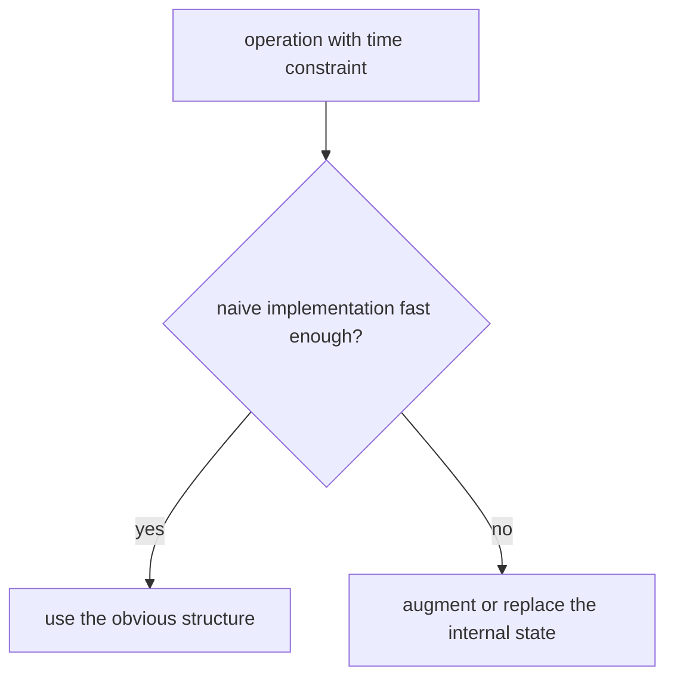
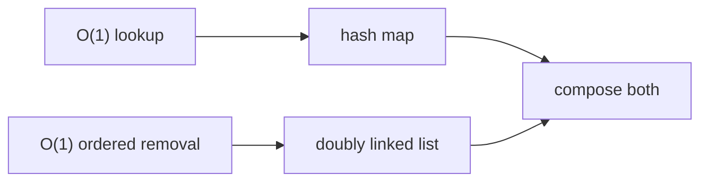
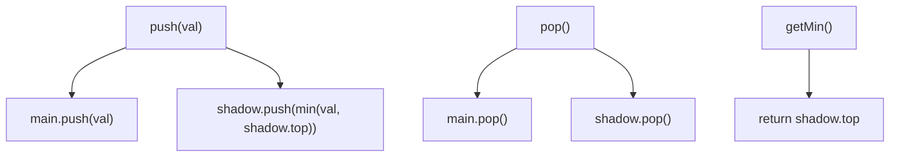
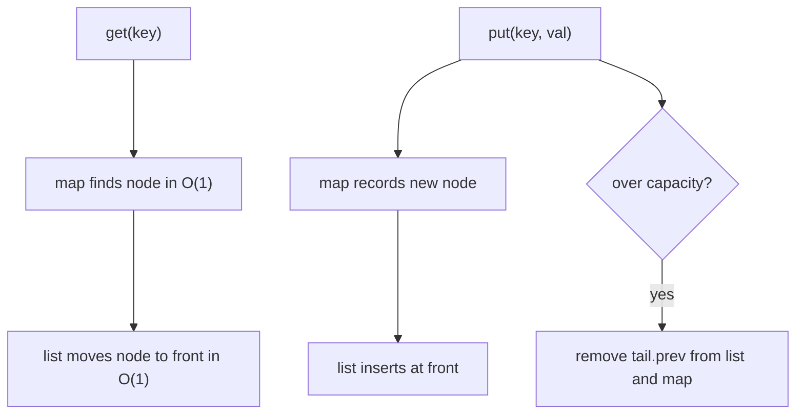
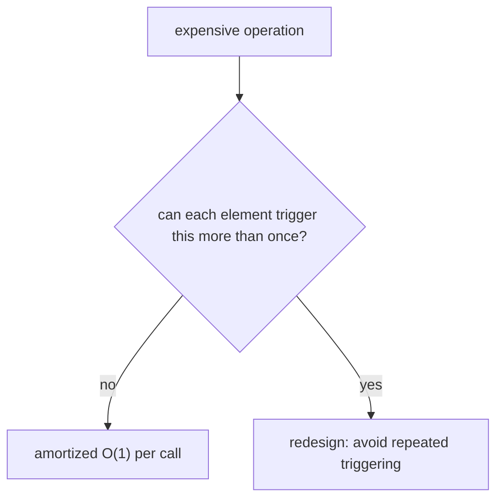
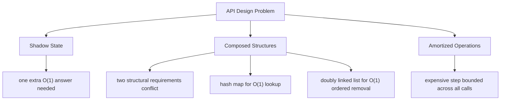
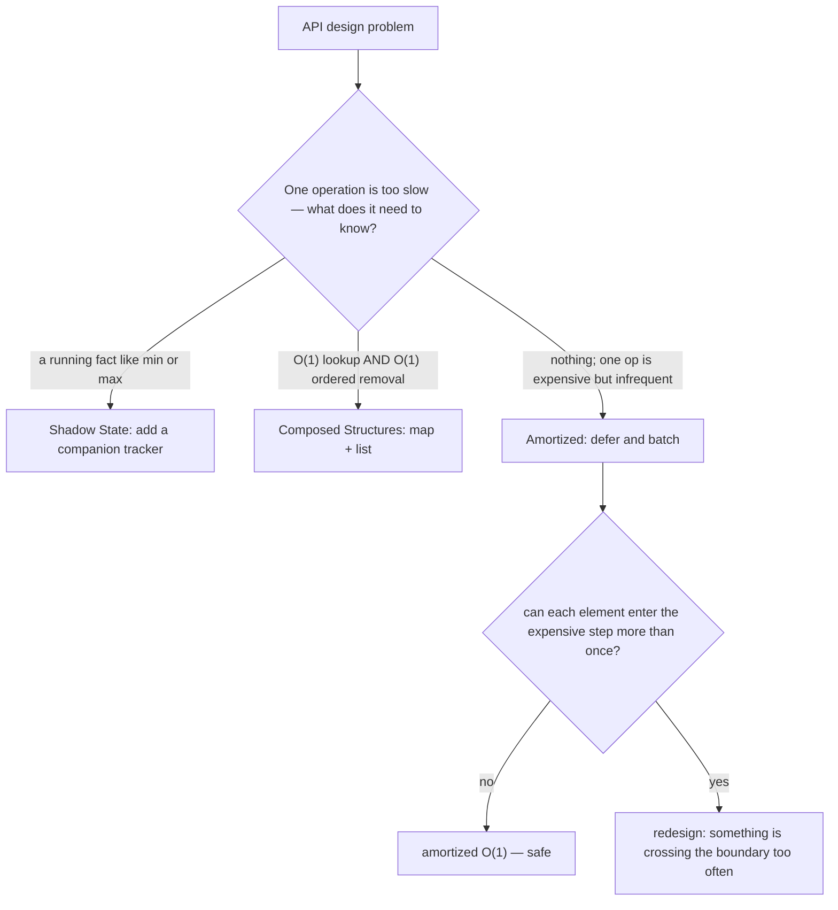

## Overview

API design problems give you a spec: a class with named operations, each with a time constraint. Your job is not to write an algorithm but to choose the right internal data structures so every operation meets its budget. The spec is the contract. The internals are invisible to the caller and entirely your decision.

These problems appear throughout the path in disguise: Min Stack, LRU Cache, Queue using Two Stacks. What they share is a pattern of reasoning. Read the operations, identify the constraint that the obvious implementation violates, and choose internal structures that preserve the invariant without breaking the other operations.

We will build that reasoning in three stages: **Shadow State**, **Composed Structures**, and **Amortized Operations**.

## Core Concept & Mental Model

### The Information Desk

Think of a hotel concierge desk. Guests see a clean interface: check in, check out, who has been waiting longest. Behind the counter, the concierge maintains three separate records: a ledger visible to guests, an arrival-order log hidden in a drawer, and a quick-name index on a whiteboard. None of those internal tools is exposed. Guests never know they exist. But without them, answering "who has been waiting longest?" would require scanning every guest card in the pile.

That is the core idea of API design problems: the interface is fixed, the internals are yours to choose, and the right choice makes the difference between O(n) and O(1).

- **interface**: the set of operations the caller can invoke; you do not control it
- **invariant**: a property you must keep true before and after every operation
- **shadow state**: internal data maintained alongside the main structure to answer one extra question in O(1)
- **composed structures**: two or more distinct data structures where each handles the operations the other cannot
- **amortized cost**: the average cost per operation when some calls are cheap and some are expensive, but the total work over n calls is bounded

### How API Design Problems Work

Before writing anything, ask two questions. First: what does each operation need to know? Second: which operations conflict?

#### Reading the Constraint

Every operation has an implied or explicit time budget. `push` and `pop` are almost always O(1). `getMin` sounds innocent but the naive answer, scan every element, costs O(n). The constraint is the hint that the obvious structure is wrong.

#### Finding the Conflict

Two operations conflict when the state one of them needs to maintain is expensive for the other to update. A hash map gives O(1) lookup but has no ordering. A linked list has O(1) ordered insertion and deletion but O(n) lookup. When a problem needs both, neither alone is enough.

#### The Three Situations

API design problems fall into three shapes. Understanding which shape you are in before writing any code saves you from the wrong structure.

**Shadow state** is for problems where the main structure is correct but you need one extra answer in O(1). You add a second, smaller structure that tracks only that answer and updates alongside the main one. The main structure does not change.

**Composed structures** is for problems where two constraints conflict and no single structure satisfies both. You split the work: one structure handles what it does well, the other handles what it cannot.

**Amortized operations** is for problems where one operation is allowed to be expensive occasionally, as long as the average across many calls stays within budget. You defer or batch expensive work and prove that each unit of work happens at most a fixed number of times.

### How I Think Through This

Before touching code, I look at the operation list and ask: which operation is the hardest to satisfy given the others?

**When one operation needs extra information the main structure does not store**: shadow state. What is the minimum extra information that answers the hard question? Can it be updated in O(1) on every push or pop? If yes, a shadow structure is the right move.

**When two operations have contradictory structural requirements**: composed structures. Draw out what each operation needs and identify which structures naturally satisfy each requirement. Then wire them together so they stay in sync.

**When one operation would be O(n) but each element can only be processed a bounded number of times across all calls**: amortized. Ask how many times each element moves through the expensive step in total. If the answer is at most once or twice, the amortized cost is O(1) per call.

**Scenario 1: Min Stack**

**Operations**: `push(val)`, `pop()`, `top()`, `getMin()` — all O(1)  
**Conflict**: `getMin` needs the current minimum, but `pop` can remove it

The naive approach stores elements in one stack and scans for the minimum on every `getMin` call. That is O(n). The fix is to add a shadow min-stack that stores the running minimum alongside every push.

:::trace-graph
[
  {
    "nodes": [
      {"id": "A", "label": "main\n[3]", "x": 20, "y": 48, "tone": "current"},
      {"id": "B", "label": "mins\n[3]", "x": 60, "y": 48, "tone": "current"}
    ],
    "edges": [],
    "facts": [
      {"name": "push", "value": "3", "tone": "blue"},
      {"name": "getMin", "value": "3", "tone": "green"}
    ],
    "action": "visit",
    "label": "Push 3. Both stacks record the current minimum."
  },
  {
    "nodes": [
      {"id": "A", "label": "main\n[3,1]", "x": 20, "y": 48, "tone": "current"},
      {"id": "B", "label": "mins\n[3,1]", "x": 60, "y": 48, "tone": "current"}
    ],
    "edges": [],
    "facts": [
      {"name": "push", "value": "1", "tone": "blue"},
      {"name": "getMin", "value": "1", "tone": "green"}
    ],
    "action": "expand",
    "label": "Push 1. New minimum, so min-stack records 1."
  },
  {
    "nodes": [
      {"id": "A", "label": "main\n[3,1,5]", "x": 20, "y": 48, "tone": "current"},
      {"id": "B", "label": "mins\n[3,1,1]", "x": 60, "y": 48, "tone": "current"}
    ],
    "edges": [],
    "facts": [
      {"name": "push", "value": "5", "tone": "blue"},
      {"name": "getMin", "value": "1", "tone": "green"}
    ],
    "action": "expand",
    "label": "Push 5. Not a new minimum, so min-stack repeats the current min."
  },
  {
    "nodes": [
      {"id": "A", "label": "main\n[3,1]", "x": 20, "y": 48, "tone": "visited"},
      {"id": "B", "label": "mins\n[3,1]", "x": 60, "y": 48, "tone": "visited"}
    ],
    "edges": [],
    "facts": [
      {"name": "pop", "value": "5", "tone": "orange"},
      {"name": "getMin", "value": "1", "tone": "green"}
    ],
    "action": "done",
    "label": "Pop removes 5 from both stacks. getMin still reads 1 instantly from the min-stack top."
  }
]
:::

**Scenario 2: LRU Cache**

**Operations**: `get(key)` O(1), `put(key, val)` O(1) — evict the least-recently-used entry when over capacity  
**Conflict**: O(1) lookup needs a hash map; ordered eviction needs to move arbitrary entries to the front in O(1), which needs a doubly linked list

The composed design: a hash map stores `{key → node}`, and a doubly linked list stores `{most recent ... least recent}`. Every `get` or `put` moves the affected node to the list front in O(1). When the cache is full, the list tail gives the eviction target in O(1).

:::trace-graph
[
  {
    "nodes": [
      {"id": "H", "label": "map\n{1→n1}", "x": 18, "y": 30, "tone": "default"},
      {"id": "A", "label": "[head]", "x": 18, "y": 70, "tone": "default"},
      {"id": "B", "label": "1:A", "x": 42, "y": 70, "tone": "current"},
      {"id": "C", "label": "[tail]", "x": 66, "y": 70, "tone": "default"}
    ],
    "edges": [
      {"from": "A", "to": "B", "tone": "active"},
      {"from": "B", "to": "C", "tone": "active"}
    ],
    "facts": [
      {"name": "put", "value": "1:A", "tone": "blue"},
      {"name": "capacity", "value": 2, "tone": "purple"}
    ],
    "action": "visit",
    "label": "put(1,'A'). Map records key→node. Node goes to the front of the list."
  },
  {
    "nodes": [
      {"id": "H", "label": "map\n{1→n1,2→n2}", "x": 18, "y": 30, "tone": "default"},
      {"id": "A", "label": "[head]", "x": 18, "y": 70, "tone": "default"},
      {"id": "B", "label": "2:B", "x": 42, "y": 70, "tone": "current"},
      {"id": "C", "label": "1:A", "x": 66, "y": 70, "tone": "visited"},
      {"id": "D", "label": "[tail]", "x": 90, "y": 70, "tone": "default"}
    ],
    "edges": [
      {"from": "A", "to": "B", "tone": "active"},
      {"from": "B", "to": "C", "tone": "active"},
      {"from": "C", "to": "D", "tone": "active"}
    ],
    "facts": [
      {"name": "put", "value": "2:B", "tone": "blue"},
      {"name": "capacity", "value": 2, "tone": "purple"}
    ],
    "action": "expand",
    "label": "put(2,'B'). New node goes to front. Key 1 slides toward the tail."
  },
  {
    "nodes": [
      {"id": "H", "label": "map\n{1→n1,2→n2}", "x": 18, "y": 30, "tone": "default"},
      {"id": "A", "label": "[head]", "x": 18, "y": 70, "tone": "default"},
      {"id": "B", "label": "1:A", "x": 42, "y": 70, "tone": "current"},
      {"id": "C", "label": "2:B", "x": 66, "y": 70, "tone": "visited"},
      {"id": "D", "label": "[tail]", "x": 90, "y": 70, "tone": "default"}
    ],
    "edges": [
      {"from": "A", "to": "B", "tone": "active"},
      {"from": "B", "to": "C", "tone": "active"},
      {"from": "C", "to": "D", "tone": "active"}
    ],
    "facts": [
      {"name": "get", "value": "1 → 'A'", "tone": "green"},
      {"name": "capacity", "value": 2, "tone": "purple"}
    ],
    "action": "mark",
    "label": "get(1). Map finds the node immediately. Node moves to front. Key 2 slides toward tail."
  },
  {
    "nodes": [
      {"id": "H", "label": "map\n{1→n1,3→n3}", "x": 18, "y": 30, "tone": "default"},
      {"id": "A", "label": "[head]", "x": 18, "y": 70, "tone": "default"},
      {"id": "B", "label": "3:C", "x": 42, "y": 70, "tone": "current"},
      {"id": "C", "label": "1:A", "x": 66, "y": 70, "tone": "visited"},
      {"id": "D", "label": "[tail]", "x": 90, "y": 70, "tone": "default"}
    ],
    "edges": [
      {"from": "A", "to": "B", "tone": "active"},
      {"from": "B", "to": "C", "tone": "active"},
      {"from": "C", "to": "D", "tone": "active"}
    ],
    "facts": [
      {"name": "put", "value": "3:C (evict 2)", "tone": "orange"},
      {"name": "capacity", "value": 2, "tone": "purple"}
    ],
    "action": "done",
    "label": "put(3,'C'). Cache is full. Tail node (key 2) is evicted. New node goes to front."
  }
]
:::

**Scenario 3: Queue from Two Stacks**

**Operations**: `push(val)` O(1), `pop()` amortized O(1)  
**Key insight**: a single stack reverses order. Two stacks restore it. Elements move from inbox to outbox at most once across all calls.

:::trace-graph
[
  {
    "nodes": [
      {"id": "I", "label": "inbox\n[1,2,3]", "x": 20, "y": 48, "tone": "current"},
      {"id": "O", "label": "outbox\n[]", "x": 70, "y": 48, "tone": "default"}
    ],
    "edges": [],
    "facts": [
      {"name": "pushed", "value": "1, 2, 3", "tone": "blue"},
      {"name": "total moves", "value": 3, "tone": "orange"}
    ],
    "action": "visit",
    "label": "Three pushes go to inbox only. Cost: O(1) each."
  },
  {
    "nodes": [
      {"id": "I", "label": "inbox\n[]", "x": 20, "y": 48, "tone": "visited"},
      {"id": "O", "label": "outbox\n[3,2,1]", "x": 70, "y": 48, "tone": "current"}
    ],
    "edges": [
      {"from": "I", "to": "O", "tone": "active"}
    ],
    "facts": [
      {"name": "pop triggers transfer", "value": "outbox empty", "tone": "orange"},
      {"name": "total moves", "value": 6, "tone": "orange"}
    ],
    "action": "expand",
    "label": "First pop: outbox is empty, so all elements transfer. This pop costs O(n) — but it is the only time those elements will ever transfer."
  },
  {
    "nodes": [
      {"id": "I", "label": "inbox\n[]", "x": 20, "y": 48, "tone": "visited"},
      {"id": "O", "label": "outbox\n[3,2]", "x": 70, "y": 48, "tone": "current"}
    ],
    "edges": [],
    "facts": [
      {"name": "pop", "value": "1", "tone": "green"},
      {"name": "total moves", "value": 6, "tone": "orange"}
    ],
    "action": "done",
    "label": "Return outbox.top() = 1. No transfer needed. Next two pops are O(1)."
  }
]
:::

---

## Building Blocks: Progressive Learning

### Level 1: Shadow State

A shadow state problem looks like this: you need one extra answer the main structure cannot give cheaply. The minimum of a stack, the maximum of a window, the current running count. The fix is to add a companion structure that tracks only that answer and stays synchronized with every push and pop.

The key discipline is knowing what the shadow must record on each push. For a minimum tracker, it is not enough to record the new element only when it is smaller than the current minimum, because then you cannot restore the previous minimum on pop. The shadow stack must record the current minimum at the time of every push, so the minimum before the push is always available at the shadow top after the pop.

:::trace-graph
[
  {
    "nodes": [
      {"id": "M", "label": "main\n[]", "x": 18, "y": 40, "tone": "default"},
      {"id": "S", "label": "shadow\n[]", "x": 60, "y": 40, "tone": "default"}
    ],
    "edges": [],
    "facts": [
      {"name": "invariant", "value": "shadow.top = current min", "tone": "purple"}
    ],
    "action": "visit",
    "label": "Start empty. The invariant: shadow top always equals the current minimum."
  },
  {
    "nodes": [
      {"id": "M", "label": "main\n[5,2,7]", "x": 18, "y": 40, "tone": "current"},
      {"id": "S", "label": "shadow\n[5,2,2]", "x": 60, "y": 40, "tone": "current"}
    ],
    "edges": [],
    "facts": [
      {"name": "getMin", "value": "2 (shadow.top)", "tone": "green"},
      {"name": "invariant", "value": "shadow.top = current min", "tone": "purple"}
    ],
    "action": "expand",
    "label": "After push(5), push(2), push(7): shadow records 5, then 2, then 2 again. getMin is always shadow.top."
  },
  {
    "nodes": [
      {"id": "M", "label": "main\n[5,2]", "x": 18, "y": 40, "tone": "visited"},
      {"id": "S", "label": "shadow\n[5,2]", "x": 60, "y": 40, "tone": "visited"}
    ],
    "edges": [],
    "facts": [
      {"name": "pop", "value": "7", "tone": "orange"},
      {"name": "getMin", "value": "2 (shadow.top)", "tone": "green"}
    ],
    "action": "done",
    "label": "pop() removes 7 from main and 2 from shadow. Minimum is still 2 — the invariant held."
  }
]
:::

#### **Exercise 1**

The naive Min Stack scans the whole main stack on every `getMin` call. This exercise asks you to first predict what the broken behavior looks like, then fix it.

The problem file contains a `getMin` implementation that iterates all elements. Four tests pass for the wrong reasons (small stacks) and one fails. Your task: predict which test fails, observe that it fails by running the file, then add a shadow min-stack so all five tests pass with O(1) `getMin`.

How to think about it:
1. The broken `getMin` iterates. Which input would make that incorrect rather than just slow?
2. What must the shadow record at each `push` so that `pop` can restore the previous minimum?
3. Both stacks must stay synchronized — every `push` pushes to both; every `pop` pops from both.

:::stackblitz{step=1 total=3 exercises="step1-exercise1-problem.ts" solutions="step1-exercise1-solution.ts"}

#### **Exercise 2**

The Max Stack extends the same shadow state pattern in one direction: track the running maximum instead of the minimum. There is no broken starting point here. Implement `push`, `pop`, `top`, and `getMax` from scratch using the same two-stack shadow approach.

:::stackblitz{step=1 total=3 exercises="step1-exercise2-problem.ts" solutions="step1-exercise2-solution.ts"}

#### **Exercise 3**

A frequency stack is the shadow state exercise where the shadow holds a map instead of a second stack. Implement `push(val)` and `popMax()` — which removes the most recently pushed element among those with the highest frequency. Shadow: a map from value to frequency, and a map from frequency to a stack of values at that frequency. The invariant is that `maxFreq` always reflects the current highest frequency in the structure.

:::stackblitz{step=1 total=3 exercises="step1-exercise3-problem.ts" solutions="step1-exercise3-solution.ts"}

> **Mental anchor**: The shadow records the answer at the moment of every push, so pop never has to search.

**→ Bridge to Level 2**: Shadow state works when one structure is correct for most operations and you add one extra tracker. When two operations have directly conflicting structural requirements — one needs O(1) lookup, the other needs O(1) ordered removal of arbitrary nodes — neither structure alone is the answer, and you need to compose them.

### Level 2: Composed Structures

Level 1 augmented a single main structure. Level 2 replaces it with two structures that cooperate. The pattern: identify which operation each structure handles well, then write the synchronization that keeps them consistent on every call.

The LRU Cache is the canonical example. A hash map handles O(1) lookup by key. A doubly linked list handles O(1) insertion, deletion, and ordering for any node you can already find directly. Alone, neither satisfies the full spec. Together, the map finds the node in O(1) and the list moves it in O(1).

The synchronization rule is the fragile part. Every operation that changes one structure must change the other in the same call. Forgetting to remove a key from the map when the tail is evicted is the most common bug in composed-structure implementations.

`capacity = 2`, sequence: put(1,'A'), put(2,'B'), get(1), put(3,'C')

:::trace-graph
[
  {
    "nodes": [
      {"id": "H", "label": "map: {}", "x": 22, "y": 22, "tone": "default"},
      {"id": "A", "label": "head", "x": 22, "y": 60, "tone": "default"},
      {"id": "B", "label": "tail", "x": 60, "y": 60, "tone": "default"}
    ],
    "edges": [
      {"from": "A", "to": "B", "tone": "default"}
    ],
    "facts": [
      {"name": "size", "value": 0, "tone": "blue"}
    ],
    "action": "visit",
    "label": "Start with sentinel head and tail nodes. The real data lives between them."
  },
  {
    "nodes": [
      {"id": "H", "label": "map: {1,2}", "x": 22, "y": 22, "tone": "current"},
      {"id": "A", "label": "head", "x": 10, "y": 60, "tone": "default"},
      {"id": "N2", "label": "2:B", "x": 36, "y": 60, "tone": "current"},
      {"id": "N1", "label": "1:A", "x": 62, "y": 60, "tone": "visited"},
      {"id": "B", "label": "tail", "x": 88, "y": 60, "tone": "default"}
    ],
    "edges": [
      {"from": "A", "to": "N2", "tone": "active"},
      {"from": "N2", "to": "N1", "tone": "active"},
      {"from": "N1", "to": "B", "tone": "active"}
    ],
    "facts": [
      {"name": "size", "value": 2, "tone": "blue"},
      {"name": "LRU (tail.prev)", "value": "1:A", "tone": "orange"}
    ],
    "action": "expand",
    "label": "put(1,'A') then put(2,'B'). Each goes to front. Least recent is nearest the tail."
  },
  {
    "nodes": [
      {"id": "H", "label": "map: {1,2}", "x": 22, "y": 22, "tone": "current"},
      {"id": "A", "label": "head", "x": 10, "y": 60, "tone": "default"},
      {"id": "N1", "label": "1:A", "x": 36, "y": 60, "tone": "current"},
      {"id": "N2", "label": "2:B", "x": 62, "y": 60, "tone": "visited"},
      {"id": "B", "label": "tail", "x": 88, "y": 60, "tone": "default"}
    ],
    "edges": [
      {"from": "A", "to": "N1", "tone": "active"},
      {"from": "N1", "to": "N2", "tone": "active"},
      {"from": "N2", "to": "B", "tone": "active"}
    ],
    "facts": [
      {"name": "get(1)", "value": "'A'", "tone": "green"},
      {"name": "LRU (tail.prev)", "value": "2:B", "tone": "orange"}
    ],
    "action": "mark",
    "label": "get(1): map finds node 1 instantly, list moves it to front. Key 2 is now least recent."
  },
  {
    "nodes": [
      {"id": "H", "label": "map: {1,3}", "x": 22, "y": 22, "tone": "current"},
      {"id": "A", "label": "head", "x": 10, "y": 60, "tone": "default"},
      {"id": "N3", "label": "3:C", "x": 36, "y": 60, "tone": "current"},
      {"id": "N1", "label": "1:A", "x": 62, "y": 60, "tone": "visited"},
      {"id": "B", "label": "tail", "x": 88, "y": 60, "tone": "default"}
    ],
    "edges": [
      {"from": "A", "to": "N3", "tone": "active"},
      {"from": "N3", "to": "N1", "tone": "active"},
      {"from": "N1", "to": "B", "tone": "active"}
    ],
    "facts": [
      {"name": "put(3,'C')", "value": "evict key 2", "tone": "orange"},
      {"name": "size", "value": 2, "tone": "blue"}
    ],
    "action": "done",
    "label": "put(3,'C'): cache is full. tail.prev is key 2 — evict it from both map and list. New node goes to front."
  }
]
:::

#### **Exercise 1**

Implement LRU Cache from scratch. The class takes a `capacity` on construction. `get(key)` returns the value or `-1` and moves the key to most-recent. `put(key, val)` inserts or updates and moves to most-recent, evicting the least-recent key when over capacity.

How to think about it:
1. Define a `Node` type with `key`, `val`, `prev`, and `next`.
2. Use sentinel `head` and `tail` nodes so you never handle null boundary cases in `insertFront` or `remove`.
3. Every `get` and `put` calls `remove` then `insertFront`. Eviction calls `remove(tail.prev)` and deletes that node's key from the map.

:::stackblitz{step=2 total=3 exercises="step2-exercise1-problem.ts" solutions="step2-exercise1-solution.ts"}

#### **Exercise 2**

A time-based key-value store supports `set(key, val, timestamp)` and `get(key, timestamp)`. `get` must return the value with the largest timestamp less than or equal to the given one, or `''` if none exists. Compose a hash map (key to list of `[timestamp, val]` pairs) with binary search on the sorted timestamp list.

:::stackblitz{step=2 total=3 exercises="step2-exercise2-problem.ts" solutions="step2-exercise2-solution.ts"}

#### **Exercise 3**

A snapshot array supports `set(index, val)`, `snap()`, and `get(index, snap_id)`. `snap()` is called frequently; `get` must return the value at a given index at the time of a given snapshot without storing a full copy of the array for every snapshot. Compose a map from index to a sorted list of `[snap_id, val]` pairs and use binary search to find the right value in `get`.

:::stackblitz{step=2 total=3 exercises="step2-exercise3-problem.ts" solutions="step2-exercise3-solution.ts"}

> **Mental anchor**: Draw both structures side by side, then write the sync. Every operation must leave both consistent.

**→ Bridge to Level 3**: Composed structures keep two structures perpetually synchronized. Amortized operations take a different approach: allow one operation to be expensive occasionally, and prove that the total work across all calls stays bounded. The queue-from-two-stacks and similar designs depend on showing that each element can only cross the expensive boundary a fixed number of times.

### Level 3: Amortized Operations

Amortized reasoning is about total work, not per-call work. One call may cost O(n), but if you can prove that every element participates in the expensive step at most once across all calls, the average cost per call is O(1).

The Queue from Two Stacks is the clearest example. Elements enter via the inbox stack. When the outbox is empty, all inbox elements transfer to the outbox (reversing them to restore FIFO order). That transfer costs O(n) for that single pop. But each element transfers exactly once in its lifetime: it enters inbox, crosses to outbox, and is then popped. The total moves across n pushes and n pops is 2n, so the amortized cost per operation is O(1).

The key discipline is identifying the "each element crosses this boundary at most once" argument. When you can make that argument, the amortized bound holds regardless of which specific calls trigger the expensive step.

`sequence: push(1), push(2), push(3), pop(), pop(), push(4), pop()`

:::trace-graph
[
  {
    "nodes": [
      {"id": "I", "label": "inbox\n[1,2,3]", "x": 20, "y": 44, "tone": "current"},
      {"id": "O", "label": "outbox\n[]", "x": 72, "y": 44, "tone": "default"}
    ],
    "edges": [],
    "facts": [
      {"name": "ops", "value": "push ×3", "tone": "blue"},
      {"name": "total cost so far", "value": 3, "tone": "orange"}
    ],
    "action": "visit",
    "label": "Three pushes, all O(1). Elements sit in inbox in LIFO order."
  },
  {
    "nodes": [
      {"id": "I", "label": "inbox\n[]", "x": 20, "y": 44, "tone": "visited"},
      {"id": "O", "label": "outbox\n[3,2,1]", "x": 72, "y": 44, "tone": "current"}
    ],
    "edges": [
      {"from": "I", "to": "O", "tone": "active"}
    ],
    "facts": [
      {"name": "pop() triggers transfer", "value": "outbox was empty", "tone": "orange"},
      {"name": "total cost so far", "value": 6, "tone": "orange"}
    ],
    "action": "expand",
    "label": "First pop: outbox empty, so transfer all 3 elements. Cost O(3) this call, but each element transfers at most once."
  },
  {
    "nodes": [
      {"id": "I", "label": "inbox\n[]", "x": 20, "y": 44, "tone": "visited"},
      {"id": "O", "label": "outbox\n[3]", "x": 72, "y": 44, "tone": "current"}
    ],
    "edges": [],
    "facts": [
      {"name": "pop()", "value": "1 (outbox.top)", "tone": "green"},
      {"name": "total cost so far", "value": 7, "tone": "orange"}
    ],
    "action": "mark",
    "label": "Return 1 from outbox top. Next pop() returns 2. Both are O(1)."
  },
  {
    "nodes": [
      {"id": "I", "label": "inbox\n[4]", "x": 20, "y": 44, "tone": "current"},
      {"id": "O", "label": "outbox\n[3]", "x": 72, "y": 44, "tone": "visited"}
    ],
    "edges": [],
    "facts": [
      {"name": "push(4)", "value": "inbox", "tone": "blue"},
      {"name": "pop()", "value": "3 (outbox.top)", "tone": "green"},
      {"name": "total cost", "value": 9, "tone": "orange"}
    ],
    "action": "done",
    "label": "push(4) to inbox. pop() takes from outbox (not empty). No transfer. 7 ops, 9 total cost: amortized O(1) each."
  }
]
:::

#### **Exercise 1**

Implement a Queue using Two Stacks. The class must support `push(val)` and `pop()` with amortized O(1) per call. Transfer all inbox elements to outbox only when outbox is empty and a pop is needed.

How to think about it:
1. `push` always goes to inbox.
2. `pop` reads from outbox. If outbox is empty, pour all of inbox into outbox before reading.
3. The amortization argument: each element moves from inbox to outbox at most once. Total moves across all ops is bounded by 2n.

:::stackblitz{step=3 total=3 exercises="step3-exercise1-problem.ts" solutions="step3-exercise1-solution.ts"}

#### **Exercise 2**

The Online Stock Span asks: for each day's price, how many consecutive days (including today) have had a price less than or equal to today's? Return the span for each price as it arrives. Use a monotonic stack that stores `[price, span]` pairs, and prove that each price is pushed and popped at most once.

:::stackblitz{step=3 total=3 exercises="step3-exercise2-problem.ts" solutions="step3-exercise2-solution.ts"}

#### **Exercise 3**

The final exercise combines amortized reasoning with lazy deletion. Implement a `FrequencyQueue` that supports `push(val)` and `popLeast()` — which removes and returns the element that has been pushed the fewest times (breaking ties by which was pushed first). The queue uses a map from frequency to a queue of values at that frequency, and tracks the current minimum frequency. The amortized argument: each value moves across at most one frequency bucket per push.

:::stackblitz{step=3 total=3 exercises="step3-exercise3-problem.ts" solutions="step3-exercise3-solution.ts"}

> **Mental anchor**: The expensive step only hurts if elements cross it repeatedly. Prove they cross it at most once, and the amortized cost collapses.

## Key Patterns

### Pattern: Shadow State

**When to use**: the main structure supports most operations cheaply but one operation needs to answer a question (the current min, the current max, the current mode) that requires scanning all elements without a shadow.

**How to think about it**: ask what the single extra fact is that the shadow must record. Then ask how the shadow updates on every push and on every pop. The shadow must record the state at every push, not only when the answer changes, so that pop can restore the previous answer by reading the new shadow top.

**Complexity**: Time O(1) per operation, Space O(n) for the shadow structure in the worst case.

### Pattern: Composed Structures

**When to use**: two operations have directly conflicting structural requirements. One needs O(1) lookup by key; another needs O(1) insertion or deletion at an arbitrary position without key lookup.

**How to think about it**: identify which structure owns each operation. The map owns lookup. The list owns order. Write a synchronization step that keeps both consistent on every call. Sentinel head and tail nodes eliminate the edge-case logic that comes with null neighbors.

**Complexity**: Time O(1) per `get` and `put`, Space O(capacity) for nodes and map entries.

### Pattern: Amortized Operations

**When to use**: one operation would be expensive if triggered on every call, but the same elements cannot trigger that operation more than a bounded number of times in total.

**How to think about it**: count total work across all calls, not per-call work. If n calls collectively perform at most kn units of work, the amortized cost per call is O(k). The transfer in queue-from-two-stacks is the clearest example: each element transfers at most once regardless of how many calls occur.

**Complexity**: Time O(1) amortized, O(n) worst case for the expensive call, Space O(n) across all calls.

---

## Decision Framework

**Concept Map**

| Pattern | Trigger | Canonical Example | Time | Space |
| --- | --- | --- | --- | --- |
| Shadow State | one query needs a running answer the main structure cannot give | Min Stack | O(1) all ops | O(n) |
| Composed Structures | two ops have conflicting structural needs | LRU Cache | O(1) all ops | O(capacity) |
| Amortized Operations | one op is expensive but each element enters it at most once | Queue from Two Stacks | O(1) amortized | O(n) |

**Decision Tree**

| Recognition Signal | Reach For |
| --- | --- |
| `getMin`, `getMax`, `getMode` must be O(1) | Shadow State |
| O(1) lookup + O(1) ordered eviction or removal | Composed Structures (map + list) |
| operation is expensive but each element is involved at most k times total | Amortized |
| `set` with timestamp, `get` with range, sorted by insertion time | Composed (map + sorted list + binary search) |

## Common Gotchas & Edge Cases

**Gotcha 1: Shadow records only on change, not on every push**

The symptom is a wrong minimum after a pop removes the current minimum. If the shadow only pushes when the new element is strictly smaller than the current minimum, it does not record the previous minimum anywhere. When the current minimum is popped, the previous one is gone.

Why it is tempting: it feels wasteful to record the same minimum value repeatedly when nothing changed.

Fix: on every push, record `min(newVal, shadow.top)` in the shadow, not just `newVal`. This way, after every pop, the shadow top is always the correct new minimum.

**Gotcha 2: Forgetting to sync both structures in a composed design**

The symptom is a stale map entry after eviction, or a list node with no map pointer. A `get` returns a stale value for an evicted key, or an evicted node is never garbage collected because the map still holds a reference.

Why it is tempting: the map and list operations feel independent during coding.

Fix: treat every public operation as a transaction. At the top of `put` and `get`, list every structure that must change and confirm all of them are updated before the function returns.

**Gotcha 3: Triggering the amortized transfer on every pop**

The symptom is O(n) per pop rather than O(1) amortized. This happens when the transfer happens unconditionally at the start of every pop, even when outbox already has elements.

Why it is tempting: the transfer logic is simple to write unconditionally.

Fix: transfer only when outbox is empty. If outbox has elements, pop from it directly.

**Gotcha 4: Null pointer errors without sentinel nodes**

The symptom is runtime errors when the cache has zero or one element, or when inserting the first node or removing the last one.

Why it is tempting: sentinel nodes feel like extra code until you hit the boundary case.

Fix: always create a dummy `head` and a dummy `tail` at construction time. `insertFront` always inserts after `head`. `remove` always leaves `head` and `tail` in place. No edge case requires special logic.

**Edge cases to always check**

- `getMin` or `getMax` on an empty structure should not crash.
- `get` on an LRU cache for a missing key should return `-1` without modifying the list.
- `pop` from a queue with only one element should empty both stacks cleanly.
- Capacity of `1` in an LRU cache should evict on every second `put`.
- A `snap()` at index 0 with no prior `set` should return the default value, not crash.
