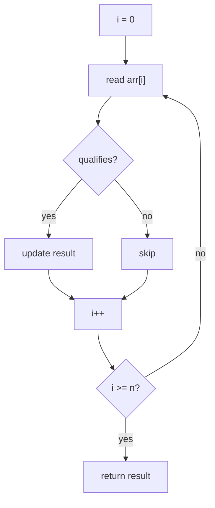
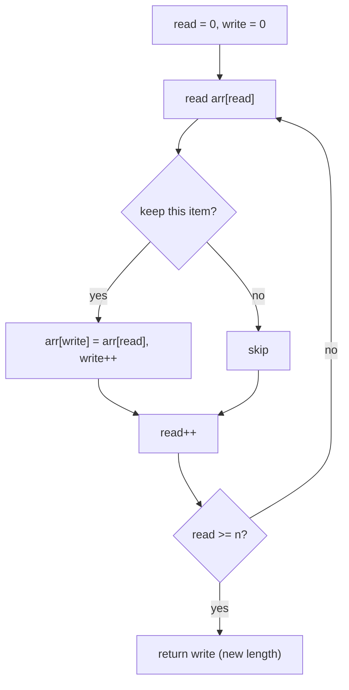
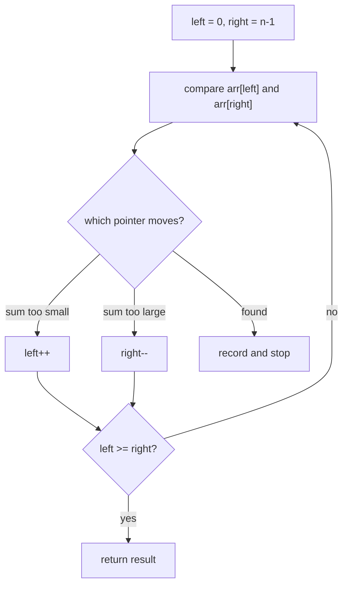
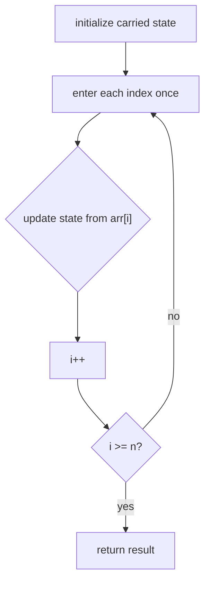
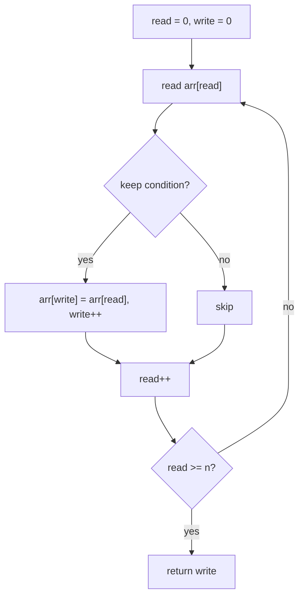
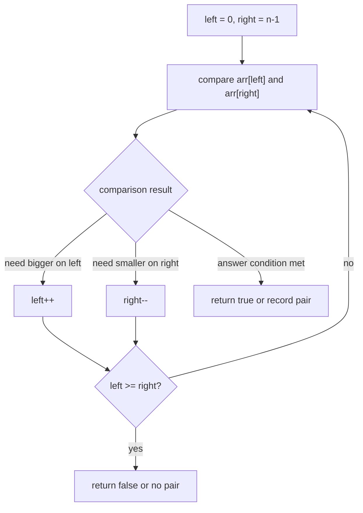

## Overview

Arrays and strings are the bedrock of nearly every algorithm problem. An array gives you indexed access to elements in O(1); a string is just an array of characters with a few extra constraints. Nearly everything you do with them comes down to one question: which index or indices should I be looking at right now, and what information have I accumulated so far?

This guide builds that index intuition in three stages. **Single-Pass Traversal** uses one read cursor to accumulate information about the whole sequence in one walk. **The Write Cursor** adds a second pointer that rewrites the array in-place, so filtering and compressing work without extra allocation. **Converging Two Pointers** places one pointer at each end and walks them toward each other, collapsing what would be a nested O(n²) search into a single O(n) pass.

## Core Concept & Mental Model

### The Corridor of Lockers

Picture a corridor with lockers numbered 0 through n-1. Each locker holds one value. You can open any locker by its number in constant time, but you never have more than a few keys in your hand at once.

- **index**: the locker number; the single most important thing you control in any array problem
- **read cursor**: a key you carry forward through the corridor, opening lockers one by one
- **write cursor**: a second key you carry separately; you only advance it when you deposit a qualified item
- **prefix state**: a notebook you carry; updated at every locker, it tells you what you have seen from the start up to the current position
- **left pointer / right pointer**: two keys, one starting at each end of the corridor, moving toward each other

The corridor image maps directly onto cost. Reading any locker is O(1). Walking the corridor once from left to right, or from both ends toward the middle, is O(n). Building a separate corridor of the same length costs O(n) space; working in-place with only a few extra keys costs O(1) space.

### Three Mechanisms

These three mechanisms are the complete toolkit for arrays and strings. Every technique in this guide is one of them or a combination.

#### The Read Cursor

The simplest use of index control is a single cursor walking left to right. At each position you read the value, apply a condition or arithmetic, and carry a result forward. The result might be a count, a running sum, a maximum seen so far, or a set of elements encountered. The cursor itself never writes; its job is to observe.

The prefix sum is the clearest example of a carried result. After visiting index `i`, you know the sum of every element from `0` to `i`. That prefix value unlocks range queries and product-except-self in a second pass.

#### The Write Cursor

Filtering or compressing an array in-place requires two indices moving at different speeds. The **read** cursor advances every step. The **write** cursor advances only when the current item earns its place in the output. Items behind the write cursor are the kept ones. Items between write and read are gaps waiting to be overwritten.

Three classic problems use exactly this shape: remove a target value, deduplicate a sorted array, and move zeros to the end. In all three the answer is whatever the write cursor landed on when the read cursor finished.

#### The Converging Two Pointers

Two pointers work when the sequence is sorted or symmetric and the answer involves a pair. Place `left` at index 0 and `right` at index n-1. At each step, compare what both pointers see and move the one that the comparison tells you to move. The two pointers close the gap and meet somewhere in the middle, guaranteeing O(n) regardless of the pair they are looking for.

The same shape that checks palindromes also finds two-sum pairs in sorted arrays. In the palindrome case the comparison is equality and both pointers always advance after a check. In the sorted-pair case the comparison is arithmetic and only one pointer advances at a time.

### How I Think Through This

Before touching code, I ask: **how many cursors do I need, and what does each one carry?**

**When the problem asks to measure, count, or aggregate**: one read cursor walking left to right, carrying a running result. If the question references "everything before position i" or "everything after position i," a prefix or suffix pass is the tool.

**When the problem asks to modify the array in-place without extra space**: two cursors on the same array. Read advances unconditionally. Write advances only when the current item belongs in the output.

**When the input is sorted or the problem is symmetric, and a pair is involved**: two pointers from opposite ends. Move the pointer that the current comparison tells you to move.

**Scenario 1: Prefix accumulation**

**Input:** `nums = [3, 1, 4, 1, 5]`

:::trace-graph
[
  {
    "nodes": [
      {"id": "0", "label": "3", "x": 10, "y": 50, "tone": "current"},
      {"id": "1", "label": "1", "x": 28, "y": 50, "tone": "default"},
      {"id": "2", "label": "4", "x": 46, "y": 50, "tone": "default"},
      {"id": "3", "label": "1", "x": 64, "y": 50, "tone": "default"},
      {"id": "4", "label": "5", "x": 82, "y": 50, "tone": "default"}
    ],
    "edges": [],
    "facts": [
      {"name": "i", "value": 0, "tone": "orange"},
      {"name": "prefix[i]", "value": 3, "tone": "blue"}
    ],
    "action": "visit",
    "label": "The read cursor enters position 0. The prefix sum equals the element itself."
  },
  {
    "nodes": [
      {"id": "0", "label": "3", "x": 10, "y": 50, "tone": "visited"},
      {"id": "1", "label": "1", "x": 28, "y": 50, "tone": "current"},
      {"id": "2", "label": "4", "x": 46, "y": 50, "tone": "default"},
      {"id": "3", "label": "1", "x": 64, "y": 50, "tone": "default"},
      {"id": "4", "label": "5", "x": 82, "y": 50, "tone": "default"}
    ],
    "edges": [],
    "facts": [
      {"name": "i", "value": 1, "tone": "orange"},
      {"name": "prefix[i]", "value": 4, "tone": "blue"}
    ],
    "action": "expand",
    "label": "Each position adds its element to the previous prefix value. The notebook carries the total forward."
  },
  {
    "nodes": [
      {"id": "0", "label": "3", "x": 10, "y": 50, "tone": "done"},
      {"id": "1", "label": "1", "x": 28, "y": 50, "tone": "done"},
      {"id": "2", "label": "4", "x": 46, "y": 50, "tone": "done"},
      {"id": "3", "label": "1", "x": 64, "y": 50, "tone": "done"},
      {"id": "4", "label": "5", "x": 82, "y": 50, "tone": "done"}
    ],
    "edges": [],
    "facts": [
      {"name": "i", "value": 4, "tone": "orange"},
      {"name": "prefix", "value": "[3,4,8,9,14]", "tone": "blue"}
    ],
    "action": "done",
    "label": "One pass fills the entire prefix array. Any range sum [i..j] is now prefix[j] - prefix[i-1]."
  }
]
:::

**Scenario 2: Write cursor filtering**

**Input:** `arr = [1, 0, 2, 0, 3]`, remove zeros in-place

:::trace-graph
[
  {
    "nodes": [
      {"id": "0", "label": "1", "x": 10, "y": 50, "tone": "current"},
      {"id": "1", "label": "0", "x": 28, "y": 50, "tone": "default"},
      {"id": "2", "label": "2", "x": 46, "y": 50, "tone": "default"},
      {"id": "3", "label": "0", "x": 64, "y": 50, "tone": "default"},
      {"id": "4", "label": "3", "x": 82, "y": 50, "tone": "default"}
    ],
    "edges": [],
    "facts": [
      {"name": "read", "value": 0, "tone": "orange"},
      {"name": "write", "value": 0, "tone": "green"},
      {"name": "arr[write]", "value": 1, "tone": "blue"}
    ],
    "action": "visit",
    "label": "Read and write start together. The value qualifies, so write also advances."
  },
  {
    "nodes": [
      {"id": "0", "label": "1", "x": 10, "y": 50, "tone": "visited"},
      {"id": "1", "label": "0", "x": 28, "y": 50, "tone": "blocked"},
      {"id": "2", "label": "2", "x": 46, "y": 50, "tone": "current"},
      {"id": "3", "label": "0", "x": 64, "y": 50, "tone": "default"},
      {"id": "4", "label": "3", "x": 82, "y": 50, "tone": "default"}
    ],
    "edges": [],
    "facts": [
      {"name": "read", "value": 2, "tone": "orange"},
      {"name": "write", "value": 1, "tone": "green"},
      {"name": "gap", "value": "read-write=1", "tone": "purple"}
    ],
    "action": "expand",
    "label": "Position 1 was zero so write stayed. A gap opens between the two cursors."
  },
  {
    "nodes": [
      {"id": "0", "label": "1", "x": 10, "y": 50, "tone": "done"},
      {"id": "1", "label": "2", "x": 28, "y": 50, "tone": "done"},
      {"id": "2", "label": "3", "x": 46, "y": 50, "tone": "done"},
      {"id": "3", "label": "0", "x": 64, "y": 50, "tone": "muted"},
      {"id": "4", "label": "0", "x": 82, "y": 50, "tone": "muted"}
    ],
    "edges": [],
    "facts": [
      {"name": "read", "value": 5, "tone": "orange"},
      {"name": "write", "value": 3, "tone": "green"},
      {"name": "new length", "value": 3, "tone": "blue"}
    ],
    "action": "done",
    "label": "When read finishes, write marks the boundary. The live portion is arr[0..write-1]."
  }
]
:::

**Scenario 3: Converging two pointers**

**Input:** `s = "racecar"`, check palindrome

:::trace-graph
[
  {
    "nodes": [
      {"id": "0", "label": "'r'", "x": 10, "y": 50, "tone": "current", "badge": "L"},
      {"id": "1", "label": "'a'", "x": 24, "y": 50, "tone": "default"},
      {"id": "2", "label": "'c'", "x": 38, "y": 50, "tone": "default"},
      {"id": "3", "label": "'e'", "x": 52, "y": 50, "tone": "default"},
      {"id": "4", "label": "'c'", "x": 66, "y": 50, "tone": "default"},
      {"id": "5", "label": "'a'", "x": 80, "y": 50, "tone": "default"},
      {"id": "6", "label": "'r'", "x": 94, "y": 50, "tone": "current", "badge": "R"}
    ],
    "edges": [
      {"from": "0", "to": "6", "tone": "active"}
    ],
    "facts": [
      {"name": "left", "value": 0, "tone": "orange"},
      {"name": "right", "value": 6, "tone": "green"},
      {"name": "match", "value": "r == r", "tone": "blue"}
    ],
    "action": "visit",
    "label": "Both pointers check their characters. A match means both can safely move inward."
  },
  {
    "nodes": [
      {"id": "0", "label": "'r'", "x": 10, "y": 50, "tone": "visited"},
      {"id": "1", "label": "'a'", "x": 24, "y": 50, "tone": "current", "badge": "L"},
      {"id": "2", "label": "'c'", "x": 38, "y": 50, "tone": "default"},
      {"id": "3", "label": "'e'", "x": 52, "y": 50, "tone": "default"},
      {"id": "4", "label": "'c'", "x": 66, "y": 50, "tone": "default"},
      {"id": "5", "label": "'a'", "x": 80, "y": 50, "tone": "current", "badge": "R"},
      {"id": "6", "label": "'r'", "x": 94, "y": 50, "tone": "visited"}
    ],
    "edges": [
      {"from": "1", "to": "5", "tone": "active"}
    ],
    "facts": [
      {"name": "left", "value": 1, "tone": "orange"},
      {"name": "right", "value": 5, "tone": "green"},
      {"name": "match", "value": "a == a", "tone": "blue"}
    ],
    "action": "expand",
    "label": "Each matched pair shrinks the unchecked window. The pointers close toward the center."
  },
  {
    "nodes": [
      {"id": "0", "label": "'r'", "x": 10, "y": 50, "tone": "done"},
      {"id": "1", "label": "'a'", "x": 24, "y": 50, "tone": "done"},
      {"id": "2", "label": "'c'", "x": 38, "y": 50, "tone": "done"},
      {"id": "3", "label": "'e'", "x": 52, "y": 50, "tone": "done"},
      {"id": "4", "label": "'c'", "x": 66, "y": 50, "tone": "done"},
      {"id": "5", "label": "'a'", "x": 80, "y": 50, "tone": "done"},
      {"id": "6", "label": "'r'", "x": 94, "y": 50, "tone": "done"}
    ],
    "edges": [],
    "facts": [
      {"name": "left", "value": 3, "tone": "orange"},
      {"name": "right", "value": 3, "tone": "green"},
      {"name": "result", "value": "palindrome", "tone": "blue"}
    ],
    "action": "done",
    "label": "When the pointers meet (or cross for even-length strings), every pair has been checked."
  }
]
:::

---

## Building Blocks: Progressive Learning

### Level 1: Single-Pass Traversal

A single-pass traversal problem asks you to walk an array or string once and produce a result from what you observe. The brute-force temptation is to re-scan from the start whenever you need information about a different position. That turns a linear problem into a quadratic one.

The exploitable property is that a running result carried forward eliminates re-scanning. Whether you are counting matching elements, building a prefix sum, or tracking the maximum seen so far, the pattern is the same: enter each position once, update the carried state, move on.

Mechanically: initialize the result before the loop, update it inside the loop at each index, return it after the loop ends. The only decision is what the carried state looks like.

`s = "hello world"`, count vowels

:::trace-graph
[
  {
    "nodes": [
      {"id": "0", "label": "'h'", "x": 8, "y": 50, "tone": "blocked"},
      {"id": "1", "label": "'e'", "x": 22, "y": 50, "tone": "current"},
      {"id": "2", "label": "'l'", "x": 36, "y": 50, "tone": "default"},
      {"id": "3", "label": "'l'", "x": 50, "y": 50, "tone": "default"},
      {"id": "4", "label": "'o'", "x": 64, "y": 50, "tone": "frontier"},
      {"id": "5", "label": "' '", "x": 78, "y": 50, "tone": "default"},
      {"id": "6", "label": "'w'", "x": 92, "y": 50, "tone": "default"}
    ],
    "edges": [],
    "facts": [
      {"name": "i", "value": 1, "tone": "orange"},
      {"name": "count", "value": 1, "tone": "blue"}
    ],
    "action": "visit",
    "label": "'h' failed the vowel check. 'e' passes — count increments immediately."
  },
  {
    "nodes": [
      {"id": "0", "label": "'h'", "x": 8, "y": 50, "tone": "blocked"},
      {"id": "1", "label": "'e'", "x": 22, "y": 50, "tone": "visited"},
      {"id": "2", "label": "'l'", "x": 36, "y": 50, "tone": "blocked"},
      {"id": "3", "label": "'l'", "x": 50, "y": 50, "tone": "blocked"},
      {"id": "4", "label": "'o'", "x": 64, "y": 50, "tone": "current"},
      {"id": "5", "label": "' '", "x": 78, "y": 50, "tone": "default"},
      {"id": "6", "label": "'w'", "x": 92, "y": 50, "tone": "default"}
    ],
    "edges": [],
    "facts": [
      {"name": "i", "value": 4, "tone": "orange"},
      {"name": "count", "value": 2, "tone": "blue"}
    ],
    "action": "expand",
    "label": "The cursor skips non-vowels without resetting. Count grows only on qualifying elements."
  },
  {
    "nodes": [
      {"id": "0", "label": "'h'", "x": 8, "y": 50, "tone": "done"},
      {"id": "1", "label": "'e'", "x": 22, "y": 50, "tone": "done"},
      {"id": "2", "label": "'l'", "x": 36, "y": 50, "tone": "done"},
      {"id": "3", "label": "'l'", "x": 50, "y": 50, "tone": "done"},
      {"id": "4", "label": "'o'", "x": 64, "y": 50, "tone": "done"},
      {"id": "5", "label": "' '", "x": 78, "y": 50, "tone": "done"},
      {"id": "6", "label": "'w'", "x": 92, "y": 50, "tone": "done"}
    ],
    "edges": [],
    "facts": [
      {"name": "i", "value": 7, "tone": "orange"},
      {"name": "count", "value": 3, "tone": "blue"}
    ],
    "action": "done",
    "label": "One pass, one count variable. The result is ready as soon as the cursor finishes."
  }
]
:::

#### **Exercise 1**

Vowel counting is the simplest read-cursor exercise. You're given a string. Return the count of vowel characters (a, e, i, o, u, case-insensitive) using a single pass with one accumulator variable.

:::stackblitz{step=1 total=3 exercises="step1-exercise1-problem.ts" solutions="step1-exercise1-solution.ts"}

#### **Exercise 2**

A prefix sum carries a running total forward so any range query can be answered later in O(1). You're given an array of integers. Return a new array of the same length where each position holds the sum of all elements from index 0 through that position.

:::stackblitz{step=1 total=3 exercises="step1-exercise2-problem.ts" solutions="step1-exercise2-solution.ts"}

#### **Exercise 3**

Tracking the running maximum is useful when the answer depends on what came before each element, not what the element is in isolation. You're given an array of integers. Return a new array where each position holds the maximum value seen from index 0 through that position.

:::stackblitz{step=1 total=3 exercises="step1-exercise3-problem.ts" solutions="step1-exercise3-solution.ts"}

> **Mental anchor**: Enter each position once, update the carried state, move on. One pass is almost always enough.

**→ Bridge to Level 2**: Level 1 reads without writing. When the problem asks you to compress or filter the array itself without allocating a second one, a second cursor is needed. That is the write cursor.

### Level 2: Write-Cursor Compression

Level 1 gave you one cursor that only reads. Now the problem changes: you need to shrink or rearrange the array in-place, using no extra allocation beyond a few variables. The brute-force mistake is to shift elements one slot at a time every time you remove something. On an array with n removals, that is O(n²) shifts.

The exploitable property is that a second cursor moving at a different speed handles all the repositioning in a single pass. The **read** cursor visits every element. The **write** cursor sits at the next open slot. When the read cursor finds a keeper, it copies to the write slot and advances write. When read finds a discard, it skips past without moving write. At the end, the array's live portion runs from index 0 to write-1.

Mechanically: initialize both cursors to 0, walk read to the end, conditionally advance write. No shifting, no second array. The total work is exactly one read per element.

`arr = [3, 0, 1, 0, 4, 0, 2]`, remove zeros

:::trace-graph
[
  {
    "nodes": [
      {"id": "0", "label": "3", "x": 10, "y": 50, "tone": "current"},
      {"id": "1", "label": "0", "x": 26, "y": 50, "tone": "frontier"},
      {"id": "2", "label": "1", "x": 42, "y": 50, "tone": "default"},
      {"id": "3", "label": "0", "x": 58, "y": 50, "tone": "default"},
      {"id": "4", "label": "4", "x": 74, "y": 50, "tone": "default"},
      {"id": "5", "label": "0", "x": 90, "y": 50, "tone": "default"},
      {"id": "6", "label": "2", "x": 106, "y": 50, "tone": "default"}
    ],
    "edges": [],
    "facts": [
      {"name": "read", "value": 0, "tone": "orange"},
      {"name": "write", "value": 0, "tone": "green"}
    ],
    "action": "visit",
    "label": "Both cursors start at 0. The value 3 qualifies, so arr[write]=arr[read] and write advances."
  },
  {
    "nodes": [
      {"id": "0", "label": "3", "x": 10, "y": 50, "tone": "visited"},
      {"id": "1", "label": "0", "x": 26, "y": 50, "tone": "blocked"},
      {"id": "2", "label": "1", "x": 42, "y": 50, "tone": "current"},
      {"id": "3", "label": "0", "x": 58, "y": 50, "tone": "default"},
      {"id": "4", "label": "4", "x": 74, "y": 50, "tone": "default"},
      {"id": "5", "label": "0", "x": 90, "y": 50, "tone": "default"},
      {"id": "6", "label": "2", "x": 106, "y": 50, "tone": "default"}
    ],
    "edges": [],
    "facts": [
      {"name": "read", "value": 2, "tone": "orange"},
      {"name": "write", "value": 1, "tone": "green"},
      {"name": "gap", "value": 1, "tone": "purple"}
    ],
    "action": "expand",
    "label": "The zero at position 1 was skipped. Write did not move. The gap between cursors is 1."
  },
  {
    "nodes": [
      {"id": "0", "label": "3", "x": 10, "y": 50, "tone": "done"},
      {"id": "1", "label": "1", "x": 26, "y": 50, "tone": "done"},
      {"id": "2", "label": "4", "x": 42, "y": 50, "tone": "done"},
      {"id": "3", "label": "2", "x": 58, "y": 50, "tone": "done"},
      {"id": "4", "label": "4", "x": 74, "y": 50, "tone": "muted"},
      {"id": "5", "label": "0", "x": 90, "y": 50, "tone": "muted"},
      {"id": "6", "label": "2", "x": 106, "y": 50, "tone": "muted"}
    ],
    "edges": [],
    "facts": [
      {"name": "read", "value": 7, "tone": "orange"},
      {"name": "write", "value": 4, "tone": "green"},
      {"name": "new length", "value": 4, "tone": "blue"}
    ],
    "action": "done",
    "label": "Read finished. The first four positions are the kept values. Write is the new length."
  }
]
:::

#### **Exercise 1**

Removing a target value in-place is the write-cursor pattern at its simplest. You're given an array and a target value. Modify the array in-place so all non-target values are packed at the front, and return the count of kept elements.

:::stackblitz{step=2 total=3 exercises="step2-exercise1-problem.ts" solutions="step2-exercise1-solution.ts"}

#### **Exercise 2**

Deduplicating a sorted array adds one comparison to the write condition. You're given a sorted array. Remove duplicate values in-place so each value appears at most once, and return the count of unique values. The input being sorted means duplicates are always adjacent.

:::stackblitz{step=2 total=3 exercises="step2-exercise2-problem.ts" solutions="step2-exercise2-solution.ts"}

#### **Exercise 3**

Moving zeros to the end while preserving the relative order of non-zero elements is a variant where the discard condition is `=== 0`. You're given an array of integers. Move all zeros to the end in-place, keeping the relative order of the non-zero values unchanged.

:::stackblitz{step=2 total=3 exercises="step2-exercise3-problem.ts" solutions="step2-exercise3-solution.ts"}

> **Mental anchor**: Read sees everything. Write stamps only what earns a place. The gap between them is the junk you are compressing away.

**→ Bridge to Level 3**: Level 2 moves both cursors in the same direction at different speeds. Two-pointer problems move the cursors in opposite directions, toward each other, to answer questions about pairs without a nested loop.

### Level 3: Converging Two Pointers

Level 2 gave you two cursors moving left-to-right at different speeds. Now the problem changes shape: you need to answer questions about pairs of elements, and the input is sorted or symmetric. The brute-force is nested loops at O(n²). The exploitable property is that if you know the relative order of values, you can eliminate entire ranges in one step.

Place `left` at 0 and `right` at n-1. Compare what each points to. If that comparison tells you the left value is too small, increment left to get a bigger value. If the right value is too large, decrement right to get a smaller value. Each step eliminates at least one position from consideration, so the pointers cross in at most n steps total.

Mechanically: the loop condition is `left < right`. The exit inside the loop is a match or a target condition. The advance rule is the arithmetic condition: pick the pointer whose direction moves the comparison closer to the target.

`nums = [1, 3, 5, 7, 9]`, find pair summing to 10

:::trace-graph
[
  {
    "nodes": [
      {"id": "0", "label": "1", "x": 10, "y": 50, "tone": "current", "badge": "L"},
      {"id": "1", "label": "3", "x": 28, "y": 50, "tone": "default"},
      {"id": "2", "label": "5", "x": 46, "y": 50, "tone": "default"},
      {"id": "3", "label": "7", "x": 64, "y": 50, "tone": "default"},
      {"id": "4", "label": "9", "x": 82, "y": 50, "tone": "current", "badge": "R"}
    ],
    "edges": [
      {"from": "0", "to": "4", "tone": "active"}
    ],
    "facts": [
      {"name": "left", "value": 0, "tone": "orange"},
      {"name": "right", "value": 4, "tone": "green"},
      {"name": "sum", "value": "1+9=10", "tone": "blue"}
    ],
    "action": "visit",
    "label": "First comparison: sum is 10, the target. Answer found immediately."
  },
  {
    "nodes": [
      {"id": "0", "label": "1", "x": 10, "y": 50, "tone": "current", "badge": "L"},
      {"id": "1", "label": "3", "x": 28, "y": 50, "tone": "default"},
      {"id": "2", "label": "5", "x": 46, "y": 50, "tone": "default"},
      {"id": "3", "label": "7", "x": 64, "y": 50, "tone": "current", "badge": "R"},
      {"id": "4", "label": "9", "x": 82, "y": 50, "tone": "visited"}
    ],
    "edges": [
      {"from": "0", "to": "3", "tone": "active"}
    ],
    "facts": [
      {"name": "left", "value": 0, "tone": "orange"},
      {"name": "right", "value": 3, "tone": "green"},
      {"name": "sum", "value": "1+7=8", "tone": "blue"}
    ],
    "action": "expand",
    "label": "If sum < target, left must grow. Incrementing left moves the sum upward without re-scanning."
  },
  {
    "nodes": [
      {"id": "0", "label": "1", "x": 10, "y": 50, "tone": "visited"},
      {"id": "1", "label": "3", "x": 28, "y": 50, "tone": "current", "badge": "L"},
      {"id": "2", "label": "5", "x": 46, "y": 50, "tone": "default"},
      {"id": "3", "label": "7", "x": 64, "y": 50, "tone": "current", "badge": "R"},
      {"id": "4", "label": "9", "x": 82, "y": 50, "tone": "visited"}
    ],
    "edges": [
      {"from": "1", "to": "3", "tone": "active"}
    ],
    "facts": [
      {"name": "left", "value": 1, "tone": "orange"},
      {"name": "right", "value": 3, "tone": "green"},
      {"name": "sum", "value": "3+7=10", "tone": "blue"}
    ],
    "action": "done",
    "label": "Left advanced once. The new pair hits the target. Every other pair was eliminated without checking."
  }
]
:::

#### **Exercise 1**

Checking a palindrome is the simplest converging-pointer problem. You're given a string. Return `true` if it reads the same forwards and backwards, using two pointers that start at opposite ends and move inward until they meet.

:::stackblitz{step=3 total=3 exercises="step3-exercise1-problem.ts" solutions="step3-exercise1-solution.ts"}

#### **Exercise 2**

Two-sum in a sorted array is the canonical converging-pointer problem. You're given a sorted array of integers and a target. Return the 1-based indices of the two numbers that sum to the target, advancing left when the sum is too small and right when the sum is too large.

:::stackblitz{step=3 total=3 exercises="step3-exercise2-problem.ts" solutions="step3-exercise2-solution.ts"}

#### **Exercise 3**

Merging two sorted arrays from the right uses a three-pointer approach where two read pointers start at the end of each input and one write pointer starts at the end of the destination. You're given `nums1` with extra space at the end, `m` valid elements, `nums2`, and `n` elements. Merge them in-place, sorted, without extra allocation.

:::stackblitz{step=3 total=3 exercises="step3-exercise3-problem.ts" solutions="step3-exercise3-solution.ts"}

> **Mental anchor**: The pointers only move inward. Each step eliminates at least one position. They cross in O(n).

## Key Patterns

### Pattern: Single-Pass Accumulation

**When to use**: the input is a linear sequence, the question asks for a count, sum, maximum, or any aggregate, and the answer at each position depends only on what came before it.

**How to think about it**: decide what state to carry forward. Initialize it before the loop. Update it at each index. Return it after the last index. The output might be a single number (count, total) or an array built in the same pass (prefix sums, running max).

**Complexity**: Time O(n), Space O(1) for scalar results or O(n) for output arrays.

### Pattern: Write-Cursor Compression

**When to use**: the problem asks to remove, filter, deduplicate, or rearrange a sequence in-place with no extra array, returning the new effective length.

**How to think about it**: keep and discard are two different cursor speeds. Read always advances. Write only advances when a keeper is found and copied to `arr[write]`. The qualify condition is the only thing that changes between problems.

**Complexity**: Time O(n), Space O(1).

### Pattern: Converging Two Pointers

**When to use**: the input is sorted or symmetric, the problem involves a pair of elements, and you want to eliminate the nested loop.

**How to think about it**: the advance rule comes from the comparison. In a sorted-pair problem, if the sum is too small, left needs a bigger value, so increment left. If the sum is too large, right needs a smaller value, so decrement right. In a symmetry problem like a palindrome, both pointers advance together on a match, and a mismatch is an immediate false.

**Complexity**: Time O(n), Space O(1).
