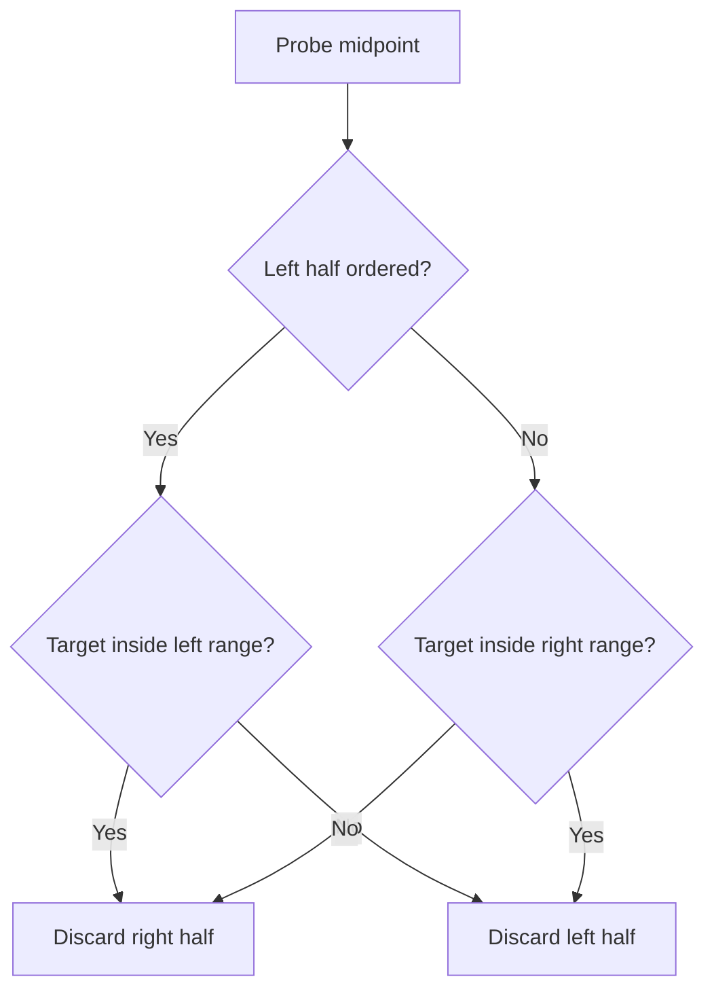
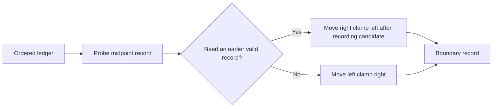
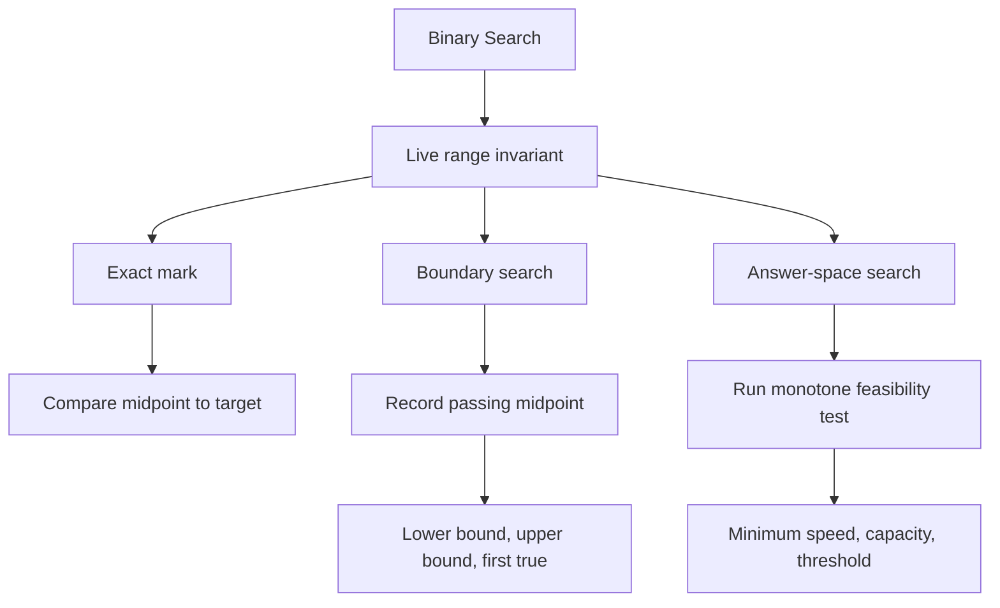
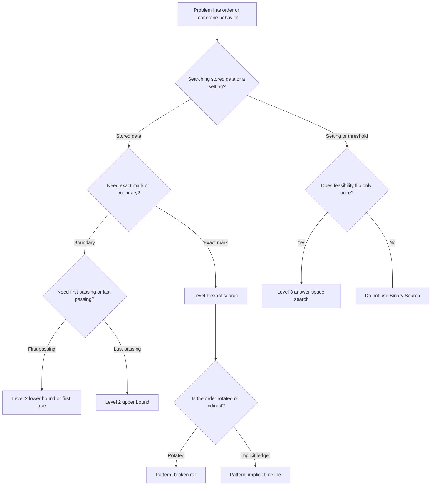

## Overview

Binary Search solves ordered problems by removing half of the remaining possibilities at every probe. Instead of checking one item at a time, you keep a live range of candidates and ask the midpoint to prove which half can never contain the answer.

From Arrays and Strings and Two Pointers, you already know that movement rules matter. Binary Search adds a stronger guarantee: the range itself is the state, and every midpoint test must permanently rule out one whole side.

The three building-block levels in this guide are `Probe the Exact Mark`, `Squeeze to the First Passing Mark`, and `Calibrate the Smallest Working Setting`.

## Core Concept & Mental Model

### The Surveyor's Calibration Rail

Picture a surveyor standing over a long numbered calibration rail. Somewhere on that rail is the mark she needs. She places a left clamp and a right clamp around every mark that could still be correct, then drops a probe at the midpoint. The reading from that probe tells her which half of the rail can be thrown away.

- The rail is the ordered search space
- The left clamp is the left boundary
- The right clamp is the right boundary
- The probe is the midpoint check
- A certified candidate is a valid midpoint worth keeping while you squeeze farther

Each probe matters because it disproves a whole half at once. Since each step cuts the live rail roughly in half, the search finishes in O(log n) probes instead of O(n) scans.

### Understanding the Analogy

#### The Setup

The calibration rail is ordered from smallest to largest. That order is the whole reason Binary Search works. When the probe lands in the middle, the surveyor does not just learn something about one mark. She learns something about every mark to the left or every mark to the right.

The left clamp and right clamp surround the only territory she still trusts. Everything outside them has already been disproved. The invariant is simple: if an answer exists, it still lives inside the clamped range.

#### The Midpoint Probe

The midpoint probe is the surveyor's test drill. If the midpoint value is too small for the target, then every mark to the left is also too small, so the left clamp jumps past the probe. If the midpoint value is too large, then every mark to the right is also too large, so the right clamp jumps left of the probe.

That is the real mental shift. The probe does not merely inspect a value. It certifies that one half of the rail is impossible.

#### Certified Edges

Boundary search adds one more idea. Sometimes the midpoint is already acceptable, but the surveyor is not done because she wants the first acceptable mark, not just any acceptable mark. In that case she records the midpoint as a certified candidate and keeps squeezing left to see whether an earlier acceptable mark exists.

Answer-space search uses the same squeeze, but the rail now represents possible settings, capacities, speeds, or thresholds. The probe runs a pass or fail test. Once a setting passes, every larger setting also passes. Once a setting fails, every smaller setting also fails.

#### Why These Approaches

Linear search spends one check per candidate. Binary Search spends one check per halving. That changes the growth rate from O(n) to O(log n), which is why ordered problems that feel expensive by scanning become cheap once each probe can discard half the rail.

#### How I Think Through This

Before I touch any code, I ask one question: **what is the live rail, and what does one midpoint prove impossible?**

**When I need one exact mark:** the live rail contains every index where the target could still sit. A midpoint that is too small kills the entire left half. A midpoint that is too large kills the entire right half.

**When I need the first passing mark:** the live rail contains every position where the boundary could still begin. A passing midpoint is useful, but it is only a certified candidate until I prove no earlier passing mark survives.

**When I need the smallest working setting:** the live rail contains every setting that might still be the minimum acceptable one. The midpoint does not compare against stored data. It runs a monotone pass or fail test and tells me which side of the threshold I am on.

The building blocks below work through three distinct situations where that logic shows up in different forms.

**Scenario 1 - Exact mark:** Take `[3, 7, 11, 14, 18, 21, 25]`, looking for `18`.

:::trace-bs
[
  {"values":[3,7,11,14,18,21,25],"left":0,"mid":3,"right":6,"action":"check","label":"Clamp the full rail. Probe index 3, value 14. Too small, so index 0 through 3 are ruled out."},
  {"values":[3,7,11,14,18,21,25],"left":4,"mid":5,"right":6,"action":"discard-left","label":"Move the left clamp to index 4. Probe index 5, value 21. Too large, so index 5 and 6 are ruled out."},
  {"values":[3,7,11,14,18,21,25],"left":4,"mid":4,"right":4,"action":"check","label":"Only one live mark remains. Probe index 4, value 18."},
  {"values":[3,7,11,14,18,21,25],"left":4,"mid":4,"right":4,"action":"found","label":"Exact hit. The surveyor has found the mark at index 4."}
]
:::

**Scenario 2 - First passing mark:** Take `[10, 14, 19, 30, 30, 42, 50]`, looking for the first mark `>= 30`.

:::trace-bs
[
  {"values":[10,14,19,30,30,42,50],"left":0,"mid":3,"right":6,"action":"check","label":"Probe index 3, value 30. It passes. Record index 3 as a candidate and squeeze left."},
  {"values":[10,14,19,30,30,42,50],"left":0,"mid":1,"right":2,"action":"candidate","label":"The candidate is index 3. Now search index 0 through 2 to see whether an earlier passing mark exists."},
  {"values":[10,14,19,30,30,42,50],"left":2,"mid":2,"right":2,"action":"discard-left","label":"Probe index 2, value 19. Too small, so the first passing mark must be to the right."},
  {"values":[10,14,19,30,30,42,50],"left":3,"mid":null,"right":2,"action":"done","label":"The live rail is empty. Keep the certified candidate at index 3."}
]
:::

**Scenario 3 - Smallest working setting:** Take the possible rates `[1, 2, 3, 4, 5, 6, 7, 8, 9, 10, 11]`, where every rate `>= 4` passes.

:::trace-bs
[
  {"values":[1,2,3,4,5,6,7,8,9,10,11],"left":0,"mid":5,"right":10,"action":"check","label":"Probe rate 6. It passes, so record it and squeeze left for a smaller working rate."},
  {"values":[1,2,3,4,5,6,7,8,9,10,11],"left":0,"mid":2,"right":4,"action":"candidate","label":"Candidate rate 6 recorded. Search the smaller rates 1 through 5."},
  {"values":[1,2,3,4,5,6,7,8,9,10,11],"left":3,"mid":3,"right":4,"action":"discard-left","label":"Probe rate 3 fails, so every smaller rate fails too. Move the left clamp right and probe rate 4 next."},
  {"values":[1,2,3,4,5,6,7,8,9,10,11],"left":3,"mid":3,"right":2,"action":"done","label":"Rate 4 passes and no smaller passing rate survives. The certified candidate is the answer."}
]
:::

---

## Building Blocks: Progressive Learning

### Level 1: Probe the Exact Mark

Start with the simplest job: the surveyor wants one exact mark from an ordered rail. On `[4, 8, 12, 16, 23, 31, 40, 52]`, scanning left to right would check one candidate after another until it hits `23` or runs out. That works, but it wastes the fact that the rail is sorted.

Sorted order gives the surveyor a much stronger move. If the midpoint reads `16`, then everything at or left of that probe is too small. If the midpoint reads `31`, then everything at or right of that probe is too large. The order does the elimination work for you, which is why one comparison can discard half the rail instead of one mark.

Mechanically, the loop is always the same. Clamp the live range with `left` and `right`, probe the midpoint, compare it with the target, then move exactly one clamp past the midpoint you just checked. The loop ends either when you hit the target or when the live range collapses and no mark survives.

Take `[4, 8, 12, 16, 23, 31, 40, 52]`, looking for `23`.

:::trace-bs
[
  {"values":[4,8,12,16,23,31,40,52],"left":0,"mid":3,"right":7,"action":"check","label":"Probe index 3, value 16. Too small, so the live rail becomes index 4 through 7."},
  {"values":[4,8,12,16,23,31,40,52],"left":4,"mid":5,"right":7,"action":"discard-left","label":"Probe index 5, value 31. Too large, so the live rail becomes index 4 through 4."},
  {"values":[4,8,12,16,23,31,40,52],"left":4,"mid":4,"right":4,"action":"check","label":"Probe index 4, value 23. Only one possible mark remains."},
  {"values":[4,8,12,16,23,31,40,52],"left":4,"mid":4,"right":4,"action":"found","label":"Exact hit. The surveyor stops at index 4."}
]
:::

#### **Exercise 1**

This is the direct application of the level. You will probe the surveyor's rail and return the exact checkpoint index when it exists. Focus on the three-way midpoint decision and on removing the midpoint from the live range after every comparison.

:::stackblitz{step=1 total=3 exercises="step1-exercise1-problem.ts" solutions="step1-exercise1-solution.ts"}

#### **Exercise 2**

This removes the need to return an index and asks only whether the mark exists. The loop structure stays the same, but the outcome becomes a boolean, which is a good check that you understand the elimination logic rather than memorizing one return shape.

:::stackblitz{step=1 total=3 exercises="step1-exercise2-problem.ts" solutions="step1-exercise2-solution.ts"}

#### **Exercise 3**

This shifts the rail so it crosses from negative to positive values. Nothing about Binary Search changes, which is the point of the exercise. Sorted order, not the sign of the numbers, is what makes the midpoint proof valid.

:::stackblitz{step=1 total=3 exercises="step1-exercise3-problem.ts" solutions="step1-exercise3-solution.ts"}

> **Mental anchor**: "An exact-mark search works because every midpoint proves one whole side cannot possibly contain the target."

**→ Bridge to Level 2**: Level 1 stops the moment it sees the target. Boundary problems do not. Once a midpoint passes the rule, you still have to prove whether an earlier or later passing mark exists.

### Level 2: Squeeze to the First Passing Mark

Level 1 gave you an exact-hit search. Now the question changes shape. On `[10, 14, 19, 30, 30, 42]`, the goal may be the first mark that is at least `30`, the last mark that is at most `11`, or the first place a false rail flips to true. Scanning can answer those questions, but it still spends one check per position.

The structural guarantee is still sorted order, but the meaning of "success" changes. A passing midpoint does not finish the search. It becomes a certified candidate, and the search keeps squeezing toward the relevant edge to see whether a better passing mark exists. That is what turns exact search into lower-bound, upper-bound, and first-true search.

Mechanically, the loop adds one state variable: the best passing midpoint seen so far. When the midpoint fails, you discard the failing side. When the midpoint passes, you record it, then shrink toward the edge you are hunting. The loop ends when the live range empties, and the recorded candidate is the answer.

Take `[10, 14, 19, 30, 30, 42, 50]`, looking for the first mark `>= 30`.

:::trace-bs
[
  {"values":[10,14,19,30,30,42,50],"left":0,"mid":3,"right":6,"action":"check","label":"Probe index 3, value 30. It passes. Record index 3 as a candidate and squeeze left."},
  {"values":[10,14,19,30,30,42,50],"left":0,"mid":1,"right":2,"action":"candidate","label":"Keep index 3 as the best candidate so far and search the earlier marks."},
  {"values":[10,14,19,30,30,42,50],"left":2,"mid":2,"right":2,"action":"discard-left","label":"Probe index 2, value 19. Too small, so the first passing mark must be to the right."},
  {"values":[10,14,19,30,30,42,50],"left":3,"mid":null,"right":2,"action":"done","label":"No earlier passing mark survived. The candidate at index 3 is the boundary."}
]
:::

#### **Exercise 1**

This is the core lower-bound exercise. You are finding the first rail mark that is not less than the target, which means a passing midpoint stays alive as a candidate while you keep squeezing left.

:::stackblitz{step=2 total=3 exercises="step2-exercise1-problem.ts" solutions="step2-exercise1-solution.ts"}

#### **Exercise 2**

This flips the edge. Instead of the first passing mark, you want the last safe mark that is not greater than the target. The logic is symmetric, but the candidate now moves right when a midpoint passes.

:::stackblitz{step=2 total=3 exercises="step2-exercise2-problem.ts" solutions="step2-exercise2-solution.ts"}

#### **Exercise 3**

This shifts the problem from numeric comparison to a monotone boolean rail. The search now asks where green begins, which is the same boundary idea with the pass or fail rule written directly into the data.

:::stackblitz{step=2 total=3 exercises="step2-exercise3-problem.ts" solutions="step2-exercise3-solution.ts"}

> **Mental anchor**: "A passing midpoint is not the boundary. It is only the best certified candidate until no better edge survives."

**→ Bridge to Level 3**: Level 2 still searches stored positions. Level 3 removes the stored rail entirely and asks you to search a range of possible settings whose midpoint must be judged by a monotone feasibility test.

### Level 3: Calibrate the Smallest Working Setting

Level 2 taught you to search for an edge inside stored data. Level 3 keeps the same squeeze, but now the rail is made of possible answers: capacities, rates, thresholds, or square roots. On these problems, brute force means testing every possible setting from the smallest to the largest until one finally works.

The exploitable property is monotonicity. If a capacity is enough, every larger capacity is enough. If a speed is too slow, every smaller speed is too slow. That one-way flip is what lets the midpoint prove an entire side impossible even though the midpoint is not an element from an input array.

Mechanically, you choose a valid low and high setting, define a feasibility test, probe the midpoint, and shrink toward the smallest passing setting. The hard part is not the loop. The hard part is proving that your feasibility test flips only once so the rail has one clean boundary.

Take the possible rates `[1, 2, 3, 4, 5, 6, 7, 8, 9, 10, 11]`, where every rate `>= 4` passes.

:::trace-bs
[
  {"values":[1,2,3,4,5,6,7,8,9,10,11],"left":0,"mid":5,"right":10,"action":"check","label":"Probe rate 6. It passes, so record it and squeeze left for a smaller working rate."},
  {"values":[1,2,3,4,5,6,7,8,9,10,11],"left":0,"mid":2,"right":4,"action":"candidate","label":"Candidate rate 6 recorded. Search the smaller rates 1 through 5."},
  {"values":[1,2,3,4,5,6,7,8,9,10,11],"left":3,"mid":3,"right":4,"action":"discard-left","label":"Probe rate 3 fails, so every smaller rate fails too. Move right and test the next possible setting."},
  {"values":[1,2,3,4,5,6,7,8,9,10,11],"left":3,"mid":3,"right":2,"action":"done","label":"Rate 4 is the first passing setting. No smaller passing rate survives."}
]
:::

#### **Exercise 1**

This is the direct answer-space search. You will test daily load capacities and keep the smallest one that can finish the shipment plan within the allowed number of days. The key is the feasibility function that simulates one capacity and reports pass or fail.

:::stackblitz{step=3 total=3 exercises="step3-exercise1-problem.ts" solutions="step3-exercise1-solution.ts"}

#### **Exercise 2**

This removes the simulation pass and replaces it with a mathematical threshold. You are still searching for the first setting that passes, but now the predicate is whether `x * x` has reached the target.

:::stackblitz{step=3 total=3 exercises="step3-exercise2-problem.ts" solutions="step3-exercise2-solution.ts"}

#### **Exercise 3**

This shifts the feasibility test to hourly work rate. You are looking for the smallest reading speed that finishes the full plan on time, so the midpoint must run the whole schedule and count whether the hours stay within budget.

:::stackblitz{step=3 total=3 exercises="step3-exercise3-problem.ts" solutions="step3-exercise3-solution.ts"}

> **Mental anchor**: "Binary Search is not about arrays. It is about finding the one edge where fail becomes pass."

## Key Patterns

### Pattern: Search a Broken Rail

**When to use**: the data is still sorted in pieces, but a rotation or pivot has split the rail into two ordered segments. Recognition signals include "rotated sorted array", "find minimum after rotation", or "one side is still sorted".

**How to think about it**: the surveyor's rail is broken at one pivot, but each side of the break is still ordered. The midpoint first tells you which half is normally ordered. That ordered half then tells you whether the target could still live there, so you keep the possible half and discard the other.

**Complexity**: Time O(log n), Space O(1), because one half is still ordered on every step and that keeps the elimination proof alive.

### Pattern: Search an Implicit Timeline

**When to use**: each index represents a time, version, row-major slot, or history entry, and you need the latest valid record before a cutoff or the correct place to translate one ordered view into another. Recognition signals include "latest timestamp not after t", "first bad version", or "sorted matrix treated as one ordered list".

**How to think about it**: the surveyor is probing an ordered ledger rather than the final object itself. The rail still has one clean ordering, but the payload may be versions, timestamps, or flattened matrix positions. What matters is that "everything before here" and "everything after here" still have a monotone meaning.

**Complexity**: Time O(log n) per query, Space O(1) extra beyond the stored ledger, because each midpoint still discards half of the remaining records.

---

## Decision Framework

**Concept Map**

**Complexity table**

| Technique | Time | Space | Core invariant |
| --- | --- | --- | --- |
| Exact-match binary search | O(log n) | O(1) | If the target exists, it stays inside `[left, right]` |
| Lower bound or first passing mark | O(log n) | O(1) | The candidate is the best passing midpoint seen so far |
| Upper bound or last passing mark | O(log n) | O(1) | The candidate is the best passing midpoint on the right side |
| First true on a monotone boolean rail | O(log n) | O(1) | The fail region stays left of the pass region |
| Answer-space binary search | O(log range) times test cost | O(1) extra | Feasibility flips only once |
| Rotated-array binary search | O(log n) | O(1) | One half remains ordered on every step |

**Decision tree**

**Recognition signals**

| Problem signal | Technique |
| --- | --- |
| "sorted array", "find target", "return index or -1" | Level 1 exact search |
| "where would this value be inserted?" | Level 2 first index `>= target` |
| "first bad version", "first time condition becomes true" | Level 2 first true or first passing mark |
| "last value not greater than target", "latest timestamp <= t" | Level 2 last passing mark |
| "minimum speed or capacity that still works" | Level 3 answer-space search |
| "find target in rotated sorted array" | Pattern: broken rail |
| "sorted matrix flattened by order", "timestamp history per key" | Pattern: implicit timeline |

**When NOT to use**

Do not use Binary Search just because numbers are present. You need either an ordered structure you can index, or a monotone rule that splits candidates into one failing side and one passing side. If probing the midpoint does not let you discard half the space, the problem is not a Binary Search problem.

## Common Gotchas & Edge Cases

**Gotcha 1: Forgetting the live-range invariant**

What goes wrong: pointer updates start to feel arbitrary, and off-by-one bugs pile up because the loop no longer has a clear promise about what still survives.

Why it is tempting: the midpoint value feels like the whole problem, so it is easy to think locally about one comparison instead of globally about the remaining rail.

Fix: state the invariant before you code. Use a sentence like "if the answer exists, it is still inside `[left, right]`" or "the recorded candidate is the best passing midpoint seen so far."

**Gotcha 2: Using `left = mid` or `right = mid` in an exact search**

What goes wrong: the range may stop shrinking, which creates an infinite loop on the same midpoint.

Why it is tempting: keeping the midpoint inside the rail feels safer than removing it.

Fix: once the midpoint has been checked in an exact search, remove it with `mid + 1` or `mid - 1`. In boundary search, keep the midpoint by recording it as a candidate, not by refusing to shrink.

**Gotcha 3: Returning the first passing midpoint immediately**

What goes wrong: you return some valid answer, but not the first or last valid one.

Why it is tempting: the midpoint already satisfies the rule, so stopping feels efficient.

Fix: treat a passing midpoint as evidence, not proof. Record it, then keep squeezing toward the relevant edge until the live rail is empty.

**Gotcha 4: Binary-searching a non-monotone predicate**

What goes wrong: the search discards the side that secretly contains the real answer because pass and fail do not flip in one direction.

Why it is tempting: many optimization problems sound like "find the minimum" even when the test does not form one clean boundary.

Fix: sample a few increasing settings and verify the pass or fail pattern only moves one way. If it can flip back and forth, use a different technique.

**Edge cases to always check**

- Empty array or empty search space, which should usually return `-1` or the neutral failure case
- Single-element range, where the midpoint is also both clamps
- Target smaller than every value, which often returns the first insertion position or `-1`
- Target larger than every value, which often returns the last valid position or `-1`
- Duplicate values, where exact search may return any match but boundary search must return the first or last one consistently
- Answer-space problems where the minimum and maximum candidate are already the same setting

**Debugging tips**

- Print `left`, `mid`, and `right` every iteration and confirm the live range strictly shrinks
- For boundary search, also print the current certified candidate whenever it changes
- For answer-space search, print the midpoint setting and whether the feasibility test passed
- If the loop hangs, inspect whether one update can leave `left`, `mid`, and `right` unchanged
