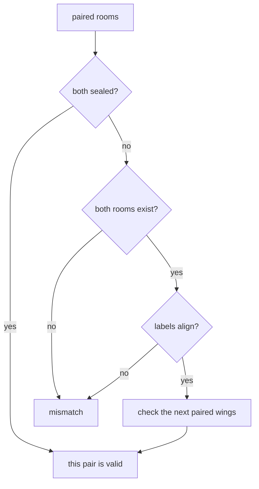
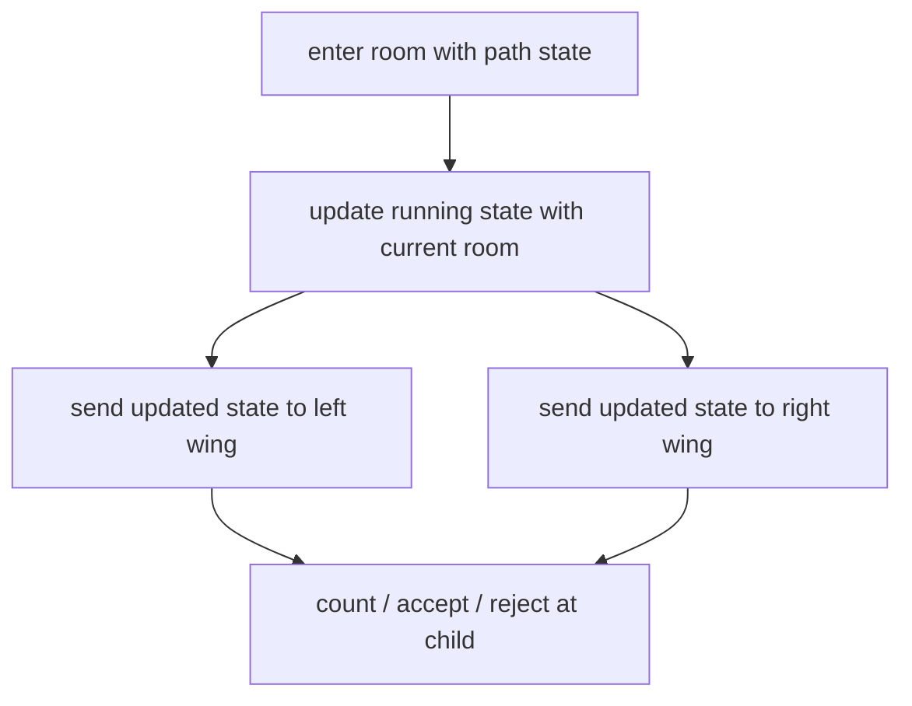
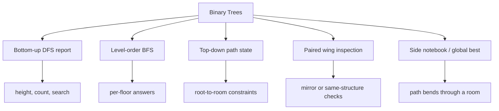
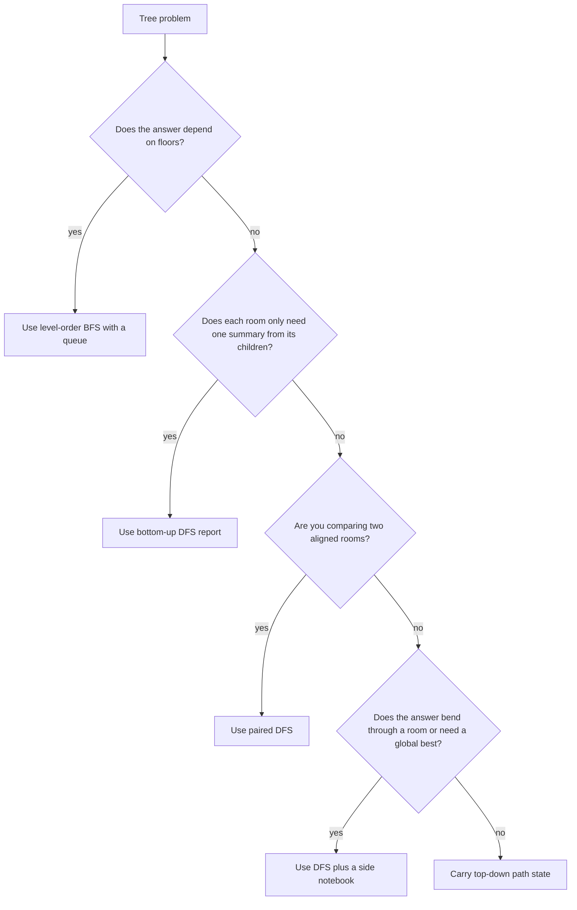

## Overview

Binary trees are the first place where a branching structure changes how you think. An array lets you scan linearly, but a tree makes you decide whether the answer is about one branch, one floor, or a path that bends through the middle. That choice is what separates clean tree solutions from "visit everything and hope."

You already know from recursion that a smaller subproblem can hand a result back to you, and from stacks and queues that visit order changes what you can see. Binary trees combine those habits into one structure. This guide builds that in three stages: **Return One Scout Report**, **Sweep One Floor at a Time**, and **Keep a Side Notebook**.

## Core Concept & Mental Model

### The Archive Building

Picture an old archive building where every room can open into at most two smaller wings, one on the left and one on the right. A curator stands in a room, asks scouts to inspect any smaller wings, and then decides what that room can report upward. Some questions are about how deep the archive goes. Some are about what you can see floor by floor. Some are about the best hallway route that passes through a room before continuing elsewhere.

- archive room -> tree node
- left wing / right wing -> left and right child
- sealed doorway -> `null` child
- scout report -> recursive return value from a subtree
- cart line -> queue used for level-order sweeps
- side notebook -> extra answer tracked outside the recursive return

The building stays efficient because each room only asks the questions its parent actually needs. No scout revisits a finished wing, so every room is processed a constant number of times.

### Understanding the Analogy

#### The Setup

The curator starts at the entrance room. From there, each room can send a scout left, send a scout right, or place the next set of rooms into a cart line for a floor sweep. A sealed doorway means that wing does not exist. The curator never needs to invent information. Every answer is built from what smaller wings already discovered.

#### The Scout Report

Many tree questions are really asking, "If I trust each smaller wing to tell me one useful fact, what can I compute at this room?" A scout might return the deepest floor below, the number of terminal rooms, or whether a target record exists anywhere in that wing. The important part is that the report is small and local. The parent room does not need the entire history of the walk, only the one summary that lets it keep going.

If you ask for too much, the report becomes messy and hard to combine. If you ask for too little, the parent room has to re-explore finished wings. Clean binary-tree solutions depend on choosing the exact report that lets each room do its own job once.

#### The Floor Sweep

Some questions are not about one room talking to its parent. They are about what all rooms on the same floor reveal together. A scout report cannot preserve that left-to-right floor grouping, because recursion naturally dives down one wing before the other. For those questions the curator loads one floor of rooms into a cart line, processes them together, then loads the next floor.

That single change, room reports versus floor sweeps, is why DFS and BFS feel so different on trees. One is about "what can this room learn from its children?" The other is about "what can I observe when I keep every room at the same distance together?"

#### Why These Approaches

Brute force on a tree often means re-asking solved questions. You measure a left wing, then later walk it again to compare depths, then later walk it a third time to collect the deepest floor. The archive structure lets you do better because every room is already the natural meeting point for its two smaller wings. If the answer is local to a room, ask for reports and combine them there. If the answer is local to a floor, use the cart line and process each floor exactly once. If the answer bends through a room but the parent only needs one smaller fact, keep that full answer in a side notebook instead of polluting the return report.

#### How I Think Through This

Before I touch code, I ask one question: **what is the smallest useful fact each room needs to hand upward so the archive never gets walked twice?**

**When one room only needs one summary from each wing:** I use a scout report. Height, leaf count, or "did we find it?" all fit this shape because the parent room can combine small answers from left and right and move on.

**When the question is about all rooms on the same floor:** I stop thinking recursively and switch to a cart line. The answer depends on distance from the entrance, not on what one parent can learn from one child.

**When the real answer is bigger than the report the parent needs:** I keep a side notebook. Each room still returns the one report its parent depends on, but while the room has both wing reports in hand it updates the notebook with a larger candidate answer.

The building blocks below work through those three situations where the same archive behaves differently.

**Scenario 1 — One summary per wing:** This archive asks for its height, so each room only needs the deepest floor reported by its smaller wings.

:::trace-tree
[
  {
    "nodes": [
      {"index": 0, "value": "A", "tone": "focus", "badge": "entrance"},
      {"index": 1, "value": "B", "tone": "default"},
      {"index": 2, "value": "C", "tone": "default"},
      {"index": 3, "value": "D", "tone": "muted"},
      {"index": 4, "value": "E", "tone": "muted"},
      {"index": 5, "value": "F", "tone": "default"}
    ],
    "facts": [
      {"name": "question", "value": "archive height", "tone": "blue"}
    ],
    "action": "visit",
    "label": "Room A waits for one scout report from each wing: how many floors remain below B and below C."
  },
  {
    "nodes": [
      {"index": 0, "value": "A", "tone": "focus", "badge": "combine"},
      {"index": 1, "value": "B", "tone": "done", "badge": "2"},
      {"index": 2, "value": "C", "tone": "done", "badge": "2"},
      {"index": 3, "value": "D", "tone": "muted"},
      {"index": 4, "value": "E", "tone": "muted"},
      {"index": 5, "value": "F", "tone": "muted"}
    ],
    "facts": [
      {"name": "left report", "value": 2, "tone": "green"},
      {"name": "right report", "value": 2, "tone": "green"}
    ],
    "action": "combine",
    "label": "With both scout reports in hand, room A returns max(2, 2) + 1 = 3 floors."
  },
  {
    "nodes": [
      {"index": 0, "value": "A", "tone": "answer", "badge": "3"},
      {"index": 1, "value": "B", "tone": "done"},
      {"index": 2, "value": "C", "tone": "done"},
      {"index": 3, "value": "D", "tone": "muted"},
      {"index": 4, "value": "E", "tone": "muted"},
      {"index": 5, "value": "F", "tone": "muted"}
    ],
    "action": "done",
    "label": "The whole archive height is now known without rewalking any wing."
  }
]
:::

**Scenario 2 — One floor at a time:** This archive wants the last room visible on each floor, so the curator processes rooms by distance from the entrance instead of diving down one wing.

:::trace-tree
[
  {
    "nodes": [
      {"index": 0, "value": "A", "tone": "frontier", "badge": "q"},
      {"index": 1, "value": "B", "tone": "default"},
      {"index": 2, "value": "C", "tone": "default"},
      {"index": 3, "value": "D", "tone": "muted"},
      {"index": 4, "value": "E", "tone": "muted"},
      {"index": 5, "value": "F", "tone": "muted"},
      {"index": 6, "value": "G", "tone": "muted"}
    ],
    "facts": [
      {"name": "cart line", "value": "[A]", "tone": "orange"},
      {"name": "visible rooms", "value": "[]", "tone": "blue"}
    ],
    "action": "queue",
    "label": "Start with only the entrance room in the cart line. One whole floor will be processed before the next floor is loaded."
  },
  {
    "nodes": [
      {"index": 0, "value": "A", "tone": "done"},
      {"index": 1, "value": "B", "tone": "frontier", "badge": "q"},
      {"index": 2, "value": "C", "tone": "frontier", "badge": "last"},
      {"index": 3, "value": "D", "tone": "muted"},
      {"index": 4, "value": "E", "tone": "muted"},
      {"index": 5, "value": "F", "tone": "muted"},
      {"index": 6, "value": "G", "tone": "muted"}
    ],
    "facts": [
      {"name": "cart line", "value": "[B, C]", "tone": "orange"},
      {"name": "visible rooms", "value": "[A]", "tone": "green"}
    ],
    "action": "queue",
    "label": "After finishing floor 0, the next cart line holds B and C. The last room processed on that floor is what stays visible."
  },
  {
    "nodes": [
      {"index": 0, "value": "A", "tone": "done"},
      {"index": 1, "value": "B", "tone": "done"},
      {"index": 2, "value": "C", "tone": "done"},
      {"index": 3, "value": "D", "tone": "default"},
      {"index": 4, "value": "E", "tone": "default"},
      {"index": 5, "value": "F", "tone": "default"},
      {"index": 6, "value": "G", "tone": "answer", "badge": "visible"}
    ],
    "facts": [
      {"name": "visible rooms", "value": "[A, C, G]", "tone": "green"}
    ],
    "action": "done",
    "label": "Processing one floor at a time reveals the rightmost room on every floor: A, then C, then G."
  }
]
:::

**Scenario 3 — The answer is bigger than the report:** This archive wants the longest hallway route, so each room returns a one-sided height report while also updating a notebook with any route that bends through that room.

:::trace-tree
[
  {
    "nodes": [
      {"index": 0, "value": "A", "tone": "focus", "badge": "check"},
      {"index": 1, "value": "B", "tone": "default"},
      {"index": 2, "value": "C", "tone": "default"},
      {"index": 3, "value": "D", "tone": "muted"},
      {"index": 4, "value": "E", "tone": "muted"},
      {"index": 5, "value": "F", "tone": "muted"}
    ],
    "facts": [
      {"name": "notebook best", "value": 0, "tone": "orange"}
    ],
    "action": "visit",
    "label": "Room A asks for the deepest hallway down its left and right wings. The parent still only needs one side, but the notebook can record both."
  },
  {
    "nodes": [
      {"index": 0, "value": "A", "tone": "focus", "badge": "update"},
      {"index": 1, "value": "B", "tone": "done", "badge": "2"},
      {"index": 2, "value": "C", "tone": "done", "badge": "1"},
      {"index": 3, "value": "D", "tone": "muted"},
      {"index": 4, "value": "E", "tone": "muted"},
      {"index": 5, "value": "F", "tone": "muted"}
    ],
    "facts": [
      {"name": "left depth", "value": 2, "tone": "green"},
      {"name": "right depth", "value": 1, "tone": "green"},
      {"name": "notebook best", "value": 3, "tone": "purple"}
    ],
    "action": "combine",
    "label": "At room A the hallway can bend from the deepest left route into the deepest right route, so the notebook records 2 + 1 = 3 edges."
  },
  {
    "nodes": [
      {"index": 0, "value": "A", "tone": "answer", "badge": "3"},
      {"index": 1, "value": "B", "tone": "done"},
      {"index": 2, "value": "C", "tone": "done"},
      {"index": 3, "value": "D", "tone": "muted"},
      {"index": 4, "value": "E", "tone": "muted"},
      {"index": 5, "value": "F", "tone": "muted"}
    ],
    "facts": [
      {"name": "report upward", "value": 3, "tone": "blue"},
      {"name": "notebook best", "value": 3, "tone": "green"}
    ],
    "action": "done",
    "label": "The room returns one downward height to its parent, but the notebook keeps the full best hallway for the whole archive."
  }
]
:::

---

## Building Blocks: Progressive Learning

### Level 1: Return One Scout Report

A small archive with rooms `[A, B, C, D]` might ask, "How many floors deep is this wing?" The brute-force instinct is to measure one side, then restart and measure the other, or to keep a full path history for every room. That works, but it is wasteful. For a large archive, rewalking every wing turns a clean structural question into repeated bookkeeping.

The exploitable property is that every room is already the natural meeting point for its two smaller wings. If each smaller wing can hand back one scout report, the current room can finish its own work immediately. For depth, the report is "how many floors are below me." For leaf count, it is "how many terminal rooms are below me." For search, it is "did my wing ever find the target record?" The key is that the report stays small.

Mechanically, the scout walks until it reaches a sealed doorway, which returns the neutral answer for the question. Then each real room waits for its left report and right report, combines them with the current room, and returns exactly one new report upward. The root room's report becomes the answer for the whole archive.

Use archive `A(B(D, E), C(., F))` and ask for its height.

:::trace-tree
[
  {
    "nodes": [
      {"index": 0, "value": "A", "tone": "focus", "badge": "wait"},
      {"index": 1, "value": "B", "tone": "default"},
      {"index": 2, "value": "C", "tone": "default"},
      {"index": 3, "value": "D", "tone": "muted"},
      {"index": 4, "value": "E", "tone": "muted"},
      {"index": 6, "value": "F", "tone": "muted"}
    ],
    "facts": [
      {"name": "question", "value": "height", "tone": "blue"}
    ],
    "action": "visit",
    "label": "Room A cannot answer yet. It waits for one scout report from B and one from C."
  },
  {
    "nodes": [
      {"index": 0, "value": "A", "tone": "default"},
      {"index": 1, "value": "B", "tone": "done", "badge": "2"},
      {"index": 2, "value": "C", "tone": "done", "badge": "2"},
      {"index": 3, "value": "D", "tone": "muted"},
      {"index": 4, "value": "E", "tone": "muted"},
      {"index": 6, "value": "F", "tone": "muted"}
    ],
    "facts": [
      {"name": "B report", "value": 2, "tone": "green"},
      {"name": "C report", "value": 2, "tone": "green"}
    ],
    "action": "combine",
    "label": "The smaller wings report their deepest floors back to the entrance room."
  },
  {
    "nodes": [
      {"index": 0, "value": "A", "tone": "answer", "badge": "3"},
      {"index": 1, "value": "B", "tone": "done"},
      {"index": 2, "value": "C", "tone": "done"},
      {"index": 3, "value": "D", "tone": "muted"},
      {"index": 4, "value": "E", "tone": "muted"},
      {"index": 6, "value": "F", "tone": "muted"}
    ],
    "action": "done",
    "label": "Room A returns max(2, 2) + 1, so the archive height is 3."
  }
]
:::

#### **Exercise 1**

The curators only care how many floors the archive descends, not which path produced that depth. Your scout report should be "deepest floor below this room," and each room turns two child reports into `1 + max(left, right)`.

:::stackblitz{file="step1-exercise1-problem.ts" step=1 total=3 solution="step1-exercise1-solution.ts"}

#### **Exercise 2**

This removes the "how deep" question and asks which rooms are true dead ends. A sealed doorway still returns zero, but now a room with no smaller wings contributes one terminal room, while any other room adds together the counts reported by both wings.

:::stackblitz{file="step1-exercise2-problem.ts" step=1 total=3 solution="step1-exercise2-solution.ts"}

#### **Exercise 3**

This shifts the goal from counting to searching. The scout report becomes a yes-or-no answer, and each room checks its own label before asking whether either smaller wing already found the target record.

:::stackblitz{file="step1-exercise3-problem.ts" step=1 total=3 solution="step1-exercise3-solution.ts"}

> **Mental anchor**: A room should only return one small fact upward, exactly the fact its parent needs next.

**→ Bridge to Level 2**: A scout report is perfect when one room can solve the question from its children. It breaks down when the question is about all rooms at the same distance from the entrance, because recursion forgets floor boundaries the moment it dives down a wing.

### Level 2: Sweep One Floor at a Time

Now imagine the question changes shape: "What does each floor of the archive look like?" A recursive scout can still visit every room, but it will naturally finish one whole wing before returning to the sibling wing. That destroys the floor grouping you need. On a wide archive, trying to reconstruct floors afterward means storing extra depth bookkeeping for every visit.

The exploitable property here is distance from the entrance. Every room on the same floor should be processed together before any room on the next floor matters. A cart line does that naturally. Load the entrance room, pop exactly the current cart length, record what those rooms reveal, and while doing so load their children for the next sweep.

Mechanically, the queue snapshot is the whole trick. At the start of a floor, record `queue.length`. Process exactly that many rooms, pushing their children as you go. When that batch ends, one floor is complete and any floor-level answer can be recorded cleanly before the next batch starts.

Use archive `A(B(D, E), C(F, G))` and record the last room seen on each floor.

:::trace-tree
[
  {
    "nodes": [
      {"index": 0, "value": "A", "tone": "frontier", "badge": "q"},
      {"index": 1, "value": "B", "tone": "default"},
      {"index": 2, "value": "C", "tone": "default"},
      {"index": 3, "value": "D", "tone": "muted"},
      {"index": 4, "value": "E", "tone": "muted"},
      {"index": 5, "value": "F", "tone": "muted"},
      {"index": 6, "value": "G", "tone": "muted"}
    ],
    "facts": [
      {"name": "floor size", "value": 1, "tone": "blue"},
      {"name": "cart line", "value": "[A]", "tone": "orange"}
    ],
    "action": "queue",
    "label": "Start floor 0 with one room in the cart line."
  },
  {
    "nodes": [
      {"index": 0, "value": "A", "tone": "done"},
      {"index": 1, "value": "B", "tone": "frontier", "badge": "q"},
      {"index": 2, "value": "C", "tone": "frontier", "badge": "last"},
      {"index": 3, "value": "D", "tone": "muted"},
      {"index": 4, "value": "E", "tone": "muted"},
      {"index": 5, "value": "F", "tone": "muted"},
      {"index": 6, "value": "G", "tone": "muted"}
    ],
    "facts": [
      {"name": "floor answer", "value": "A", "tone": "green"},
      {"name": "next cart line", "value": "[B, C]", "tone": "orange"}
    ],
    "action": "queue",
    "label": "After processing exactly one room, floor 0 is complete. B and C are loaded for the next floor."
  },
  {
    "nodes": [
      {"index": 0, "value": "A", "tone": "done"},
      {"index": 1, "value": "B", "tone": "done"},
      {"index": 2, "value": "C", "tone": "done"},
      {"index": 3, "value": "D", "tone": "frontier", "badge": "q"},
      {"index": 4, "value": "E", "tone": "frontier", "badge": "q"},
      {"index": 5, "value": "F", "tone": "frontier", "badge": "q"},
      {"index": 6, "value": "G", "tone": "frontier", "badge": "last"}
    ],
    "facts": [
      {"name": "answers so far", "value": "[A, C]", "tone": "green"},
      {"name": "next cart line", "value": "[D, E, F, G]", "tone": "orange"}
    ],
    "action": "queue",
    "label": "Floor 1 finishes with room C as the last visible room, and the deepest floor is now queued."
  },
  {
    "nodes": [
      {"index": 0, "value": "A", "tone": "done"},
      {"index": 1, "value": "B", "tone": "done"},
      {"index": 2, "value": "C", "tone": "done"},
      {"index": 3, "value": "D", "tone": "done"},
      {"index": 4, "value": "E", "tone": "done"},
      {"index": 5, "value": "F", "tone": "done"},
      {"index": 6, "value": "G", "tone": "answer", "badge": "visible"}
    ],
    "facts": [
      {"name": "visible rooms", "value": "[A, C, G]", "tone": "green"}
    ],
    "action": "done",
    "label": "One floor at a time gives the final right-side view: A, then C, then G."
  }
]
:::

> [!TIP]
> At the start of each floor, snapshot the cart-line length. If you let the loop run until the queue is empty, you blur multiple floors together.

#### **Exercise 1**

This is the direct floor-sweep template. The cart line should return one array per floor, so you snapshot the current floor size, pop exactly that many rooms, and collect their labels before moving deeper.

:::stackblitz{file="step2-exercise1-problem.ts" step=2 total=3 solution="step2-exercise1-solution.ts"}

#### **Exercise 2**

This removes the need to store every room on a floor and asks only for the last room seen from that floor. The loop structure stays the same, but you only keep the label from the final room processed in each batch.

:::stackblitz{file="step2-exercise2-problem.ts" step=2 total=3 solution="step2-exercise2-solution.ts"}

#### **Exercise 3**

This shifts the floor sweep into an aggregate question. You still process one floor at a time, but instead of recording labels you maintain the running sum for the current floor and keep only the deepest floor's total once the queue finishes.

:::stackblitz{file="step2-exercise3-problem.ts" step=2 total=3 solution="step2-exercise3-solution.ts"}

> **Mental anchor**: Queue length is the floor boundary. Freeze it, finish that floor, then move on.

**→ Bridge to Level 3**: Floor sweeps show what rooms share the same depth, but they do not solve answers that bend through a room and combine both wings at once. For that, each room needs a small return report plus a separate place to record the bigger answer it sees locally.

### Level 3: Keep a Side Notebook

Now the archive asks a harder question: "What is the longest hallway route anywhere in the building?" If a room only returns one scout report to its parent, that report can describe the best single route continuing upward, but it cannot fully describe a path that comes up from the left wing and leaves through the right wing. Trying to return the entire best path upward breaks the parent logic, because the parent still only needs one continuing route.

The exploitable property is that each room is the only place where its left and right wing reports meet at the same time. That makes the room the perfect place to update a side notebook with a larger candidate answer, while still returning only the narrower one-sided report the parent depends on. This is why diameter, best path sum, and zigzag-style questions often keep a global best outside the recursive return.

Mechanically, the order is consistent. First ask both wings for the report they owe this room. Then compute the local candidate that uses both reports together and write it into the notebook if it is better. Finally, return the one-sided report the parent needs next. The notebook keeps the richer answer, while the recursion stays simple.

Use archive `A(B(D, E), C(., F))` and track the longest hallway in edges.

:::trace-tree
[
  {
    "nodes": [
      {"index": 0, "value": "A", "tone": "focus", "badge": "check"},
      {"index": 1, "value": "B", "tone": "default"},
      {"index": 2, "value": "C", "tone": "default"},
      {"index": 3, "value": "D", "tone": "muted"},
      {"index": 4, "value": "E", "tone": "muted"},
      {"index": 6, "value": "F", "tone": "muted"}
    ],
    "facts": [
      {"name": "notebook best", "value": 0, "tone": "orange"}
    ],
    "action": "visit",
    "label": "Room A collects one-sided depth reports from B and C. The notebook is still holding the best hallway seen so far."
  },
  {
    "nodes": [
      {"index": 0, "value": "A", "tone": "focus", "badge": "update"},
      {"index": 1, "value": "B", "tone": "done", "badge": "2"},
      {"index": 2, "value": "C", "tone": "done", "badge": "2"},
      {"index": 3, "value": "D", "tone": "muted"},
      {"index": 4, "value": "E", "tone": "muted"},
      {"index": 6, "value": "F", "tone": "muted"}
    ],
    "facts": [
      {"name": "left depth", "value": 2, "tone": "green"},
      {"name": "right depth", "value": 2, "tone": "green"},
      {"name": "through A", "value": 4, "tone": "purple"}
    ],
    "action": "combine",
    "label": "Because room A sees both reports at once, it can record a hallway that comes up from one wing and exits through the other."
  },
  {
    "nodes": [
      {"index": 0, "value": "A", "tone": "answer", "badge": "4"},
      {"index": 1, "value": "B", "tone": "done"},
      {"index": 2, "value": "C", "tone": "done"},
      {"index": 3, "value": "D", "tone": "muted"},
      {"index": 4, "value": "E", "tone": "muted"},
      {"index": 6, "value": "F", "tone": "muted"}
    ],
    "facts": [
      {"name": "returned upward", "value": 3, "tone": "blue"},
      {"name": "notebook best", "value": 4, "tone": "green"}
    ],
    "action": "done",
    "label": "The notebook stores the full hallway length 4, while the room returns only one continuing depth report upward."
  }
]
:::

#### **Exercise 1**

This is the cleanest notebook pattern. Each room returns the longest downward hallway starting there, but while both wing reports are visible you update the notebook with the best room-to-room hallway that bends through the current room.

:::stackblitz{file="step3-exercise1-problem.ts" step=3 total=3 solution="step3-exercise1-solution.ts"}

#### **Exercise 2**

This changes the hallway length into a weighted route. The room still returns one downward route to its parent, but the notebook now tracks the best left-plus-room-plus-right sum, and negative wings must be clipped away instead of dragging the route down.

:::stackblitz{file="step3-exercise2-problem.ts" step=3 total=3 solution="step3-exercise2-solution.ts"}

#### **Exercise 3**

This extends the notebook pattern by returning two reports instead of one: the best alternating route if the next move turns left, and the best alternating route if the next move turns right. The notebook records the longest alternating hallway seen anywhere in the archive.

:::stackblitz{file="step3-exercise3-problem.ts" step=3 total=3 solution="step3-exercise3-solution.ts"}

> **Mental anchor**: Return the narrow report the parent needs, but write the bigger local answer into the notebook before you leave the room.

## Key Patterns

### Pattern: Paired Wing Inspection

**When to use**: the problem compares two structures instead of summarizing one. Keywords include "same tree," "mirror," "symmetric," "subtree shape," and "both sides must match."

**How to think about it**: one scout is no longer enough, because correctness depends on how two rooms line up against each other. The right mental model is to send paired inspectors into corresponding positions and ask one yes-or-no question at every stop: are these two rooms both absent, both present with matching labels, and do their next paired wings still line up? For symmetry, the pairing crosses inward, left wing against right wing. For same-tree checks, it stays parallel. The power comes from failing fast the moment one paired comparison breaks.

**Complexity**: Time `O(n)`, Space `O(h)` with recursion, because every room is checked at most once and the call stack only stores the current paired descent.

### Pattern: Top-Down Path State

**When to use**: the answer depends on what has happened from the entrance down to the current room. Keywords include "good nodes," "current maximum on path," "target path sum," and "ancestor constraint."

**How to think about it**: bottom-up scout reports are great when children tell the parent what happened below. Top-down state flips the direction. The curator carries a running fact while descending, such as the largest label seen so far or the remaining budget to hit a target sum. Every child receives an updated copy of that path state. This works because the needed fact belongs to the route from root to current room, not to the subtree alone.

**Complexity**: Time `O(n)`, Space `O(h)`, because the running state moves along each root-to-room route once and no room is revisited.

---

## Decision Framework

**Concept Map**

**Complexity Table**

| Technique | Time | Space | Best for |
| --- | --- | --- | --- |
| Bottom-up DFS report | `O(n)` | `O(h)` | Height, counts, subtree summaries |
| Level-order BFS | `O(n)` | `O(w)` | Per-floor values, right-side view, deepest level |
| Paired DFS | `O(n)` | `O(h)` | Symmetry, same-tree, subtree comparison |
| Top-down DFS state | `O(n)` | `O(h)` | Path constraints from root to current room |
| DFS + side notebook | `O(n)` | `O(h)` | Diameter, max path sum, zigzag global best |

**Decision Tree**

**Recognition Signals**

| Problem signal | Reach for |
| --- | --- |
| "maximum depth", "leaf count", "does it exist" | Bottom-up DFS report |
| "each level", "right side view", "deepest level" | Level-order BFS |
| "same tree", "mirror", "symmetric" | Paired DFS |
| "good nodes", "path sum from root", "ancestor rule" | Top-down path state |
| "diameter", "best path anywhere", "global longest" | DFS plus side notebook |

**When NOT to use**

Do not force a floor sweep when the answer is purely local to each room, because queue bookkeeping adds noise without new information. Do not force a bottom-up scout report when the question is about aligned pairs or root-to-room history, because the needed context is in the comparison or the path state, not in a single child summary. And do not stuff a whole global answer into the recursive return when the parent only needs one narrow report, because that is how tree code becomes brittle and confusing.

## Common Gotchas & Edge Cases

**Gotcha 1: Mixing edge count and node count**

Diameter and depth problems often look almost identical, so it is easy to count rooms in one place and hallways in another. The symptom is an answer that is off by exactly one on every non-empty archive.

Why it is tempting: many tree traces naturally talk about rooms, while the prompt may measure the hallways between them.

Fix: decide the unit before writing code. If the answer is in edges, a sealed doorway should usually contribute `0` or `-1` depending on the formula, and the combine step should be checked against a tiny three-room archive by hand.

**Gotcha 2: Forgetting the floor boundary in BFS**

If you keep popping until the queue is empty, you silently merge multiple floors together. The symptom is that "level order" outputs flatten into one long list or the right-side view records the last room in the whole archive instead of the last room on each floor.

Why it is tempting: the queue already knows future rooms, so it feels natural to keep draining it.

Fix: snapshot `queue.length` at the start of each floor and run the inner loop exactly that many times before recording the floor answer.

**Gotcha 3: Returning the notebook answer instead of the parent answer**

In diameter and max-path problems, the room often sees a two-sided candidate locally. If that full two-sided value gets returned upward, the parent combines impossible routes and the answer inflates without crashing.

Why it is tempting: the local two-sided candidate looks like the most interesting number in the room.

Fix: separate the two roles. Update the notebook with the rich local candidate, then return only the one-sided report the parent can legally extend.

**Gotcha 4: Treating `null` like a real room**

Tree bugs often start at the sealed doorway. Using the wrong neutral value makes every real room combine bad data. The symptom is weird answers on empty archives, single-room archives, or lopsided wings.

Why it is tempting: every problem has a different neutral value, so copying one base case into another problem feels almost right.

Fix: define what a sealed doorway should mean for this exact question before writing recursion. For search it is `false`, for counts it is `0`, and for max-path-style returns it may need clipping logic.

**Edge cases to always check**

- Empty archive: the function should return the neutral answer immediately.
- Single room: height, leaf count, and path-style problems should be checked by hand.
- Completely lopsided archive: verifies recursion depth assumptions and off-by-one counting.
- Perfectly balanced archive: verifies the combine step when both wings are equally strong.
- Negative room values for path-sum questions: confirms you clip or keep values correctly.

**Debugging tips**

- Print `(room.value, leftReport, rightReport, returnedReport)` during DFS to see whether each room is returning the correct small fact upward.
- For notebook problems, print both the returned report and the notebook value after each room so you can catch accidental mixing of the two.
- For BFS, print the queue contents at the start of each floor. If a floor starts with nodes from two different depths, the boundary logic is wrong.
- For paired DFS, print both room labels together before recursing so mismatched alignment is obvious.
