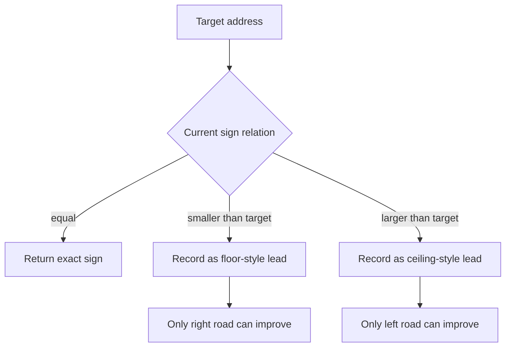
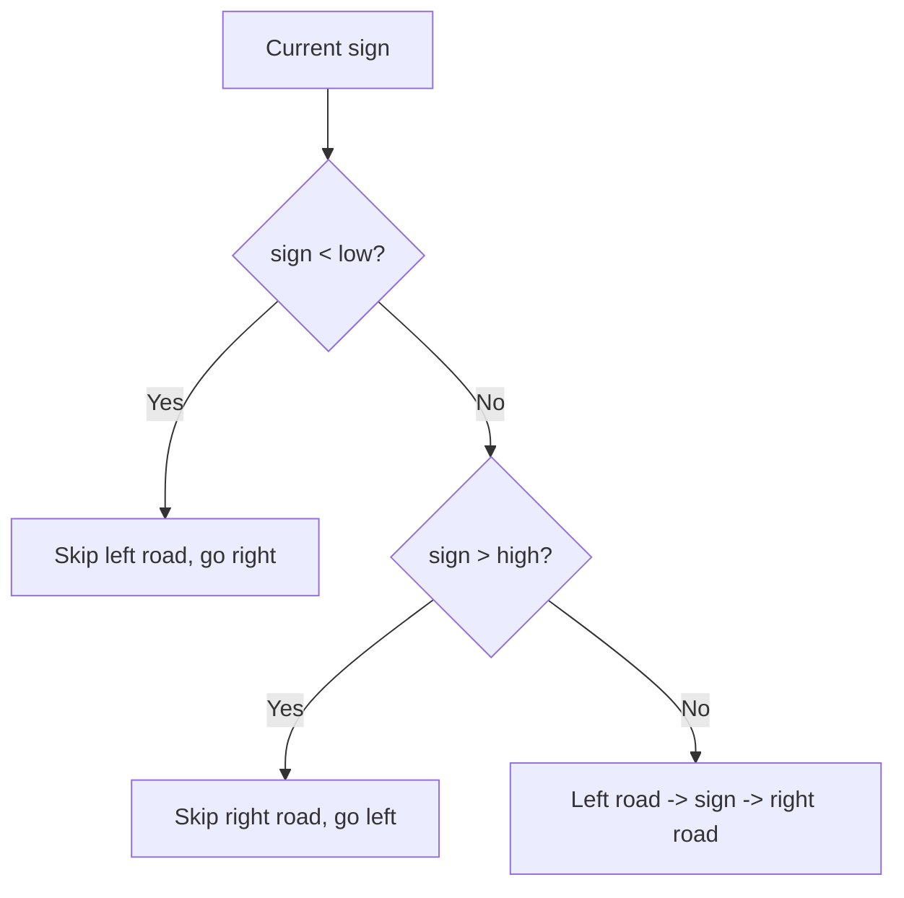
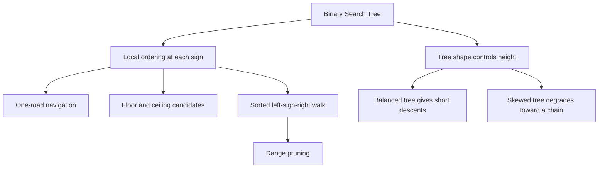
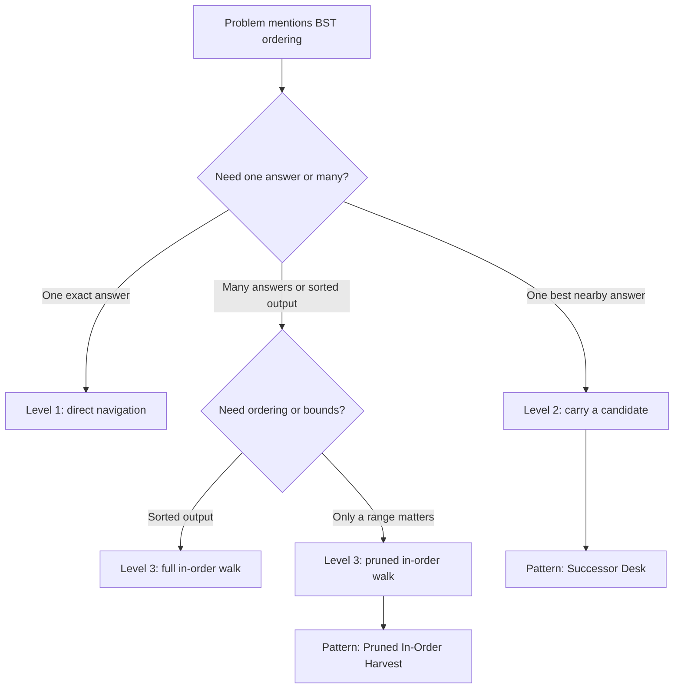

## Overview

Binary Search Trees are what you get when tree structure and ordered search finally snap together. A plain binary tree forces you to explore both wings when you do not know where the answer lives. A BST adds one ordering rule, smaller values live on the left road and larger values live on the right road, so each comparison tells you exactly which direction is still alive.

From [Binary Trees](/dsa/fundamentals/binary-trees) you already know how to trust a smaller subtree, and from [Binary Search](/dsa/fundamentals/binary-search) you already know how ordering lets you discard impossible space. This guide combines those habits into three levels: reading one sign and choosing one road, carrying the best candidate while you descend, and walking the streets in sorted order while pruning whole neighborhoods.

## Core Concept & Mental Model

### The Hillside Street Map

Picture a hillside town built around signposted intersections. Each intersection shows one house number. Every house number on the left road is smaller than that sign, and every house number on the right road is larger. If you are looking for an address, you do not wander both roads. You read the sign, compare once, and take the only road that can still contain the address.

- intersection sign -> current node value
- left road -> left subtree of smaller values
- right road -> right subtree of larger values
- empty lot -> `null` child where the road ends
- town clerk carrying the current best lead -> candidate node while descending
- left street, current sign, right street walk -> in-order traversal

Each sign rules out one entire side of town. Since you never revisit neighborhoods the sign already disproved, search, insert, and candidate-finding all take time proportional to the height of the tree rather than the total number of intersections.

### Understanding the Analogy

#### The Setup

You enter the town at its highest intersection. At every stop you can read one sign and see at most two outgoing roads. The promise of the town map is strict: every address on the left road is smaller, every address on the right road is larger. That promise is what turns a tree into a navigation structure instead of just a branching maze.

An empty lot is not a special failure. It is the town's way of saying the address is not in that direction, or that this is where a new address would be built. That makes BST descent mechanical: compare once, choose one road, stop when you hit the matching sign or an empty lot.

#### The Direction Rule

The direction rule is the heart of the structure. If the target address is smaller than the current sign, the entire right road is impossible and you turn left. If the target is larger, the entire left road is impossible and you turn right. If the sign matches, the search is over because the town has already navigated you to the only valid spot.

What would go wrong if you ignored that rule and explored both roads anyway? You would throw away the one structural advantage BSTs give you. The moment you recurse both directions by habit, you are back to plain binary-tree work and you lose the whole point of the ordering property.

#### The Clerk's Best Lead

Some BST questions do not ask for an exact sign. They ask for the closest smaller address, the first address not below a target, or all addresses inside a range. In those problems the town clerk carries the current best lead while walking. A sign can be good enough to record even if it is not the final answer. Then the next comparison decides whether to keep searching for a tighter lead on one side.

This is the BST version of boundary search. A sign does not just tell you where to go next. It can also certify that one candidate is valid while you continue descending toward a better one.

#### Why These Approaches

Brute-force tree search asks both roads at every intersection, which can touch every node in the town. BST navigation asks a stronger question: which road is still logically alive after this comparison? That cuts the work from "walk the whole town" to "follow one descending route" for search-like problems, and it lets in-order and range queries prune entire neighborhoods instead of inspecting every sign.

#### How I Think Through This

Before I touch code, I ask one question: **what does this sign let me rule out immediately?** If the sign rules out a whole road, I should not touch that road at all. If the sign is a valid lead but maybe not the best one, I record it and keep walking in the only direction that could improve it. If I need sorted output, I walk left street, current sign, right street because that is the only route that visits the town from smallest address to largest.

**When the target matches this sign:** stop immediately. The current intersection already proves the answer.

**When the target belongs strictly on one side:** take that one road and abandon the other side completely.

**When the current sign is a valid lead but not guaranteed final:** record it as the clerk's best lead, then descend toward the side that might tighten it.

The building blocks below work through those three situations, then turn them into ordered walks and range pruning.

**Scenario 1 — Exact match at the sign:** The target `11` is found as soon as the clerk lands on a sign that matches, so no extra neighborhood needs inspection.

:::trace-tree
[
  {
    "nodes": [
      {"index": 0, "value": 8, "tone": "focus", "badge": "start"},
      {"index": 1, "value": 3, "tone": "default"},
      {"index": 2, "value": 11, "tone": "default"},
      {"index": 3, "value": 1, "tone": "muted"},
      {"index": 4, "value": 6, "tone": "muted"},
      {"index": 5, "value": 9, "tone": "muted"},
      {"index": 6, "value": 14, "tone": "muted"}
    ],
    "facts": [
      {"name": "target", "value": 11, "tone": "blue"},
      {"name": "rule", "value": "larger -> right road", "tone": "orange"}
    ],
    "action": "visit",
    "label": "Read sign 8. Since 11 is larger, the whole left road is dead and the clerk turns right."
  },
  {
    "nodes": [
      {"index": 0, "value": 8, "tone": "done"},
      {"index": 1, "value": 3, "tone": "muted"},
      {"index": 2, "value": 11, "tone": "focus", "badge": "match"},
      {"index": 3, "value": 1, "tone": "muted"},
      {"index": 4, "value": 6, "tone": "muted"},
      {"index": 5, "value": 9, "tone": "muted"},
      {"index": 6, "value": 14, "tone": "muted"}
    ],
    "facts": [
      {"name": "status", "value": "exact sign found", "tone": "green"}
    ],
    "action": "done",
    "label": "The sign matches 11 exactly, so navigation stops. No other road can contain a second valid answer."
  }
]
:::

**Scenario 2 — Smaller target means go left:** The target `4` keeps forcing smaller choices, so each comparison cuts away one right-hand neighborhood.

:::trace-tree
[
  {
    "nodes": [
      {"index": 0, "value": 8, "tone": "focus", "badge": "start"},
      {"index": 1, "value": 3, "tone": "default"},
      {"index": 2, "value": 11, "tone": "muted"},
      {"index": 3, "value": 1, "tone": "muted"},
      {"index": 4, "value": 6, "tone": "default"},
      {"index": 5, "value": 9, "tone": "muted"},
      {"index": 6, "value": 14, "tone": "muted"}
    ],
    "facts": [
      {"name": "target", "value": 4, "tone": "blue"},
      {"name": "rule", "value": "smaller -> left road", "tone": "orange"}
    ],
    "action": "branch",
    "label": "At sign 8, target 4 is smaller, so the whole right road is impossible and the clerk turns left."
  },
  {
    "nodes": [
      {"index": 0, "value": 8, "tone": "done"},
      {"index": 1, "value": 3, "tone": "focus", "badge": "compare"},
      {"index": 2, "value": 11, "tone": "muted"},
      {"index": 3, "value": 1, "tone": "muted"},
      {"index": 4, "value": 6, "tone": "default"},
      {"index": 5, "value": 9, "tone": "muted"},
      {"index": 6, "value": 14, "tone": "muted"}
    ],
    "facts": [
      {"name": "decision", "value": "4 > 3, so turn right", "tone": "purple"}
    ],
    "action": "visit",
    "label": "At sign 3 the target flips direction. The clerk now knows the left road is too small and moves right toward 6."
  },
  {
    "nodes": [
      {"index": 0, "value": 8, "tone": "done"},
      {"index": 1, "value": 3, "tone": "done"},
      {"index": 2, "value": 11, "tone": "muted"},
      {"index": 3, "value": 1, "tone": "muted"},
      {"index": 4, "value": 6, "tone": "focus", "badge": "too large"},
      {"index": 5, "value": 9, "tone": "muted"},
      {"index": 6, "value": 14, "tone": "muted"}
    ],
    "facts": [
      {"name": "next stop", "value": "empty left lot", "tone": "green"}
    ],
    "action": "branch",
    "label": "Sign 6 is larger than 4, so the clerk turns left and reaches an empty lot. That proves 4 is not in the town."
  }
]
:::

**Scenario 3 — Record a valid lead while descending:** The target `10` is not present, but signs `8` and then `11` tell the clerk how to tighten the best ceiling candidate.

:::trace-tree
[
  {
    "nodes": [
      {"index": 0, "value": 8, "tone": "focus", "badge": "start"},
      {"index": 1, "value": 3, "tone": "muted"},
      {"index": 2, "value": 11, "tone": "default"},
      {"index": 3, "value": 1, "tone": "muted"},
      {"index": 4, "value": 6, "tone": "muted"},
      {"index": 5, "value": 9, "tone": "default"},
      {"index": 6, "value": 14, "tone": "muted"}
    ],
    "facts": [
      {"name": "target", "value": 10, "tone": "blue"},
      {"name": "ceiling lead", "value": "none yet", "tone": "orange"}
    ],
    "action": "visit",
    "label": "Sign 8 is too small to be the ceiling, so the clerk turns right without recording it."
  },
  {
    "nodes": [
      {"index": 0, "value": 8, "tone": "done"},
      {"index": 1, "value": 3, "tone": "muted"},
      {"index": 2, "value": 11, "tone": "focus", "badge": "lead"},
      {"index": 3, "value": 1, "tone": "muted"},
      {"index": 4, "value": 6, "tone": "muted"},
      {"index": 5, "value": 9, "tone": "default"},
      {"index": 6, "value": 14, "tone": "muted"}
    ],
    "facts": [
      {"name": "ceiling lead", "value": 11, "tone": "green"},
      {"name": "improvement", "value": "try left road", "tone": "purple"}
    ],
    "action": "branch",
    "label": "Sign 11 is the first address not below 10, so it becomes a valid lead. The clerk turns left to see if an even tighter lead exists."
  },
  {
    "nodes": [
      {"index": 0, "value": 8, "tone": "done"},
      {"index": 1, "value": 3, "tone": "muted"},
      {"index": 2, "value": 11, "tone": "answer", "badge": "final lead"},
      {"index": 3, "value": 1, "tone": "muted"},
      {"index": 4, "value": 6, "tone": "muted"},
      {"index": 5, "value": 9, "tone": "focus", "badge": "too small"},
      {"index": 6, "value": 14, "tone": "muted"}
    ],
    "facts": [
      {"name": "ceiling lead", "value": 11, "tone": "green"}
    ],
    "action": "done",
    "label": "Sign 9 is still below 10, and the next right lot is empty. The recorded lead 11 survives as the tightest ceiling."
  }
]
:::

---

## Building Blocks: Progressive Learning

### Level 1: Read the Sign and Choose the Road

A plain binary-tree search would have to ask both children whether they contain the target. In a BST that is wasted work. Take the town `[8, 3, 11, 1, 6, 9, 14]` and ask whether address `9` exists. Brute force could visit every sign. The BST rule means you compare at `8`, discard the whole left road, compare at `11`, discard the whole right road, and land on `9`. For a tall tree that difference is the gap between following one downhill route and wandering the whole town.

The exploitable property is local order. Every sign partitions the town into smaller-on-the-left and larger-on-the-right neighborhoods. That lets one comparison remove an entire road from consideration. Mechanically the loop is simple: stand on the current sign, compare the target, stop on equality, otherwise replace `current` with exactly one child. The walk ends when `current` becomes an empty lot, which proves the address is absent.

Take the town `[8, 3, 11, 1, 6, 9, 14]` and look for `9`.

:::trace-tree
[
  {
    "nodes": [
      {"index": 0, "value": 8, "tone": "focus", "badge": "start"},
      {"index": 1, "value": 3, "tone": "default"},
      {"index": 2, "value": 11, "tone": "default"},
      {"index": 3, "value": 1, "tone": "muted"},
      {"index": 4, "value": 6, "tone": "muted"},
      {"index": 5, "value": 9, "tone": "default"},
      {"index": 6, "value": 14, "tone": "muted"}
    ],
    "facts": [
      {"name": "target", "value": 9, "tone": "blue"}
    ],
    "action": "visit",
    "label": "Read sign 8. Since 9 is larger, the clerk immediately abandons the left road and turns right."
  },
  {
    "nodes": [
      {"index": 0, "value": 8, "tone": "done"},
      {"index": 1, "value": 3, "tone": "muted"},
      {"index": 2, "value": 11, "tone": "focus", "badge": "compare"},
      {"index": 3, "value": 1, "tone": "muted"},
      {"index": 4, "value": 6, "tone": "muted"},
      {"index": 5, "value": 9, "tone": "default"},
      {"index": 6, "value": 14, "tone": "muted"}
    ],
    "facts": [
      {"name": "decision", "value": "9 < 11, turn left", "tone": "orange"}
    ],
    "action": "branch",
    "label": "Now sign 11 rules out its whole right road. Only the left child can still contain 9."
  },
  {
    "nodes": [
      {"index": 0, "value": 8, "tone": "done"},
      {"index": 1, "value": 3, "tone": "muted"},
      {"index": 2, "value": 11, "tone": "done"},
      {"index": 3, "value": 1, "tone": "muted"},
      {"index": 4, "value": 6, "tone": "muted"},
      {"index": 5, "value": 9, "tone": "answer", "badge": "found"},
      {"index": 6, "value": 14, "tone": "muted"}
    ],
    "facts": [
      {"name": "work done", "value": "three signs", "tone": "green"}
    ],
    "action": "done",
    "label": "The clerk lands on sign 9 and stops. Only one descending route was needed."
  }
]
:::

#### **Exercise 1**

The first exercise is the direct form of this level: given a BST and a target address, return whether the town contains that address. The loop is exactly the compare-and-choose-road pattern from the trace above.

:::stackblitz{step=1 total=3 exercises="step1-exercise1-problem.ts" solutions="step1-exercise1-solution.ts"}

#### **Exercise 2**

This removes the "found or not" finish line and instead asks how many signs the clerk had to inspect before proving the answer. The comparison logic stays the same, but now you must count each visited intersection until you either match the target or fall into an empty lot.

:::stackblitz{step=1 total=3 exercises="step1-exercise2-problem.ts" solutions="step1-exercise2-solution.ts"}

#### **Exercise 3**

This shifts the goal from matching a target to following the always-left road until no smaller address exists. It is still a one-road problem, but the signal is structural rather than value-based: the smallest address is at the leftmost surviving sign.

:::stackblitz{step=1 total=3 exercises="step1-exercise3-problem.ts" solutions="step1-exercise3-solution.ts"}

> **Mental anchor**: One sign, one comparison, one surviving road.

**→ Bridge to Level 2**: Level 1 works when the answer is exactly where you stop. It breaks when the best answer might be nearby but not present, because an empty lot does not tell you which earlier sign was the tightest valid lead. Level 2 fixes that by carrying the clerk's best lead during the descent.

### Level 2: Carry the Best Lead While Descending

Level 1 gave you exact navigation, but problems like floor, ceiling, and closest value change the shape of the question. Take the same town and ask for the smallest address that is at least `10`. Brute force would inspect every sign and compare all valid answers. A BST can do better because each sign tells you both whether it is a valid lead and which road could still improve it. You do not just walk, you walk while preserving the best certificate seen so far.

The exploitable property is still BST order, but now it combines with a candidate invariant. If the current sign is below the target, it cannot be a ceiling, so only the right road matters. If it is at least the target, it becomes a valid ceiling candidate, and only the left road could possibly tighten it. The same symmetric logic gives you floor. Closest value adds one more check, update the best lead when the current sign is numerically nearer, then break ties by keeping the smaller address so the behavior stays deterministic.

Take the town `[8, 3, 11, 1, 6, 9, 14]` and look for the ceiling of `10`.

:::trace-tree
[
  {
    "nodes": [
      {"index": 0, "value": 8, "tone": "focus", "badge": "start"},
      {"index": 1, "value": 3, "tone": "muted"},
      {"index": 2, "value": 11, "tone": "default"},
      {"index": 3, "value": 1, "tone": "muted"},
      {"index": 4, "value": 6, "tone": "muted"},
      {"index": 5, "value": 9, "tone": "default"},
      {"index": 6, "value": 14, "tone": "muted"}
    ],
    "facts": [
      {"name": "target", "value": 10, "tone": "blue"},
      {"name": "ceiling", "value": "none", "tone": "orange"}
    ],
    "action": "visit",
    "label": "Sign 8 is below the target, so it cannot serve as the ceiling. The clerk turns right."
  },
  {
    "nodes": [
      {"index": 0, "value": 8, "tone": "done"},
      {"index": 1, "value": 3, "tone": "muted"},
      {"index": 2, "value": 11, "tone": "focus", "badge": "lead"},
      {"index": 3, "value": 1, "tone": "muted"},
      {"index": 4, "value": 6, "tone": "muted"},
      {"index": 5, "value": 9, "tone": "default"},
      {"index": 6, "value": 14, "tone": "muted"}
    ],
    "facts": [
      {"name": "ceiling", "value": 11, "tone": "green"}
    ],
    "action": "branch",
    "label": "Sign 11 is the first valid lead, so the clerk records it and turns left looking for a tighter one."
  },
  {
    "nodes": [
      {"index": 0, "value": 8, "tone": "done"},
      {"index": 1, "value": 3, "tone": "muted"},
      {"index": 2, "value": 11, "tone": "answer", "badge": "best lead"},
      {"index": 3, "value": 1, "tone": "muted"},
      {"index": 4, "value": 6, "tone": "muted"},
      {"index": 5, "value": 9, "tone": "focus", "badge": "too small"},
      {"index": 6, "value": 14, "tone": "muted"}
    ],
    "facts": [
      {"name": "next", "value": "empty right lot", "tone": "purple"}
    ],
    "action": "done",
    "label": "Sign 9 is still too small, so the clerk moves right into an empty lot. The recorded lead 11 survives as the ceiling."
  }
]
:::

> [!TIP]
> Decide the tie rule for "closest" before you code. These exercises keep the smaller address when two signs are equally far from the target.

#### **Exercise 1**

This is the cleanest candidate problem: return the ceiling, the smallest address not below the target, or `null` when none exists. Each time you see a valid sign you record it, then try left for a tighter answer.

:::stackblitz{step=2 total=3 exercises="step2-exercise1-problem.ts" solutions="step2-exercise1-solution.ts"}

#### **Exercise 2**

This removes the ceiling guarantee and flips the logic symmetrically: now you want the floor, the largest address not above the target. Valid leads come from the other side, so each recorded candidate sends you right instead of left.

:::stackblitz{step=2 total=3 exercises="step2-exercise2-problem.ts" solutions="step2-exercise2-solution.ts"}

#### **Exercise 3**

This extends the candidate idea by keeping whichever sign is numerically closest to the target while you descend. The loop still follows one road, but now every visited sign has to compete with the current best lead before you move on.

:::stackblitz{step=2 total=3 exercises="step2-exercise3-problem.ts" solutions="step2-exercise3-solution.ts"}

> **Mental anchor**: Record a valid sign, then walk only where a tighter sign could still exist.

**→ Bridge to Level 3**: Candidate tracking still follows one descending road. It does not yet teach you how BST order turns the whole town into a sorted walk, or how range bounds let you skip entire neighborhoods during traversal. Level 3 adds that ordered street walk and the pruning logic that comes with it.

### Level 3: Walk the Streets in Sorted Order

Level 2 still thinks like a navigator chasing one answer. Level 3 changes the task to ordered output and range work. Suppose you need every address from `5` through `12`, or you need the whole town in ascending order. A brute-force tree traversal can collect everything and sort later, or it can visit every sign even when a whole road is out of range. A BST does not need either waste. Its left road is already smaller, its right road is already larger, and those facts let you both emit values in order and prune roads that cannot contribute.

The exploitable property is the left-street, current-sign, right-street walk. Visit the left road first and every emitted value is smaller than the current sign. Visit the current sign next and the order stays sorted. Visit the right road last and every emitted value stays larger. Range queries add pruning on top: if the current sign is below `low`, the whole left road is too small and can be skipped; if the current sign is above `high`, the whole right road is too large and can be skipped.

Take the town `[8, 3, 11, 1, 6, 9, 14]` and collect addresses in the inclusive range `[5, 12]`.

:::trace-tree
[
  {
    "nodes": [
      {"index": 0, "value": 8, "tone": "focus", "badge": "in range"},
      {"index": 1, "value": 3, "tone": "default"},
      {"index": 2, "value": 11, "tone": "default"},
      {"index": 3, "value": 1, "tone": "muted"},
      {"index": 4, "value": 6, "tone": "default"},
      {"index": 5, "value": 9, "tone": "default"},
      {"index": 6, "value": 14, "tone": "default"}
    ],
    "facts": [
      {"name": "range", "value": "[5, 12]", "tone": "blue"}
    ],
    "action": "visit",
    "label": "Sign 8 is inside the range, so both roads might matter. The walker first checks the left street for smaller in-range addresses."
  },
  {
    "nodes": [
      {"index": 0, "value": 8, "tone": "active"},
      {"index": 1, "value": 3, "tone": "focus", "badge": "too small"},
      {"index": 2, "value": 11, "tone": "default"},
      {"index": 3, "value": 1, "tone": "muted"},
      {"index": 4, "value": 6, "tone": "default"},
      {"index": 5, "value": 9, "tone": "default"},
      {"index": 6, "value": 14, "tone": "default"}
    ],
    "facts": [
      {"name": "prune", "value": "skip left road of 3", "tone": "orange"}
    ],
    "action": "branch",
    "label": "Sign 3 is below the range. That makes its entire left road too small, so the walker skips straight to its right child."
  },
  {
    "nodes": [
      {"index": 0, "value": 8, "tone": "active"},
      {"index": 1, "value": 3, "tone": "done"},
      {"index": 2, "value": 11, "tone": "focus", "badge": "emit later"},
      {"index": 3, "value": 1, "tone": "muted"},
      {"index": 4, "value": 6, "tone": "answer", "badge": "emit"},
      {"index": 5, "value": 9, "tone": "default"},
      {"index": 6, "value": 14, "tone": "default"}
    ],
    "facts": [
      {"name": "output", "value": "[6, 8, ...]", "tone": "green"}
    ],
    "action": "combine",
    "label": "The in-order walk emits 6 first, then 8, because every left-street address is smaller than the current sign."
  },
  {
    "nodes": [
      {"index": 0, "value": 8, "tone": "done"},
      {"index": 1, "value": 3, "tone": "done"},
      {"index": 2, "value": 11, "tone": "answer", "badge": "emit"},
      {"index": 3, "value": 1, "tone": "muted"},
      {"index": 4, "value": 6, "tone": "done"},
      {"index": 5, "value": 9, "tone": "done"},
      {"index": 6, "value": 14, "tone": "focus", "badge": "too large"}
    ],
    "facts": [
      {"name": "output", "value": "[6, 8, 9, 11]", "tone": "green"}
    ],
    "action": "done",
    "label": "Sign 14 is above the range, so its whole right road is skipped. The final ordered collection is [6, 8, 9, 11]."
  }
]
:::

#### **Exercise 1**

The direct application is to return every address in sorted order. The key move is the full in-order walk: left street first, then the current sign, then the right street.

:::stackblitz{step=3 total=3 exercises="step3-exercise1-problem.ts" solutions="step3-exercise1-solution.ts"}

#### **Exercise 2**

This removes the "return everything" guarantee and asks for only the addresses inside a range. The walk is still in-order, but now you use BST bounds to skip roads that are already too small or too large.

:::stackblitz{step=3 total=3 exercises="step3-exercise2-problem.ts" solutions="step3-exercise2-solution.ts"}

#### **Exercise 3**

This shifts from collecting addresses to accumulating one total over the same pruned walk. The new constraint is that you must add only in-range signs, while still skipping whole neighborhoods that cannot possibly contribute.

:::stackblitz{step=3 total=3 exercises="step3-exercise3-problem.ts" solutions="step3-exercise3-solution.ts"}

> **Mental anchor**: Left street, current sign, right street gives sorted output. Bounds let you skip whole neighborhoods.

## Key Patterns

### Pattern: Successor Desk

**When to use**: problems ask for floor, ceiling, predecessor, successor, closest value, or "the next larger / next smaller sign" without requiring a full traversal. Recognition signals include "nearest", "just above", "just below", and "best valid candidate while descending".

**How to think about it**: the walk is still one descending road, but the clerk keeps a desk ledger of the best valid sign so far. Signs smaller than the target cannot be ceilings, signs larger than the target cannot be floors, and exact matches end the search immediately. The candidate is not the destination. It is a certificate you carry while you continue toward the only side that could tighten it.

**Complexity**: Time `O(h)`, Space `O(1)` iteratively or `O(h)` recursively, because you follow one root-to-leaf road while updating one stored lead.

### Pattern: Pruned In-Order Harvest

**When to use**: problems ask for sorted output, values within `[low, high]`, range sums, merging BST order into another sorted process, or "visit only what can matter". Recognition signals include "sorted traversal", "between low and high", "report all values in order", and "skip subtrees outside bounds".

**How to think about it**: start with in-order traversal because that is the BST's sorted street walk. Then add pruning before recursing. If the current sign is already below the window, the entire left street is too small. If it is already above the window, the entire right street is too large. This keeps the sorted order while shrinking the explored part of the town.

**Complexity**: Time `O(k + h)` for many practical range queries, where `k` is the number of reported signs and `h` is tree height, because pruning avoids visiting neighborhoods outside the requested window.

---

## Decision Framework

**Concept Map**

**Complexity table**

| Operation | Balanced BST | Worst case skewed BST | Why |
| --- | --- | --- | --- |
| Exact search | `O(log n)` | `O(n)` | One comparison per level |
| Floor / ceiling / closest | `O(log n)` | `O(n)` | One descending route plus candidate updates |
| Insert position search | `O(log n)` | `O(n)` | Same directional descent as search |
| In-order traversal | `O(n)` | `O(n)` | Every node emitted once |
| Range collect / range sum | `O(k + log n)` often | `O(n)` worst case | Pruning skips whole roads when bounds exclude them |
| Extra space for iterative navigation | `O(1)` | `O(1)` | Only current pointer and maybe one candidate |
| Extra space for recursive traversal | `O(log n)` | `O(n)` | Call stack depth equals tree height |

**Decision tree**

**Recognition signals table**

| Problem signal | Technique |
| --- | --- |
| "search this BST", "does target exist", "follow left or right" | Level 1 direct navigation |
| "smallest value", "leftmost node", "follow one structural road" | Level 1 one-road descent |
| "ceiling", "floor", "closest", "next larger / next smaller" | Level 2 candidate descent |
| "return sorted values from BST" | Level 3 full in-order traversal |
| "all values between low and high", "sum values in range" | Level 3 pruned in-order traversal |
| "keep best lead while descending" | Pattern: Successor Desk |
| "skip whole subtrees outside bounds" | Pattern: Pruned In-Order Harvest |

**When NOT to use**

Use plain binary-tree reasoning when the node values do not satisfy a global ordering promise. Use heaps when you need fast access to only the smallest or largest value and do not care about full search paths or in-order output. Use a balanced map or sorted array with binary search when the data is static and you do not actually need tree-shaped updates or subtree-local recursion.

## Common Gotchas & Edge Cases

**Gotcha 1: Recurse or loop into both roads out of habit**

The symptom is correct answers paired with tree-shaped time complexity that quietly degrades to a full traversal. This usually shows up on simple search or candidate problems where the code still explores both children "just to be safe."

Why it is tempting: binary-tree practice teaches you to ask both subtrees, and that reflex is hard to break.

Fix: on navigation problems, compare first and move into exactly one child. If your exact-search code ever branches into both roads after a comparison, it has stopped using the BST property.

**Gotcha 2: Forget to stop on equality before choosing a road**

The symptom is missing exact matches and falling into an empty lot even though the target is present. This happens when `<=` or `>=` sends equal values down one side instead of treating equality as a terminal case.

Why it is tempting: it feels neat to fold equality into one branch and keep the loop uniform.

Fix: handle `target === current.value` first. Only after ruling out equality should you choose left or right.

**Gotcha 3: Update the candidate in the wrong direction**

The symptom is returning a valid but non-tight floor or ceiling, such as returning `14` as the ceiling of `10` even though `11` exists. The code still runs and often passes a few tests, which makes the bug subtle.

Why it is tempting: once a sign is valid, it feels safe to keep it forever without proving whether a tighter lead might exist.

Fix: when the sign is a valid ceiling, record it and move left. When it is a valid floor, record it and move right. The candidate update and the next direction are a matched pair.

**Gotcha 4: Break sorted order by visiting the sign too early**

The symptom is an output list that contains the right values in the wrong order, such as preorder masquerading as in-order. Range-collection bugs often look like this.

Why it is tempting: "visit current node, then recurse" is a common recursive template in other tree problems.

Fix: for sorted BST output, always walk left street first, then emit the current sign, then walk the right street. If bounds exclude one side, skip only that side, not the in-order discipline itself.

**Gotcha 5: Prune after recursing instead of before**

The symptom is a correct range query that still touches almost every node. Large trees feel slow even though the answers are right.

Why it is tempting: it is simpler to recurse both ways and decide later whether to keep the current value.

Fix: check the bounds before recursing. If `value < low`, skip the left road entirely. If `value > high`, skip the right road entirely.

**Edge cases to always check**

- Empty town: search returns `false`, candidate queries return `null`, collection returns `[]`, range sum returns `0`.
- Single sign: exact match, no match, and range containing or excluding that one value.
- Target smaller than every sign: floor should be `null`, ceiling should be the smallest sign.
- Target larger than every sign: ceiling should be `null`, floor should be the largest sign.
- Exact tie for closest value: confirm the chosen rule, these exercises keep the smaller address.
- Range endpoints equal to existing signs: inclusive range logic should keep both endpoints.

**Debugging tips**

- Print `(current.value, target)` at each step of a navigation loop and verify only one child is chosen.
- For candidate problems, print `(current.value, candidate)` after every update and make sure the candidate gets tighter, never looser.
- For in-order work, print the output list after every append. If it ever decreases, the visitation order is wrong.
- For range pruning, print when a subtree is skipped because `value < low` or `value > high`. If you never skip, you are not using the BST property.
