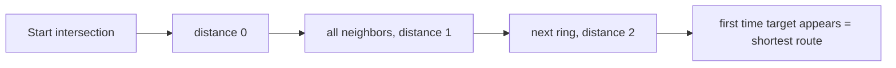
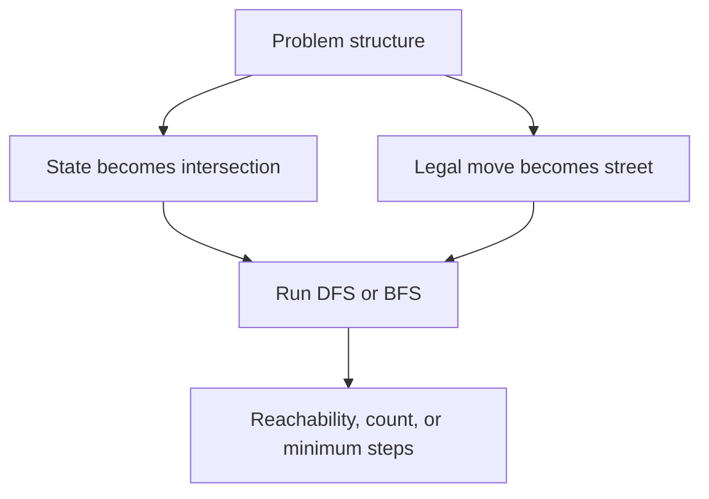
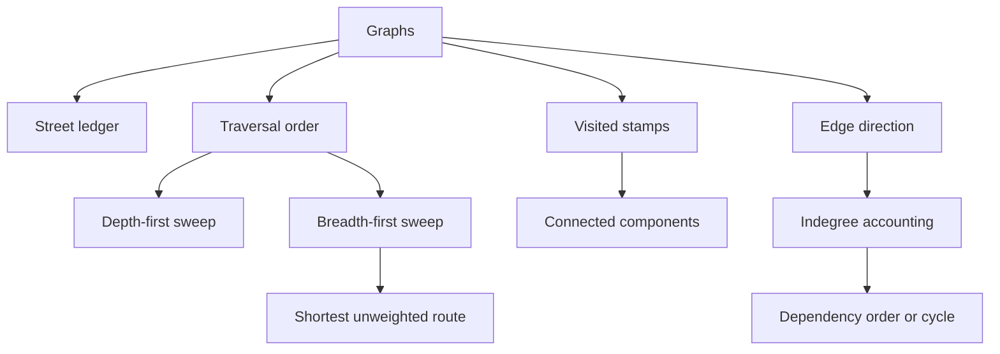
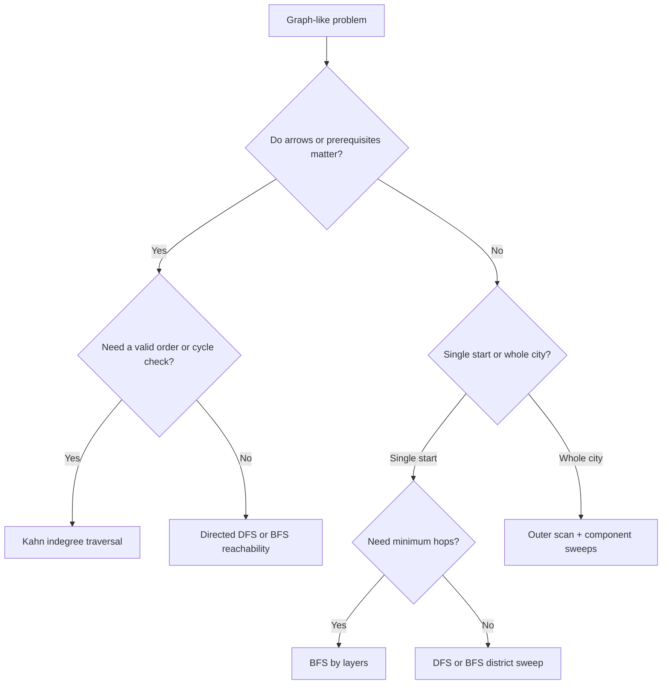

## Overview

Graphs are what arrays and trees turn into once the structure stops being a single line or a single rooted hierarchy. The brute-force trap is easy to fall into: from every intersection, try every road again and again, and the city explodes into repeated work. Graph thinking fixes that by turning the map into a ledger of neighbors plus a rule for when a street has already been accounted for.

You already know how arrays give you indexed storage, how hash maps remember what you have seen, and how stacks and queues change visit order. Graphs fuse those ideas into one system. This guide builds that in three stages: **Draw the Street Ledger**, **Sweep Every District**, and **Respect One-Way Streets**.

## Core Concept & Mental Model

### The City Map

Picture a city transit board pinned to a wall. Each **intersection** is a place you can stand. Each **street** connects one intersection to another. Some streets work both ways. Some are one-way arrows. Your job is never to wander randomly. Your job is to read the map, decide what counts as "already covered," and move through the city without walking the same district from scratch.

- intersection -> graph node
- street -> graph edge
- street ledger -> adjacency list
- stamped intersection -> visited marker
- district sweep -> one traversal through a connected component
- dispatch line -> queue or stack controlling visit order
- one-way arrow -> directed edge

The map stays efficient because once an intersection is stamped, every street decision that depends on it is settled. No district has to be rediscovered from zero.

### Understanding the Analogy

#### The Setup

The transit board does not hand you a neat route. It hands you local choices. At one intersection you only know which streets leave that point. To move intelligently, you keep a street ledger listing each intersection's neighbors and a stamp sheet showing which intersections have already been covered. The rule is simple: a stamped intersection does not need a fresh expedition.

#### Following Streets

When the question is about one reachable district, the main job is disciplined expansion. Start at one known intersection, stamp it the moment you commit to exploring it, then use the dispatch line to keep pulling the next intersection whose outgoing streets still matter. Every unstamped neighbor gets added exactly once. That single rule is what prevents loops from turning into infinite wandering.

#### Sweeping Every District

Sometimes the city is not one connected place. There may be several separate districts with no street between them. In that case, one clean sweep from a starting intersection can only tell you about that one district. The outer job changes: you scan the entire map for an unstamped intersection, launch one new district sweep there, finish that whole district, then continue scanning. The city count grows by whole districts, not by individual streets.

#### Why These Approaches

Brute force treats every intersection as if it were brand new every time you arrive there. On a dense map that means revisiting the same district through many different streets and paying the same exploration cost repeatedly. The graph structure gives you a stronger guarantee: once an intersection has been stamped, every path that reaches it in the future is redundant for reachability questions. That is why one stamp per intersection is enough for traversal, and why one outer scan plus district sweeps is enough for disconnected maps. For one-way streets, direction adds another guarantee: an intersection with no unfinished incoming streets is safe to dispatch now because nothing upstream still depends on it.

#### How I Think Through This

Before I touch code, I ask one question: **am I exploring one district, sweeping the whole city, or respecting one-way arrows that create dependencies?**

**When the question starts from one known intersection:** I think in terms of a single district sweep. The hard part is not movement, it is discipline. I stamp an intersection before I let any street bring me back to it, and I keep pulling work from the dispatch line until that district is exhausted.

**When the map may be disconnected:** I stop expecting one sweep to answer the whole question. The real move is an outer scan over every intersection. Each unstamped starting point means I have discovered a brand-new district, so I launch one full sweep there and count or measure that district once.

**When the streets are one-way and order matters:** I stop asking only "what can I reach?" and start asking "what is allowed to happen next?" The safest places to dispatch are the intersections with no unfinished incoming arrows. If I process all such places and some intersections still remain, the city contains a loop of mutual dependency.

The building blocks below work through those three situations where the same city map demands different control rules.

**Scenario 1 — One district from one starting point:** Starting from intersection A, a single sweep stamps everything reachable in that district and ignores already stamped streets.

:::trace-graph
[
  {
    "nodes": [
      {"id": "A", "label": "A", "x": 18, "y": 48, "tone": "current", "badge": "start"},
      {"id": "B", "label": "B", "x": 40, "y": 24, "tone": "frontier"},
      {"id": "C", "label": "C", "x": 40, "y": 72, "tone": "frontier"},
      {"id": "D", "label": "D", "x": 66, "y": 48, "tone": "default"},
      {"id": "E", "label": "E", "x": 86, "y": 48, "tone": "muted"}
    ],
    "edges": [
      {"from": "A", "to": "B", "tone": "active"},
      {"from": "A", "to": "C", "tone": "active"},
      {"from": "B", "to": "D", "tone": "queued"},
      {"from": "C", "to": "D", "tone": "default"},
      {"from": "D", "to": "E", "tone": "muted"}
    ],
    "facts": [
      {"name": "dispatch line", "value": "[A]", "tone": "orange"},
      {"name": "stamped", "value": "{A}", "tone": "green"}
    ],
    "action": "visit",
    "label": "Start at A. The district sweep stamps A immediately, then lines up B and C as the next streets to expand."
  },
  {
    "nodes": [
      {"id": "A", "label": "A", "x": 18, "y": 48, "tone": "visited"},
      {"id": "B", "label": "B", "x": 40, "y": 24, "tone": "visited"},
      {"id": "C", "label": "C", "x": 40, "y": 72, "tone": "visited"},
      {"id": "D", "label": "D", "x": 66, "y": 48, "tone": "current", "badge": "new"},
      {"id": "E", "label": "E", "x": 86, "y": 48, "tone": "muted"}
    ],
    "edges": [
      {"from": "A", "to": "B", "tone": "traversed"},
      {"from": "A", "to": "C", "tone": "traversed"},
      {"from": "B", "to": "D", "tone": "active"},
      {"from": "C", "to": "D", "tone": "traversed"},
      {"from": "D", "to": "E", "tone": "muted"}
    ],
    "facts": [
      {"name": "dispatch line", "value": "[D]", "tone": "orange"},
      {"name": "stamped", "value": "{A,B,C,D}", "tone": "green"}
    ],
    "action": "mark",
    "label": "D is discovered from B. When C later points at D, that street is redundant because D is already stamped."
  },
  {
    "nodes": [
      {"id": "A", "label": "A", "x": 18, "y": 48, "tone": "done"},
      {"id": "B", "label": "B", "x": 40, "y": 24, "tone": "done"},
      {"id": "C", "label": "C", "x": 40, "y": 72, "tone": "done"},
      {"id": "D", "label": "D", "x": 66, "y": 48, "tone": "done"},
      {"id": "E", "label": "E", "x": 86, "y": 48, "tone": "muted"}
    ],
    "edges": [
      {"from": "A", "to": "B", "tone": "traversed"},
      {"from": "A", "to": "C", "tone": "traversed"},
      {"from": "B", "to": "D", "tone": "traversed"},
      {"from": "C", "to": "D", "tone": "traversed"},
      {"from": "D", "to": "E", "tone": "muted"}
    ],
    "facts": [
      {"name": "covered district", "value": "{A,B,C,D}", "tone": "green"}
    ],
    "action": "done",
    "label": "The sweep ends with one whole district covered. E stays untouched because no street from this district reaches it."
  }
]
:::

**Scenario 2 — The city is disconnected:** One sweep only covers one district, so the outer scan must launch a second sweep from the first unstamped intersection it finds.

:::trace-graph
[
  {
    "nodes": [
      {"id": "A", "label": "A", "x": 20, "y": 38, "tone": "done"},
      {"id": "B", "label": "B", "x": 42, "y": 38, "tone": "done"},
      {"id": "C", "label": "C", "x": 30, "y": 68, "tone": "done"},
      {"id": "D", "label": "D", "x": 70, "y": 38, "tone": "current", "badge": "new"},
      {"id": "E", "label": "E", "x": 86, "y": 62, "tone": "frontier"}
    ],
    "edges": [
      {"from": "A", "to": "B", "tone": "traversed"},
      {"from": "A", "to": "C", "tone": "traversed"},
      {"from": "D", "to": "E", "tone": "active"}
    ],
    "facts": [
      {"name": "districts counted", "value": 2, "tone": "purple"},
      {"name": "outer scan", "value": "first unstamped = D", "tone": "blue"}
    ],
    "action": "queue",
    "label": "After finishing A-B-C, the outer scan keeps moving. D is the first unstamped intersection, so that means a second district."
  },
  {
    "nodes": [
      {"id": "A", "label": "A", "x": 20, "y": 38, "tone": "done"},
      {"id": "B", "label": "B", "x": 42, "y": 38, "tone": "done"},
      {"id": "C", "label": "C", "x": 30, "y": 68, "tone": "done"},
      {"id": "D", "label": "D", "x": 70, "y": 38, "tone": "visited"},
      {"id": "E", "label": "E", "x": 86, "y": 62, "tone": "current", "badge": "sweep"}
    ],
    "edges": [
      {"from": "A", "to": "B", "tone": "traversed"},
      {"from": "A", "to": "C", "tone": "traversed"},
      {"from": "D", "to": "E", "tone": "active"}
    ],
    "facts": [
      {"name": "dispatch line", "value": "[E]", "tone": "orange"},
      {"name": "stamped", "value": "{A,B,C,D,E}", "tone": "green"}
    ],
    "action": "expand",
    "label": "That second sweep covers D and E. The two districts are counted once each, not once per road."
  },
  {
    "nodes": [
      {"id": "A", "label": "A", "x": 20, "y": 38, "tone": "done"},
      {"id": "B", "label": "B", "x": 42, "y": 38, "tone": "done"},
      {"id": "C", "label": "C", "x": 30, "y": 68, "tone": "done"},
      {"id": "D", "label": "D", "x": 70, "y": 38, "tone": "done"},
      {"id": "E", "label": "E", "x": 86, "y": 62, "tone": "done"}
    ],
    "edges": [
      {"from": "A", "to": "B", "tone": "traversed"},
      {"from": "A", "to": "C", "tone": "traversed"},
      {"from": "D", "to": "E", "tone": "traversed"}
    ],
    "facts": [
      {"name": "final districts", "value": 2, "tone": "green"}
    ],
    "action": "done",
    "label": "The whole city is covered after the outer scan plus two district sweeps."
  }
]
:::

**Scenario 3 — One-way streets create dependency order:** When arrows matter, intersections with no unfinished incoming arrows are the only safe next dispatch points.

:::trace-graph
[
  {
    "nodes": [
      {"id": "Prep", "label": "P", "x": 16, "y": 50, "tone": "frontier", "badge": "0 in"},
      {"id": "Cook", "label": "C", "x": 40, "y": 26, "tone": "default", "badge": "1 in"},
      {"id": "Pack", "label": "K", "x": 40, "y": 74, "tone": "default", "badge": "1 in"},
      {"id": "Ship", "label": "S", "x": 72, "y": 50, "tone": "default", "badge": "2 in"}
    ],
    "edges": [
      {"from": "Prep", "to": "Cook", "tone": "queued", "directed": true},
      {"from": "Prep", "to": "Pack", "tone": "queued", "directed": true},
      {"from": "Cook", "to": "Ship", "tone": "default", "directed": true},
      {"from": "Pack", "to": "Ship", "tone": "default", "directed": true}
    ],
    "facts": [
      {"name": "ready now", "value": "[Prep]", "tone": "orange"},
      {"name": "remaining arrows", "value": 4, "tone": "blue"}
    ],
    "action": "queue",
    "label": "Prep has no unfinished incoming arrows, so it is safe to dispatch first."
  },
  {
    "nodes": [
      {"id": "Prep", "label": "P", "x": 16, "y": 50, "tone": "visited"},
      {"id": "Cook", "label": "C", "x": 40, "y": 26, "tone": "frontier", "badge": "0 in"},
      {"id": "Pack", "label": "K", "x": 40, "y": 74, "tone": "frontier", "badge": "0 in"},
      {"id": "Ship", "label": "S", "x": 72, "y": 50, "tone": "default", "badge": "2 in"}
    ],
    "edges": [
      {"from": "Prep", "to": "Cook", "tone": "traversed", "directed": true},
      {"from": "Prep", "to": "Pack", "tone": "traversed", "directed": true},
      {"from": "Cook", "to": "Ship", "tone": "queued", "directed": true},
      {"from": "Pack", "to": "Ship", "tone": "queued", "directed": true}
    ],
    "facts": [
      {"name": "ready now", "value": "[Cook, Pack]", "tone": "orange"},
      {"name": "order so far", "value": "[Prep]", "tone": "green"}
    ],
    "action": "expand",
    "label": "Processing Prep removes its arrows. Cook and Pack now drop to zero incoming arrows and become safe."
  },
  {
    "nodes": [
      {"id": "Prep", "label": "P", "x": 16, "y": 50, "tone": "done"},
      {"id": "Cook", "label": "C", "x": 40, "y": 26, "tone": "done"},
      {"id": "Pack", "label": "K", "x": 40, "y": 74, "tone": "done"},
      {"id": "Ship", "label": "S", "x": 72, "y": 50, "tone": "answer", "badge": "0 in"}
    ],
    "edges": [
      {"from": "Prep", "to": "Cook", "tone": "traversed", "directed": true},
      {"from": "Prep", "to": "Pack", "tone": "traversed", "directed": true},
      {"from": "Cook", "to": "Ship", "tone": "traversed", "directed": true},
      {"from": "Pack", "to": "Ship", "tone": "traversed", "directed": true}
    ],
    "facts": [
      {"name": "valid order", "value": "[Prep, Cook, Pack, Ship]", "tone": "green"}
    ],
    "action": "done",
    "label": "Once Cook and Pack finish, Ship becomes safe. Every intersection is dispatched, so there is no dependency loop."
  }
]
:::

---

## Building Blocks: Progressive Learning

### Level 1: Draw the Street Ledger

Suppose the city says, "Start at intersection 0 and report every place reachable from it." The brute-force instinct is to keep scanning the whole road list every time you stand at a new intersection. On a map with ten thousand roads, that means doing the same lookup work again and again just to rediscover neighboring streets you already saw before.

The exploitable property is that graph movement is local. Once you rewrite the road list into a street ledger, each intersection can answer the only question that matters at that moment: who are my immediate neighbors? Pair that with a stamp sheet, and every neighbor lookup becomes cheap while every repeated arrival becomes harmless because a stamped intersection is skipped immediately.

Mechanically, you first draw the ledger so each intersection points to its outgoing streets. Then you seed the dispatch line with one start intersection, stamp it, and repeatedly pull the next intersection to expand. For each neighbor in its ledger entry, if the neighbor is not stamped yet, you stamp it immediately and add it to the line. The sweep stops when the line empties, and the stamped set is the whole reachable district.

Use intersections `0-1`, `0-2`, `1-3`, `2-3`, `3-4` and start from `0`.

:::trace-graph
[
  {
    "nodes": [
      {"id": "0", "label": "0", "x": 16, "y": 50, "tone": "current", "badge": "start"},
      {"id": "1", "label": "1", "x": 38, "y": 24, "tone": "frontier"},
      {"id": "2", "label": "2", "x": 38, "y": 76, "tone": "frontier"},
      {"id": "3", "label": "3", "x": 64, "y": 50, "tone": "default"},
      {"id": "4", "label": "4", "x": 86, "y": 50, "tone": "default"}
    ],
    "edges": [
      {"from": "0", "to": "1", "tone": "active"},
      {"from": "0", "to": "2", "tone": "active"},
      {"from": "1", "to": "3", "tone": "default"},
      {"from": "2", "to": "3", "tone": "default"},
      {"from": "3", "to": "4", "tone": "default"}
    ],
    "facts": [
      {"name": "street ledger", "value": "0:[1,2]", "tone": "blue"},
      {"name": "dispatch line", "value": "[0]", "tone": "orange"}
    ],
    "action": "visit",
    "label": "The ledger turns road scanning into neighbor lookup. From 0, the next legal expansions are 1 and 2."
  },
  {
    "nodes": [
      {"id": "0", "label": "0", "x": 16, "y": 50, "tone": "visited"},
      {"id": "1", "label": "1", "x": 38, "y": 24, "tone": "visited"},
      {"id": "2", "label": "2", "x": 38, "y": 76, "tone": "visited"},
      {"id": "3", "label": "3", "x": 64, "y": 50, "tone": "current", "badge": "new"},
      {"id": "4", "label": "4", "x": 86, "y": 50, "tone": "default"}
    ],
    "edges": [
      {"from": "0", "to": "1", "tone": "traversed"},
      {"from": "0", "to": "2", "tone": "traversed"},
      {"from": "1", "to": "3", "tone": "active"},
      {"from": "2", "to": "3", "tone": "traversed"},
      {"from": "3", "to": "4", "tone": "queued"}
    ],
    "facts": [
      {"name": "stamped", "value": "{0,1,2,3}", "tone": "green"},
      {"name": "dispatch line", "value": "[3]", "tone": "orange"}
    ],
    "action": "mark",
    "label": "Intersection 3 is stamped the first time it is discovered. The second road into 3 does not create duplicate work."
  },
  {
    "nodes": [
      {"id": "0", "label": "0", "x": 16, "y": 50, "tone": "done"},
      {"id": "1", "label": "1", "x": 38, "y": 24, "tone": "done"},
      {"id": "2", "label": "2", "x": 38, "y": 76, "tone": "done"},
      {"id": "3", "label": "3", "x": 64, "y": 50, "tone": "done"},
      {"id": "4", "label": "4", "x": 86, "y": 50, "tone": "answer", "badge": "last"}
    ],
    "edges": [
      {"from": "0", "to": "1", "tone": "traversed"},
      {"from": "0", "to": "2", "tone": "traversed"},
      {"from": "1", "to": "3", "tone": "traversed"},
      {"from": "2", "to": "3", "tone": "traversed"},
      {"from": "3", "to": "4", "tone": "traversed"}
    ],
    "facts": [
      {"name": "reachable district", "value": "{0,1,2,3,4}", "tone": "green"}
    ],
    "action": "done",
    "label": "When the dispatch line empties, the stamped set is exactly the reachable district from 0."
  }
]
:::

#### **Exercise 1**

Draw the street ledger for an undirected city map. The key move is adding both directions for every two-way road so each intersection can see the neighbors it can actually reach.

:::stackblitz{step=1 total=3 exercises="step1-exercise1-problem.ts" solutions="step1-exercise1-solution.ts"}

#### **Exercise 2**

Now use the ledger to sweep one district from a start intersection. The loop structure is one dispatch line, one stamped set, and one repeated neighbor expansion until the line is empty.

:::stackblitz{step=1 total=3 exercises="step1-exercise2-problem.ts" solutions="step1-exercise2-solution.ts"}

#### **Exercise 3**

Shift the goal from "list everything reachable" to "decide whether one destination is inside this district." The traversal stays the same, but now you can stop as soon as the target intersection is stamped.

:::stackblitz{step=1 total=3 exercises="step1-exercise3-problem.ts" solutions="step1-exercise3-solution.ts"}

> **Mental anchor**: One district sweep needs three things only: a street ledger, a stamp sheet, and a rule that every intersection enters the line once.

**→ Bridge to Level 2**: Level 1 assumes the city is one connected place from the chosen start. The moment the map contains multiple disconnected districts, one perfect sweep is still only one district, so you need an outer scan that knows when to launch a fresh traversal.

### Level 2: Sweep Every District

Level 1 gave you a clean way to cover one reachable district. Now the problem changes shape: the city may contain several disconnected districts, and the question asks about the whole map. A brute-force response is to start a fresh traversal from every intersection. That works, but it repeats the same district many times. On a graph with six districts and thousands of intersections, that repeated restarting is the real waste.

The exploitable property is that one traversal already covers an entire district. Once a district sweep finishes, every stamped intersection inside it is globally settled. That means the only starts that matter are the first unstamped intersections you encounter during an outer scan. Each of those starts is proof that you have discovered a brand-new district.

Mechanically, you keep the exact same inner traversal from Level 1. The only new control flow is an outer loop from `0` through `n - 1`. If the current intersection is already stamped, skip it because its district is done. If it is unstamped, increment the district counter, launch one full sweep from it, and let that traversal stamp the entire component before continuing the scan.

Use districts `0-1-2`, `3-4`, and isolated `5`.

:::trace-graph
[
  {
    "nodes": [
      {"id": "0", "label": "0", "x": 14, "y": 42, "tone": "done"},
      {"id": "1", "label": "1", "x": 30, "y": 26, "tone": "done"},
      {"id": "2", "label": "2", "x": 30, "y": 58, "tone": "done"},
      {"id": "3", "label": "3", "x": 58, "y": 42, "tone": "current", "badge": "new"},
      {"id": "4", "label": "4", "x": 76, "y": 42, "tone": "frontier"},
      {"id": "5", "label": "5", "x": 88, "y": 74, "tone": "default"}
    ],
    "edges": [
      {"from": "0", "to": "1", "tone": "traversed"},
      {"from": "1", "to": "2", "tone": "traversed"},
      {"from": "3", "to": "4", "tone": "active"}
    ],
    "facts": [
      {"name": "districts", "value": 2, "tone": "purple"},
      {"name": "outer scan", "value": "first unstamped = 3", "tone": "blue"}
    ],
    "action": "queue",
    "label": "The outer scan skips 0, 1, and 2 because their district is already finished. Hitting 3 means a second district begins."
  },
  {
    "nodes": [
      {"id": "0", "label": "0", "x": 14, "y": 42, "tone": "done"},
      {"id": "1", "label": "1", "x": 30, "y": 26, "tone": "done"},
      {"id": "2", "label": "2", "x": 30, "y": 58, "tone": "done"},
      {"id": "3", "label": "3", "x": 58, "y": 42, "tone": "done"},
      {"id": "4", "label": "4", "x": 76, "y": 42, "tone": "done"},
      {"id": "5", "label": "5", "x": 88, "y": 74, "tone": "current", "badge": "solo"}
    ],
    "edges": [
      {"from": "0", "to": "1", "tone": "traversed"},
      {"from": "1", "to": "2", "tone": "traversed"},
      {"from": "3", "to": "4", "tone": "traversed"}
    ],
    "facts": [
      {"name": "districts", "value": 3, "tone": "purple"},
      {"name": "outer scan", "value": "first unstamped = 5", "tone": "blue"}
    ],
    "action": "expand",
    "label": "Intersection 5 has no roads, but it is still its own district. One empty sweep counts it exactly once."
  },
  {
    "nodes": [
      {"id": "0", "label": "0", "x": 14, "y": 42, "tone": "done"},
      {"id": "1", "label": "1", "x": 30, "y": 26, "tone": "done"},
      {"id": "2", "label": "2", "x": 30, "y": 58, "tone": "done"},
      {"id": "3", "label": "3", "x": 58, "y": 42, "tone": "done"},
      {"id": "4", "label": "4", "x": 76, "y": 42, "tone": "done"},
      {"id": "5", "label": "5", "x": 88, "y": 74, "tone": "answer", "badge": "3"}
    ],
    "edges": [
      {"from": "0", "to": "1", "tone": "traversed"},
      {"from": "1", "to": "2", "tone": "traversed"},
      {"from": "3", "to": "4", "tone": "traversed"}
    ],
    "facts": [
      {"name": "final districts", "value": 3, "tone": "green"}
    ],
    "action": "done",
    "label": "Outer scan plus district sweeps counts all components, including isolated intersections."
  }
]
:::

> [!TIP]
> In disconnected-graph problems, the inner traversal does not change. Almost every bug comes from the outer scan: either forgetting to skip stamped intersections or forgetting that an isolated node is still a full district.

#### **Exercise 1**

Count how many separate districts exist in a two-way city map. The direct application is the exact outer-scan plus inner-sweep pattern from the level narrative.

:::stackblitz{step=2 total=3 exercises="step2-exercise1-problem.ts" solutions="step2-exercise1-solution.ts"}

#### **Exercise 2**

Remove the simple counting goal and measure the largest district instead. You still launch one sweep per new district, but now each sweep returns a size that the outer scan compares against the current best.

:::stackblitz{step=2 total=3 exercises="step2-exercise2-problem.ts" solutions="step2-exercise2-solution.ts"}

#### **Exercise 3**

Shift from one summary number to a summary per district. Each time the outer scan discovers a new district, run one sweep, record that district's size, and keep going until every intersection belongs to exactly one recorded group.

:::stackblitz{step=2 total=3 exercises="step2-exercise3-problem.ts" solutions="step2-exercise3-solution.ts"}

> **Mental anchor**: A new district is not "an unstamped road," it is "the first unstamped intersection the outer scan finds."

**→ Bridge to Level 3**: Level 2 still treats every road as symmetric. Once streets become one-way, reachability is no longer enough. The map starts encoding prerequisites, and the next question becomes which intersections are safe to dispatch before others.

### Level 3: Respect One-Way Streets

Level 2 let you count districts, but it does not tell you how to schedule work when roads are arrows. Imagine package steps where `Prep -> Cook`, `Prep -> Pack`, and both `Cook -> Ship` and `Pack -> Ship`. A brute-force attempt would repeatedly scan every arrow asking, "is this now allowed?" That works, but it burns time rescanning blocked steps that have not changed yet.

The exploitable property is that an intersection with zero unfinished incoming arrows is safe right now. Nothing upstream can still delay it. Instead of guessing a legal order, you track how many incoming arrows each intersection still has. Every time you dispatch a zero-arrow intersection, you remove its outgoing arrows from the ledger. Some neighbors then drop to zero and become newly safe.

Mechanically, you build a directed street ledger plus an indegree count for every intersection. Seed the dispatch line with all intersections whose indegree is zero. Repeatedly pop one, append it to the answer, and subtract one from each outgoing neighbor's indegree. If a neighbor drops to zero, push it into the line. When the line empties, if you processed all intersections, the order is valid. If some intersections remain unprocessed, those intersections are trapped in a cycle of mutual dependency.

Use arrows `0 -> 1`, `0 -> 2`, `1 -> 3`, `2 -> 3`.

:::trace-graph
[
  {
    "nodes": [
      {"id": "0", "label": "0", "x": 14, "y": 50, "tone": "frontier", "badge": "0 in"},
      {"id": "1", "label": "1", "x": 40, "y": 26, "tone": "default", "badge": "1 in"},
      {"id": "2", "label": "2", "x": 40, "y": 74, "tone": "default", "badge": "1 in"},
      {"id": "3", "label": "3", "x": 74, "y": 50, "tone": "default", "badge": "2 in"}
    ],
    "edges": [
      {"from": "0", "to": "1", "tone": "queued", "directed": true},
      {"from": "0", "to": "2", "tone": "queued", "directed": true},
      {"from": "1", "to": "3", "tone": "default", "directed": true},
      {"from": "2", "to": "3", "tone": "default", "directed": true}
    ],
    "facts": [
      {"name": "dispatch line", "value": "[0]", "tone": "orange"},
      {"name": "order", "value": "[]", "tone": "blue"}
    ],
    "action": "queue",
    "label": "Only 0 has no unfinished incoming arrows, so the order must begin there."
  },
  {
    "nodes": [
      {"id": "0", "label": "0", "x": 14, "y": 50, "tone": "visited"},
      {"id": "1", "label": "1", "x": 40, "y": 26, "tone": "frontier", "badge": "0 in"},
      {"id": "2", "label": "2", "x": 40, "y": 74, "tone": "frontier", "badge": "0 in"},
      {"id": "3", "label": "3", "x": 74, "y": 50, "tone": "default", "badge": "2 in"}
    ],
    "edges": [
      {"from": "0", "to": "1", "tone": "traversed", "directed": true},
      {"from": "0", "to": "2", "tone": "traversed", "directed": true},
      {"from": "1", "to": "3", "tone": "queued", "directed": true},
      {"from": "2", "to": "3", "tone": "queued", "directed": true}
    ],
    "facts": [
      {"name": "dispatch line", "value": "[1,2]", "tone": "orange"},
      {"name": "order", "value": "[0]", "tone": "green"}
    ],
    "action": "expand",
    "label": "Removing 0's outgoing arrows frees both 1 and 2. They can be dispatched in either order."
  },
  {
    "nodes": [
      {"id": "0", "label": "0", "x": 14, "y": 50, "tone": "done"},
      {"id": "1", "label": "1", "x": 40, "y": 26, "tone": "done"},
      {"id": "2", "label": "2", "x": 40, "y": 74, "tone": "done"},
      {"id": "3", "label": "3", "x": 74, "y": 50, "tone": "answer", "badge": "0 in"}
    ],
    "edges": [
      {"from": "0", "to": "1", "tone": "traversed", "directed": true},
      {"from": "0", "to": "2", "tone": "traversed", "directed": true},
      {"from": "1", "to": "3", "tone": "traversed", "directed": true},
      {"from": "2", "to": "3", "tone": "traversed", "directed": true}
    ],
    "facts": [
      {"name": "valid order", "value": "[0,1,2,3]", "tone": "green"}
    ],
    "action": "done",
    "label": "After 1 and 2 finish, 3 drops to zero incoming arrows. Processing all nodes means there is no cycle."
  }
]
:::

#### **Exercise 1**

Detect whether a one-way city contains a dependency loop. The decisive check is whether the zero-indegree dispatch process can actually remove every intersection.

:::stackblitz{step=3 total=3 exercises="step3-exercise1-problem.ts" solutions="step3-exercise1-solution.ts"}

#### **Exercise 2**

Return one legal delivery order for a one-way city. The queue logic is the same as the cycle detector, but now you must record the dispatch sequence and return an empty list if the city locks itself into a loop.

:::stackblitz{step=3 total=3 exercises="step3-exercise2-problem.ts" solutions="step3-exercise2-solution.ts"}

#### **Exercise 3**

Extend the same idea into batches of work that can happen in parallel. Each round consists of the intersections currently at zero indegree, and finishing a whole round may unlock the next one.

:::stackblitz{step=3 total=3 exercises="step3-exercise3-problem.ts" solutions="step3-exercise3-solution.ts"}

> **Mental anchor**: In a one-way city, zero incoming arrows means "safe now," and processed count tells you whether a hidden loop survived.

## Key Patterns

### Pattern: Shortest Route in an Unweighted City

**When to use**: the problem asks for the minimum number of streets, hops, or moves in an unweighted graph. Recognition phrases include "fewest moves," "minimum edges," "shortest path in an unweighted network," and "what is the first time we can reach the target?"

**How to think about it**: the city map now cares about distance, not just reachability. BFS works because it expands the city in rings. Every intersection pulled from the queue belongs to the earliest possible ring in which it could have been discovered. That means the first time the target is stamped, you already know its minimum hop count.

**Complexity**: Time O(V + E), Space O(V), because each intersection is enqueued once and each street is inspected when its source is expanded.

### Pattern: The Graph Hidden Inside Another Structure

**When to use**: the input is not literally called a graph, but you can move from one state to another by a fixed rule. Recognition phrases include "grid of land cells," "word transformation," "state machine," "minimum moves on a board," and "neighbors differ by one legal move."

**How to think about it**: the graph is still there, just implicit. A cell, word, or board state is an intersection, and a legal move generates streets on demand. You do not need to prebuild every edge if neighbor generation is cheap. The same traversal rules survive: stamp once, expand legal neighbors, and let the problem's structure decide whether you want one district, all districts, or shortest route layers.

**Complexity**: Usually Time O(number of reachable states × neighbors per state), Space O(number of stamped states). The exact constants depend on how expensive it is to generate neighbors.

---

## Decision Framework

**Concept Map**

**Complexity table**

| Technique | Time | Space | Why |
|-----------|------|-------|-----|
| Build adjacency list | O(V + E) | O(V + E) | Every road is recorded once or twice depending on direction |
| DFS/BFS from one start | O(V + E) | O(V) | Each reachable intersection is stamped once |
| Connected components scan | O(V + E) | O(V) | Outer scan plus one sweep per district |
| Unweighted shortest path BFS | O(V + E) | O(V) | Queue explores the graph in distance layers |
| Kahn topological order | O(V + E) | O(V) | Every arrow reduces one indegree exactly once |

**Decision tree**

**Recognition signals table**

| Problem signal | Technique |
|----------------|-----------|
| "reachable from start", "same network", "flood this area" | Single DFS/BFS sweep |
| "how many groups", "count provinces", "separate districts" | Outer scan + connected components |
| "fewest moves", "minimum hops", "nearest target" | BFS layers |
| "must happen before", "dependency order", "cycle in prerequisites" | Kahn indegree traversal |
| "grid or word states with legal moves" | Treat it as an implicit graph, then choose DFS or BFS |

**When NOT to use**: do not force graph traversal onto problems where the structure is really a contiguous window, a sorted array, or a tree with a fixed root and parent-child meaning. If the input already has a stronger structure that removes arbitrary connections, use that narrower technique first.

## Common Gotchas & Edge Cases

**Gotcha 1: Forgetting the reverse street in an undirected map**

Your traversal quietly misses half the city because one side of each two-way road was never written into the ledger. The bug usually appears on maps where the only route to a district uses the missing reverse street.

Why it is tempting: the road list already "looks symmetric," so it feels like one append should be enough.

Fix: for every undirected road `[a, b]`, append `b` to `ledger[a]` and `a` to `ledger[b]`.

**Gotcha 2: Stamping too late**

The same intersection enters the dispatch line multiple times, and on cyclic maps the queue or stack grows with duplicates even though the answer might still look almost correct.

Why it is tempting: it feels natural to stamp only when you pop an intersection for work.

Fix: stamp at discovery time, right before pushing into the queue or stack. That guarantees one scheduled visit per intersection.

**Gotcha 3: Restarting the same district during component counting**

Your district count becomes too large because the outer scan launches a new sweep from an intersection that was already covered by a previous sweep.

Why it is tempting: the inner traversal is correct, so it is easy to forget the outer loop needs its own skip rule.

Fix: in the outer scan, `continue` immediately when an intersection is already stamped.

**Gotcha 4: Treating a directed problem like an undirected one**

A dependency order appears valid even though it violates prerequisites, or a cycle slips through because direction was discarded.

Why it is tempting: the same pair representation `[from, to]` is used in both graph types.

Fix: keep directed edges one-way in the ledger, track indegrees, and verify that the processed count matches `n`.

**Edge cases to always check**

- Empty graph or `n = 0`: return the neutral answer immediately.
- Single intersection with no roads: it is reachable from itself, it counts as one district, and it is a valid topological order of length one.
- Duplicate roads: visited logic should prevent repeated scheduling even if the ledger contains repeated neighbors.
- Self-loop `u -> u`: this is an immediate directed cycle.
- Isolated intersections mixed with larger districts: component counting must include the isolated ones.

**Debugging tips**

- Print the built street ledger first. If the neighbors are wrong, every later traversal bug is downstream noise.
- During DFS or BFS, print the dispatch line plus the stamped set after each expansion. Duplicates usually show up there first.
- For component problems, print the outer-loop index whenever you launch a new sweep. If launches happen inside an already stamped district, the count bug is in the scan logic.
- For topological problems, print the indegree array after each processed node. A node that never drops to zero usually points to the blocking cycle or to a missed decrement.
