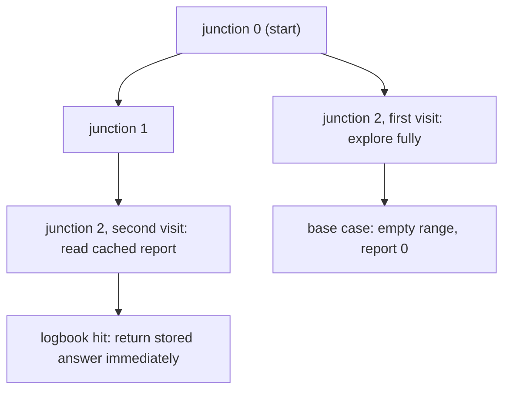
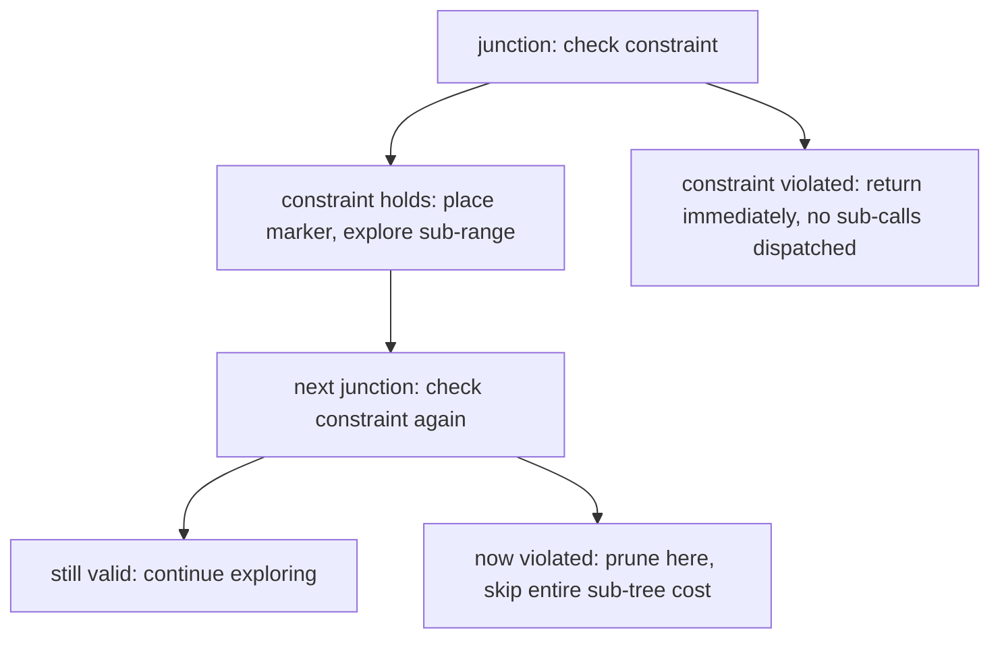
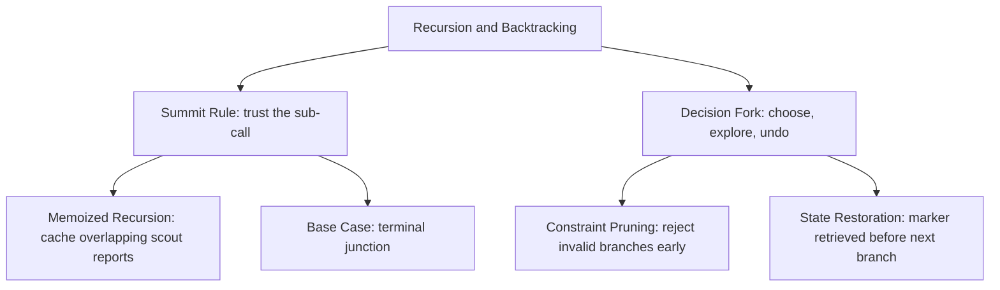
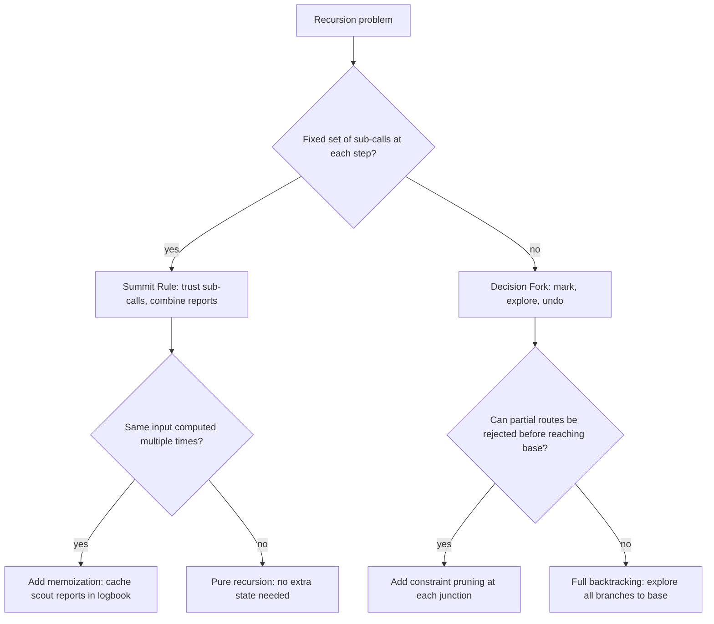

## Overview

Recursion is the first technique where a solution delegates to itself. Instead of building a result one step at a time, you describe what the function should return and trust that a smaller version already delivers it. Backtracking extends that trust into search: at each fork in the road, make one choice, explore every path under it completely, then clean up and try the next. Together they let you map every valid route through a decision space without generating and storing all possibilities upfront. You already know linear traversal from arrays and branching structure from trees; this guide adds the decision tree that writes itself as the recursion runs, through three building blocks: **Trust the Summit Rule**, **Branch the Decision Tree**, and **Choose, Explore, Undo**.

## Core Concept & Mental Model

### The Trail Guide

Picture a trail guide mapping routes through a mountain range where each junction can branch in multiple directions. The guide's job is not to personally walk every branch. At each junction, they dispatch scouts to the smaller sub-ranges ahead and wait for each scout's report. When the reports come back, the guide combines them into one answer and reports upward to whoever sent them.

- trail junction → recursive function call
- scout report → return value from a recursive call
- terminal junction → base case: a summit (goal reached) or dead end (nothing valid here)
- trail marker → the current choice made before exploring a branch
- backtrack → retrieving the marker and returning to the junction
- decision tree → the full map of every junction and branch the recursion visits

The efficiency claim: no section of trail gets surveyed twice. Each junction is visited once, makes its report, and is done.

### Understanding the Analogy

#### The Setup

The guide stands at the first junction in the mountain range. From any junction, the trail can continue to smaller sub-ranges, and the guide can dispatch a scout to explore each one. A scout who reaches a terminal junction reports immediately without dispatching anyone further. The guide never personally walks a section that a scout already covered. The full range gets surveyed even though the guide only ever stands at one junction at a time.

#### The Summit Rule and The Decision Fork

Two mechanisms drive every recursion and backtracking problem.

The **Summit Rule** is the key to trusting recursion: if the answer for the current range can be built from the answer for a smaller range, assume the scouts already solved that smaller version. The guide does not need to understand how that sub-range was surveyed, only what it reported. Correctness runs backward from the smallest possible case: once the base case returns the right answer, every junction above it combines correct reports and returns a correct answer in turn.

The **Decision Fork** is what backtracking adds. At some junctions the guide must actively choose which branch to mark first. Each branch is explored completely before the marker is retrieved and the next branch is tried. The critical property is that after fully exploring a branch, the junction must look exactly as it did before that branch was started. Mutable state that is changed before exploring must be restored before moving on.

#### Why These Approaches

Brute force on a decision space generates all possibilities first and filters afterward. A space with N items and two choices each has 2^N possible combinations. The recursion and backtracking approach builds each route one junction at a time, abandons routes that are already invalid before they are complete, and reuses the same state container for the current route rather than allocating memory for every candidate. The structural guarantee that makes this correct is that each branch of the decision tree is independent: once fully explored, it cannot affect any other branch, so the marker-and-undo cycle is safe.

#### How I Think Through This

Before I touch any code, I ask: **what does the junction need to report, and what state must be in place before and after each scout returns?**

That question separates two fundamentally different shapes.

**When the function only needs one summary from each sub-range:** I use the Summit Rule alone. The guide dispatches a scout to the smaller version of the problem, collects that one report, and combines it into the current answer. Height, count, and "does it exist" all fit this shape. There is no choice to make at each junction, only a report to trust and extend.

**When the function must try multiple branches at one junction:** I add the Decision Fork. The guide marks a branch, dispatches a scout to explore the full sub-range under that branch, then retrieves the marker before trying the next branch. State at the junction must be identical before and after each exploration.

The building blocks below work through three stages where this logic plays out differently.

**Scenario 1 — Summit Rule:** A linear recursion where every junction dispatches exactly one scout and trusts the report.

:::trace-subset
{
  "labels": {"source": "range", "selection": "path so far", "position": "scout at"},
  "steps": [
{"nums":[3,2,1],"start":0,"basket":[],"action":"record","label":"Junction A: how many junctions remain? Dispatch a scout to junction B rather than counting the whole range personally."},
{"nums":[3,2,1],"start":0,"basket":[3],"action":"add","label":"Scout heading to junction B, responsible for range [2, 1]. The guide trusts whatever it reports back."},
{"nums":[3,2,1],"start":1,"basket":[3],"action":"record","label":"Junction B receives the same question and dispatches its own scout to junction C. It trusts junction C's answer and adds 1."},
{"nums":[3,2,1],"start":1,"basket":[3,2],"action":"add","label":"Scout heading to junction C, responsible for range [1]."},
{"nums":[3,2,1],"start":2,"basket":[3,2],"action":"record","label":"Junction C dispatches a scout to the base. One junction remains."},
{"nums":[3,2,1],"start":3,"basket":[3,2,1],"action":"done","label":"Base reached: empty range, no further junctions. Report 0. Every junction above trusts this and adds 1, giving a total of 3 without re-walking any ground."}
  ]
}
:::

**Scenario 2 — Choose, Explore, Undo:** Every junction branches. The guide marks one path, explores all ground under it, retrieves the marker, then tries the next.

:::trace-subset
{
  "labels": {"source": "items", "selection": "pack", "position": "junction"},
  "steps": [
{"nums":[1,2],"start":0,"basket":[],"action":"record","label":"Junction 0: arrive and record route {} immediately. Two branches await: include item 1, or skip it."},
{"nums":[1,2],"start":0,"basket":[1],"action":"add","label":"Mark item 1 as packed. A scout will explore every route with item 1 included."},
{"nums":[1,2],"start":1,"basket":[1],"action":"record","label":"Junction 1 with item 1 packed: arrive and record route {1}. One branch remains: include item 2 or skip it."},
{"nums":[1,2],"start":1,"basket":[1,2],"action":"add","label":"Mark item 2 as packed. Scout descends to the base."},
{"nums":[1,2],"start":2,"basket":[1,2],"action":"record","label":"Base reached: no items left. Route {1, 2} is complete and recorded."},
{"nums":[1,2],"start":1,"basket":[1],"action":"remove","label":"Unpack item 2. The marker is retrieved. Junction 1 is restored to exactly how it looked before this branch."},
{"nums":[1,2],"start":0,"basket":[],"action":"remove","label":"Junction 1 has no more branches. Unpack item 1. Junction 0 is restored. The left branch is fully explored."},
{"nums":[1,2],"start":1,"basket":[2],"action":"add","label":"Mark item 2 as packed. Scout descends to the base."},
{"nums":[1,2],"start":2,"basket":[2],"action":"record","label":"Base reached. Route {2} is complete and recorded."},
{"nums":[1,2],"start":1,"basket":[],"action":"remove","label":"Unpack item 2. Marker retrieved. Junction 0 has no more branches."},
{"nums":[1,2],"start":0,"basket":[],"action":"done","label":"Both branches at junction 0 explored and cleaned up. All 4 routes found: {}, {1}, {1, 2}, {2}. The choose-explore-undo cycle is complete."}
  ]
}
:::

---

## Building Blocks: Progressive Learning

### Level 1: Trust the Summit Rule

Given a trail of N junctions and the task of computing some value that spans the entire trail — a total distance, the largest marker encountered, a cumulative product — brute force walks every junction in a single loop. For most trail lengths that loop is fast and obvious. The problem emerges when you ask the same question from a different starting point, or when a problem's structure naturally produces repeated sub-questions. A loop computes one answer and discards all intermediate work. Recursive decomposition keeps that work available by making each junction's answer an independent fact that any other junction can request.

The Summit Rule is the shift that makes this possible. Instead of thinking "walk from junction 1 to junction N," think "the guide at junction N only needs one piece of information: what is the result for junctions 1 through N-1?" If the scout at junction N-1 already has that answer, the guide at junction N can combine it with the local value and report upward. The base junction — the one with no sub-range left — reports a concrete answer with no sub-call at all. Every junction above it trusts that answer without re-walking.

Applying the Summit Rule is a two-step decision. First, identify the base case: what is the answer when the trail is empty or reduced to nothing? For a sum that is zero. For a maximum that is negative infinity. For a product that is one. Second, identify the combination: what does the current junction add to the scout's report? For a sum that is the current value plus the sub-range total. For a maximum that is the larger of the current marker and the sub-range maximum. Write the base case first, then the recursive case follows from it.

`sumDownFrom(3)` dispatches to `sumDownFrom(2)`, which dispatches to `sumDownFrom(1)`, which dispatches to the base. The base returns 0. Each junction above adds its label and returns without re-surveying any ground.

:::trace-subset
{
  "labels": {"source": "n", "selection": "accumulated", "position": "junction"},
  "steps": [
{"nums":[3,2,1],"start":0,"basket":[],"action":"record","label":"sumDownFrom(3): dispatch a scout to sumDownFrom(2). The guide will add 3 to whatever the scout returns."},
{"nums":[3,2,1],"start":0,"basket":[3],"action":"add","label":"Scout heading to sumDownFrom(2). The guide trusts its report without checking the sub-range itself."},
{"nums":[3,2,1],"start":1,"basket":[3],"action":"record","label":"sumDownFrom(2): dispatch a scout to sumDownFrom(1). Will add 2 to the report."},
{"nums":[3,2,1],"start":1,"basket":[3,2],"action":"add","label":"Scout heading to sumDownFrom(1)."},
{"nums":[3,2,1],"start":2,"basket":[3,2],"action":"record","label":"sumDownFrom(1): dispatch a scout to the base. Will add 1 to the report."},
{"nums":[3,2,1],"start":3,"basket":[3,2,1],"action":"done","label":"Base: sumDownFrom(0) returns 0. Each level above combines: 0+1=1, 1+2=3, 3+3=6. The Summit Rule: no junction re-surveys any ground."}
  ]
}
:::

#### **Exercise 1**

A direct application of the Summit Rule with a running sum. The guide at junction n needs the total of all integers from n down to 1. Dispatch one scout to junction n-1, trust its report, and add n to get the current junction's answer. The base case is n=0, which contributes nothing to the trail total.

:::stackblitz{file="step1-exercise1-problem.ts" step=1 total=3 solution="step1-exercise1-solution.ts"}

#### **Exercise 2**

Changes the combination step from addition to multiplication. The guide at exponent E dispatches one scout to exponent E-1 and multiplies `base` by the scout's report. A scout who reaches exponent 0 is at the terminal junction: any value raised to the zero power equals 1, not 0. The base case identity element depends on the operation — and for multiplication, 0 would erase every answer above it.

:::stackblitz{file="step1-exercise2-problem.ts" step=1 total=3 solution="step1-exercise2-solution.ts"}

#### **Exercise 3**

Shifts the input from a single integer to an indexed array. The guide at index i dispatches a scout to index i+1 and combines by returning the larger of `arr[i]` and the scout's report. The base case fires when the index reaches the end of the array and should return negative infinity — a value small enough that the first real element always wins the first comparison.

:::stackblitz{file="step1-exercise3-problem.ts" step=1 total=3 solution="step1-exercise3-solution.ts"}

> **Mental anchor**: Fix the base case identity value first, then the combination writes itself. The scout always has the rest; the current junction adds exactly one thing.

**→ Bridge to Level 2**: Level 1 always dispatches exactly one scout. Each junction returns a single combined report upward. That works for sum, max, and power — but none of those require mapping out every possible route. When the goal is "find all valid combinations," a single scout per junction is not enough. The guide needs to send one scout down each possible branch from the same junction and merge all their results. That requires a fundamentally different structure.

### Level 2: Branch the Decision Tree

Level 1 dispatched exactly one scout per junction. Now the problem changes. Given a list of items, find every possible subset: every combination of included and excluded items. Brute force generates all 2^N binary strings, maps each to a subset, and filters. Branching recursion builds each route directly: at junction i, dispatch one scout with item i included and one scout with item i excluded, then merge their two result lists. The guide never generates routes it will throw away, because every leaf of the decision tree is already a complete valid subset.

The simpler version of branching recursion avoids all backtracking machinery by passing a new copy of the current pack to each scout. The scout who gets a copy with item i appended explores all sub-routes with that item present. The scout who gets the original copy explores all sub-routes without it. Because each scout has an independent array, neither can corrupt the other's state. The decision tree writes itself: each branch call creates two new calls, and every path from root to leaf is one complete route.

This approach makes the structure transparent. The tree has 2^N leaves for a list of N items. The combination step at each junction is just list concatenation — no sorting, no deduplication. Every route appears exactly once because every binary sequence of include-or-skip decisions maps to exactly one leaf path. The cost is memory: each branch call allocates a new array, so there are O(n) live arrays at peak depth.

`allSubsets([1,2])` forks at each item. One scout carries its own copy with item 1 included; another carries a copy without it. Each of those scouts forks again at item 2.

:::trace-subset
{
  "labels": {"source": "items", "selection": "new copy", "position": "junction"},
  "steps": [
{"nums":[1,2],"start":0,"basket":[],"action":"record","label":"allSubsets: fork at item 0. Scout A gets a new copy [1]. Scout B gets a copy []. They cannot interfere with each other."},
{"nums":[1,2],"start":0,"basket":[1],"action":"add","label":"Scout A carries its own copy [1] and explores all routes from item 1 onward."},
{"nums":[1,2],"start":1,"basket":[1],"action":"record","label":"Scout A at item 1: fork again. One sub-scout gets [1,2]; another gets [1]."},
{"nums":[1,2],"start":2,"basket":[1,2],"action":"add","label":"Sub-scout receives new copy [1,2]. Independent of every other branch."},
{"nums":[1,2],"start":2,"basket":[1,2],"action":"record","label":"Base: no items left. Return [[1,2]]."},
{"nums":[1,2],"start":1,"basket":[1],"action":"remove","label":"Sub-scout [1] reaches base and returns [[1]]. Scout A merges: [[1,2],[1]]."},
{"nums":[1,2],"start":0,"basket":[],"action":"remove","label":"Scout A done. Scout B (copy []) now explores from item 1."},
{"nums":[1,2],"start":1,"basket":[2],"action":"add","label":"Scout B forks: one sub-scout gets [2], one gets []."},
{"nums":[1,2],"start":2,"basket":[2],"action":"record","label":"Base: return [[2]]."},
{"nums":[1,2],"start":1,"basket":[],"action":"remove","label":"Sub-scout [] reaches base and returns [[]]. Scout B merges: [[2],[]]."},
{"nums":[1,2],"start":0,"basket":[],"action":"done","label":"Both scouts merged: [[1,2],[1],[2],[]]. Four subsets. No route explored twice. No shared state mutated."}
  ]
}
:::

> [!TIP]
> The base case at this level fires when `i >= nums.length`. That junction returns a list containing exactly one element — the current pack — not an empty list. Returning `[]` instead of `[current]` at the base silently drops every route from the results.

#### **Exercise 1**

A direct application of binary branching. At each junction, fork into two recursive calls: one that passes a new array with `nums[i]` appended (include), and one that passes the unchanged array (skip). Merge the two returned lists with concatenation. The base case returns a single-element list containing only the current pack.

:::stackblitz{file="step2-exercise1-problem.ts" step=2 total=3 solution="step2-exercise1-solution.ts"}

#### **Exercise 2**

Changes the return type from a list of routes to a count. Instead of collecting routes, count how many routes produce a specific target sum. The fork is identical — include or skip — but each branch returns a number and the junction adds the two counts together. Pass the running sum as a parameter so the junction can check it at the base without inspecting the pack array at all.

:::stackblitz{file="step2-exercise2-problem.ts" step=2 total=3 solution="step2-exercise2-solution.ts"}

#### **Exercise 3**

Shifts the branching domain from items to grid positions. The guide starts at the top-left corner of a grid and must reach the bottom-right corner by moving only right or down. At each position, fork: one scout moves right, one scout moves down. Positions on the right or bottom edge have only one valid move. The base case is reaching the bottom-right corner, which contributes exactly one route. The total is the sum of the two scouts' counts.

:::stackblitz{file="step2-exercise3-problem.ts" step=2 total=3 solution="step2-exercise3-solution.ts"}

> **Mental anchor**: Two scouts, two independent copies of state, one merged result list. No shared pack, no undo step, no surprises.

**→ Bridge to Level 3**: Passing copies works when the pack array is small. When N is large, each branch call allocates a new array, and the peak memory is N live arrays at once. When the problem also demands that the guide keep exploring from the same junction after recording a route — rather than returning immediately — copying becomes unwieldy. The next level uses one shared pack with explicit mark-and-retrieve to avoid all allocation during traversal.

### Level 3: Choose, Explore, Undo

Level 2 passed a new copy of the pack to each scout. Level 3 gives all scouts the same pack, but with a strict protocol: place a marker before exploring a branch, then retrieve it before the next branch starts. After retrieval, the pack must look exactly as it did before the marker was placed. This is the marker-and-retrieve cycle that defines backtracking.

The consequence is that no route is stored as a separate object until it is complete. At any moment, the shared pack holds exactly one active partial route. When the guide reaches a terminal junction, the pack contains a full route; a snapshot is recorded (the pack is copied into the results list) and the guide returns. When the guide backtracks, the pack is already restored to what the junction above expects. The active call stack is at most N levels deep, and the pack never grows beyond N elements — versus Level 2, which needs O(n) live copies at peak depth.

Constraint pruning fits naturally here. If the current partial route already violates a constraint before the guide dispatches a scout — the running sum exceeds the target, the open count has hit the limit — the guide returns immediately without placing a marker. No sub-tree below an invalid junction can produce a valid route, so the entire sub-tree cost is avoided. The pack is already correct for the junction above because no marker was placed.

`buildSubsets([1,2])` pushes item 1, explores all routes under that choice, records them, pops item 1, then pushes item 2. The pack is shared across all calls; the markers are explicit push and pop operations.

:::trace-subset
{
  "labels": {"source": "items", "selection": "pack (shared)", "position": "junction"},
  "steps": [
{"nums":[1,2],"start":0,"basket":[],"action":"record","label":"Arrive at junction 0. Snapshot the empty pack: record {}. Two branches remain — place marker for item 1, or skip it."},
{"nums":[1,2],"start":0,"basket":[1],"action":"add","label":"pack.push(1). Pack is now [1]. Explore all routes with item 1 included."},
{"nums":[1,2],"start":1,"basket":[1],"action":"record","label":"Junction 1 with pack=[1]. Snapshot: record {1}. Place marker for item 2 or skip."},
{"nums":[1,2],"start":1,"basket":[1,2],"action":"add","label":"pack.push(2). Pack is now [1,2]. Scout descends to base."},
{"nums":[1,2],"start":2,"basket":[1,2],"action":"record","label":"Base: no items left. Snapshot: record {1,2}. Return."},
{"nums":[1,2],"start":1,"basket":[1],"action":"remove","label":"pack.pop(). Pack restored to [1]. Junction 1 is exactly as it was before item 2 branch."},
{"nums":[1,2],"start":0,"basket":[],"action":"remove","label":"Junction 1 loop ends. pack.pop(). Pack restored to []. Junction 0 is exactly as it was before item 1 branch."},
{"nums":[1,2],"start":1,"basket":[2],"action":"add","label":"pack.push(2). Pack is now [2]. Scout descends to base."},
{"nums":[1,2],"start":2,"basket":[2],"action":"record","label":"Base: snapshot and record {2}. Return."},
{"nums":[1,2],"start":1,"basket":[],"action":"remove","label":"pack.pop(). Pack restored to []. Junction 0 loop ends."},
{"nums":[1,2],"start":0,"basket":[],"action":"done","label":"All markers retrieved. Pack is back to []. Results: {}, {1}, {1,2}, {2}. One snapshot per junction, one shared pack throughout — zero intermediate allocations."}
  ]
}
:::

#### **Exercise 1**

A direct application of the marker-and-retrieve cycle with a for-loop structure. At every junction — not only at leaves — snapshot the current pack into the results list first, then for each remaining item push it, recurse from the next index, and pop it. This records every partial route as a valid subset, producing all 2^N subsets through a single shared pack with no array copies during traversal.

:::stackblitz{file="step3-exercise1-problem.ts" step=3 total=3 solution="step3-exercise1-solution.ts"}

#### **Exercise 2**

Changes the shared state from a pack array to a `used[]` boolean array. At each junction, scan every item and try those not yet marked. For each candidate: mark it used (place marker), push it to the current sequence, recurse, then pop and unmark (retrieve marker). The base case fires when the current sequence reaches `nums.length`. Each leaf records a permutation — a route that visits every item exactly once.

:::stackblitz{file="step3-exercise2-problem.ts" step=3 total=3 solution="step3-exercise2-solution.ts"}

#### **Exercise 3**

Adds constraint pruning to the marker-retrieve cycle. Generate all k-length combinations from the integers 1 through n in sorted order. At each junction push the next integer, recurse, then pop. Prune when the remaining integers cannot fill the remaining slots: if `n - start + 1 < k - current.length`, no valid combination can be completed from this junction and the loop should break immediately rather than continuing to dispatch scouts.

:::stackblitz{file="step3-exercise3-problem.ts" step=3 total=3 solution="step3-exercise3-solution.ts"}

> **Mental anchor**: Push before exploring, pop after. The pack must look identical before and after every branch — no exceptions.

## Key Patterns

### Pattern: Memoized Recursion

**When to use**: the recursion fans out into multiple sub-calls, but the same smaller sub-problem appears at many junctions across different branches. Keywords include "how many ways," "count distinct paths," "minimum steps," and any problem where the same input would be recomputed multiple times without caching.

**How to think about it**: In the trail guide model, some junctions send scouts to the exact same sub-range from different starting branches. Without a logbook, each scout independently surveys that sub-range at full cost. With a shared logbook, the first scout to complete a given junction writes down the report. Every subsequent scout for that same junction reads from the logbook instead of re-exploring. This works because the sub-range is fixed: the same input always produces the same output. Memoization applies only when the return value depends entirely on the function's input and nothing else — no mutable shared state that varies across branches.

**Complexity**: Without memoization, overlapping sub-problems cause exponential time. With memoization, each unique junction is explored at most once. Time `O(n)` for n unique inputs, Space `O(n)` for the logbook plus `O(n)` call stack depth.

### Pattern: Constraint Pruning

**When to use**: the decision tree has branches that are guaranteed to produce no valid routes beyond a certain point. Keywords include "valid combinations," "generate all X that satisfy Y," and any problem where partial routes can be rejected before reaching a terminal junction.

**How to think about it**: An unpruned decision tree explores every branch all the way to the base before deciding it was invalid. Constraint pruning checks validity at each junction before dispatching scouts. If the current partial route already violates the constraint, the guide turns back immediately without placing a marker or descending. This is safe because a violation at junction K propagates to every junction below it: no further exploration can rescue the route. The earlier the prune, the more sub-trees are skipped in their entirety.

**Complexity**: Pruning does not change the worst-case time complexity, which remains exponential for problems with no constraints that eliminate branches early. In practice, pruning can cut running time dramatically by eliminating large sub-trees before any scout reaches a terminal junction.

---

## Decision Framework

**Concept Map**

**Complexity Table**

| Technique | Time | Space | Best for |
| --- | --- | --- | --- |
| Summit Rule (pure recursion) | `O(k^n)` naive | `O(n)` stack | Count, check, or summarize across sub-problems |
| Summit Rule + Memoization | `O(n)` unique inputs | `O(n)` logbook + `O(n)` stack | Overlapping sub-problems, counting paths |
| Choose-Explore-Undo | `O(2^n)` or `O(n!)` | `O(n)` stack + `O(n)` current route | Enumerate all valid combinations |
| Choose-Explore-Undo + Pruning | Better than `O(2^n)` in practice | `O(n)` | Valid subsets, constrained sequences, generate parentheses |

**Decision Tree**

**Recognition Signals**

| Problem signal | Reach for |
| --- | --- |
| "nth Fibonacci," "factorial," "count paths to base" | Summit Rule |
| "all subsets," "all permutations," "generate all valid X" | Choose-Explore-Undo |
| "how many ways" with repeated sub-problems | Memoized Recursion |
| "generate valid parentheses," "letter combinations," constrained enumeration | Choose-Explore-Undo + Pruning |
| "can you reach," "does a path exist" | Summit Rule with boolean return |

**When NOT to use**

Do not reach for backtracking when the question only asks for a count or yes-or-no answer across overlapping sub-problems — that signals memoized recursion, not enumeration. Do not use pure recursion without memoization when the same sub-range can appear from multiple branches, because the redundant exploration grows exponentially. And do not add choose-explore-undo machinery for problems that only call themselves once with a smaller input — the undo step is unnecessary complexity when there is no branching.

## Common Gotchas & Edge Cases

**Gotcha 1: Missing or unreachable base case**

The recursion runs until the call stack is exhausted. The symptom is a stack overflow or a maximum call stack error with no visible logic error — the function looks correct except it never stops. The input that triggers it is any valid non-base case, because every call only makes progress toward the base and never arrives.

Why it is tempting: when the recursive case feels obviously correct, writing the base case separately can feel redundant. The logic for combining reports seems complete even without a stopping condition.

Fix: always write the base case first. After writing it, verify that every possible non-base input makes at least one step toward the base — smaller n, larger i, or reduced remaining.

**Gotcha 2: Wrong identity value for the base case**

The answer is off by a constant across all inputs. For a maximum query, using 0 as the base case value means the maximum of a list of negative numbers reports 0 instead of the actual maximum. For a product query, using 0 as the base returns 0 for every input because 0 multiplied by anything is 0.

Why it is tempting: 0 is the default "nothing" value for most numeric contexts, but the identity element depends on the operation. The identity for sum is 0, for product is 1, and for maximum is negative infinity.

Fix: before writing the base case, name the operation and look up its identity element. The base case returns that element and nothing else.

**Gotcha 3: Forgetting to pop after push in backtracking**

The shared pack accumulates markers from previous branches. The symptom is results that contain extra items that should have been excluded, or correct-looking early results followed by increasingly corrupted later ones. The pack grows without bound across branches.

Why it is tempting: the push step is visible in the code immediately before the recursive call. The pop step, which must come immediately after the call returns, feels like cleanup that the recursion "should handle." It does not.

Fix: every `pack.push(x)` must be followed by `pack.pop()` in the same function body, after the recursive call returns. Treat push and pop as matched parentheses: if you count one more push than pop in any code path, the pack will be wrong.

**Gotcha 4: Pushing a reference instead of a snapshot at leaves**

The results list accumulates entries that all point to the same array object. When the traversal finishes, every entry in results is the same empty (or final-state) array. The function returns a list of identical values rather than the distinct routes.

Why it is tempting: `results.push(pack)` looks correct in isolation. At the moment it executes, `pack` does contain the right values. But `pack` is a live reference that continues to be mutated by subsequent branches.

Fix: always snapshot with `results.push([...pack])`. The spread operator creates a new array that captures the current contents permanently. This is the only allocation the backtracking approach requires, and it must happen at every junction that records a route.

**Gotcha 5: Passing the same array reference to both scouts in Level 2**

Both the include branch and the skip branch receive the same array object. Mutations in one branch corrupt the other. The symptom is subsets that contain items that should have been excluded, or the results list reporting fewer subsets than expected.

Why it is tempting: when writing the two recursive calls, copying from one branch to the other by accident produces `backtrack(i+1, current)` for both, or `backtrack(i+1, [...current, nums[i]])` for one and `backtrack(i+1, current)` for the other — but `current` has already been mutated by the time the second call runs.

Fix: for the include branch, construct the new array explicitly before passing it: `backtrack(i+1, [...current, nums[i]])`. Verify that the two calls pass distinct objects, not the same reference.

**Edge cases to always check**

- Empty input: `n=0`, `arr=[]`, `nums=[]`. Level 1 should return the identity value. Level 2 and 3 should return `[[]]` (a list containing the empty route).
- Single element: verify the base case fires after exactly one recursive call, not zero or two.
- All identical elements in a permutations problem: the result contains duplicate permutations unless the problem allows them.
- Grid with one row or one column: only one path exists, moving entirely right or entirely down.
- k greater than n in combinations: no valid combination exists; the result should be empty.
- Large n for power or sum: verify the recursion terminates and no off-by-one causes an extra call.

**Debugging tips**

- Print `(i, JSON.stringify(pack))` at the start of each recursive call to trace what state each junction receives. A growing pack that never shrinks confirms a missing pop.
- For backtracking, also print after each pop: `'after pop:', JSON.stringify(pack)`. If the pack does not match the pre-push state, the push and pop are not in the same scope.
- For Level 2, verify independence by logging `pack` before passing it to each branch. If both branches log the same object reference, you are sharing state accidentally.
- For Level 1, log `(n, returnValue)` at each return to verify the chain: each level should combine its local value with exactly the value from one level below.
- For grid paths or combination problems, log `(start, current.length)` at each call to confirm the index is advancing and the recursion is making progress toward the base.
