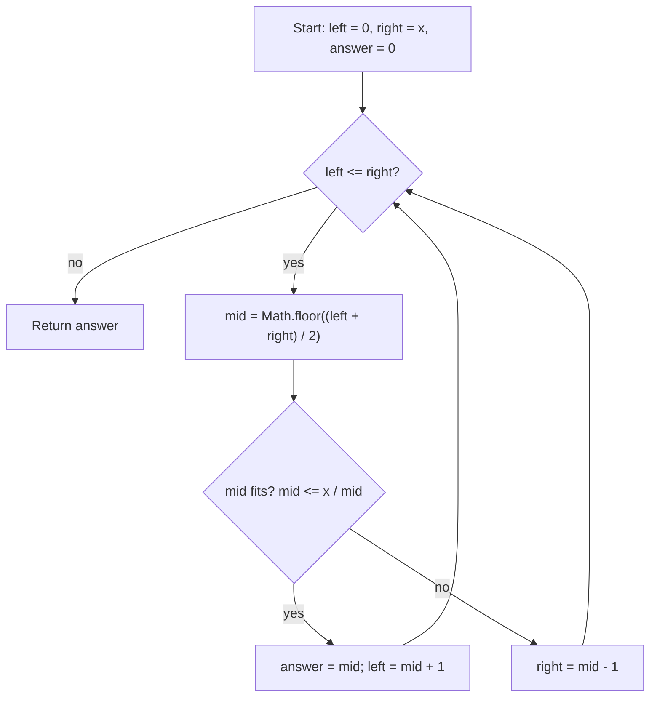

# Sqrt(x) - Mental Model

## The Problem

Implement `int sqrt(int x)`.

Compute and return the square root of `x`, where `x` is guaranteed to be a non-negative integer.

Since the return type is an integer, the decimal digits are truncated, and only the integer part of the result is returned.

**Example 1:**
```
Input: 4
Output: 2
```

**Example 2:**
```
Input: 8
Output: 2
```

## The Tile Yard Analogy

Imagine a builder with exactly `x` tiles, trying to lay the biggest possible square patio. A patio with side length `2` needs `2 * 2 = 4` tiles. A patio with side length `3` needs `9`. So the real question is not "what is the exact square root as a decimal?" It is "what is the largest whole-number side length that still fits inside the tile budget?"

That turns the problem into a boundary hunt. If a side length works, then every smaller side length also works. If a side length is too large, then every larger side length is also too large. The builder is standing on a sorted line of candidate side lengths, from small to large, and looking for the last one that is still safe.

So Binary Search fits naturally. Each midpoint side length either fits inside the tile budget or it overshoots. A safe midpoint becomes the current best certified patio size, and an unsafe midpoint tells the builder to search smaller sizes instead.

## Understanding the Analogy

### The Setup

The candidates are the whole-number side lengths from `0` through `x`. I keep `left` and `right` around the part of that line where the final answer could still live, and I keep `answer = 0` as the best safe patio size I have certified so far.

The important monotone rule is this: if side length `k` fits, then every side length smaller than `k` also fits. If side length `k` is too large, then every side length larger than `k` is also too large. That one-way boundary is what makes Binary Search valid.

### Certified Patio Sizes

At each midpoint `mid`, I ask whether a square of side `mid` still fits inside `x` tiles.

If it fits, `mid` is a valid patio size, but maybe not the largest one. So I record `answer = mid` and keep searching to the right for a bigger safe size.

If it does not fit, then `mid` and every larger side length are impossible, so I move the right boundary left and keep searching smaller candidates.

In code, I avoid checking `mid * mid <= x` directly, because multiplication can overflow in fixed-width integer languages. The safer equivalent question is `mid <= x / mid`.

### Why This Approach

A linear scan would try side lengths one by one until it found the first one that was too large. That works, but it takes `O(x)` time in the worst case.

Binary Search uses the safe-versus-too-large boundary instead. Every midpoint check throws away half of the remaining candidates, so the runtime becomes `O(log x)`.

## How I Think Through This

I translate the prompt into: "find the largest integer `k` such that `k * k <= x`." `left` and `right` surround the candidate side lengths that might still contain that last safe `k`, and `answer` stores the biggest safe one I have seen so far.

Inside the loop, I probe `mid`. If `mid` is still safe, then it deserves to become the new `answer`, but I am not done yet because there may be a bigger safe side length farther right. So I move `left` to `mid + 1`. If `mid` is too large, then the whole right side is impossible, so I move `right` to `mid - 1`.

When the boundaries cross, there are no unresolved candidate side lengths left. The builder has already proved every larger square is too expensive, and `answer` is the largest square patio that still fits.

Take `x = 8`.

:::trace-bs
[
  {"values":[0,1,2,3,4,5,6,7,8],"left":0,"mid":4,"right":8,"action":"check","label":"Clamp the full line of candidate side lengths. Probe side 4. A 4 by 4 patio needs 16 tiles, so it is too large."},
  {"values":[0,1,2,3,4,5,6,7,8],"left":0,"mid":1,"right":3,"action":"discard-right","label":"Drop the oversized right half. Probe side 1. A 1 by 1 patio fits, so side 1 becomes the current certified size."},
  {"values":[0,1,2,3,4,5,6,7,8],"left":2,"mid":2,"right":3,"action":"candidate","label":"Search to the right for a bigger safe patio. Probe side 2. A 2 by 2 patio also fits, so it becomes the new certified size."},
  {"values":[0,1,2,3,4,5,6,7,8],"left":3,"mid":3,"right":3,"action":"check","label":"Probe side 3. A 3 by 3 patio needs 9 tiles, which is too many."},
  {"values":[0,1,2,3,4,5,6,7,8],"left":3,"mid":null,"right":2,"action":"done","label":"The boundaries cross. Side 2 is the largest certified patio that still fits, so return 2."}
]
:::

---

## Building the Algorithm

### Step 1: Certify the First Safe Midpoint

Start with the Binary Search shell over candidate side lengths, from `0` through `x`, plus `answer = 0` as the current best safe patio size.

For this first step, keep the rule narrow. Probe the midpoint once. If that midpoint is safe, return it immediately. If it is too large, return the fallback `answer` for now. This isolates one key idea: a midpoint that fits is a certified candidate answer.

Take `x = 3`.

:::trace-bs
[
  {"values":[0,1,2,3],"left":0,"mid":1,"right":3,"action":"check","label":"Step 1 probes side 1 first."},
  {"values":[0,1,2,3],"left":0,"mid":1,"right":3,"action":"found","label":"A 1 by 1 patio fits inside 3 tiles, so Step 1 returns 1 immediately."}
]
:::

:::stackblitz{file="step1-problem.ts" step=1 total=2 solution="step1-solution.ts"}

<details>
  <summary>Hints & gotchas</summary>

- **Search over side lengths, not decimal values**: the answer must be a whole number.
- **A safe midpoint is already meaningful**: if side `mid` fits, it is at least a valid patio size.
- **Avoid overflow in the fit check**: compare `mid <= x / mid` instead of multiplying first.
</details>

### Step 2: Keep Squeezing Toward the Last Safe Side

Now complete the boundary search. A safe midpoint means "this side length works, and maybe a bigger one works too," so record `answer = mid` and move `left = mid + 1`.

An unsafe midpoint means "this side length and everything larger are impossible," so move `right = mid - 1`.

That is the full last-true Binary Search loop. When the boundaries cross, `answer` holds the largest whole-number side length whose square still fits inside `x`.

Take `x = 15`.

:::trace-bs
[
  {"values":[0,1,2,3,4,5,6,7,8,9,10,11,12,13,14,15],"left":0,"mid":7,"right":15,"action":"check","label":"Probe side 7. A 7 by 7 patio needs 49 tiles, so it is too large."},
  {"values":[0,1,2,3,4,5,6,7,8,9,10,11,12,13,14,15],"left":0,"mid":3,"right":6,"action":"discard-right","label":"Search smaller candidates. Probe side 3. A 3 by 3 patio fits, so side 3 becomes the current certified size."},
  {"values":[0,1,2,3,4,5,6,7,8,9,10,11,12,13,14,15],"left":4,"mid":5,"right":6,"action":"candidate","label":"Search right for a bigger safe patio. Probe side 5. A 5 by 5 patio needs 25 tiles, so it is too large."},
  {"values":[0,1,2,3,4,5,6,7,8,9,10,11,12,13,14,15],"left":4,"mid":4,"right":4,"action":"check","label":"Probe side 4. A 4 by 4 patio needs 16 tiles, still too many."},
  {"values":[0,1,2,3,4,5,6,7,8,9,10,11,12,13,14,15],"left":4,"mid":null,"right":3,"action":"done","label":"The boundaries cross. Side 3 is the largest certified patio that still fits, so return 3."}
]
:::

:::stackblitz{file="step2-problem.ts" step=2 total=2 solution="step2-solution.ts"}

<details>
  <summary>Hints & gotchas</summary>

- **Safe means move right**: when `mid` fits, you are looking for a larger safe side, not stopping immediately.
- **Too large means move left**: once side `mid` is too expensive, every larger side is also impossible.
- **Record before expanding**: save `mid` into `answer` before moving `left` rightward.
</details>

## Tile Boundary at a Glance



## Common Misconceptions

- **"I need the exact decimal square root first"**: this problem only wants the integer floor. The correct mental model is the largest square patio that still fits.
- **"If a midpoint fits, I can return it right away"**: not yet. A safe midpoint is only the best certified patio size so far, and there may still be a larger safe side to the right.
- **"I should check `mid * mid` directly"**: that can overflow in fixed-width integer languages. The safer mental model is to ask whether `mid` still fits inside `x / mid`.
- **"An unsafe midpoint tells me nothing about larger values"**: it tells you everything. If side `mid` is already too large, every larger side is also too large.

## Complete Solution

:::stackblitz{file="solution.ts" step=2 total=2 solution="solution.ts"}
