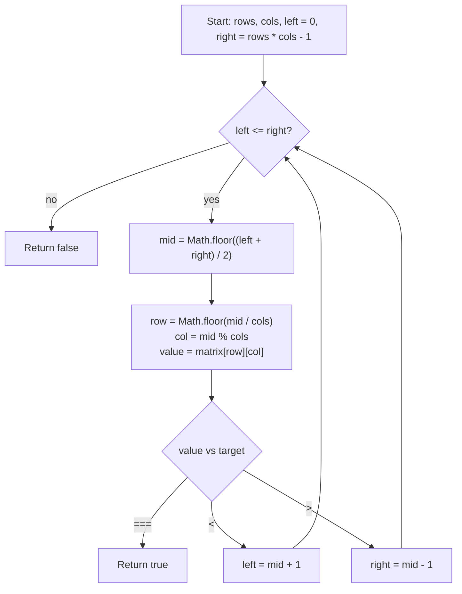

# Search a 2D Matrix - Mental Model

## The Problem

You are given an `m x n` integer matrix `matrix` with the following two properties:

- Each row is sorted in non-decreasing order.
- The first integer of each row is greater than the last integer of the previous row.

Given an integer `target`, return `true` if `target` is in `matrix` or `false` otherwise.

You must write a solution in `O(log(m * n))` time complexity.

**Example 1:**
```
Input: matrix = [[1,3,5,7],[10,11,16,20],[23,30,34,60]], target = 3
Output: true
```

**Example 2:**
```
Input: matrix = [[1,3,5,7],[10,11,16,20],[23,30,34,60]], target = 13
Output: false
```

## The Continuous Inventory Tape Analogy

Imagine a warehouse where products are laid onto shelves in rows, but the labels were printed from one single continuously increasing inventory tape. The workers only bent that tape at the end of each shelf so it would fit the room. The shelf breaks look two-dimensional, but the numbering still behaves like one long sorted strip.

That second rule in the prompt is what makes the tape continuous: the first label of a new shelf is always larger than the last label of the shelf before it. So even though the products are stored in rows and columns, there are no overlaps or resets between rows. If you flattened the shelves back into one strip, the order would still be perfectly sorted.

That means Binary Search should not think in terms of "which row should I scan?" It should think in terms of "which position on the imaginary inventory tape should I probe next?" The row and column are just coordinates you recover after choosing a tape position.

## Understanding the Analogy

### The Setup

The warehouse looks like a grid, but the searchable structure is really one long sorted tape with `rows * cols` positions. Position `0` is the first product on the first shelf. Position `rows * cols - 1` is the last product on the last shelf.

So the live search range is not a pair of row boundaries. It is a pair of tape boundaries: `left = 0` and `right = rows * cols - 1`. The invariant is simple: if the target exists anywhere in the warehouse, its flattened tape position must still live between those two boundaries.

### Converting a Tape Position Back to a Shelf Slot

Once Binary Search picks a midpoint on the tape, that midpoint has to be translated back into shelf coordinates so we can inspect the actual matrix cell.

If every shelf has `cols` positions, then:

- `row = Math.floor(mid / cols)`
- `col = mid % cols`

That is the crucial bridge. The midpoint is chosen in one-dimensional space, then decoded into the two-dimensional shelf slot that holds that inventory label.

### Why This Approach

You could scan every row or do a two-phase search, but the prompt's ordering guarantee gives something stronger: the whole matrix already behaves like one sorted array.

Once you accept that, the problem becomes ordinary Binary Search over `m * n` sorted positions. Each midpoint comparison still discards half the remaining tape, so the runtime becomes `O(log(m * n))`.

## How I Think Through This

I pretend the matrix is one long sorted tape with `rows * cols` positions. `left` and `right` surround every flattened position where the target could still exist. On each loop, I pick `mid` from that tape range first, then decode it back into `row = Math.floor(mid / cols)` and `col = mid % cols` so I can read `matrix[row][col]`.

If that decoded cell equals the target, I return `true` immediately. If the value is too small, then every flattened position through `mid` is also too small, so I move `left` to `mid + 1`. If the value is too large, then every flattened position from `mid` onward is too large, so I move `right` to `mid - 1`.

The key mental model is that the shelves are only the display format. The search logic lives on the hidden tape. Row and column are just how I locate the midpoint cell after Binary Search has already decided which flattened position to inspect.

Take `matrix = [[1, 3, 5], [7, 9, 11]]`, `target = 9`.

:::trace-bs
[
  {"values":[1,3,5,7,9,11],"left":0,"mid":2,"right":5,"action":"check","label":"Clamp the whole inventory tape. Probe flattened index 2, which decodes to row 0, col 2, value 5. Too small, so every tape position through index 2 is ruled out."},
  {"values":[1,3,5,7,9,11],"left":3,"mid":4,"right":5,"action":"discard-left","label":"Move the left boundary to index 3. Probe flattened index 4, which decodes to row 1, col 1, value 9."},
  {"values":[1,3,5,7,9,11],"left":3,"mid":4,"right":5,"action":"found","label":"That decoded shelf slot matches the target, so return true."}
]
:::

---

## Building the Algorithm

### Step 1: Build the Virtual Tape and Decode the Midpoint Cell

Start by treating the matrix like one sorted tape. Handle the empty-matrix case first, then compute `rows`, `cols`, `left`, and `right` from the full flattened range.

For this step, keep the behavior narrow. Pick `mid`, decode it into `row` and `col`, read the midpoint cell, and return `true` only if that first decoded cell is the target. Otherwise, return `false` for now. This isolates the structural idea that the matrix is searched by flattened position, not by row scanning.

Take `matrix = [[1, 3, 5], [7, 9, 11]]`, `target = 5`.

:::trace-bs
[
  {"values":[1,3,5,7,9,11],"left":0,"mid":2,"right":5,"action":"check","label":"Step 1 searches the virtual tape first. Flattened index 2 decodes to row 0, col 2."},
  {"values":[1,3,5,7,9,11],"left":0,"mid":2,"right":5,"action":"found","label":"That decoded cell holds value 5, so the first probe already succeeds and Step 1 returns true."}
]
:::

:::stackblitz{file="step1-problem.ts" step=1 total=2 solution="step1-solution.ts"}

<details>
  <summary>Hints & gotchas</summary>

- **Search the flattened range, not the rows**: `left` and `right` should be indexes on the virtual tape from `0` to `rows * cols - 1`.
- **Decode after choosing `mid`**: use `row = Math.floor(mid / cols)` and `col = mid % cols`.
- **Keep this step narrow**: only teach the midpoint decoding and exact-hit check here. The left/right squeeze belongs to step 2.
</details>

### Step 2: Discard Half of the Virtual Tape

Now finish the real Binary Search loop. Once the decoded midpoint cell is not the target, its value still tells you which half of the flattened tape must be impossible.

If `value < target`, the midpoint cell and every flattened position before it are too small, so move `left` to `mid + 1`. If `value > target`, the midpoint cell and every flattened position after it are too large, so move `right` to `mid - 1`.

That is the complete algorithm: Binary Search chooses a midpoint on the hidden tape, the midpoint is decoded back into one shelf slot, and the comparison decides which half of the tape survives.

Take `matrix = [[1, 3, 5, 7], [10, 11, 16, 20], [23, 30, 34, 60]]`, `target = 13`.

:::trace-bs
[
  {"values":[1,3,5,7,10,11,16,20,23,30,34,60],"left":0,"mid":5,"right":11,"action":"check","label":"Probe flattened index 5, which decodes to row 1, col 1, value 11. Too small, so the surviving tape starts to the right."},
  {"values":[1,3,5,7,10,11,16,20,23,30,34,60],"left":6,"mid":8,"right":11,"action":"discard-left","label":"Probe flattened index 8, which decodes to row 2, col 0, value 23. Too large, so the surviving tape must move left."},
  {"values":[1,3,5,7,10,11,16,20,23,30,34,60],"left":6,"mid":6,"right":7,"action":"discard-right","label":"Probe flattened index 6, value 16. Still too large, so squeeze left again."},
  {"values":[1,3,5,7,10,11,16,20,23,30,34,60],"left":6,"mid":null,"right":5,"action":"done","label":"The boundaries cross. No flattened position is still alive, so the target is not in the matrix and the answer is false."}
]
:::

:::stackblitz{file="step2-problem.ts" step=2 total=2 solution="step2-solution.ts"}

<details>
  <summary>Hints & gotchas</summary>

- **Compare the decoded cell value**: the elimination decision comes from `matrix[row][col]`, not from `row` or `col` alone.
- **Discard the midpoint itself after a miss**: use `mid + 1` or `mid - 1`, because that cell has already been checked.
- **The matrix shape is only for lookup**: the surviving search space is always a flattened tape interval.
</details>

## Inventory Tape at a Glance



## Common Misconceptions

- **"I need to pick a row first, then search inside it"**: that works, but it misses the stronger mental model. The correct view is that the entire matrix is already one sorted tape.
- **"`mid` should become a row midpoint and a column midpoint separately"**: no. Binary Search chooses one flattened midpoint first, then decodes that single position into `row` and `col`.
- **"When the midpoint is too small, I should move to the next column only"**: the comparison eliminates flattened positions, not local neighbors. The correct move is `left = mid + 1`.
- **"The row breaks change the ordering"**: they do not. The first value of each row is greater than the last value of the previous row, so the hidden tape stays globally sorted across shelf boundaries.

## Complete Solution

:::stackblitz{file="solution.ts" step=2 total=2 solution="solution.ts"}
