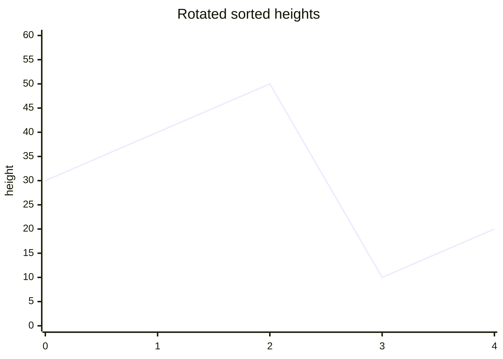
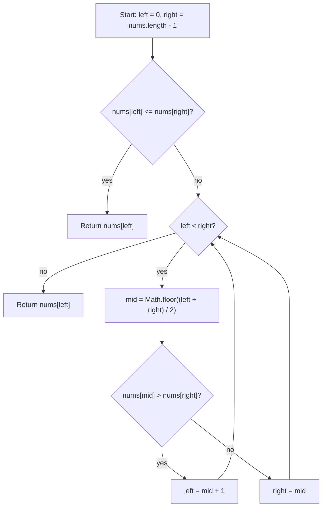

# Find Minimum in Rotated Sorted Array - Mental Model

## The Problem

You are given an ascending array of unique numbers that has been rotated some number of times.

Return the smallest value in the array.

Your solution must run in `O(log n)` time.

**Example 1:**

```
Input: nums = [3,4,5,1,2]
Output: 1
Explanation: The original sorted array was [1,2,3,4,5].
```

**Example 2:**

```
Input: nums = [4,5,6,7,0,1,2]
Output: 0
Explanation: The original sorted array was [0,1,2,4,5,6,7].
```

**Example 3:**

```
Input: nums = [11,13,15,17]
Output: 11
Explanation: The array was not broken by rotation in a way that changed the order.
```

## The Analogy: The Cliff Loop

### What are we actually searching for?

This is not really a "find the smallest number by scanning everything" problem. It is a "find the lowest point on a rotated cliff path" problem.

If the cliff heights were still laid out in perfect ascending order from left to right, the first point would obviously be the lowest. Rotation changes only one thing: it cuts the trail at some point and moves the back segment to the front. That creates one sharp drop where a higher point is immediately followed by a lower one.

The minimum is the first point after that drop.

### The Rotated Trail

Imagine a trail of cliff heights that used to rise smoothly. Then the map was rotated so the back segment appears first, without changing the order inside either segment.

Now the trail still rises locally, but not globally. The left segment is ascending. The right segment is ascending. The only disorder is the one drop where the high ridge wraps around to the low valley.

That is why the minimum is special. It sits exactly at the start of the lower valley segment.

### How we define the live trail

I keep `left` and `right` around the part of the trail where that drop could still be hiding.

There is one fast check before any shrinking starts. If the leftmost height is already smaller than the rightmost height, then the whole live trail is still in sorted order. That means no drop lives inside it, so the minimum must simply be the leftmost point.

If the live trail is not fully ordered, then the drop is somewhere inside it, and I need a probe to decide which half still contains it.

### The one drop that makes Binary Search valid

The midpoint does not tell me whether it is the minimum directly. It tells me which side is still contaminated by the drop.

Compare the midpoint height to the rightmost height in the live trail.

If the midpoint height is larger than the rightmost height, then the midpoint is still sitting on the higher ridge. The drop must be to its right, because the lower valley has not started yet.

If the midpoint height is smaller than the rightmost height, then the midpoint is already in the lower valley, which means the minimum cannot be to its right. The drop, and therefore the minimum, must be at `mid` or to its left.

That is the monotone structure that makes Binary Search work here. One side is definitely clean. The other side still contains the drop.

### Testing one lookout point

So each probe asks one question: is this lookout point still on the high ridge, or have I already crossed into the lower valley?

`nums[mid] > nums[right]` means I am still on the higher side of the drop, so the minimum must be farther right.

`nums[mid] <= nums[right]` means the suffix from `mid` through `right` is ordered and already belongs to the lower valley, so `mid` is still a valid candidate minimum and I should squeeze left.

### How I Think Through This

I picture a cliff profile with one sudden drop in it. I do not care about every point. I care about which side of the drop my midpoint probe landed on. The rightmost height acts like an anchor because it definitely belongs to the lower side of the live trail.

If the midpoint is bigger than that anchor, I know I am still standing on the higher ridge, so I move `left` past `mid`. If the midpoint is smaller, I know I have reached the lower valley already, so I pull `right` back to `mid` and keep the candidate minimum alive.

Take `nums = [4, 5, 6, 7, 0, 1, 2]`.

:::trace-bs
[
{"values":[4,5,6,7,0,1,2],"left":0,"mid":3,"right":6,"action":"check","label":"Probe index 3, height 7, against the right anchor 2. Since 7 is larger, the midpoint is still on the higher ridge, so the drop must be to the right."},
{"values":[4,5,6,7,0,1,2],"left":4,"mid":null,"right":6,"action":"candidate","label":"Move the left boundary to index 4. The live trail now starts in the lower valley, where the minimum still survives."}
]
:::

### The Shape to Visualize

I like to picture the heights as a line graph with one clean drop:



The important feature is not the exact numbers. It is the shape: rising ridge, sudden drop, then rising valley. Binary Search is just locating where that drop begins.

---

## Building the Algorithm

### Step 1: Detect When the Live Trail Is Already Sorted

Start with the search window itself. Put `left` at the first point and `right` at the last point.

Before doing any midpoint work, ask whether the live trail is already fully ordered. If `nums[left] <= nums[right]`, then there is no drop inside this window, so the smallest value is simply `nums[left]`. This gives you the base case that handles a single point and an unrotated trail with one rule.

Take `nums = [11, 13, 15, 17]`.

:::trace-bs
[
{"values":[11,13,15,17],"left":0,"mid":null,"right":3,"action":"check","label":"The live trail starts at index 0 and ends at index 3. The leftmost height is already smaller than the rightmost one, so this window is fully sorted."},
{"values":[11,13,15,17],"left":0,"mid":0,"right":3,"action":"found","label":"Because the window is already ordered, the minimum is the leftmost point: 11."}
]
:::

:::stackblitz{file="step1-problem.ts" step=1 total=4 solution="step1-solution.ts"}

<details>
  <summary>Hints & gotchas</summary>

- **Use the current window, not the original story**: `left` and `right` define the live trail you are reasoning about.
- **Already sorted means answer found**: if the live window is in order, the first value in that window is the minimum.
- **This step is about the base case only**: do not start shrinking with midpoint logic yet.
</details>

### Step 2: Open the Search Loop

Now build the search shell, but not the Binary Search decisions yet.

If the trail is not already sorted, you need a loop that keeps working while more than one point is still alive. Inside that loop, compute `mid` so you can probe the current live trail. For this step, the goal is just to reach that probe point correctly.

The temporary checkpoint is simple: once you have the first valid midpoint, return `nums[mid]`. This gives you a clean checkpoint for building the loop condition and midpoint calculation before the branch logic starts.

Take `nums = [3, 4, 5, 1, 2]`.

:::trace-bs
[
{"values":[3,4,5,1,2],"left":0,"mid":2,"right":4,"action":"check","label":"The live trail is not already sorted, so enter the loop. The first job is just to compute the midpoint of the current window."},
{"values":[3,4,5,1,2],"left":0,"mid":2,"right":4,"action":"candidate","label":"That midpoint is index 2, with value 5. This step focuses on building the loop and midpoint setup before the branch logic is introduced."}
]
:::

:::stackblitz{file="step2-problem.ts" step=2 total=4 solution="step2-solution.ts"}

<details>
  <summary>Hints & gotchas</summary>

- **Do not jump ahead to branch logic**: this step is only about the loop condition and midpoint calculation.
- **`left < right` means more than one candidate survives**: that is why the loop should continue.
- **The midpoint must come from the live window**: compute it from the current `left` and `right`, not from a fixed original range.
</details>

### Step 3: Skip the Higher Ridge

Now add the first real Binary Search decision.

If `nums[mid] > nums[right]`, then the midpoint is still on the higher ridge. That means the drop has not happened yet, so the minimum must be strictly to the right and you can safely move `left = mid + 1`.

This step teaches one trustworthy discard rule: when the midpoint is clearly too high, throw away the whole left side through `mid`.

Take `nums = [2, 3, 4, 5, 1]`.

:::trace-bs
[
{"values":[2,3,4,5,1],"left":0,"mid":2,"right":4,"action":"check","label":"Probe index 2, height 4, against the right anchor 1. Since 4 is larger, the midpoint is still on the higher ridge."},
{"values":[2,3,4,5,1],"left":3,"mid":3,"right":4,"action":"discard-left","label":"Move the left boundary to index 3 because the minimum must be to the right of the midpoint."},
{"values":[2,3,4,5,1],"left":3,"mid":3,"right":4,"action":"check","label":"Probe again at index 3, height 5. It is still larger than the right anchor 1, so the minimum is still farther right."},
{"values":[2,3,4,5,1],"left":4,"mid":null,"right":4,"action":"done","label":"Now only index 4 survives. This example can already be solved using the high-ridge discard rule alone."}
]
:::

:::stackblitz{file="step3-problem.ts" step=3 total=4 solution="step3-solution.ts"}

<details>
  <summary>Hints & gotchas</summary>

- **Build one discard rule at a time**: in this step, only handle the case where the midpoint is definitely too high.
- **Compare to the right anchor**: the key question is whether `nums[mid]` is bigger than `nums[right]`.
- **Moving `left` is safe here**: when `nums[mid] > nums[right]`, neither `mid` nor anything left of it can be the minimum.
</details>

### Step 4: Keep the Valley Alive

Now add the missing half of the Binary Search decision.

If `nums[mid] <= nums[right]`, then the midpoint is already in the lower valley. That means `mid` could still be the minimum, so do not throw it away. Instead, keep that candidate alive by setting `right = mid`.

Once both discard rules exist, every midpoint probe tells you exactly which side of the live trail still contains the drop. When `left === right`, the search has collapsed to the minimum index.

Take `nums = [3, 4, 5, 1, 2]`.

:::trace-bs
[
{"values":[3,4,5,1,2],"left":0,"mid":2,"right":4,"action":"check","label":"Probe index 2, height 5, against the right anchor 2. Since 5 is larger, the drop must be to the right."},
{"values":[3,4,5,1,2],"left":3,"mid":3,"right":4,"action":"discard-left","label":"Move the left boundary to index 3. Probe again at index 3, height 1."},
{"values":[3,4,5,1,2],"left":3,"mid":3,"right":3,"action":"discard-right","label":"This time the midpoint is already in the lower valley, so keep it alive by moving the right boundary back to index 3."},
{"values":[3,4,5,1,2],"left":3,"mid":null,"right":3,"action":"done","label":"Now both boundaries meet at the minimum. Return value 1."}
]
:::

:::stackblitz{file="step4-problem.ts" step=4 total=4 solution="step4-solution.ts"}

<details>
  <summary>Hints & gotchas</summary>

- **Keep `mid` when it might still be the answer**: use `right = mid`, not `mid - 1`, because `mid` could already be the minimum.
- **The two branches should mirror the story**: high ridge means move `left`, lower valley means pull `right` back.
- **Stop when one index survives**: `left === right` means the drop has been pinned down completely.
</details>

## Tracing through an Example

Take `nums = [30, 40, 50, 5, 10, 20]`.

:::trace-bs
[
{"values":[30,40,50,5,10,20],"left":0,"mid":2,"right":5,"action":"check","label":"Start with the whole trail. Probe index 2, height 50, against the right anchor 20. Since 50 is larger, the drop is still to the right."},
{"values":[30,40,50,5,10,20],"left":3,"mid":4,"right":5,"action":"discard-left","label":"Move left to index 3. Probe index 4, height 10. That value is already in the lower valley because it is not larger than 20."},
{"values":[30,40,50,5,10,20],"left":3,"mid":3,"right":4,"action":"discard-right","label":"Keep the lower valley and pull right back to index 4. Probe index 3, height 5. It is still in the lower valley, so keep squeezing left."},
{"values":[30,40,50,5,10,20],"left":3,"mid":null,"right":3,"action":"done","label":"Now only index 3 survives. The minimum value is 5."}
]
:::

## Cliff Search at a Glance



## Recognizing This Pattern

Reach for this pattern when an array is mostly sorted but has one rotation drop, pivot, or break in order. The signal is that one comparison can tell you which half still contains that drop. Because the structure flips only once from the higher ridge to the lower valley, Binary Search can keep discarding half the trail instead of scanning every point. That cuts the work from `O(n)` to `O(log n)`.

## Complete Solution

:::stackblitz{file="solution.ts" step=4 total=4 solution="solution.ts"}
