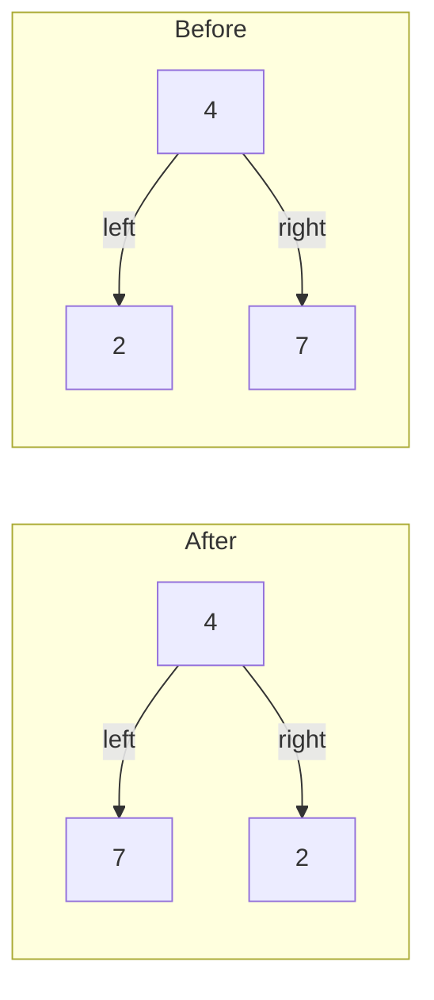
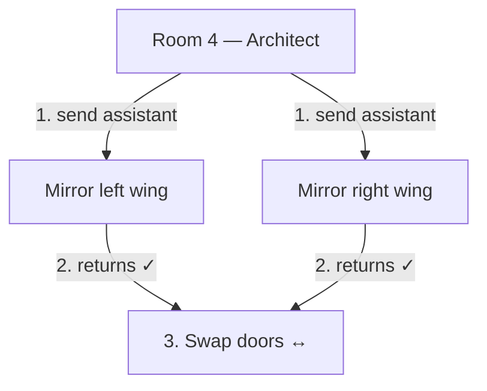
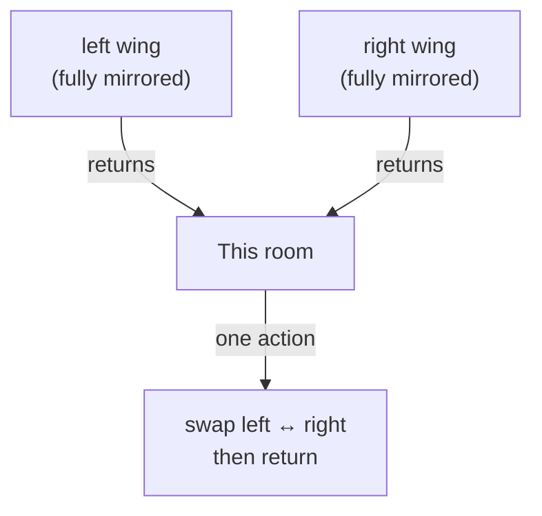
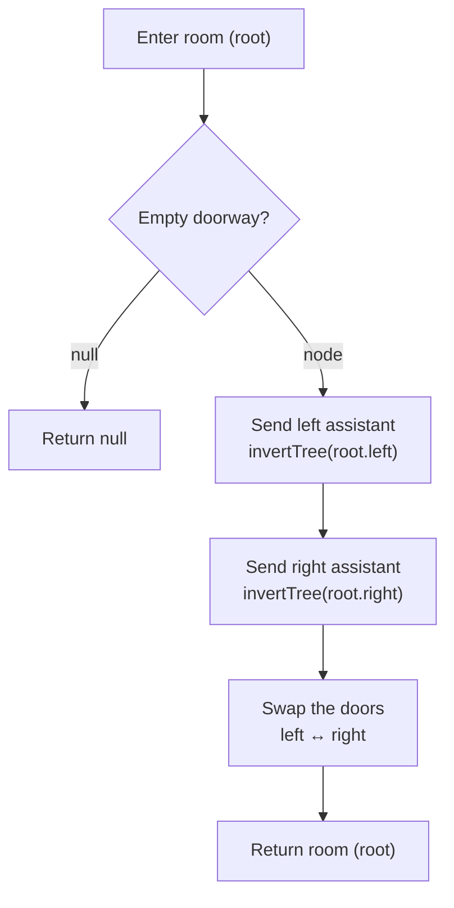

# Invert Binary Tree - Mental Model

## The Problem

Given the root of a binary tree, invert the tree, and return its root.

**Example 1:**
```
Input: root = [4,2,7,1,3,6,9]
Output: [4,7,2,9,6,3,1]
```
```
     4                  4
   /   \     -->      /   \
  2     7            7     2
 / \   / \          / \   / \
1   3 6   9        9   6 3   1
```

**Example 2:**
```
Input: root = [2,1,3]
Output: [2,3,1]
```

**Example 3:**
```
Input: root = []
Output: []
```

**Constraints:**
- The number of nodes in the tree is in the range [0, 100].
- -100 <= Node.val <= 100

## The Analogy: Mirroring the Blueprint Room by Room

### What are we actually doing?

We are not rearranging nodes or building a new tree. We are redirecting pointers. Every node still exists with the same value, but the left and right child pointers at every node will be swapped. The tree becomes its own mirror image.



### The blueprint architect

An architect has a building floor plan shaped like a binary tree: one entrance room, and each room may have a left wing and a right wing (either of which can be empty). The client wants the mirrored version — every room should swap which side leads left and which leads right.

The architect uses one rule: at each room, send an assistant to mirror the left wing and another to mirror the right wing. Once both assistants return, swap the doors — the left door now leads where the right door used to, and vice versa. That room is done.

An empty doorway (no room behind it) is already its own mirror. Return immediately.



### The one thing each room does

The architect standing in a room does not think about the whole building. The only question at each room is: once both wings come back mirrored, are the doors swapped? If yes, this room is done.

This is the core insight: each node performs one swap. The recursive calls handle everything below, and null terminates the descent.



### Testing a candidate room

Before executing the swap, both wings must already be mirrored. That means the recursive calls must complete before the swap. The operation at any room is: trust the left wing came back correct, trust the right wing came back correct, then swap the doors and return.

### How I Think Through This

I think about each node as a room with one responsibility: once both wings return, swap left and right. I never think about the whole tree at once.

When I reach a null node, there is no room, no doors, nothing to do. I return null immediately. When I reach an actual node, I hand both wings off to recursive calls first, then execute the swap.

Take `[4,2,7]`.

:::trace-tree
[
  {
    "nodes": [
      {"index": 0, "value": 4, "tone": "focus"},
      {"index": 1, "value": 2, "tone": "done", "badge": "mirrored"},
      {"index": 2, "value": 7, "tone": "done", "badge": "mirrored"}
    ],
    "facts": [
      {"name": "at room", "value": 4, "tone": "blue"},
      {"name": "left wing", "value": "node 2 (done)", "tone": "orange"},
      {"name": "right wing", "value": "node 7 (done)", "tone": "orange"}
    ],
    "action": "combine",
    "label": "Both wings have returned. Room 4 now swaps which door leads left and which leads right."
  },
  {
    "nodes": [
      {"index": 0, "value": 4, "tone": "done"},
      {"index": 1, "value": 7, "tone": "done"},
      {"index": 2, "value": 2, "tone": "done"}
    ],
    "facts": [
      {"name": "at room", "value": 4, "tone": "blue"},
      {"name": "left wing", "value": "node 7", "tone": "green"},
      {"name": "right wing", "value": "node 2", "tone": "green"}
    ],
    "action": "done",
    "label": "Swap complete. Left now leads to 7, right leads to 2. Return room 4 — the mirrored tree ✓"
  }
]
:::

---

## Building the Algorithm

Each step introduces one concept from the blueprint architect, then a StackBlitz embed to try it.

### Step 1: When the Architect Has No Room to Enter

Before any swapping can happen, the recursion needs to know when to stop. An empty doorway — a null node — is its own mirror. Return null immediately.

With just the base case in place, one case is already handled: an empty tree. If `root` is null, the function returns null, and no further processing occurs.

:::stackblitz{file="step1-problem.ts" step=1 total=2 solution="step1-solution.ts"}

<details>
<summary>Hints & gotchas</summary>

- **Why return null, not undefined**: The function signature returns `TreeNode | null`. Returning null for an empty node signals "no subtree here" to the caller — undefined would break the return contract.
- **This handles more than the empty tree**: A leaf node's left and right are both null. When the recursion reaches a leaf's children, both null checks fire immediately and return — no further work needed below a leaf.

</details>

### Step 2: Recurse Into Both Wings, Then Swap the Doors

Now the full architect routine: send assistants to mirror both wings, then swap the doors at this room. The recursive calls go first — both must complete before the swap happens. After the swap, return `root`.

:::trace-tree
[
  {
    "nodes": [
      {"index": 0, "value": 4, "tone": "focus"},
      {"index": 1, "value": 2, "tone": "default"},
      {"index": 2, "value": 7, "tone": "default"},
      {"index": 3, "value": 1, "tone": "default"},
      {"index": 4, "value": 3, "tone": "default"},
      {"index": 5, "value": 6, "tone": "default"},
      {"index": 6, "value": 9, "tone": "default"}
    ],
    "facts": [
      {"name": "at room", "value": 4, "tone": "blue"}
    ],
    "action": "branch",
    "label": "Enter room 4. Send assistants into both wings before touching any doors."
  },
  {
    "nodes": [
      {"index": 0, "value": 4, "tone": "muted"},
      {"index": 1, "value": 2, "tone": "focus"},
      {"index": 2, "value": 7, "tone": "muted"},
      {"index": 3, "value": 1, "tone": "default"},
      {"index": 4, "value": 3, "tone": "default"},
      {"index": 5, "value": 6, "tone": "muted"},
      {"index": 6, "value": 9, "tone": "muted"}
    ],
    "facts": [
      {"name": "at room", "value": 2, "tone": "blue"}
    ],
    "action": "branch",
    "label": "Left assistant enters room 2. Sends sub-assistants into rooms 1 and 3."
  },
  {
    "nodes": [
      {"index": 0, "value": 4, "tone": "muted"},
      {"index": 1, "value": 2, "tone": "muted"},
      {"index": 2, "value": 7, "tone": "muted"},
      {"index": 3, "value": 1, "tone": "focus"},
      {"index": 4, "value": 3, "tone": "muted"},
      {"index": 5, "value": 6, "tone": "muted"},
      {"index": 6, "value": 9, "tone": "muted"}
    ],
    "facts": [
      {"name": "at room", "value": 1, "tone": "blue"}
    ],
    "action": "visit",
    "label": "Room 1 is a leaf. Both doorways are empty — null returns immediately. Room 1 mirrors itself."
  },
  {
    "nodes": [
      {"index": 0, "value": 4, "tone": "muted"},
      {"index": 1, "value": 2, "tone": "muted"},
      {"index": 2, "value": 7, "tone": "muted"},
      {"index": 3, "value": 1, "tone": "done"},
      {"index": 4, "value": 3, "tone": "focus"},
      {"index": 5, "value": 6, "tone": "muted"},
      {"index": 6, "value": 9, "tone": "muted"}
    ],
    "facts": [
      {"name": "at room", "value": 3, "tone": "blue"}
    ],
    "action": "visit",
    "label": "Room 3 is a leaf. Same result — returns immediately as its own mirror."
  },
  {
    "nodes": [
      {"index": 0, "value": 4, "tone": "muted"},
      {"index": 1, "value": 2, "tone": "focus"},
      {"index": 2, "value": 7, "tone": "muted"},
      {"index": 3, "value": 3, "tone": "done"},
      {"index": 4, "value": 1, "tone": "done"}
    ],
    "facts": [
      {"name": "at room", "value": 2, "tone": "blue"},
      {"name": "left wing", "value": "node 3 (done)", "tone": "orange"},
      {"name": "right wing", "value": "node 1 (done)", "tone": "orange"}
    ],
    "action": "combine",
    "label": "Both wings of room 2 returned. Swap: left door now leads to 3, right door to 1. Return room 2."
  },
  {
    "nodes": [
      {"index": 0, "value": 4, "tone": "muted"},
      {"index": 1, "value": 2, "tone": "done"},
      {"index": 2, "value": 7, "tone": "focus"},
      {"index": 3, "value": 9, "tone": "default"},
      {"index": 4, "value": 6, "tone": "default"},
      {"index": 5, "value": 3, "tone": "muted"},
      {"index": 6, "value": 1, "tone": "muted"}
    ],
    "facts": [
      {"name": "at room", "value": 7, "tone": "blue"}
    ],
    "action": "branch",
    "label": "Right assistant enters room 7. Sends sub-assistants into rooms 6 and 9."
  },
  {
    "nodes": [
      {"index": 0, "value": 4, "tone": "muted"},
      {"index": 1, "value": 2, "tone": "done"},
      {"index": 2, "value": 7, "tone": "done"},
      {"index": 3, "value": 9, "tone": "done"},
      {"index": 4, "value": 6, "tone": "done"},
      {"index": 5, "value": 3, "tone": "muted"},
      {"index": 6, "value": 1, "tone": "muted"}
    ],
    "facts": [
      {"name": "at room", "value": 7, "tone": "blue"},
      {"name": "left wing", "value": "node 9 (done)", "tone": "orange"},
      {"name": "right wing", "value": "node 6 (done)", "tone": "orange"}
    ],
    "action": "combine",
    "label": "Both wings of room 7 returned. Swap: left door now leads to 9, right door to 6. Return room 7."
  },
  {
    "nodes": [
      {"index": 0, "value": 4, "tone": "focus"},
      {"index": 1, "value": 7, "tone": "done"},
      {"index": 2, "value": 2, "tone": "done"},
      {"index": 3, "value": 9, "tone": "done"},
      {"index": 4, "value": 6, "tone": "done"},
      {"index": 5, "value": 3, "tone": "done"},
      {"index": 6, "value": 1, "tone": "done"}
    ],
    "facts": [
      {"name": "at room", "value": 4, "tone": "blue"},
      {"name": "left wing", "value": "node 7 (done)", "tone": "green"},
      {"name": "right wing", "value": "node 2 (done)", "tone": "green"}
    ],
    "action": "done",
    "label": "Both wings returned. Room 4 swaps doors: left leads to 7, right leads to 2. Full tree inverted ✓"
  }
]
:::

:::stackblitz{file="step2-problem.ts" step=2 total=2 solution="step2-solution.ts"}

<details>
<summary>Hints & gotchas</summary>

- **Recurse before swapping**: Both `invertTree(root.left)` and `invertTree(root.right)` must be called before the swap. Swapping first would just mean the recursive calls go into the already-swapped children — you'd still get a correct result, but the mental model breaks. Post-order keeps it clean: children first, operation second.
- **Swap needs a temp variable**: After `root.left = root.right`, the original left is gone. Save it first: `const left = root.left`, then assign, then `root.right = left`.
- **Return root, not a new node**: The function does not build anything new. It modifies pointers in place and returns the same root node. The root's value and identity never change.
- **Symmetric trees are correct**: If both subtrees are identical, swapping them produces the same tree. The algorithm handles this without any special case.

</details>

---

## The Architect's Rule at a Glance



---

## Recognizing This Pattern

Reach for post-order DFS whenever each node's operation depends on both children completing first. For invert, the children must be fully mirrored before the current node swaps its doors — no information flows upward other than "done." Any problem where you combine or act on both subtrees before returning from the current node fits this shape.

The pattern is valid here because inversion is self-similar: inverting a tree means inverting every subtree. When a problem has that recursive self-similarity, trusting recursion to handle children and doing one operation at the current node is sufficient.

Brute force would mean manually tracking depth and swapping level by level. Recursion eliminates all that tracking: the call stack manages the traversal order, and each frame does O(1) work. Total complexity is O(n) time and O(h) space, where h is the tree height.

---

## Complete Solution

:::stackblitz{file="solution.ts" step=2 total=2 solution="solution.ts"}
