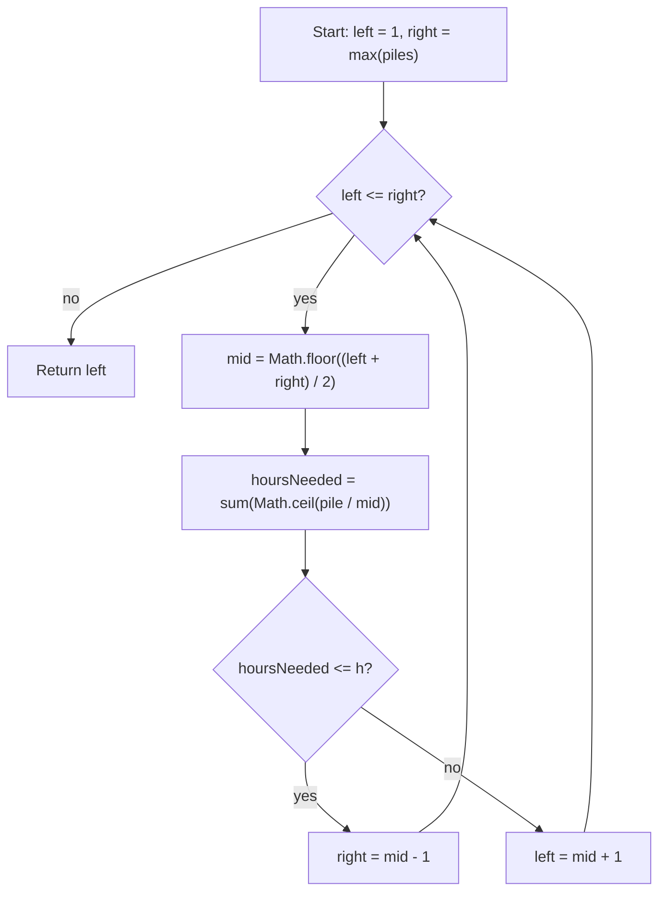

# Koko Eating Bananas - Mental Model

## The Problem

Koko loves to eat bananas. There are `n` piles of bananas, the `i`th pile has `piles[i]` bananas. The guards have gone and will come back in `h` hours.

Koko can decide her bananas-per-hour eating speed of `k`. Each hour, she chooses some pile of bananas and eats `k` bananas from that pile. If the pile has fewer than `k` bananas, she eats all of them instead, and will not eat any more bananas during that hour.

Koko likes to eat slowly but still wants to finish eating all the bananas before the guards return.

Return the minimum integer `k` such that she can eat all the bananas within `h` hours.

**Example 1:**
```
Input: piles = [3,6,7,11], h = 8
Output: 4
```

**Example 2:**
```
Input: piles = [30,11,23,4,20], h = 5
Output: 30
```

**Example 3:**
```
Input: piles = [30,11,23,4,20], h = 6
Output: 23
```

## The Thermostat Testing Analogy

Imagine a building manager trying to find the lowest thermostat setting that still warms every room before dawn. If he sets the thermostat too low, the building stays cold when the deadline arrives. If he sets it high enough, the whole building is warm on time.

The important part is monotonicity. A setting of `10` might be enough. If it is, then every higher setting also works because more heat never makes the building slower to warm up. If `10` is not enough, then every lower setting also fails for the same reason.

So this is not an exact-hit search like "find the room already at 72 degrees." It is a boundary search. The manager is testing thermostat settings and asking one question each time: does this setting finish the job before the deadline? Binary Search works because the answers flip only once, from "too low" to "works."

## Understanding the Analogy

### The Setup

The candidate speeds form an ordered line from `1` banana per hour up to `max(piles)` bananas per hour. Koko never needs to eat faster than the largest pile, because at that speed she can finish any single pile in one hour.

That gives a clean search range:

- `left = 1`
- `right = Math.max(...piles)`

The real question is not whether some speed is possible. Many speeds may work. The real question is where the first working speed begins.

### Testing One Setting

To test one speed `k`, I simulate how many hours it would take to clear every pile at that speed.

One pile of size `pile` costs `Math.ceil(pile / k)` hours, because Koko can only work on one pile per hour. If I add that cost across all piles, I get the total hours needed for speed `k`.

That total acts like the thermostat test:

- if `hoursNeeded(k) <= h`, this setting works
- if `hoursNeeded(k) > h`, this setting is too low

### Why This Approach

A linear search would try speeds `1, 2, 3, ...` until it found the first one that works. That solves the problem, but it wastes the monotone structure and can take `O(max(piles) * n)` time.

Binary Search uses the fact that feasibility moves in one direction. If speed `k` works, every faster speed also works. If speed `k` fails, every slower speed also fails. That lets each midpoint test eliminate half the remaining speed settings, so the runtime becomes `O(n log max(piles))`.

## How I Think Through This

I translate the problem into: "find the first eating speed where `hoursNeeded(speed) <= h` becomes true." `left` and `right` surround the speeds that could still contain that first working setting. I am not searching banana piles directly. I am searching the answer space.

Inside the loop, I test `mid` by summing `Math.ceil(pile / mid)` across all piles. If that total fits within `h`, then `mid` is a certified working speed, but there may still be a slower working speed. So I squeeze left by moving `right` to `mid - 1`. If the total is too large, then `mid` is too slow, so every slower speed is also too slow and I move `left` to `mid + 1`.

When the boundaries cross, the first working speed has been pinned down. `left` ends up parked on the smallest speed that still finishes on time.

Take `piles = [3, 6, 7, 11]`, `h = 8`.

:::trace-bs
[
  {"values":[1,2,3,4,5,6,7,8,9,10,11],"left":0,"mid":5,"right":10,"action":"check","label":"Clamp the full speed dial from 1 through 11. Probe speed 6. It needs 1 + 1 + 2 + 2 = 6 hours, so this setting works."},
  {"values":[1,2,3,4,5,6,7,8,9,10,11],"left":0,"mid":2,"right":4,"action":"candidate","label":"A working setting might still be higher than necessary, so squeeze left. Probe speed 3. It needs 1 + 2 + 3 + 4 = 10 hours, so that setting is too low."},
  {"values":[1,2,3,4,5,6,7,8,9,10,11],"left":3,"mid":3,"right":4,"action":"check","label":"Now only speeds 4 and 5 are still alive. Probe speed 4. It needs exactly 8 hours, so speed 4 works."},
  {"values":[1,2,3,4,5,6,7,8,9,10,11],"left":3,"mid":null,"right":2,"action":"done","label":"The boundaries cross with the answer pointer on speed 4. That is the first working setting, so return 4."}
]
:::

---

## Building the Algorithm

### Step 1: Certify a Midpoint Speed as the Answer

Start with the answer-space Binary Search shell: search from speed `1` to `max(piles)`, probe the midpoint, and use a helper to measure how many hours that speed would need.

For this first step, keep the rule narrow. If the midpoint speed works and the speed just below it fails, then the midpoint is already the first working setting, so return it immediately. Otherwise stop for now. This isolates the core idea that a speed is not just "working" or "failing." A working speed becomes the answer only when it is the first one that works.

Take `piles = [8, 8, 8, 8]`, `h = 8`.

:::trace-bs
[
  {"values":[1,2,3,4,5,6,7,8],"left":0,"mid":3,"right":7,"action":"check","label":"Step 1 probes speed 4 first."},
  {"values":[1,2,3,4,5,6,7,8],"left":0,"mid":3,"right":7,"action":"candidate","label":"Speed 4 needs exactly 8 hours, so it works. Speed 3 would need 12 hours, so it fails. That certifies speed 4 as the answer immediately."}
]
:::

:::stackblitz{file="step1-problem.ts" step=1 total=2 solution="step1-solution.ts"}

<details>
  <summary>Hints & gotchas</summary>

- **Search the answer space**: the midpoint is an eating speed, not a pile index.
- **One test means summing all piles**: `Math.ceil(pile / speed)` is the hour cost of one pile at that speed.
- **Working is not enough by itself**: Step 1 only returns `mid` when it can prove the next slower speed fails.
</details>

### Step 2: Squeeze to the First Working Speed

Now complete the boundary search. If `mid` works, the first working speed is at `mid` or somewhere to its left, so move `right = mid - 1`. If `mid` fails, the first working speed must be to the right, so move `left = mid + 1`.

That is the entire monotone search. I do not need to store a separate `answer` variable here because, after the loop, `left` lands on the first speed that survived every elimination.

Take `piles = [30, 11, 23, 4, 20]`, `h = 6`.

:::trace-bs
[
  {"values":[1,2,3,4,5,6,7,8,9,10,11,12,13,14,15,16,17,18,19,20,21,22,23,24,25,26,27,28,29,30],"left":0,"mid":14,"right":29,"action":"check","label":"Probe speed 15. That needs 2 + 1 + 2 + 1 + 2 = 8 hours, so 15 is too low."},
  {"values":[1,2,3,4,5,6,7,8,9,10,11,12,13,14,15,16,17,18,19,20,21,22,23,24,25,26,27,28,29,30],"left":15,"mid":22,"right":29,"action":"discard-left","label":"Move rightward and probe speed 23. That needs 2 + 1 + 1 + 1 + 1 = 6 hours, so 23 works."},
  {"values":[1,2,3,4,5,6,7,8,9,10,11,12,13,14,15,16,17,18,19,20,21,22,23,24,25,26,27,28,29,30],"left":15,"mid":18,"right":21,"action":"candidate","label":"Squeeze left to look for a slower working speed. Probe speed 19. That needs 2 + 1 + 2 + 1 + 2 = 8 hours, so 19 fails."},
  {"values":[1,2,3,4,5,6,7,8,9,10,11,12,13,14,15,16,17,18,19,20,21,22,23,24,25,26,27,28,29,30],"left":19,"mid":20,"right":21,"action":"check","label":"Probe speed 21. That still needs 7 hours, so it fails too."},
  {"values":[1,2,3,4,5,6,7,8,9,10,11,12,13,14,15,16,17,18,19,20,21,22,23,24,25,26,27,28,29,30],"left":21,"mid":21,"right":21,"action":"check","label":"Probe speed 22. That still needs 7 hours, so it also fails."},
  {"values":[1,2,3,4,5,6,7,8,9,10,11,12,13,14,15,16,17,18,19,20,21,22,23,24,25,26,27,28,29,30],"left":22,"mid":null,"right":21,"action":"done","label":"The boundaries cross with the answer pointer on speed 23. That is the first working setting, so return 23."}
]
:::

:::stackblitz{file="step2-problem.ts" step=2 total=2 solution="step2-solution.ts"}

<details>
  <summary>Hints & gotchas</summary>

- **If a speed works, search left**: you are hunting for the slowest setting that still finishes on time.
- **If a speed fails, search right**: every slower speed also fails, so there is nothing to keep on the left.
- **`left` becomes the answer**: once the boundaries cross, every smaller speed has been disproved.
</details>

## Tracing through an Example

Take `piles = [25, 10, 23, 4]`, `h = 7`.

:::trace-bs
[
  {"values":[1,2,3,4,5,6,7,8,9,10,11,12,13,14,15,16,17,18,19,20,21,22,23,24,25],"left":0,"mid":12,"right":24,"action":"check","label":"Start with the full speed dial. Probe speed 13. Hours needed: 2 + 1 + 2 + 1 = 6, so this speed works."},
  {"values":[1,2,3,4,5,6,7,8,9,10,11,12,13,14,15,16,17,18,19,20,21,22,23,24,25],"left":0,"mid":5,"right":11,"action":"candidate","label":"Squeeze left and probe speed 6. Hours needed: 5 + 2 + 4 + 1 = 12, so this speed fails."},
  {"values":[1,2,3,4,5,6,7,8,9,10,11,12,13,14,15,16,17,18,19,20,21,22,23,24,25],"left":6,"mid":8,"right":11,"action":"check","label":"Probe speed 9. Hours needed: 3 + 2 + 3 + 1 = 9, so this speed still fails."},
  {"values":[1,2,3,4,5,6,7,8,9,10,11,12,13,14,15,16,17,18,19,20,21,22,23,24,25],"left":9,"mid":10,"right":11,"action":"check","label":"Probe speed 11. Hours needed: 3 + 1 + 3 + 1 = 8, so this speed still fails."},
  {"values":[1,2,3,4,5,6,7,8,9,10,11,12,13,14,15,16,17,18,19,20,21,22,23,24,25],"left":11,"mid":11,"right":11,"action":"check","label":"Probe speed 12. Hours needed: 3 + 1 + 2 + 1 = 7, so this speed works."},
  {"values":[1,2,3,4,5,6,7,8,9,10,11,12,13,14,15,16,17,18,19,20,21,22,23,24,25],"left":11,"mid":null,"right":10,"action":"done","label":"The boundaries cross with the answer pointer on speed 12. That is the minimum speed that finishes within 7 hours."}
]
:::

## Thermostat Boundary at a Glance



## Common Misconceptions

- **"Binary Search is over the pile array"**: no. The sorted thing here is the speed dial from `1` to `max(piles)`, not the input array.
- **"If one speed works, return it immediately"**: that can miss a slower speed that also works. The correct mental model is to keep squeezing left until you find the first working setting.
- **"`pile / speed` is already the number of hours"**: only after rounding up. A pile with 7 bananas at speed 3 still costs 3 hours, not 2.33.
- **"The answer needs a separate `answer` variable"**: it can, but it does not have to. In this lower-bound pattern, `left` lands on the minimum working speed after the loop.

## Complete Solution

:::stackblitz{file="solution.ts" step=2 total=2 solution="solution.ts"}
