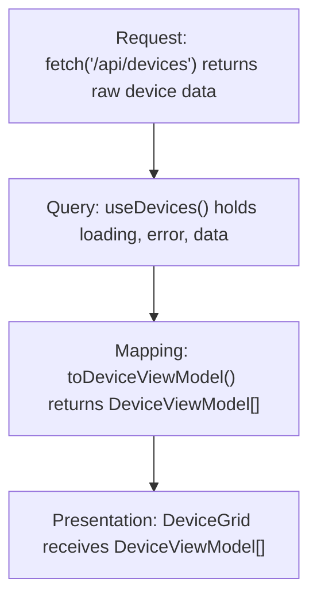
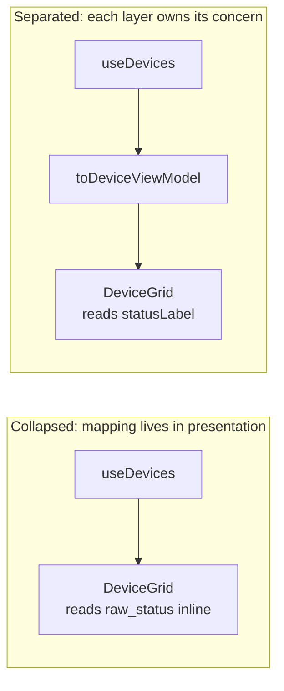
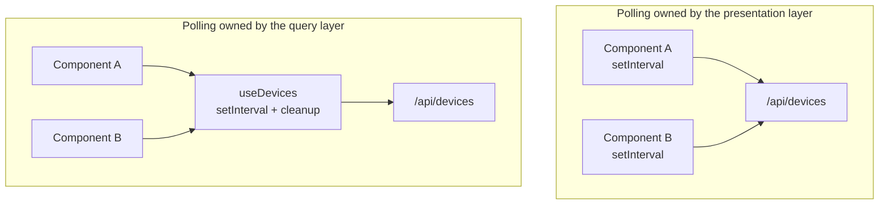

# API Layer Boundaries

## Mental Model

When a component owns the HTTP call, the async lifecycle, the field translations, and the rendered output, it becomes the most expensive piece of code to change. Not because any one responsibility is complex -- each is manageable alone -- but because they share the same file, the same variable scope, and the same change surface. A field rename in the API response touches every ternary that reads it. Adding a loading spinner means reading through polling logic to find the right place. Pausing refresh on tab blur means untangling interval management from the render cycle.

This is not a discipline problem. It is a structure problem. When four different reasons to change are collapsed into one unit, every change carries the risk of affecting all four.

The structural answer is partitioning. Four layers, each with one reason to change, each ignorant of the concerns above it. The server changes a field name and only one layer updates. Product changes a status label and only one layer updates. A 503 needs graceful handling and only one layer updates. The partition makes each concern addressable without reading -- or breaking -- the others.

**Name the concern, own it in one layer, and keep each layer ignorant of everything above it.**

## The Four Layers

Each layer has a single owner and a defined boundary. The dependency direction is always downward. Presentation depends on mapping. Mapping depends on the query hook. The query hook depends on the request function. No layer skips a level or reaches upward.

| Layer | Owns | Does not know about |
|---|---|---|
| Request | Wire call, raw response typed to the server's shape | React, polling cadence, display labels, rendering |
| Query | Loading state, error state, cancellation, retry, polling interval | What the data means to users |
| Mapping | Converting server data to display-ready objects, display labels, derived values | How the data arrived, how often it refreshes |
| Presentation | Rendering view models to pixels | Server field names, polling intervals, mapping logic |



Each layer has a distinct shape in code.

```ts
// Request layer -- plain async function, no React imports
async function fetchDevices(): Promise<DeviceDTO[]> {
  const res = await fetch('/api/devices');
  if (!res.ok) throw new Error(`HTTP ${res.status}`);
  return res.json();
}
```

```ts
// Query layer -- hook owns async state, calls the request function
function useDevices() {
  const [data, setData] = useState<DeviceDTO[]>([]);
  const [loading, setLoading] = useState(true);
  const [error, setError] = useState<Error | null>(null);

  useEffect(() => {
    fetchDevices().then(setData).catch(setError).finally(() => setLoading(false));
  }, []);

  return { data, loading, error };
}
```

```ts
// Mapping layer -- pure function, no React, no fetch
function toDeviceViewModel(dto: DeviceDTO): DeviceViewModel {
  return {
    id: dto.device_id,
    statusLabel: dto.raw_status === 'ACTIVE' ? 'Online' : 'Offline',
    isOnline: dto.raw_status === 'ACTIVE',
  };
}
```

```tsx
// Presentation layer -- receives view models, knows nothing about server types
function DeviceGrid({ devices }: { devices: DeviceViewModel[] }) {
  return (
    <ul>
      {devices.map(d => <li key={d.id}>{d.statusLabel}</li>)}
    </ul>
  );
}
```

The request layer knows nothing about React. The query layer knows nothing about what the data means to a user. The mapping layer knows nothing about where the data came from or how often it refreshes. The presentation layer receives view models -- objects already shaped for display -- and renders them. It never sees the server's original field names.

The key property is that each layer can be changed, replaced, or tested without reading the others. Swap the REST call for a WebSocket in the request layer and the query hook never changes. Rewrite the retry strategy in the query hook and the component never changes. Add a new status label to the mapping function and the component never changes. The partition enforces that each change stays contained.

:::evaluator
Name one decision that belongs to the query layer and not the request layer. Then name one thing the presentation layer must not know about the data it renders.
:::

## When Mapping Collapses

The mapping layer is the most frequently collapsed, and the collapse is always a local decision that looks reasonable. Instead of calling `toDeviceViewModel(device)` and passing a view model to the component, a developer writes `device.raw_status === 'ACTIVE' ? 'Online' : 'Offline'` directly in the JSX template. The label is simple. The data is right there.

```tsx
// Collapsed: DeviceGrid owns both rendering and field translation
function DeviceGrid({ devices }: { devices: DeviceDTO[] }) {
  return (
    <ul>
      {devices.map(d => (
        <li key={d.device_id}>
          {d.raw_status === 'ACTIVE' ? 'Online' : 'Offline'}
        </li>
      ))}
    </ul>
  );
}
```

What actually happened is that mapping now lives in the presentation layer. Two layers with different reasons to change are now one unit.



Three specific failures follow from the collapse. First: when the server renames `raw_status` to `status`, a TypeScript search for `raw_status` finds the `DeviceDTO` type definition and stops there. The field comparison in the JSX template is real, but it lives in a different file. Engineers mark the type fix done and ship a runtime error in the template.

Second: when product adds a third status variant, there is no mapping function to update. The engineer has to audit every JSX file that hardcoded the conditional. There is no compile-time signal pointing to a central definition. The mapping surface has no boundary, so there is no obvious place to look.

Third: when the label logic needs a unit test, there is no function to call. Reaching it requires rendering a component, passing it a device fixture, and inspecting the DOM -- a test that is slower, harder to read, and dependent on rendering infrastructure that has nothing to do with status labels.

A pure `toDeviceViewModel` function eliminates all three. It has a testable surface, a single place to update when server shapes or display labels change, and no dependency on rendering. The indirection pays for itself the first time the API changes.

```ts
// Separated: mapping lives in its own function
function toDeviceViewModel(dto: DeviceDTO): DeviceViewModel {
  return {
    id: dto.device_id,
    statusLabel: dto.raw_status === 'ACTIVE' ? 'Online' : 'Offline',
    isOnline: dto.raw_status === 'ACTIVE',
  };
}
```

```tsx
// Presentation layer receives the view model -- no knowledge of raw_status
function DeviceGrid({ devices }: { devices: DeviceViewModel[] }) {
  return (
    <ul>
      {devices.map(d => <li key={d.id}>{d.statusLabel}</li>)}
    </ul>
  );
}
```

```tsx
// Wiring: the caller runs the data through the mapping layer before rendering
function DeviceDashboard() {
  const { data, loading, error } = useDevices();
  const viewModels = data.map(toDeviceViewModel);
  return <DeviceGrid devices={viewModels} />;
}
```

:::evaluator
A teammate inlines the status label lookup directly into the JSX template. The server then renames `raw_status` to `status`. What is the first thing that breaks? Why does TypeScript not surface the error at the location in the template where the field is read?
:::

## Polling and Lifecycle Ownership

Polling is a lifecycle concern: it decides refresh cadence, whether to pause when the tab is hidden, and how to clean up when the component unmounts. Lifecycle concerns belong in the query layer -- inside the custom hook, alongside loading and error state.

The common mistake is a `setInterval` inside the same `useEffect` that handles the fetch, placed directly in the component. This feels natural because the component is the thing that needs fresh data. But it couples refresh cadence to the render tree, and two concrete failures follow.

```tsx
// Polling owned by the component -- interval and rendering in one place
function DeviceGrid() {
  const [devices, setDevices] = useState<DeviceDTO[]>([]);

  useEffect(() => {
    fetchDevices().then(setDevices);
    const id = setInterval(() => fetchDevices().then(setDevices), 5000);
    return () => clearInterval(id);
  }, []);

  return <ul>{devices.map(d => <li key={d.device_id}>{d.raw_status}</li>)}</ul>;
}
```



First failure: if two components both consume device data and each owns its own interval, the server receives two sets of requests on the same schedule. Adding a third consumer adds a third interval. The problem compounds silently -- no error, no warning, just doubled load and potential UI flicker as results arrive slightly offset.

Second failure: if product asks for pause-on-blur -- stop polling when the tab is not visible -- the engineer has to find every component that owns an interval and update each one. There is no single function to change. Adding three lines of `visibilitychange` handling becomes a search through the component tree.

```ts
// Polling owned by the query hook -- interval, cleanup, and data in one place
function useDevices(intervalMs = 5000) {
  const [devices, setDevices] = useState<DeviceDTO[]>([]);

  useEffect(() => {
    fetchDevices().then(setDevices);
    const id = setInterval(() => fetchDevices().then(setDevices), intervalMs);
    return () => clearInterval(id);
  }, [intervalMs]);

  return devices;
}
```

Moving polling into `useDevices` resolves both failures. The hook owns the interval, the cleanup, and any pause logic. Components call the hook and receive current data. They do not know how often it refreshes or whether the tab is visible. Adding pause-on-blur is a change to one function. Adding a third consumer is a new `useDevices()` call with no new interval.

The request layer is unaffected in either case. It does not know whether it is called once or every five seconds. That indifference is what makes the layer boundary real -- the fetch function is pure transport, callable in any context, with no knowledge of who decides when to call it.

:::evaluator
A product requirement arrives: pause polling when the browser tab is hidden. Which layer owns this change, and why? Name one concrete failure that occurs if you implement it in the presentation layer instead.
:::

:::evaluator
You are reviewing a 180-line component that calls `fetch('/api/devices')` in a `useEffect`, maps the response inline with a ternary for each display label, and starts a `setInterval` for polling. Name the four concerns collapsed into this component. Identify which concern is hardest to reach with a unit test and explain why. Then describe one failure that becomes impossible to reproduce once all four concerns are in separate layers.
:::
