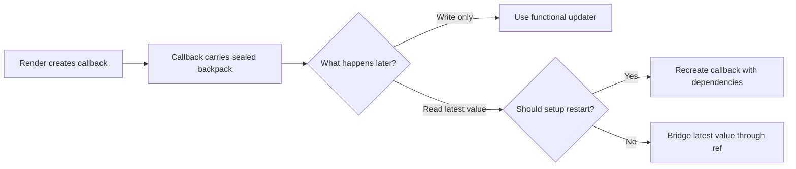
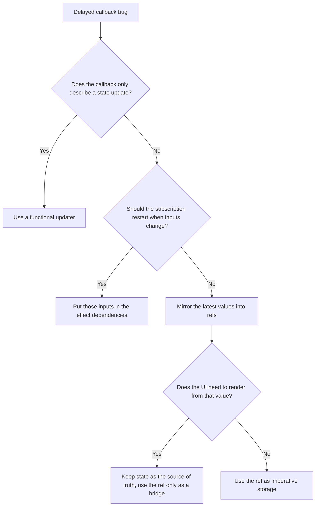

## Overview

Closure captures explain why a function in React keeps reading the values from the render where that function was created. This is the source of stale handlers, delayed timers, intervals that keep seeing old state, and effects that quietly use yesterday's inputs. The bug is confusing because the UI can show the latest render while an older callback is still running with older data packed inside it. This builds directly on Generics, which taught you to track a structural relationship, because closure captures are the runtime version of the same discipline: you have to know what stays linked to what. We will build that model in three levels, `Packed Writes`, `Fresh Packs Per Render`, and `Live Feed Bridges`.

## Core Concept & Mental Model

### The Sealed Backpack

Imagine every render hands each callback a backpack, then zips it shut before the callback leaves the room. Whatever values were packed at that moment stay inside that backpack until the callback finally runs. React can render again, update the screen, and create newer backpacks, but the older callback still carries the older pack.

- **backpack**: one callback instance
- **packed note**: a state or prop value from a specific render
- **zipper closing**: the moment the callback is created
- **new backpack shipment**: a later render creating newer callbacks
- **clipboard on the wall**: a ref that can be updated without replacing the callback

In backpack terms, correctness comes from making sure a callback either gets a fresh pack for the next trip or reads from a live clipboard instead of an old sealed note.

### What Actually Gets Captured

A React component renders, computes values, and creates functions. Each function closes over the variables that were in scope during that render. If the function runs immediately, this feels invisible. If it runs later, inside a timeout, event listener, interval, promise, or effect cleanup, the age of that captured data becomes the whole problem.

The important point is that React does not keep a callback magically wired to the newest render. The callback keeps the values from the render that created it. New render, new values, new callback. If older callbacks still run later, they still unpack older notes.

### Two Renders Can Stay Alive At Once

The part that usually feels wrong at first is that a newer render and an older callback can both still be active. The screen may now reflect newer state, while a timeout, listener, or async continuation created by the older render is still waiting to run.

That gives you two timelines:

- the **render timeline**, where React produces newer state and newer callbacks
- the **callback timeline**, where older callbacks eventually wake up and run

The tracer below shows that split. A timeout from render 0 is still alive after render 1 exists, so when it runs, it still opens the older backpack.

:::trace-graph
[
  {
    "nodes": [
      {"id": "R0", "label": "render 0", "x": 18, "y": 50, "tone": "current", "badge": "first render"},
      {"id": "C0", "label": "count = 0", "x": 38, "y": 26, "tone": "visited"},
      {"id": "T0", "label": "timeout A", "x": 38, "y": 74, "tone": "frontier"},
      {"id": "R1", "label": "render 1", "x": 68, "y": 50, "tone": "muted"},
      {"id": "C1", "label": "count = 1", "x": 88, "y": 26, "tone": "muted"},
      {"id": "T1", "label": "timeout B", "x": 88, "y": 74, "tone": "muted"}
    ],
    "edges": [
      {"from": "R0", "to": "C0", "tone": "traversed", "label": "reads"},
      {"from": "R0", "to": "T0", "tone": "active", "label": "creates"},
      {"from": "R1", "to": "C1", "tone": "muted", "label": "new state"},
      {"from": "R1", "to": "T1", "tone": "muted", "label": "new callback"}
    ],
    "facts": [
      {"name": "screen", "value": "count shows 0", "tone": "blue"},
      {"name": "live callback", "value": "timeout A is waiting", "tone": "orange"}
    ],
    "action": "visit",
    "label": "Render 0 creates timeout A. That callback seals count = 0 inside its backpack."
  },
  {
    "nodes": [
      {"id": "R0", "label": "render 0", "x": 18, "y": 50, "tone": "visited"},
      {"id": "C0", "label": "count = 0", "x": 38, "y": 26, "tone": "visited"},
      {"id": "T0", "label": "timeout A", "x": 38, "y": 74, "tone": "frontier"},
      {"id": "R1", "label": "render 1", "x": 68, "y": 50, "tone": "current", "badge": "rerender"},
      {"id": "C1", "label": "count = 1", "x": 88, "y": 26, "tone": "current"},
      {"id": "T1", "label": "timeout B", "x": 88, "y": 74, "tone": "frontier"}
    ],
    "edges": [
      {"from": "R0", "to": "T0", "tone": "queued", "label": "still pending"},
      {"from": "R1", "to": "C1", "tone": "active", "label": "screen now reads this"},
      {"from": "R1", "to": "T1", "tone": "active", "label": "creates"},
      {"from": "T0", "to": "C0", "tone": "queued", "label": "still points here"}
    ],
    "facts": [
      {"name": "screen", "value": "count shows 1", "tone": "blue"},
      {"name": "older callback", "value": "timeout A still carries count = 0", "tone": "orange"}
    ],
    "action": "expand",
    "label": "Render 1 exists now, but timeout A did not get rewritten. It still points back to the notes from render 0."
  },
  {
    "nodes": [
      {"id": "R0", "label": "render 0", "x": 18, "y": 50, "tone": "muted"},
      {"id": "C0", "label": "count = 0", "x": 38, "y": 26, "tone": "visited"},
      {"id": "T0", "label": "timeout A fires", "x": 38, "y": 74, "tone": "current"},
      {"id": "R1", "label": "render 1", "x": 68, "y": 50, "tone": "done"},
      {"id": "C1", "label": "count = 1", "x": 88, "y": 26, "tone": "done"},
      {"id": "T1", "label": "timeout B", "x": 88, "y": 74, "tone": "frontier"}
    ],
    "edges": [
      {"from": "T0", "to": "C0", "tone": "active", "label": "opens old note"},
      {"from": "R1", "to": "C1", "tone": "traversed", "label": "newer render exists"},
      {"from": "T1", "to": "C1", "tone": "queued", "label": "newer callback would read this"}
    ],
    "facts": [
      {"name": "bug shape", "value": "older callback, newer UI", "tone": "purple"},
      {"name": "question", "value": "should this callback read old notes at all?", "tone": "orange"}
    ],
    "action": "done",
    "label": "When timeout A wakes up, it still reads count = 0. The stale closure bug is not that React forgot the new render. It is that the old callback is still alive."
  }
]
:::

### Three Callback Shapes

Once you look at callbacks this way, the guide breaks into three distinct shapes.

#### Packed writes

Some delayed callbacks do not need to read current state. They only need to describe a state transition such as increment, append, merge, or toggle. In that case, the packed value is unnecessary baggage. The callback should carry an instruction instead of a snapshot.

#### Fresh reads per render

Some callbacks really are supposed to read current props or state later. A listener that logs the current label, or a debounce that commits the current search term, belongs to this group. Here the issue is not the update shape. The issue is that the callback itself has aged, so React needs to create a fresh one from the newer render.

#### Stable setup, live reads

Some long lived setups should stay mounted while still reading fresh values. An interval, DOM listener, or subscription may be expensive or awkward to restart on every render. In that case the callback stays stable, but its read path moves through a ref that is updated every render.

### How I Sort A Closure Bug

Before touching code, sort the callback by the kind of work it is doing.

| Callback behavior | What is going wrong | What changes |
|---|---|---|
| Delayed write built from old state | The callback packed a stale snapshot it never needed | Replace the snapshot read with a functional updater |
| Delayed read of props or state | The callback itself belongs to an older render | Recreate it when those inputs change |
| Long lived setup with fresh reads | The setup should persist, but the read should not stay frozen | Keep the setup stable and mirror the read through a ref |

The three exercise levels below use that same split. The first level stays inside packed writes. The second level moves to fresh reads. The third level keeps the setup stable and changes only where the callback reads from.

### Scenario 1: Two Increments That Land as One

A hook queues two delayed increments. Both timers close over `count = 0` from the current render. When they fire, each one applies `count + 1` to the same packed starting value:

```ts
// Both timers sealed count = 0 in their backpacks at creation time
setTimeout(() => setCount(count + 1), 10); // packed count = 0 → sets to 1
setTimeout(() => setCount(count + 1), 20); // packed count = 0 → sets to 1 again
// Final count: 1, not 2
```

The callback only needs to describe a state transition, not read the current count. Hand React an updater instead and React applies it against live state at commit time:

```ts
setTimeout(() => setCount(c => c + 1), 10); // instruction: take whatever c is now, add 1
setTimeout(() => setCount(c => c + 1), 20); // instruction applied against updated state
// Final count: 2
```

Nothing about this bug requires a newer callback. The callback never needed to carry `count` in the first place. It only needed to describe "add one to whatever the current count is."

### Scenario 2: A Listener Frozen On The First Label

An effect installs a keydown listener with `[]` as dependencies. That tells React to keep the very first backpack forever. After the prop changes, the listener still reads from the sealed original note:

```ts
useEffect(() => {
  const handler = (e: KeyboardEvent) => log(`${label}:${e.key}`);
  document.addEventListener('keydown', handler);
  return () => document.removeEventListener('keydown', handler);
}, []); // [] = keep this backpack sealed forever
// label = 'draft' at mount. After rerender with label = 'live': still logs 'draft:k'
```

Adding every value the callback reads to the dependency list gives it a fresh backpack each time those values change:

```ts
useEffect(() => {
  const handler = (e: KeyboardEvent) => log(`${label}:${e.key}`);
  document.addEventListener('keydown', handler);
  return () => document.removeEventListener('keydown', handler);
}, [label, log]); // React tears down old listener and reinstalls with the current label
```

Here the callback really is supposed to read the current label later. The fix is not a different write shape. The fix is a fresh callback from the newer render.

### Scenario 3: One Stable Interval, Fresh Callback Reads

An interval needs to call the latest callback on each tick. Adding `onTick` to the dependency array looks like the right fix after Scenario 2, but `onTick` is a new function reference every render, so the interval restarts constantly:

```ts
useEffect(() => {
  const id = setInterval(() => onTick(), delay);
  return () => clearInterval(id);
}, [delay, onTick]); // onTick is new every render → interval cancels and restarts each time
```

Mirror `onTick` into a ref instead. The interval reads from the clipboard on each tick, so the effect only restarts when `delay` changes:

```ts
const latestTick = useRef(onTick);
latestTick.current = onTick; // write the newest callback to the clipboard each render

useEffect(() => {
  const id = setInterval(() => latestTick.current(), delay);
  return () => clearInterval(id);
}, [delay]); // one interval, fresh callback reads on every tick
```

This is the third shape. The interval setup should stay where it is, but what it reads on each tick should come from a live bridge rather than an old backpack.

---

## Building Blocks: Progressive Learning

### Level 1: Packed Writes

The first surprise is that stale closures often break writes, not just reads. Two queued updates can both carry the same old count. Two delayed object patches can both spread the same old object. The result looks like React "ignored" one update, but React is doing exactly what you asked: each callback opened its own sealed backpack and wrote from the old note inside it.

The structural rule here is simple. If a delayed callback only needs to describe how state should change, do not read the captured value directly. Hand React an updater function so React can apply the change against the freshest state at commit time. That turns "set count to packed count plus one" into "take whatever count is current, then add one."

Level 1 matters because it gives you the smallest correct fix. You do not need refs or subscription choreography yet. You just need to stop writing from stale notes when React already offers a fresh state handoff.

`count = 0` at render time. Two timers queue before the first one fires:

```ts
// Bug: both timers sealed count = 0 at the moment queuePair() ran
function queuePair() {
  setTimeout(() => setCount(count + 1), 10); // count = 0 → will set to 1
  setTimeout(() => setCount(count + 1), 20); // count = 0 → will also set to 1
}
// After both fire: count = 1, not 2. React applied the same write twice.
```

The fix is to stop carrying the value in the backpack and carry an instruction instead:

```ts
// Fix: each callback hands React an update rule, not a packed value
function queuePair() {
  setTimeout(() => setCount(c => c + 1), 10); // apply +1 to whatever count is at commit time
  setTimeout(() => setCount(c => c + 1), 20); // apply +1 to the result of the first update
}
// After both fire: count = 2. React threads the updates through live state.
```

#### **Exercise 1**

This is the most common stale closure surprise, and it looks deceptively harmless. Two scheduled increments both read `count` from the same render. React is not broken when it applies only one increment — it is doing exactly what the packed notes say. You are given a hook where two queued increments collapse into one. Repair it so both increments land. The question to ask before touching code: does this callback need to read the current count, or only tell React that count should increase by one?

:::stackblitz{file="step1-exercise1-problem.ts" step=1 total=3 solution="step1-exercise1-solution.ts"}

#### **Exercise 2**

Spreading state inside a delayed callback is a silent trap, because the spread looks safe but operates on a frozen snapshot. Both callbacks copy the same packed array and append to it independently, so the second one never sees what the first one added. You are given a hook where two queued appends both read the same packed list and only one name survives. Fix it so both names land in order. The structural move is to express each append as an instruction that takes the current list and adds one entry, rather than spreading from the sealed note.

:::stackblitz{file="step1-exercise2-problem.ts" step=1 total=3 solution="step1-exercise2-solution.ts"}

#### **Exercise 3**

Object merges feel safe because you are spreading existing state, but "existing state" here means the snapshot from when the callback was packed, not the state at commit time. Two delayed patches both spread from the same sealed profile, so the second patch overwrites whatever the first one wrote. You are given a hook where two queued patches collide and only one field survives. Fix it so both fields land intact. The key is to merge inside the updater where React passes you the live object instead of the packed one.

:::stackblitz{file="step1-exercise3-problem.ts" step=1 total=3 solution="step1-exercise3-solution.ts"}

> **Mental anchor**: "If the backpack only contains an instruction, let React read the live state when the instruction lands."

**→ Bridge to Level 2**: Functional updaters fix stale writes, but they do not help when the callback must read a prop or state value later. The next level handles callbacks that need a fresh backpack each time the source value changes.

### Level 2: Fresh Packs Per Render

Some callbacks are supposed to read current values, not just describe updates. A keydown listener should use the current label. A debounce should commit the current query. An interval that announces status should speak with the latest status, not the one from the first render. In these cases the bug is not the write shape, it is the age of the backpack itself.

The fix is to recreate the callback when its inputs change. That usually means the effect that installs the listener, timeout, or interval must depend on the values the callback reads. React then tears down the old subscription and installs a new one with a fresh backpack packed from the latest render.

This level teaches you to read dependency lists as closure declarations. They are not performance hints. They are the list of values that require a new backpack because the old one would speak with stale notes.

`label = 'draft'` at mount. The prop changes to `'live'` on rerender:

```ts
// Bug: empty deps array tells React to keep the first backpack forever
useEffect(() => {
  const handler = (e: KeyboardEvent) => log(`${label}:${e.key}`);
  document.addEventListener('keydown', handler);
  return () => document.removeEventListener('keydown', handler);
}, []); // label frozen at 'draft' — the listener never learns about 'live'
// After rerender: key press logs 'draft:k', not 'live:k'
```

Adding the values the callback reads to the dependency list tells React when to repack:

```ts
// Fix: list every value the effect reads — React tears down and reinstalls when they change
useEffect(() => {
  const handler = (e: KeyboardEvent) => log(`${label}:${e.key}`);
  document.addEventListener('keydown', handler);
  return () => document.removeEventListener('keydown', handler);
}, [label, log]); // rerender with label = 'live' → old listener removed, new one installed
// Key press now logs 'live:k'
```

#### **Exercise 1**

The listener is installed correctly, but it never gets a new backpack. Every keypress after the prop changes still reads the label from the first render because the effect's dependency list is empty and the closure is sealed at mount. The UI can update on screen while the listener keeps announcing old information. You are given a hook where the listener logs the original label even after a rerender with a new one. Fix it so the listener reads the current label. Ask yourself: which values does this callback read, and are all of them listed as dependencies?

:::stackblitz{file="step2-exercise1-problem.ts" step=2 total=3 solution="step2-exercise1-solution.ts"}

#### **Exercise 2**

The heartbeat starts correctly on mount, but its backpack is never refreshed. After a rerender with a new status, the interval keeps calling `onTick` with the original status value because the effect has no dependencies and the closure is frozen. The caller sees ticks that are increasingly out of date. You are given a hook where the interval announces the mount-time status forever. Fix it so each tick reports the current status after a rerender. List every value the interval callback reads in the effect dependency array, and confirm the cleanup correctly cancels the old interval before a new one starts.

:::stackblitz{file="step2-exercise2-problem.ts" step=2 total=3 solution="step2-exercise2-solution.ts"}

#### **Exercise 3**

A debounce is only useful if it commits the latest value. Without a dependency on the current term, the timeout created at mount fires 300ms later with whatever term was packed then. Rapid rerenders all queue new timeouts but never cancel the original, so `onCommit` runs with stale input. You are given a hook where a debounce fires with the initial search term instead of the most recent one. Fix it so only the latest term commits after the debounce window. Notice that the cleanup function is also a backpack — it has to cancel the timer that belongs to its own render, not someone else's.

:::stackblitz{file="step2-exercise3-problem.ts" step=2 total=3 solution="step2-exercise3-solution.ts"}

> **Mental anchor**: "If a later callback must read a value, give it a fresh backpack when that value changes."

**→ Bridge to Level 3**: Repacking works, but some subscriptions are expensive or awkward to restart on every change. The next level shows how to keep one long-lived callback while swapping the note it reads.

### Level 3: Live Feed Bridges

Long-lived subscriptions create the last important edge case. Sometimes you want one interval, one DOM listener, or one external subscription to stay mounted, but you still need it to read the latest value. Repacking the whole callback every render can restart timers, duplicate setup work, or produce visible churn. This is where refs become useful.

A ref is the clipboard on the wall, outside the backpack. The callback can stay stable and keep pointing at the same clipboard, while each render writes the newest value onto it. That gives you fresh reads without re-subscribing. The important rule is that refs bridge long-lived imperative work, they do not replace state for values the UI should render.

This level composes everything from the earlier ones. You still use functional updaters for stale writes. You still recreate callbacks when the subscription should follow changing inputs. The ref bridge is for the narrower case where the subscription itself should stay stable while its read values stay live.

#### **Exercise 1**

Why: an interval should keep one subscription, but still call the latest callback after rerender. What: build a stable interval hook that starts once and reads the latest callback. How: mirror the callback into a ref and let the interval read from that live clipboard.

:::stackblitz{file="step3-exercise1-problem.ts" step=3 total=3 solution="step3-exercise1-solution.ts"}

#### **Exercise 2**

Why: a document escape handler should not re-register on every render just to stay fresh. What: keep one listener attached while always invoking the latest handler prop. How: update a ref each render and have the listener call through that ref.

:::stackblitz{file="step3-exercise2-problem.ts" step=3 total=3 solution="step3-exercise2-solution.ts"}

#### **Exercise 3**

Why: polling code often needs stable setup plus fresh query and fetcher inputs. What: keep one polling interval alive while each tick uses the latest query. How: bridge both the query and the fetcher through refs so the long-lived timer never speaks from an old note.

:::stackblitz{file="step3-exercise3-problem.ts" step=3 total=3 solution="step3-exercise3-solution.ts"}

> **Mental anchor**: "Keep the backpack stable only when the callback can read from a live clipboard."

## Key Patterns

### Pattern: Functional updater handoff

**When to use:** use it when delayed work only needs to describe a state transition like increment, append, merge, or toggle.

**What it costs:** the callback must be written as a transition rule instead of reading the value directly, which can feel less obvious at first.

**What it prevents:** lost increments, overwritten array appends, and object merges that silently drop sibling updates.

**How to think about it:** the callback is not carrying a state value anymore, it is carrying an instruction for React to apply against the live state when the work lands.

**Complexity:** low conceptual cost, low rerender cost, and usually the smallest fix available.

### Pattern: Ref bridge for long-lived callbacks

**When to use:** use it when the subscription should stay attached, but the callback must read the latest prop, state, or handler.

**What it costs:** you introduce imperative indirection, which means the freshest value is no longer visible from the callback body alone.

**What it prevents:** stale intervals, stale DOM listeners, and expensive resubscribe loops that come from recreating the whole setup every render.

**How to think about it:** the callback keeps one backpack, but the note it reads lives on a wall clipboard that every render updates.

**Complexity:** medium conceptual cost, low subscription churn, and higher debugging cost if you start using refs where state should be rendered.

---

## Decision Framework



| Situation | Best tool | Why it fits | Main cost |
|---|---|---|---|
| Delayed increment, append, merge, toggle | Functional updater | React supplies fresh state when applying the update | Slightly less direct syntax |
| Listener or timeout that should follow changing inputs | Recreate with dependencies | New render gets a fresh backpack | Setup and cleanup churn |
| Interval or subscription that should stay mounted | Ref bridge | Stable setup with fresh reads | More imperative mental overhead |



| Recognition signal | Likely problem | First fix to try |
|---|---|---|
| Two queued updates collapse into one | Stale write from packed state | Functional updater |
| Listener logs an old prop after rerender | Old backpack still attached | Recreate effect with dependencies |
| Interval must stay mounted but needs fresh inputs | Stable setup, stale reads | Ref bridge |
| Cleanup cancels the wrong request or timer | Effect is tied to the wrong render inputs | Recheck dependency ownership |

### When NOT to use

Do not reach for refs just because dependency arrays are inconvenient. If the setup should naturally follow a changing value, repack the callback and let the effect restart. Do not store render-visible data in refs to dodge rerenders, because that only hides the state from React instead of fixing the closure problem. Do not blame every rerender bug on stale closures either, because some issues are plain ownership mistakes, effect misuse, or duplicated state.

## Common Gotchas & Edge Cases

**Gotcha 1: Event handlers are fresh, nested async work is not**

A click handler created during the current render usually sees current values, so it can feel safe. The trap appears when that handler schedules later work, like a timeout or promise callback, and that nested callback runs with the older packed notes.  
Why it is tempting: the bug starts inside a handler that already looked fresh.  
Fix: inspect the innermost delayed callback, not just the outer event handler.

**Gotcha 2: Dependency arrays describe closure ownership, not preference**

An effect with `[]` does not mean "run once and stay smart forever." It means "keep the very first backpack forever." That is exactly why stale listeners and intervals happen.  
Why it is tempting: empty dependency arrays look like a cheap optimization.  
Fix: include every value the delayed callback reads, unless you deliberately bridge that value through a ref.

**Gotcha 3: Refs solve freshness, but they do not trigger rendering**

A ref can keep the latest value available to long-lived callbacks, but changing a ref does not re-render the UI. If the screen should update, state still owns the rendered value.  
Why it is tempting: a ref appears to "fix" stale data without any rerenders.  
Fix: use refs only as a bridge for imperative readers, not as a hidden replacement for state.

**Gotcha 4: Cleanup also captures a backpack**

The cleanup function returned from an effect belongs to the same render as the setup. If that setup used the wrong dependencies, the cleanup can unsubscribe the wrong resource or leave the right one behind.  
Why it is tempting: cleanup feels like a global teardown step instead of render-scoped work.  
Fix: reason about setup and cleanup as one pair tied to one render.

**Edge cases to always check**

- Rapid rerenders before a timeout fires
- Two delayed updates that both target the same state cell
- Subscriptions that are expensive to restart
- Effects that both read current values and schedule cleanup
- External callbacks that outlive the component's most recent render

**Debugging tips**

- Add logs that print when the callback was created and when it finally runs
- Ask whether the callback is reading a value or only describing an update
- Temporarily replace direct state writes with functional updaters to isolate stale write bugs
- Count how often a listener or interval is attached to spot accidental resubscription churn
- Introduce a ref mirror only after proving the setup should remain stable
