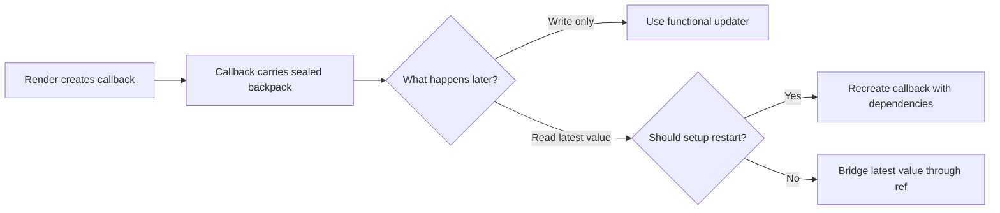
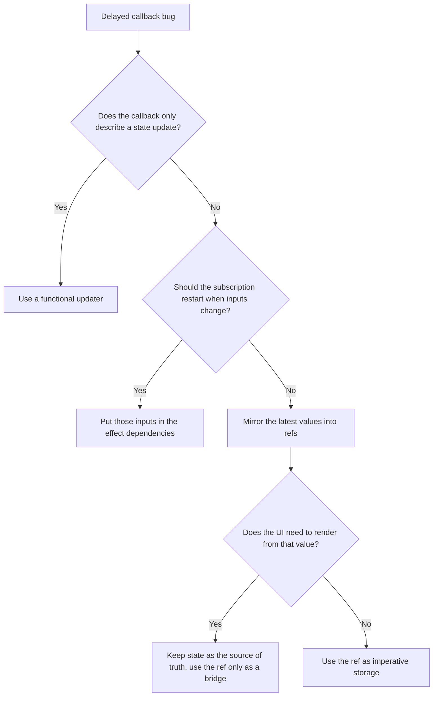

## Overview

Closure captures explain why a function in React keeps reading the values from the render where that function was created. This is the source of stale handlers, delayed timers, intervals that keep seeing old state, and effects that quietly use yesterday's inputs. The bug is confusing because the UI can show the latest render while an older callback is still running with older data packed inside it. This builds directly on Generics, which taught you to track a structural relationship, because closure captures are the runtime version of the same discipline: you have to know what stays linked to what. We will build that model in three levels, `Packed Writes`, `Fresh Packs Per Render`, and `Live Feed Bridges`.

## Core Concept & Mental Model

### The Sealed Backpack

Imagine every render hands each callback a backpack, then zips it shut before the callback leaves the room. Whatever values were packed at that moment stay inside that backpack until the callback finally runs. React can render again, update the screen, and create newer backpacks, but the older callback still carries the older pack.

- Backpack = one callback instance
- Packed note = a state or prop value from a specific render
- Zipper closing = the moment the callback is created
- New backpack shipment = a later render creating newer callbacks
- Clipboard on the wall = a ref that can be updated without replacing the callback

In backpack terms, correctness comes from making sure a callback either gets a fresh pack for the next trip or reads from a live clipboard instead of an old sealed note.

### Mechanism

#### The setup

A React component renders, computes values, and creates functions. Those functions close over the variables that were in scope during that render. If the function runs immediately, this feels invisible. If it runs later, inside a timeout, event listener, interval, promise, or effect cleanup, the age of that captured data suddenly matters.

#### The decision rule

The first question is whether the callback needs to read a value later or only describe an update. If it only describes an update, React can apply that update against the freshest state through a functional updater. If it must read a value later, you either create a fresh callback whenever that value changes, or you keep the callback stable and point it at a ref that always holds the latest value.

#### Why this prevents real bugs

Most stale closure bugs are not random. A callback was created during one render, but the engineer mentally treated it as if it would read from the render where it eventually ran. That mismatch produces logs that lag behind the UI, subscriptions that keep using old filters, intervals that never see new state, and cleanup logic that tears down the wrong thing. Once you track the age of the backpack, the bug becomes mechanical instead of mysterious.

#### How to think before touching code

Treat every delayed callback like a package with a shipping label. Ask three questions. When was this callback packed? What values are sealed inside it? When it finally runs, does it need a fresh pack, or should it read from a live clipboard instead? That sequence tells you whether to use a functional updater, dependency-driven recreation, or a ref bridge.

---

## Building Blocks: Progressive Learning

### Level 1: Packed Writes

The first surprise is that stale closures often break writes, not just reads. Two queued updates can both carry the same old count. Two delayed object patches can both spread the same old object. The result looks like React "ignored" one update, but React is doing exactly what you asked: each callback opened its own sealed backpack and wrote from the old note inside it.

The structural rule here is simple. If a delayed callback only needs to describe how state should change, do not read the captured value directly. Hand React an updater function so React can apply the change against the freshest state at commit time. That turns "set count to packed count plus one" into "take whatever count is current, then add one."

Level 1 matters because it gives you the smallest correct fix. You do not need refs or subscription choreography yet. You just need to stop writing from stale notes when React already offers a fresh state handoff.

#### **Exercise 1**

Why: a queued double increment looks trivial, but both timers can carry the same packed count. What: repair a hook so two delayed increments land as `2`, not `1`. How: replace direct state writes with updater-based writes that read fresh state at apply time.

:::stackblitz{file="step1-exercise1-problem.ts" step=1 total=3 solution="step1-exercise1-solution.ts"}

#### **Exercise 2**

Why: delayed list appends often lose the first item because both callbacks spread the same packed array. What: make two queued inserts preserve both names in order. How: express each append as "take the current list, then add one more entry."

:::stackblitz{file="step1-exercise2-problem.ts" step=1 total=3 solution="step1-exercise2-solution.ts"}

#### **Exercise 3**

Why: object state patches are especially deceptive because each callback looks like it is merging safely. What: make two delayed profile patches preserve both fields instead of letting the last packed object win. How: merge against the live object React hands to the updater.

:::stackblitz{file="step1-exercise3-problem.ts" step=1 total=3 solution="step1-exercise3-solution.ts"}

> **Mental anchor**: "If the backpack only contains an instruction, let React read the live state when the instruction lands."

**→ Bridge to Level 2**: Functional updaters fix stale writes, but they do not help when the callback must read a prop or state value later. The next level handles callbacks that need a fresh backpack each time the source value changes.

### Level 2: Fresh Packs Per Render

Some callbacks are supposed to read current values, not just describe updates. A keydown listener should use the current label. A debounce should commit the current query. An interval that announces status should speak with the latest status, not the one from the first render. In these cases the bug is not the write shape, it is the age of the backpack itself.

The fix is to recreate the callback when its inputs change. That usually means the effect that installs the listener, timeout, or interval must depend on the values the callback reads. React then tears down the old subscription and installs a new one with a fresh backpack packed from the latest render.

This level teaches you to read dependency lists as closure declarations. They are not performance hints. They are the list of values that require a new backpack because the old one would speak with stale notes.

#### **Exercise 1**

Why: a document listener can keep announcing an old label even after the prop changes. What: make a key listener use the latest label after rerender. How: reinstall the listener when the label it reads changes.

:::stackblitz{file="step2-exercise1-problem.ts" step=2 total=3 solution="step2-exercise1-solution.ts"}

#### **Exercise 2**

Why: an interval can keep reporting the startup status forever if its effect never repacks. What: make a heartbeat interval announce the current status after rerender. How: treat every value read inside the interval callback as a dependency that requires a fresh setup.

:::stackblitz{file="step2-exercise2-problem.ts" step=2 total=3 solution="step2-exercise2-solution.ts"}

#### **Exercise 3**

Why: debounced work often leaks stale inputs because the timeout from the old render still fires. What: commit only the latest search term after rapid rerenders. How: rebuild the timeout when the term changes and clean up the older pending one.

:::stackblitz{file="step2-exercise3-problem.ts" step=2 total=3 solution="step2-exercise3-solution.ts"}

> **Mental anchor**: "If a later callback must read a value, give it a fresh backpack when that value changes."

**→ Bridge to Level 3**: Repacking works, but some subscriptions are expensive or awkward to restart on every change. The next level shows how to keep one long-lived callback while swapping the note it reads.

### Level 3: Live Feed Bridges

Long-lived subscriptions create the last important edge case. Sometimes you want one interval, one DOM listener, or one external subscription to stay mounted, but you still need it to read the latest value. Repacking the whole callback every render can restart timers, duplicate setup work, or produce visible churn. This is where refs become useful.

A ref is the clipboard on the wall, outside the backpack. The callback can stay stable and keep pointing at the same clipboard, while each render writes the newest value onto it. That gives you fresh reads without re-subscribing. The important rule is that refs bridge long-lived imperative work, they do not replace state for values the UI should render.

This level composes everything from the earlier ones. You still use functional updaters for stale writes. You still recreate callbacks when the subscription should follow changing inputs. The ref bridge is for the narrower case where the subscription itself should stay stable while its read values stay live.

#### **Exercise 1**

Why: an interval should keep one subscription, but still call the latest callback after rerender. What: build a stable interval hook that starts once and reads the latest callback. How: mirror the callback into a ref and let the interval read from that live clipboard.

:::stackblitz{file="step3-exercise1-problem.ts" step=3 total=3 solution="step3-exercise1-solution.ts"}

#### **Exercise 2**

Why: a document escape handler should not re-register on every render just to stay fresh. What: keep one listener attached while always invoking the latest handler prop. How: update a ref each render and have the listener call through that ref.

:::stackblitz{file="step3-exercise2-problem.ts" step=3 total=3 solution="step3-exercise2-solution.ts"}

#### **Exercise 3**

Why: polling code often needs stable setup plus fresh query and fetcher inputs. What: keep one polling interval alive while each tick uses the latest query. How: bridge both the query and the fetcher through refs so the long-lived timer never speaks from an old note.

:::stackblitz{file="step3-exercise3-problem.ts" step=3 total=3 solution="step3-exercise3-solution.ts"}

> **Mental anchor**: "Keep the backpack stable only when the callback can read from a live clipboard."

## Key Patterns

### Pattern: Functional updater handoff

**When to use:** use it when delayed work only needs to describe a state transition like increment, append, merge, or toggle.

**What it costs:** the callback must be written as a transition rule instead of reading the value directly, which can feel less obvious at first.

**What it prevents:** lost increments, overwritten array appends, and object merges that silently drop sibling updates.

**How to think about it:** the callback is not carrying a state value anymore, it is carrying an instruction for React to apply against the live state when the work lands.

**Complexity:** low conceptual cost, low rerender cost, and usually the smallest fix available.

### Pattern: Ref bridge for long-lived callbacks

**When to use:** use it when the subscription should stay attached, but the callback must read the latest prop, state, or handler.

**What it costs:** you introduce imperative indirection, which means the freshest value is no longer visible from the callback body alone.

**What it prevents:** stale intervals, stale DOM listeners, and expensive resubscribe loops that come from recreating the whole setup every render.

**How to think about it:** the callback keeps one backpack, but the note it reads lives on a wall clipboard that every render updates.

**Complexity:** medium conceptual cost, low subscription churn, and higher debugging cost if you start using refs where state should be rendered.

---

## Decision Framework

| Situation | Best tool | Why it fits | Main cost |
|---|---|---|---|
| Delayed increment, append, merge, toggle | Functional updater | React supplies fresh state when applying the update | Slightly less direct syntax |
| Listener or timeout that should follow changing inputs | Recreate with dependencies | New render gets a fresh backpack | Setup and cleanup churn |
| Interval or subscription that should stay mounted | Ref bridge | Stable setup with fresh reads | More imperative mental overhead |

| Recognition signal | Likely problem | First fix to try |
|---|---|---|
| Two queued updates collapse into one | Stale write from packed state | Functional updater |
| Listener logs an old prop after rerender | Old backpack still attached | Recreate effect with dependencies |
| Interval must stay mounted but needs fresh inputs | Stable setup, stale reads | Ref bridge |
| Cleanup cancels the wrong request or timer | Effect is tied to the wrong render inputs | Recheck dependency ownership |

### When NOT to use

Do not reach for refs just because dependency arrays are inconvenient. If the setup should naturally follow a changing value, repack the callback and let the effect restart. Do not store render-visible data in refs to dodge rerenders, because that only hides the state from React instead of fixing the closure problem. Do not blame every rerender bug on stale closures either, because some issues are plain ownership mistakes, effect misuse, or duplicated state.

## Common Gotchas & Edge Cases

**Gotcha 1: Event handlers are fresh, nested async work is not**

A click handler created during the current render usually sees current values, so it can feel safe. The trap appears when that handler schedules later work, like a timeout or promise callback, and that nested callback runs with the older packed notes.  
Why it is tempting: the bug starts inside a handler that already looked fresh.  
Fix: inspect the innermost delayed callback, not just the outer event handler.

**Gotcha 2: Dependency arrays describe closure ownership, not preference**

An effect with `[]` does not mean "run once and stay smart forever." It means "keep the very first backpack forever." That is exactly why stale listeners and intervals happen.  
Why it is tempting: empty dependency arrays look like a cheap optimization.  
Fix: include every value the delayed callback reads, unless you deliberately bridge that value through a ref.

**Gotcha 3: Refs solve freshness, but they do not trigger rendering**

A ref can keep the latest value available to long-lived callbacks, but changing a ref does not re-render the UI. If the screen should update, state still owns the rendered value.  
Why it is tempting: a ref appears to "fix" stale data without any rerenders.  
Fix: use refs only as a bridge for imperative readers, not as a hidden replacement for state.

**Gotcha 4: Cleanup also captures a backpack**

The cleanup function returned from an effect belongs to the same render as the setup. If that setup used the wrong dependencies, the cleanup can unsubscribe the wrong resource or leave the right one behind.  
Why it is tempting: cleanup feels like a global teardown step instead of render-scoped work.  
Fix: reason about setup and cleanup as one pair tied to one render.

**Edge cases to always check**

- Rapid rerenders before a timeout fires
- Two delayed updates that both target the same state cell
- Subscriptions that are expensive to restart
- Effects that both read current values and schedule cleanup
- External callbacks that outlive the component's most recent render

**Debugging tips**

- Add logs that print when the callback was created and when it finally runs
- Ask whether the callback is reading a value or only describing an update
- Temporarily replace direct state writes with functional updaters to isolate stale write bugs
- Count how often a listener or interval is attached to spot accidental resubscription churn
- Introduce a ref mirror only after proving the setup should remain stable
