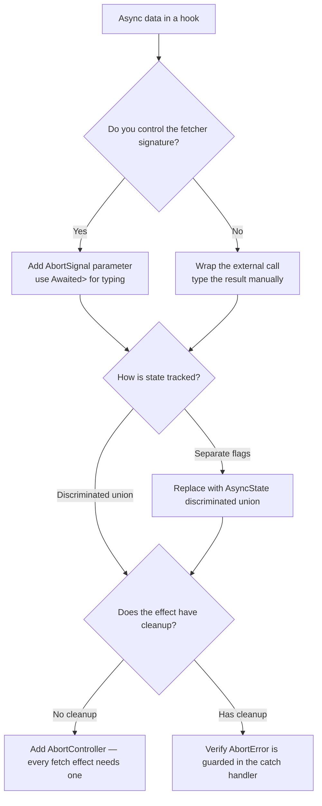

## Overview

Data fetching sits at the intersection of two distinct problems.

**The TypeScript problem:** how does a generic `useFetch<F>` know the data type it returns without hardcoding it?

**The React problem:** how does a component handle a request that may never return, may return stale, and may error?

Neither is hard once you have the right model, but most implementations get one of them wrong. This guide builds both from scratch.

**Level 1** teaches the conditional type machinery, specifically `Awaited<ReturnType<F>>` and the `infer` keyword that makes it work.

**Level 2** models async state as a four-phase discriminated union that eliminates impossible state combinations and enables exhaustive type narrowing.

**Level 3** combines them into a typed, cancellable hook where TypeScript infers the data shape from the fetcher's own return type without any manual annotation.

## Core Concept & Mental Model

The TypeScript problem from the Overview asks how `useFetch<F>` knows what type it returns. That question comes down to one mechanism: how TypeScript unwraps a `Promise<T>` to get `T`. That unwrapping is what `Awaited<ReturnType<F>>` does, and understanding it is the prerequisite for everything else in this guide. The async state machine in Level 2 and the generic hook in Level 3 both depend on knowing what `T` actually is after the Promise resolves.

### The Middleware Unwrap Model

HTTP middleware strips one envelope at a time: TLS unwraps the encrypted payload, HTTP framing unwraps the body, JSON parsing unwraps the string. The handler at the end receives the final value, not the layered packet that arrived.

`Awaited<T>` uses the same loop. At each step it asks one question: does `T` wrap a `Promise`? If yes, capture what's inside and repeat. If no, return `T` unchanged.

```ts
// Awaited<Promise<Promise<string>>> — evaluated step by step:
//
// Step 1: does Promise<Promise<string>> wrap a Promise? Yes — inner type: Promise<string>
//         recurse with Awaited<Promise<string>>
//
// Step 2: does Promise<string> wrap a Promise? Yes — inner type: string
//         recurse with Awaited<string>
//
// Step 3: does string wrap a Promise? No — return string
//
// Result: string
type A = Awaited<Promise<Promise<string>>>; // string
```

The JavaScript runtime does the same thing: `await Promise.resolve(Promise.resolve('hello'))` gives `'hello'` because the engine awaits each layer. `Awaited<T>` models that runtime behavior exactly at the type level.

- **middleware stack** = `Promise<Promise<string>>` — the nested type to unwrap
- **each unwrap step** = one conditional type check that strips one layer
- **the inferred U** = the inner type captured at each step
- **the final value** = what remains when no more Promise layers exist

### How `infer` Extracts the Inner Type

Conditional types do two things simultaneously: they check a type relationship and, optionally, capture part of the matched type. The `infer` keyword names the captured part.

```ts
type Unpack<T> = T extends Promise<infer U> ? U : T;
// If T matches Promise<something>, capture that something as U and return U.
// If T does not match, return T unchanged.

type A = Unpack<Promise<string>>; // string — T matched, U captured as string
type B = Unpack<number>;          // number — T did not match, returned as-is
```

`ReturnType<F>` uses the same mechanism against function signatures:

```ts
// F extends (...args: any[]) => infer R ? R : never
type R = ReturnType<() => Promise<string>>; // Promise<string>
```

Combining them: `Awaited<ReturnType<F>>` first extracts the return type via `infer R`, then strips the Promise wrapper via `infer U`. The data type is derived from the function itself — no manual annotation needed.

### How the Type Evaluation Unfolds

:::trace-graph
[
  {
    "nodes": [
      {"id": "outer", "label": "Awaited<Promise<Promise<string>>>", "x": 12, "y": 50, "tone": "current"},
      {"id": "l1", "label": "Promise<Promise<string>>", "x": 42, "y": 30, "tone": "muted"},
      {"id": "l2", "label": "Promise<string>", "x": 65, "y": 30, "tone": "muted"},
      {"id": "l3", "label": "string", "x": 85, "y": 50, "tone": "muted"}
    ],
    "edges": [],
    "facts": [
      {"name": "evaluating", "value": "Awaited<Promise<Promise<string>>>", "tone": "blue"},
      {"name": "question",   "value": "does Promise<Promise<string>> extend Promise<infer U>?", "tone": "orange"}
    ],
    "action": "visit",
    "label": "Start: TypeScript evaluates the outermost Awaited application. T = Promise<Promise<string>>."
  },
  {
    "nodes": [
      {"id": "outer", "label": "Awaited<Promise<Promise<string>>>", "x": 12, "y": 50, "tone": "visited"},
      {"id": "l1", "label": "T matches — U = Promise<string>\nrecurse: Awaited<Promise<string>>", "x": 42, "y": 30, "tone": "current", "badge": "match"},
      {"id": "l2", "label": "Promise<string>", "x": 65, "y": 30, "tone": "frontier"},
      {"id": "l3", "label": "string", "x": 85, "y": 50, "tone": "muted"}
    ],
    "edges": [
      {"from": "outer", "to": "l1", "tone": "active", "label": "infer U = Promise<string>"}
    ],
    "facts": [
      {"name": "match",   "value": "Promise<Promise<string>> extends Promise<infer U>: yes", "tone": "blue"},
      {"name": "captured","value": "U = Promise<string>", "tone": "orange"},
      {"name": "next",    "value": "recurse with Awaited<Promise<string>>", "tone": "orange"}
    ],
    "action": "expand",
    "label": "Layer 1 stripped. T matched Promise<infer U> with U = Promise<string>. TypeScript recurses."
  },
  {
    "nodes": [
      {"id": "outer", "label": "Awaited<Promise<Promise<string>>>", "x": 12, "y": 50, "tone": "visited"},
      {"id": "l1", "label": "U = Promise<string> — stripped", "x": 42, "y": 30, "tone": "done"},
      {"id": "l2", "label": "T matches — U = string\nrecurse: Awaited<string>", "x": 65, "y": 30, "tone": "current", "badge": "match"},
      {"id": "l3", "label": "string", "x": 85, "y": 50, "tone": "frontier"}
    ],
    "edges": [
      {"from": "l1", "to": "l2", "tone": "active", "label": "infer U = string"}
    ],
    "facts": [
      {"name": "match",   "value": "Promise<string> extends Promise<infer U>: yes", "tone": "blue"},
      {"name": "captured","value": "U = string", "tone": "orange"},
      {"name": "next",    "value": "recurse with Awaited<string>", "tone": "orange"}
    ],
    "action": "visit",
    "label": "Layer 2 stripped. T matched again with U = string. TypeScript recurses once more."
  },
  {
    "nodes": [
      {"id": "outer", "label": "Awaited<Promise<Promise<string>>>", "x": 12, "y": 50, "tone": "visited"},
      {"id": "l1", "label": "U = Promise<string> — stripped", "x": 42, "y": 30, "tone": "done"},
      {"id": "l2", "label": "U = string — stripped", "x": 65, "y": 30, "tone": "done"},
      {"id": "l3", "label": "T = string\nextends Promise<infer U>: no\nreturn string", "x": 85, "y": 50, "tone": "current", "badge": "base case"}
    ],
    "edges": [
      {"from": "l2", "to": "l3", "tone": "active", "label": "base case: no match"}
    ],
    "facts": [
      {"name": "check", "value": "string extends Promise<infer U>: no", "tone": "blue"},
      {"name": "result","value": "string — returned as-is", "tone": "orange"},
      {"name": "final", "value": "Awaited<Promise<Promise<string>>> = string", "tone": "blue"}
    ],
    "action": "done",
    "label": "Base case reached. string does not extend Promise<infer U>, so it is returned unchanged. Result: string."
  }
]
:::

### The Four-Phase Async Machine

A fetch request always moves through exactly four phases: idle before it fires, loading while it waits, success when data arrives, error when it does not. Most implementations track these with separate flags — `loading: boolean`, `data: T | null`, `error: Error | null` — which permits combinations that should be impossible: `{ loading: true, data: someValue }` or `{ loading: false, data: null, error: null }` with no explanation of why nothing is showing.

A discriminated union makes every phase explicit and every invalid combination unrepresentable:

```ts
type AsyncState<T> =
  | { status: 'idle' }
  | { status: 'loading' }
  | { status: 'success'; data: T }
  | { status: 'error'; error: Error };
```

Each variant carries only what makes sense for that state. TypeScript narrows on the `status` field, so accessing `state.data` is only valid inside the `'success'` branch. Omitting the `'loading'` branch in an exhaustive switch is a compile error, not a silent gap.

### The Complete Hook

The goal of Levels 1 through 3 is to be able to read and write this signature confidently:

```ts
function useFetch<F extends (signal: AbortSignal) => Promise<unknown>>(
  fetcher: F
): AsyncState<Awaited<ReturnType<F>>> {
  const [state, dispatch] = useReducer(asyncReducer, { status: 'idle' });

  useEffect(() => {
    const controller = new AbortController();
    dispatch({ type: 'fetch' });

    fetcher(controller.signal)
      .then(data => dispatch({ type: 'resolve', data }))
      .catch(err => {
        if (err.name !== 'AbortError') dispatch({ type: 'reject', error: err });
      });

    return () => controller.abort();
  }, [fetcher]);

  return state;
}
```

`Awaited<ReturnType<F>>` derives the data type from the fetcher. `AsyncState<T>` models the four phases. `AbortController` ensures the previous request is cancelled before the next one starts. Each part has one job.

---

## Building Blocks: Progressive Learning

### Level 1: Conditional Type Mechanics

Before you can write a generic typed hook, you need to understand what `Awaited<ReturnType<F>>` actually does at evaluation time. This level builds that understanding through three exercises: extracting the return type of an async function using `infer`, proving that TypeScript's recursive unwrapping matches the runtime's `await` behavior, and using `infer` to extract a type from a specific field within a union.

The pattern you are learning is not abstract. Every well-typed async hook uses `Awaited<ReturnType<F>>` or an equivalent to avoid casting the result to `unknown`. Understanding the mechanism means you can read existing hook signatures correctly and write your own without guessing.

```ts
// The same infer mechanism, applied three ways:
type A = Awaited<ReturnType<() => Promise<string>>>;       // string — infer R, then infer U
type B = Awaited<Promise<Promise<number>>>;                // number — two recursive steps
type C = S extends { status: 'success'; data: infer T }   // T extracted from a specific branch
       ? T : never;
```

#### **Exercise 1**

`getResolved<F>` takes any async function and returns whatever it resolves to. The function signature already uses `Awaited<ReturnType<F>>` — your job is to implement the body so it calls the function and returns its result. TypeScript already knows the return type. The question is how to call `fn` and return the result in a way TypeScript agrees with.

:::stackblitz{file="step1-exercise1-problem.ts" step=1 total=3 solution="step1-exercise1-solution.ts"}

#### **Exercise 2**

`Awaited<T>` collapses `T | Promise<T>` to `T` — the same value whether it was already resolved or still pending. Implement `awaitAll<T>` that takes a mixed array of plain values and Promises and returns all of them resolved. The key is recognizing that `Promise.all` already handles both cases uniformly, so the implementation is short. The lesson is structural: `Awaited<T | Promise<T>>` = `T`, which is what makes `useFetch<F>` safe to call with or without an explicit data annotation.

:::stackblitz{file="step1-exercise2-problem.ts" step=1 total=3 solution="step1-exercise2-solution.ts"}

#### **Exercise 3**

`infer` can capture a type from inside any matched structure, not just `Promise<infer U>`. The type `AsyncData<S>` uses `infer` to extract the `data` field only when `S` is a success state. Implement `extractIfSuccess<S>` — a function that returns the data when the state is `'success'` and `null` otherwise. The type is provided. Your job is to write the runtime guard that matches what the type describes.

:::stackblitz{file="step1-exercise3-problem.ts" step=1 total=3 solution="step1-exercise3-solution.ts"}

> **Mental anchor**: "`Awaited<ReturnType<F>>` is two `infer` operations chained — one extracts the return type from a function, the other strips the Promise wrapper."

**Bridge to Level 2**: Once you can extract a type from an async function, the next question is what to do with it. The resolved data is only one of four possible outcomes. The next level models all four as a state machine.

### Level 2: Async State Machine

Flat state tracking for async data — separate booleans and nullables — permits combinations that should be impossible. A discriminated union makes each phase explicit and forces exhaustive handling.

The four phases are not a convention. They match the actual observable states of a request: nothing has started yet (idle), the request is in flight (loading), a response arrived with data (success), a response arrived with a failure (error). Treating "not yet started" and "finished loading with no result" as the same thing is the source of spinners that never stop and empty screens with no explanation.

```ts
type AsyncState<T> =
  | { status: 'idle' }
  | { status: 'loading' }
  | { status: 'success'; data: T }
  | { status: 'error'; error: Error };

type AsyncAction<T> =
  | { type: 'fetch' }
  | { type: 'resolve'; data: T }
  | { type: 'reject'; error: Error }
  | { type: 'reset' };

function asyncReducer<T>(state: AsyncState<T>, action: AsyncAction<T>): AsyncState<T> {
  switch (action.type) {
    case 'fetch':   return { status: 'loading' };
    case 'resolve': return { status: 'success', data: action.data };
    case 'reject':  return { status: 'error', error: action.error };
    case 'reset':   return { status: 'idle' };
  }
}
```

The reducer makes transitions explicit. There is no path from `'loading'` to `'loading'` by accident. Pressing a button twice dispatches `'fetch'` twice, but both produce `{ status: 'loading' }` — no partially updated state, no impossible combination.

#### **Exercise 1**

Define `AsyncState<T>` as a four-variant discriminated union, then implement `describeState<T>` — a function that returns a string for each variant. TypeScript should make it a compile error to skip a branch: use a switch with an exhaustive default that asserts `never`. Write the type definition first, then the function. If you miss a variant, TypeScript will tell you which one before you run any tests.

:::stackblitz{file="step2-exercise1-problem.ts" step=2 total=3 solution="step2-exercise1-solution.ts"}

#### **Exercise 2**

Implement `asyncReducer<T>` using the `AsyncAction<T>` type provided. Each action maps to exactly one new state. The `'fetch'` action always produces `'loading'` regardless of the current state. The `'resolve'` and `'reject'` actions carry data that must appear in the produced state. Work through the switch one case at a time: TypeScript will verify the shape of each produced object against the expected variant.

:::stackblitz{file="step2-exercise2-problem.ts" step=2 total=3 solution="step2-exercise2-solution.ts"}

#### **Exercise 3**

Connect the state machine to a React hook. Implement `useAsyncState<T>` using `useReducer` with the `AsyncState<T>` type from the exercises above. The hook dispatches `'fetch'` when the effect fires, `'resolve'` when data arrives, and `'reject'` when the fetch throws. The hook starts as `{ status: 'idle' }` and the test simulates a fetch using a mock function that resolves immediately.

:::stackblitz{file="step2-exercise3-problem.ts" step=2 total=3 solution="step2-exercise3-solution.ts"}

> **Mental anchor**: "The `status` field is the single source of truth — one field drives all branches, not three independent booleans."

**Bridge to Level 3**: The reducer is correct, but the hook is not safe yet. Two overlapping fetches can race: the first resolves after the second and overwrites the correct result with stale data. The next level adds cancellation and combines everything into a fully typed generic hook.

### Level 3: Typed Generic Hook

The typed generic hook combines everything: `Awaited<ReturnType<F>>` for the data type, `AsyncState<T>` for the state shape, and `AbortController` for stale-request cancellation. The result is a hook that is type-safe, race-condition safe, and generic over any async function.

Race conditions in effects happen when a slow request for item A resolves after a faster request for item B. The B result shows briefly, then gets overwritten by A. `AbortController` prevents this:

```ts
useEffect(() => {
  const controller = new AbortController();
  dispatch({ type: 'fetch' });

  fetcher(controller.signal)
    .then(data => dispatch({ type: 'resolve', data }))
    .catch(err => {
      if (err.name !== 'AbortError') dispatch({ type: 'reject', error: err });
    });

  return () => controller.abort(); // cancel before the next effect fires
}, [fetcher]);
```

The cleanup runs before the next effect, aborting the in-flight request. The `AbortError` guard prevents the cancelled request from dispatching an error state — an abort is not a failure.

#### **Exercise 1**

Implement the basic `useFetch<T>` hook. The hook accepts a fetcher of type `() => Promise<T>` and returns `AsyncState<T>`. It starts as `'idle'`, transitions to `'loading'` when the effect fires, and settles into `'success'` or `'error'` based on the result. Do not add cancellation yet — focus on the state transitions. The test uses a mock fetcher that resolves with a value synchronously.

:::stackblitz{file="step3-exercise1-problem.ts" step=3 total=3 solution="step3-exercise1-solution.ts"}

#### **Exercise 2**

Add `AbortController` to the hook from Exercise 1. The fetcher signature changes to accept an `AbortSignal`: `(signal: AbortSignal) => Promise<T>`. The cleanup function should call `controller.abort()`. The `catch` handler must check `err.name !== 'AbortError'` before dispatching `'reject'`. The test verifies that the aborted fetch does not update the state after unmount.

:::stackblitz{file="step3-exercise2-problem.ts" step=3 total=3 solution="step3-exercise2-solution.ts"}

#### **Exercise 3**

Extend the hook for pagination. The fetcher now takes a page number: `(page: number, signal: AbortSignal) => Promise<T>`. Implement `usePaginatedFetch` that exposes the current page and a `setPage` function. Changing the page should reset state to `'loading'` and fire a new fetch. The design question before writing: is `page` part of `AsyncState`, or is it separate state that drives the effect?

:::stackblitz{file="step3-exercise3-problem.ts" step=3 total=3 solution="step3-exercise3-solution.ts"}

> **Mental anchor**: "The cleanup function is the second half of the effect contract — `AbortController` is what makes teardown meaningful for fetch."

## Key Patterns

### Pattern 1: `Awaited<ReturnType<F>>` for Generic Hook Typing

**When to use:** whenever a hook accepts a fetcher function as a parameter and needs to propagate the resolved data type without manual annotation.

**What it costs:** nothing at runtime. This is purely compile-time machinery. The cost is understanding: reading `Awaited<ReturnType<F>>` requires knowing that `ReturnType` uses `infer` to extract the return type, and `Awaited` uses `infer` again to strip the Promise wrapper.

**How to think about it:** `ReturnType<F>` gives you `Promise<User>`. `Awaited<Promise<User>>` gives you `User`. The hook's `data` field is typed as `User` without the caller ever naming it.

```ts
function useFetch<F extends (signal: AbortSignal) => Promise<unknown>>(
  fetcher: F
): AsyncState<Awaited<ReturnType<F>>> {
  // ...
}

const state = useFetch((signal) => fetchUser(userId, signal));
// state.status === 'success' → state.data is User, not unknown
```

### Pattern 2: Discriminated Union for Async State

**When to use:** whenever a component or hook manages async data. The flat-flags approach is always replaceable with a discriminated union and always benefits from it.

**What it costs:** one extra type definition and one reducer. The benefit is exhaustive type checking on every branch that reads async state. Missing a branch is a compile error, not a silent gap.

**How to think about it:** `status` is the selector. When TypeScript narrows on `state.status === 'success'`, it knows `state.data` exists and has the correct type. No optional chaining, no `!` assertions.

```ts
// Without discriminated union — this combination can exist silently
if (state.loading && state.data) { /* ... */ }

// With discriminated union — TypeScript prevents the combination
switch (state.status) {
  case 'success': return <div>{state.data.name}</div>;
  case 'error':   return <div>{state.error.message}</div>;
  case 'loading': return <Spinner />;
  case 'idle':    return null;
}
```

### Pattern 3: `AbortController` for Race Condition Cancellation

**When to use:** in every `useEffect` that fires a fetch. If the fetcher accepts a signal, the cleanup can abort it. There is no performance cost and the correctness benefit is significant.

**What it costs:** one `AbortController` per effect run and one `AbortError` guard in the catch handler.

**How to think about it:** the cleanup function is the second half of the effect. Without it, a quick change to the fetcher's dependency (a URL, a user ID) fires a new request before the old one resolves, and whichever resolves last wins — which is unpredictable.

```ts
useEffect(() => {
  const controller = new AbortController();
  dispatch({ type: 'fetch' });

  fetcher(controller.signal)
    .then(data => dispatch({ type: 'resolve', data }))
    .catch(err => {
      if (err.name !== 'AbortError') dispatch({ type: 'reject', error: err });
    });

  return () => controller.abort();
}, [fetcher]);
```

---

## Decision Framework



| Situation | What to reach for | Why |
|---|---|---|
| Hook takes a fetcher and must preserve the data type | `Awaited<ReturnType<F>>` in the return type | Infers the resolved type from the function without manual annotation |
| Three flags or nullables tracking async phases | `AsyncState<T>` discriminated union | Eliminates impossible combinations, enables exhaustive narrowing |
| URL or parameter changes can trigger overlapping fetches | `AbortController` in the effect cleanup | Cancels the in-flight request before the next one starts |
| Need to extract a nested type from a conditional union | `S extends { field: infer T } ? T : never` | `infer` captures the type without breaking the match |
| Conditional type distributing when it should not | Wrap in a tuple: `[T] extends [U] ? X : Y` | Suppresses distribution, evaluates the whole type as one unit |

### When NOT to use these patterns

Do not reach for `Awaited<ReturnType<F>>` when the fetcher's return type is already concrete and the hook is not generic. If the hook only ever fetches `User`, annotate `User` directly — generics add complexity without benefit when there is nothing to generalize.

Do not use `AsyncState<T>` with `useReducer` for simple boolean flags like `isOpen` or `isDirty`. Discriminated unions pay off when state has multiple phases with different data shapes. One boolean does not need a reducer.

Do not add `AbortController` to effects that are not fetches. An effect that subscribes to a WebSocket or registers a DOM listener has different cleanup requirements.

## Common Gotchas & Edge Cases

**Gotcha 1: Forgetting to guard `AbortError` in the catch handler**

Why it happens: after adding `AbortController`, the catch handler still dispatches `'reject'` for every error. When cleanup runs and aborts the request, the fetch throws `AbortError`, which incorrectly transitions state to `'error'` — immediately after the next effect has already transitioned it to `'loading'`.

Fix: check `err.name !== 'AbortError'` before dispatching `'reject'`. An aborted fetch is not a failure — it is an intentional cancellation. The error state should only reflect genuine fetch failures.

**Gotcha 2: Missing the `'idle'` state**

Why it happens: it feels natural to handle `'loading'`, `'success'`, and `'error'` and assume idle never shows. But without an `'idle'` branch, the hook renders nothing before the first fetch fires, which looks broken to users who open a page before any effect has run.

Fix: handle all four states explicitly. Treating `'idle'` and `'loading'` identically in the UI is fine — but name them separately so the intent is visible and both remain in the exhaustive switch.

**Gotcha 3: Constraining `F` too loosely**

Why it happens: writing `F extends Function` or `F extends () => unknown` does not give TypeScript enough information to infer the return type correctly. `ReturnType<Function>` is `any`, which defeats the purpose of the pattern.

Fix: use a specific call signature: `F extends (signal: AbortSignal) => Promise<unknown>`. The constraint is the information TypeScript needs to evaluate `ReturnType<F>` precisely.

**Gotcha 4: The fetcher reference changes on every render**

Why it happens: the fetcher is defined inline in the component body. It is a new function reference on every render. Adding it to the effect dependency array re-triggers the effect — and a new fetch — on every render.

Fix: wrap the fetcher with `useCallback` or define it outside the component. The effect should depend on the inputs to the fetcher (a URL, a user ID), not on the fetcher reference itself.

**Gotcha 5: Dispatch after unmount**

Why it happens: even with `AbortController`, the `.then()` and `.catch()` handlers may run after the component unmounts if the fetch completes after cleanup but before the handler is garbage collected. React 18 handles this silently, but older code may produce warnings.

Fix: the `AbortController` cleanup already prevents this in the common case — the fetch is aborted on cleanup, so the handlers do not run. For the rare case where a fetch completes in the same tick as cleanup, React 18's handling is sufficient. Do not add a `mounted` ref unless you have a specific reason.
