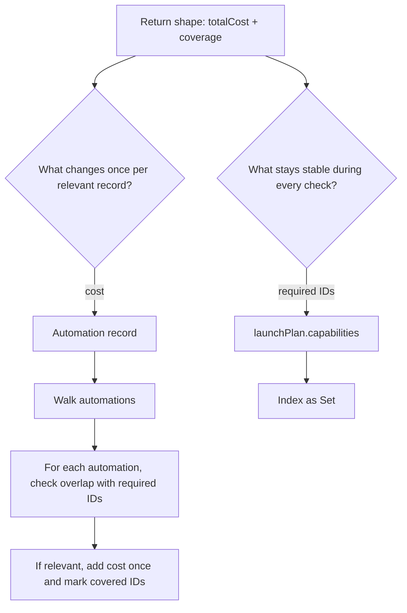
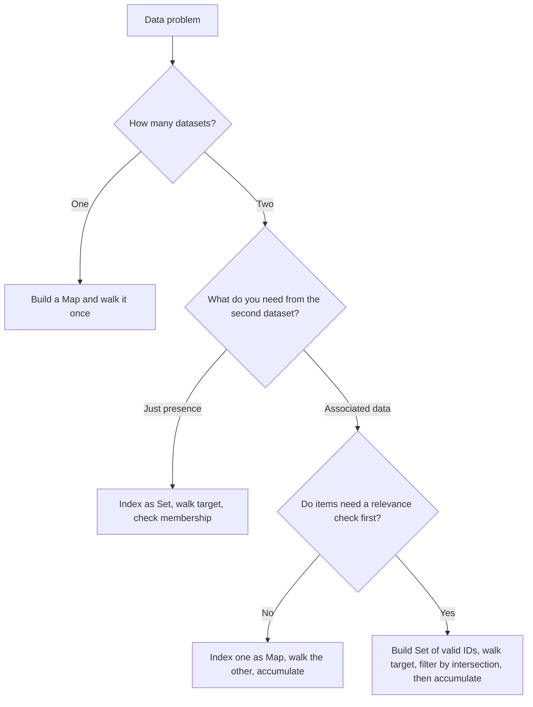

## Overview

Data parsing and cross-reference problems appear constantly in frontend work: transforming API responses, computing derived metrics, joining lookup tables to display data. The bugs these problems produce are usually performance bugs or correctness bugs that stem from the same mistake — iterating over one dataset and scanning the other from scratch on every iteration. This guide builds fluency in three levels: **Flat Lookup**, where you group or count items from a single array using a Map; **Cross-Reference**, where you join two arrays by ID by indexing one and walking the other; and **Filter + Aggregate**, where you first determine which items are relevant across two datasets before accumulating any metrics. Mastering the separation between indexing and iterating is the move that makes data problems tractable.

## Core Concept & Mental Model

### The CI Requirements Gate

When a pull request opens and CI starts, the runner loads the required checks from the pipeline configuration. Then it walks each job result and resolves it against that list. The runner does not re-read the full requirements list for each result that comes in. It builds the index once at the start, then each lookup costs constant time.

That is the exact shape of a well-structured data problem.

- **requirements list** = the source dataset you index into a Set or Map
- **requirements index** = the Set or Map lookup structure itself
- **job results** = the target dataset you walk
- **the gate** = the iteration loop that checks each item
- **the status report** = the accumulated result, whether that is a count, a sum, or a percentage

When you think in these terms, the three-step pattern becomes a process you can follow without guessing.

### The Three-Step Pattern: Index, Walk, Accumulate

Every data problem in this guide follows the same three moves.

**Step 1: Index the source.** Build a Set or Map from the dataset that will be consulted repeatedly. This is the requirements index. You pay O(n) once.

**Step 2: Walk the target.** Iterate over the other dataset. This is the job results list. Each item gets one pass through the gate.

**Step 3: Accumulate the result.** Inside the walk, look up the current item in your indexed structure and update whatever you are tracking. This is the status report. Each lookup costs O(1).

The whole pipeline runs in O(n + m) instead of O(n * m). But the more important gain is conceptual: once you separate the index step from the walk step, the logic for each step becomes much simpler to read and reason about.

### What the Code Shape Looks Like

The three steps map directly to code. Line one builds the index before the loop. Lines two through N are the loop body: look up, check, accumulate.

```ts
function computeRevenue(orders: Order[], products: Product[]): Map<string, number> {
  const productById = new Map(products.map(p => [p.id, p])); // index: built once
  const revenue = new Map<string, number>();
  for (const order of orders) {                              // walk: one pass
    const product = productById.get(order.productId);
    if (product) {
      revenue.set(product.name, (revenue.get(product.name) ?? 0) + order.quantity * product.price);
    }
  }
  return revenue;                                            // accumulate: updated per iteration
}
```

The indexing line lives before the loop. The walk and accumulation live inside it. Those two zones stay separate.

### Why Keeping the Steps Separate Matters

When index, walk, and accumulate collapse into one loop, there is no clear place to add a filter, no clean way to change what you are accumulating, and no obvious boundary for debugging. Keeping them separate gives each step one job. Adding a relevance filter before the accumulation becomes a single guard clause in the walk. Changing the accumulation target is isolated to one block. The gate only has to make one decision per item.

---

## Reading the Problem

The algorithm for data problems is almost always the same three moves: index, walk, accumulate. The hard part is not the algorithm. It is reading the problem carefully enough to know what to index, what to walk, and what counts as a match.

This section works through a complete example from problem statement to code shape using a product launch scenario. The goal is to show the reasoning process, not just the answer.

### The Problem Statement

Read this the way you would see it in a real codebase:

```
/**
 * A launch plan defines which capabilities must be ready before a product release can ship.
 * Your job is to measure how much of that launch plan is covered by the automations the team built.
 *
 * @param launchPlan  An object with a name and a list of required capability IDs.
 *
 * @param automations A list of launch automations. Each automation has a setupCost
 *                    and a list of capability IDs it supports. Some automations may
 *                    reference capabilities that are not part of this launch plan.
 *
 * @returns           An object with two properties:
 *                    - totalCost: the sum of setupCost for automations that support
 *                      at least one required capability
 *                    - coverage: the percentage of required capability IDs covered by
 *                      any relevant automation
 */
function scoreLaunchReadiness(launchPlan, automations)
```

### The Sample Data

```js
const launchPlan = {
  name: 'Spring Launch',
  capabilities: [
    { id: 'cap-search', label: 'Site search is production-ready' },
    { id: 'cap-cache', label: 'Cache warming runs before traffic cutover' },
    { id: 'cap-alerts', label: 'Pager alerts fire on launch regressions' },
    { id: 'cap-rollback', label: 'Rollback can be triggered in one step' },
  ],
};

const automations = [
  { id: 'auto-preview', setupCost: 2, capabilityIds: ['cap-search'] },
  { id: 'auto-observability', setupCost: 4, capabilityIds: ['cap-alerts', 'cap-rollback'] },
  { id: 'auto-experiment', setupCost: 3, capabilityIds: ['cap-abtest'] }, // not part of this launch plan
];
```

### Step 1: Start With the Return Value

Before looking at the inputs, read what the function is supposed to return. Here it returns a single object with `totalCost` and `coverage`.

That tells you immediately what this problem is not, because the return shape is too small for several other problem families.

If this were a grouping problem, the return type would preserve some key space in the output, usually as a `Map` or object keyed by ID, category, or name. You would expect something like `Map<string, number>` or `Record<string, Automation[]>`. But this function returns one final object, not one bucket per key.

If this were a "return one record per match" problem, the output would usually be an array of result objects. You would expect each matching input record to produce its own output entry. But there is no output array here, so the loop is not building a list of per-record answers.

Instead, both return fields are summaries across the whole dataset. `totalCost` collapses many relevant automations into one number. `coverage` collapses many matched capability IDs into one percentage. That is why the problem reads like filter + aggregate, not group + store or transform + emit.

That distinction is what tells you the loop will have accumulation state, not pushes into an output array. You will need a running number and a `Set` of covered IDs.

### Step 2: Find the Lookup Field

Look at both datasets and identify what field connects them. In this problem, the connection is `capabilityId`.

The launch plan stores those IDs inside `launchPlan.capabilities`. Each automation stores related IDs inside `automation.capabilityIds`.

That means there is no joined key to construct. There is one canonical ID space, capability IDs, and both sides reference it directly.

| Capability ID | In launch plan? | Referenced by automation? |
|---|---|---|
| `cap-search` | yes | `auto-preview` |
| `cap-alerts` | yes | `auto-observability` |
| `cap-rollback` | yes | `auto-observability` |
| `cap-abtest` | no | `auto-experiment` |

At this step, stop at the relationship shape. Do not decide the loop direction yet.

What Step 2 tells you is that this is not a one-to-one lookup like "this record has one foreign key, go fetch one matching record." One side, `automations`, stores a nested `capabilityIds` array, which means the eventual loop question will be about overlap: does some set of IDs on one side intersect with the required IDs on the other?

That is enough for Step 2. You have identified the shared ID space and the kind of matching the problem requires. Step 3 is where you decide which side should actually be walked.

### Step 3: Decide Which Side to Index and Which to Walk

This is the decision point that usually feels slippery, so make the mental logic explicit.

Step 2 found the shared field. Step 3 answers a different question: which dataset should the loop visit one record at a time?

Use the return value to choose the unit of work. Ask: which records own the thing I update once per relevant record?



For this problem:

- `totalCost` is charged per relevant automation
- `coverage` is marked by required capability IDs that got covered
- so `automations` is the natural walked side
- `launchPlan.capabilities` is the natural indexed side

That gives the loop a clear job:

```ts
const requiredIds = new Set(launchPlan.capabilities.map((c) => c.id));

for (const automation of automations) {
  const matchedIds = automation.capabilityIds.filter((id) => requiredIds.has(id));
  if (matchedIds.length === 0) continue;

  totalCost += automation.setupCost;
  for (const id of matchedIds) coveredIds.add(id);
}
```

Why not walk `launchPlan.capabilities` instead? Because the cost rule lives on automation records. One automation can cover more than one capability. If you walked capabilities first, you would need extra bookkeeping to avoid charging the same automation multiple times. Walking automations keeps the per-record action aligned with the data.

If you want a compact test, use this:

1. Which dataset provides the rule for relevance?
2. Which dataset contains the records I must evaluate one by one?
3. What exact yes/no question will I ask for each of those records?

For this problem, the answers are:

1. The launch plan provides the rule for relevance.
2. The automations are the records to evaluate one by one.
3. For each automation: does its `capabilityIds` list overlap with the launch plan's required IDs?

```
launchPlan.capabilities  →  build Set of required capability IDs  →  look things up against this
automations              →  for...of loop                         →  one decision per automation
```

This direction also matches the return value. `totalCost` changes per relevant automation, so automations have to be visited individually. `coverage` changes when a required ID from the launch plan gets covered, so the launch plan supplies the reference Set you check against. That is the mental shape: one side defines relevance, the other side gets tested against it.

### Step 4: Enumerate What Can Happen at Each Step

Before writing the loop, sketch every possible outcome for a single automation. There are four in this problem:

**No relevant capability IDs.** `auto-experiment` only references `cap-abtest`, which is not in the launch plan. Skip the automation entirely. It contributes no cost and no coverage.

**One relevant capability ID.** `auto-preview` covers `cap-search`. Add its `setupCost`, then mark `cap-search` as covered.

**Multiple relevant capability IDs.** `auto-observability` covers both `cap-alerts` and `cap-rollback`. Add its cost once, then mark both IDs as covered.

**A capability still missing after the walk.** `cap-cache` never appears in any automation's `capabilityIds`, so it stays uncovered. That matters when you compute the final coverage percentage.

Notice the asymmetry here: cost is tracked per relevant automation, but coverage is tracked per unique required capability ID. Those are different accumulation rules inside the same walk.

### Step 5: See It in the Data

The trace below steps through every automation against the required capability Set built from the sample data.

:::trace-graph
[
  {
    "nodes": [
      {"id": "c1", "label": "search",         "x": 12, "y": 16, "tone": "frontier"},
      {"id": "c2", "label": "cache",          "x": 12, "y": 32, "tone": "frontier"},
      {"id": "c3", "label": "alerts",         "x": 12, "y": 48, "tone": "frontier"},
      {"id": "c4", "label": "rollback",       "x": 12, "y": 64, "tone": "frontier"},
      {"id": "requiredSet", "label": "requiredIds", "x": 42, "y": 40, "tone": "muted"},
      {"id": "a1", "label": "preview [search]", "x": 70, "y": 20, "tone": "muted"},
      {"id": "a2", "label": "observability [alerts, rollback]", "x": 70, "y": 42, "tone": "muted"},
      {"id": "a3", "label": "experiment [abtest]", "x": 70, "y": 64, "tone": "muted"},
      {"id": "result", "label": "cost:0 covered:{}", "x": 92, "y": 42, "tone": "muted"}
    ],
    "edges": [],
    "facts": [
      {"name": "required IDs", "value": "4 capabilities in the launch plan", "tone": "blue"},
      {"name": "walked side",  "value": "each automation holds a nested capabilityIds array", "tone": "blue"},
      {"name": "lookup field", "value": "plain capabilityId, no joined key", "tone": "orange"}
    ],
    "action": "visit",
    "label": "Both datasets speak the same ID language, capability IDs. The launch plan owns the required set, and each automation carries a nested array of IDs to test against it."
  },
  {
    "nodes": [
      {"id": "c1", "label": "search",         "x": 12, "y": 16, "tone": "visited"},
      {"id": "c2", "label": "cache",          "x": 12, "y": 32, "tone": "visited"},
      {"id": "c3", "label": "alerts",         "x": 12, "y": 48, "tone": "visited"},
      {"id": "c4", "label": "rollback",       "x": 12, "y": 64, "tone": "visited"},
      {"id": "requiredSet", "label": "requiredIds", "x": 42, "y": 40, "tone": "current", "badge": "built"},
      {"id": "a1", "label": "preview [search]", "x": 70, "y": 20, "tone": "frontier"},
      {"id": "a2", "label": "observability [alerts, rollback]", "x": 70, "y": 42, "tone": "frontier"},
      {"id": "a3", "label": "experiment [abtest]", "x": 70, "y": 64, "tone": "frontier"},
      {"id": "result", "label": "cost:0 covered:{}", "x": 92, "y": 42, "tone": "muted"}
    ],
    "edges": [
      {"from": "c1", "to": "requiredSet", "tone": "traversed"},
      {"from": "c2", "to": "requiredSet", "tone": "traversed"},
      {"from": "c3", "to": "requiredSet", "tone": "traversed"},
      {"from": "c4", "to": "requiredSet", "tone": "traversed"}
    ],
    "facts": [
      {"name": "step",    "value": "index required capability IDs into a Set", "tone": "blue"},
      {"name": "entries", "value": "search, cache, alerts, rollback", "tone": "blue"},
      {"name": "why Set", "value": "membership check only, no payload lookup needed", "tone": "orange"}
    ],
    "action": "expand",
    "label": "Build the Set once from the launch plan. After that, every ID inside every automation can be checked in O(1)."
  },
  {
    "nodes": [
      {"id": "c1", "label": "search",         "x": 12, "y": 16, "tone": "current"},
      {"id": "c2", "label": "cache",          "x": 12, "y": 32, "tone": "visited"},
      {"id": "c3", "label": "alerts",         "x": 12, "y": 48, "tone": "visited"},
      {"id": "c4", "label": "rollback",       "x": 12, "y": 64, "tone": "visited"},
      {"id": "requiredSet", "label": "requiredIds", "x": 42, "y": 40, "tone": "current"},
      {"id": "a1", "label": "preview [search]", "x": 70, "y": 20, "tone": "current", "badge": "relevant"},
      {"id": "a2", "label": "observability [alerts, rollback]", "x": 70, "y": 42, "tone": "frontier"},
      {"id": "a3", "label": "experiment [abtest]", "x": 70, "y": 64, "tone": "frontier"},
      {"id": "result", "label": "cost:2 covered:{search}", "x": 92, "y": 42, "tone": "current"}
    ],
    "edges": [
      {"from": "a1", "to": "requiredSet", "tone": "active", "label": "search found"},
      {"from": "a1", "to": "result", "tone": "active", "label": "+2 cost"}
    ],
    "facts": [
      {"name": "automation", "value": "auto-preview", "tone": "blue"},
      {"name": "matches",    "value": "[cap-search]", "tone": "blue"},
      {"name": "cost",       "value": "add 2 once", "tone": "orange"},
      {"name": "coverage",   "value": "mark cap-search covered", "tone": "orange"}
    ],
    "action": "visit",
    "label": "auto-preview intersects the required Set once. That makes it relevant, so its setupCost counts and cap-search enters the covered Set."
  },
  {
    "nodes": [
      {"id": "c1", "label": "search",         "x": 12, "y": 16, "tone": "done"},
      {"id": "c2", "label": "cache",          "x": 12, "y": 32, "tone": "visited"},
      {"id": "c3", "label": "alerts",         "x": 12, "y": 48, "tone": "current"},
      {"id": "c4", "label": "rollback",       "x": 12, "y": 64, "tone": "current"},
      {"id": "requiredSet", "label": "requiredIds", "x": 42, "y": 40, "tone": "current"},
      {"id": "a1", "label": "preview [search]", "x": 70, "y": 20, "tone": "done"},
      {"id": "a2", "label": "observability [alerts, rollback]", "x": 70, "y": 42, "tone": "current", "badge": "relevant"},
      {"id": "a3", "label": "experiment [abtest]", "x": 70, "y": 64, "tone": "frontier"},
      {"id": "result", "label": "cost:6 covered:{search,alerts,rollback}", "x": 92, "y": 42, "tone": "current"}
    ],
    "edges": [
      {"from": "a2", "to": "requiredSet", "tone": "active", "label": "alerts + rollback found"},
      {"from": "a2", "to": "result", "tone": "active", "label": "+4 cost"}
    ],
    "facts": [
      {"name": "automation", "value": "auto-observability", "tone": "blue"},
      {"name": "matches",    "value": "[cap-alerts, cap-rollback]", "tone": "blue"},
      {"name": "cost",       "value": "add 4 once, not twice", "tone": "orange"},
      {"name": "coverage",   "value": "mark two IDs covered", "tone": "orange"}
    ],
    "action": "visit",
    "label": "auto-observability matches two required IDs. Its cost is still added once because relevance is per automation, while coverage grows by both matched IDs."
  },
  {
    "nodes": [
      {"id": "c1", "label": "search",         "x": 12, "y": 16, "tone": "done"},
      {"id": "c2", "label": "cache",          "x": 12, "y": 32, "tone": "frontier"},
      {"id": "c3", "label": "alerts",         "x": 12, "y": 48, "tone": "done"},
      {"id": "c4", "label": "rollback",       "x": 12, "y": 64, "tone": "done"},
      {"id": "requiredSet", "label": "requiredIds", "x": 42, "y": 40, "tone": "current"},
      {"id": "a1", "label": "preview [search]", "x": 70, "y": 20, "tone": "done"},
      {"id": "a2", "label": "observability [alerts, rollback]", "x": 70, "y": 42, "tone": "done"},
      {"id": "a3", "label": "experiment [abtest]", "x": 70, "y": 64, "tone": "current", "badge": "irrelevant"},
      {"id": "result", "label": "cost:6 covered:{search,alerts,rollback}", "x": 92, "y": 42, "tone": "muted"}
    ],
    "edges": [
      {"from": "a3", "to": "requiredSet", "tone": "queued", "label": "abtest not found"}
    ],
    "facts": [
      {"name": "automation", "value": "auto-experiment", "tone": "blue"},
      {"name": "matches",    "value": "[]", "tone": "orange"},
      {"name": "cost",       "value": "skip, no relevant capability", "tone": "orange"},
      {"name": "coverage",   "value": "unchanged", "tone": "blue"}
    ],
    "action": "visit",
    "label": "auto-experiment never intersects the required Set. That makes it irrelevant, so it contributes neither cost nor coverage."
  },
  {
    "nodes": [
      {"id": "c1", "label": "search",         "x": 12, "y": 16, "tone": "done"},
      {"id": "c2", "label": "cache",          "x": 12, "y": 32, "tone": "current", "badge": "uncovered"},
      {"id": "c3", "label": "alerts",         "x": 12, "y": 48, "tone": "done"},
      {"id": "c4", "label": "rollback",       "x": 12, "y": 64, "tone": "done"},
      {"id": "requiredSet", "label": "requiredIds", "x": 42, "y": 40, "tone": "done"},
      {"id": "a1", "label": "preview [search]", "x": 70, "y": 20, "tone": "done"},
      {"id": "a2", "label": "observability [alerts, rollback]", "x": 70, "y": 42, "tone": "done"},
      {"id": "a3", "label": "experiment [abtest]", "x": 70, "y": 64, "tone": "done"},
      {"id": "result", "label": "cost:6 coverage:75%", "x": 92, "y": 42, "tone": "done"}
    ],
    "edges": [],
    "facts": [
      {"name": "relevant automations", "value": "2 of 3", "tone": "orange"},
      {"name": "totalCost",            "value": "2 + 4 = 6", "tone": "orange"},
      {"name": "covered IDs",          "value": "search, alerts, rollback = 3 of 4", "tone": "orange"},
      {"name": "missing",              "value": "cap-cache was never covered", "tone": "blue"}
    ],
    "action": "done",
    "label": "Walk complete. Two relevant automations contributed cost. Three of the four required capabilities were covered, so coverage is 75%."
  }
]
:::

### From Trace to Code

The trace maps directly to code shape. Three things you decided before writing the loop:

**Required launch capabilities go in a Set.** You only need membership checks, so a `Set<string>` is the right index. Built once, O(m).

**Automations get walked.** For each automation, inspect its nested `capabilityIds` array and keep only the IDs that exist in the required Set.

**Cost and coverage accumulate differently.** If an automation has no relevant IDs, skip it. Otherwise add its cost once, then add each matched ID into a covered Set. The final percentage comes from `coveredIds.size / launchPlan.capabilities.length`.

The loop has one guard clause for irrelevant automations, one numeric accumulator, and one Set accumulator. That structure was visible in the trace before a single line of code was written. When you can separate "is this record relevant?" from "what do I accumulate if it is?", the implementation becomes a transcription, not a discovery.

## Building Blocks: Progressive Learning

### Level 1: Flat Lookup

When a problem gives you a single array and asks you to group or count by a field, start by reading the return value. It is a `Map` from some key field to an accumulated value. That shape tells you everything about how the loop works: each record contributes to exactly one key, and you update that key's running value on every iteration.

The loop body has three lines: get the current value for this key, compute the new value, write it back. That is the entire pattern.

The one thing to internalize before writing: `Map.get()` returns `undefined` for keys it has never seen. Guard that first encounter with a nullish coalescing default that matches what you are accumulating. `?? 0` for a count, `?? []` when you are collecting an array of records.

```ts
function countByDepartment(employees: Employee[]): Map<string, number> {
  const counts = new Map<string, number>();
  for (const employee of employees) {
    counts.set(employee.department, (counts.get(employee.department) ?? 0) + 1);
  }
  return counts;
}
```

The exercises at this level each give you a problem statement and a dataset. Read the return type, decide what to accumulate per key, and write the loop. The `?? defaultValue` is the only new mechanic.

#### **Exercise 1**

Given a flat list of employees, return a count of how many belong to each department. The return type tells you the key (department name) and the accumulated value (a number). From there, the loop writes itself.

:::stackblitz{file="step1-exercise1-problem.ts" step=1 total=3 solution="step1-exercise1-solution.ts"}

#### **Exercise 2**

Given a flat list of products, return each category mapped to the full list of products in it. The return type changes: the accumulated value is now an array of records instead of a number. The initialization and update change accordingly, but the loop structure stays identical.

:::stackblitz{file="step1-exercise2-problem.ts" step=1 total=3 solution="step1-exercise2-solution.ts"}

#### **Exercise 3**

Given a flat list of products, return each category mapped to the single highest-priced product in it. The update is now conditional: you only replace the stored record when the current one beats it. Read the return type first — `Map<string, Product>` — and let that shape the guard condition.

:::stackblitz{file="step1-exercise3-problem.ts" step=1 total=3 solution="step1-exercise3-solution.ts"}

> **Mental anchor**: "Read the return type first. The key tells you what to group by. The value tells you what to accumulate."

**Bridge to Level 2**: A single-array problem has one source of truth and one pass. When you add a second dataset joined by a shared ID, you need to decide which one drives the output and which one provides the lookup — before the loop starts.

### Level 2: Cross-Reference

When a problem gives you two arrays that share an ID field and asks you to produce output combining data from both, your first question is: which dataset drives the output, and which provides the lookup?

The one that drives the output gets walked. The one you look things up against gets indexed into a Map before the loop starts.

```ts
const productById = new Map(products.map(p => [p.id, p]));
```

That one line is the entire indexing phase. Everything inside the loop is the walk phase. The two phases stay separate — the indexing phase owns the source, the walk phase owns the accumulation. When something is wrong, you know which half to look at.

Inside the walk, each record from the iterated dataset has one field that references an ID in the indexed source. A single `get()` call retrieves the full source record, and from there you accumulate exactly like Level 1.

```ts
function computeRevenue(orders: Order[], products: Product[]): Map<string, number> {
  const productById = new Map(products.map(p => [p.id, p]));
  const revenue = new Map<string, number>();
  for (const order of orders) {
    const product = productById.get(order.productId);
    if (product) {
      revenue.set(product.name, (revenue.get(product.name) ?? 0) + order.quantity * product.price);
    }
  }
  return revenue;
}
```

The exercises at this level each give you two datasets and a return type. Decide which side to index and which to walk. The indexing line comes before the loop. The rest is accumulation.

#### **Exercise 1**

Given a list of orders and a product catalog, return the total revenue per product name. The return type tells you the key (product name, not product ID — you need the catalog to resolve it) and the accumulated value (a number). Which dataset do you index? Which do you walk?

:::stackblitz{file="step2-exercise1-problem.ts" step=2 total=3 solution="step2-exercise1-solution.ts"}

#### **Exercise 2**

Given a list of audit log entries and a user roster, return each log entry enriched with the user's display name. The return type is an array of transformed objects, not a Map — this is a flat transform, not a grouping. You still index one dataset and walk the other, but the accumulation writes to an output array instead of updating a running value.

:::stackblitz{file="step2-exercise2-problem.ts" step=2 total=3 solution="step2-exercise2-solution.ts"}

#### **Exercise 3**

Given a list of posts and a tag catalog, return each post mapped to the display names of its tags. Each post holds an array of tag IDs, so the inner loop iterates a sub-array. The return type specifies no duplicate tag names per post — use a `Set<string>` during the walk and convert at the end. The indexing decision is the same as before; the sub-array and deduplication are the new pieces.

:::stackblitz{file="step2-exercise3-problem.ts" step=2 total=3 solution="step2-exercise3-solution.ts"}

> **Mental anchor**: "Decide which side to index and which to walk before writing the loop. The indexing line lives outside the loop. The walk and accumulation live inside it."

**Bridge to Level 3**: At Level 2, relevance is binary: a lookup either finds a match or does not. Level 3 problems introduce a harder filter — an item is only relevant if its internal list overlaps with the source set. That overlap check has to happen before any accumulation, not interleaved with it.

### Level 3: Filter + Aggregate

Level 3 problems have an item in the walked dataset that carries its own internal list of IDs, and you need to check whether any of those IDs appear in the indexed source before you accumulate anything. The filter and the accumulation are two separate steps, and the order matters: filter first, then accumulate only if the filter passes.

The structure looks like this every time. Build a Set from the source. Walk the target. For each item, compute the intersection of its internal ID list against the Set. If the intersection is empty, skip. If it is not, accumulate.

```ts
const frameworkReqIds = new Set(framework.requirements.map(r => r.id));

let totalCost = 0;
const coveredReqIds = new Set<string>();

for (const control of implementedControls) {
  const relevantReqs = control.requirements.filter(reqId => frameworkReqIds.has(reqId));
  if (relevantReqs.length === 0) continue;

  totalCost += control.cost;
  for (const reqId of relevantReqs) {
    coveredReqIds.add(reqId);
  }
}

const coverage = (coveredReqIds.size / framework.requirements.length) * 100;
```

Two things to notice. First, the guard clause — `if (relevantReqs.length === 0) continue` — sits at the top of the loop body. Everything that follows it only runs for relevant items. Second, `coveredReqIds` is a `Set`, not a counter, because the same requirement ID can appear across multiple controls. The Set deduplicates automatically; you get the correct distinct count from `coveredReqIds.size` after the walk.

The exercises at this level each give you a problem statement with an intersection-based relevance condition. Before writing the loop, identify: what is the Set built from? What is the intersection filter? What are the accumulators?

#### **Exercise 1**

Given a compliance framework and a list of implemented controls, return the total cost of relevant controls and the percentage of framework requirements they cover. A control is relevant only if at least one of its requirement IDs belongs to this framework. Work through the sample data by hand first: mark each control as relevant or not, sum the relevant costs, list the distinct covered IDs. The code should match that manual pass exactly.

:::stackblitz{file="step3-exercise1-problem.ts" step=3 total=3 solution="step3-exercise1-solution.ts"}

#### **Exercise 2**

Given a list of feature flags and a list of required checks, return the total weight of flags that satisfy at least one required check, and what percentage of required checks are covered. The problem shape is the same as Exercise 1 — Set of required IDs, walk flags, filter by intersection, accumulate weight and coverage. The domain is different, which is the point: once you can identify the intersection-first structure, domain details stop mattering.

:::stackblitz{file="step3-exercise2-problem.ts" step=3 total=3 solution="step3-exercise2-solution.ts"}

#### **Exercise 3**

Given multiple frameworks and a shared pool of controls, return the cost and coverage for each framework independently. The per-framework logic is the same as Exercise 1, but it now runs inside an outer loop. Each iteration of the outer loop builds its own Set, runs its own walk, and writes its own accumulators. A control relevant to one framework must not affect another's totals. The structural question is: what state resets per framework, and what persists across the outer loop?

:::stackblitz{file="step3-exercise3-problem.ts" step=3 total=3 solution="step3-exercise3-solution.ts"}

> **Mental anchor**: "Filter first, then accumulate. The guard clause at the top of the loop is a correctness boundary — nothing below it runs for an irrelevant item."

## Key Patterns

### Pattern 1: Set for Membership Testing

**When to use:** use a Set when the only question is "is this ID present in the other dataset?" You do not need to retrieve any data from the source — only confirm presence.

**What it costs:** O(n) to build, O(1) per lookup. A Set stores no associated values, so it only applies when presence is the entire answer. If you need to retrieve a field from the matched record, you need a Map instead.

**How to think about it:** the source dataset in this case contributes nothing to the output except a yes/no answer. Build the Set from it before the loop, then call `.has()` per iteration. Nothing else is needed.

**Complexity:** O(n) to build, O(1) per lookup, O(1) space overhead per entry.

```ts
const implementedIds = new Set(implementedControls.map(c => c.id));

for (const req of framework.requirements) {
  if (implementedIds.has(req.id)) {
    coveredCount++;
  }
}
```

### Pattern 2: Map for Keyed Aggregation

**When to use:** use a Map when you need to accumulate a value per key across the walk. Revenue per product, count per department, total hours per user — all keyed aggregations follow this shape.

**What it costs:** O(n) to build the index, O(1) per read or write inside the loop. The cost you accept is the upfront build pass. The benefit is that every subsequent operation in the walk is constant time.

**How to think about it:** the output Map and the lookup Map are two separate structures with two separate jobs. Build the lookup Map before the loop. Build the output Map during the loop. Keep them distinct or the purpose of each becomes unclear.

**Complexity:** O(n) to build the index, O(m) to walk the target, O(n + m) total. Accumulation at each step is O(1).

```ts
// Index products by ID (build manifest)
const productById = new Map(products.map(p => [p.id, p]));

// Accumulate revenue per product name (build tally)
const revenue = new Map<string, number>();
for (const order of orders) {
  const product = productById.get(order.productId);
  if (product) {
    revenue.set(product.name, (revenue.get(product.name) ?? 0) + order.quantity * product.price);
  }
}
```

### Pattern 3: Intersection-First Filtering

**When to use:** use this pattern when an item in the target dataset is only relevant if some part of it matches the source dataset, and you need to validate relevance before accumulating. This is the filter step that must come before the accumulate step, not mixed into it.

**What it costs:** building the intersection set costs O(n). The relevance check per item costs O(1). Accumulation per relevant item costs O(1). The discipline cost is keeping the filter condition separate from the accumulation logic, which requires slightly more deliberate structuring.

**What it prevents:** when filter and accumulate collapse into one expression, it becomes easy to count the wrong items, accumulate against the wrong key, or miss the case where an item is partially relevant. Separating the steps means each one has one job and one place to be wrong.

**How to think about it:** not every item in the target needs to reach the accumulation step. The gate first checks whether the item's internal list intersects with the requirements index. If there is no intersection, the gate skips it without tallying anything. Only items with a relevant intersection reach the accumulation step.

**Complexity:** O(n) to build the source index, O(m * k) to check intersection where k is the number of sub-items per target item, O(1) per accumulation. For most real data, k is small and bounded.

```ts
// Build the Set of framework requirement IDs (the manifest)
const frameworkReqIds = new Set(framework.requirements.map(r => r.id));

let totalCost = 0;
const coveredReqIds = new Set<string>();

for (const control of implementedControls) {
  // Intersection-first: is any requirement in this control covered by the framework?
  const relevantReqs = control.requirements.filter(reqId => frameworkReqIds.has(reqId));
  if (relevantReqs.length === 0) continue; // not relevant, skip before accumulating

  totalCost += control.cost;
  for (const reqId of relevantReqs) {
    coveredReqIds.add(reqId);
  }
}

const coverage = (coveredReqIds.size / framework.requirements.length) * 100;
```

---

## Decision Framework



| Situation | Structure to build | What lives before the loop | What lives inside the loop |
|---|---|---|---|
| Group or count items from one array | Output Map keyed by group field | Nothing — the output Map starts empty | Read, update, write back per record |
| Two arrays joined by a shared ID | Lookup Map from source array | `new Map(source.map(item => [item.id, item]))` | `lookupMap.get(foreignId)` then accumulate |
| Two arrays where one side has a relevance filter | Set from source IDs | `new Set(source.map(item => item.id))` | Intersection check, guard clause, then accumulate |
| Check presence only, no data retrieval needed | Set from source IDs | `new Set(source.map(item => item.id))` | `set.has(id)` — no record needed |

### When NOT to use

Do not reach for a Map or Set just because the data happens to have IDs. If you only need one item from one array (a simple find), a linear scan is fine and the upfront indexing pass is wasted work. Do not pre-build a Map inside a loop, that recreates the structure on every iteration and erases the performance benefit. Do not store render-visible values in a local Map and then derive state from it without going through React state, because that hides the source of truth from the component.

## Common Gotchas & Edge Cases

**Gotcha 1: Building the index Map inside the loop instead of before it**

Why it happens: in multi-pass or multi-framework problems it is easy to construct the lookup structure inside the outer loop body, treating it as setup for each iteration. Each rebuild throws away the previous structure and recreates it from scratch.

Fix: anything derived from a dataset that does not change per iteration belongs before the loop. Ask yourself: does this structure need to be rebuilt every time through, or does it only need to be built once? If once, move it above the loop.

**Gotcha 2: Forgetting `?? 0` or `?? []` when initializing a Map entry for the first time**

Why it is tempting: the code `map.set(key, map.get(key) + 1)` looks correct until the first time `key` has never been set. `map.get(key)` returns `undefined`, and `undefined + 1` evaluates to `NaN` in JavaScript without a TypeScript error in loose configurations.

Fix: always guard the first read with a nullish coalescing default that matches what you are accumulating: `(map.get(key) ?? 0) + 1` for counts, `(map.get(key) ?? [])` for arrays. TypeScript in strict mode will usually surface the type mismatch, but the explicit default also documents the intended initial state clearly.

**Gotcha 3: Accumulating before checking intersection relevance**

Why it is tempting: it feels efficient to combine the intersection check and the accumulation into one step, a single loop body with a conditional deep inside. The code appears shorter and the result is sometimes correct for basic cases.

Fix: place the relevance check as a guard clause at the top of the loop body and `continue` immediately if the item is not relevant. All accumulation statements must appear after the guard. This structure makes it visually obvious that an irrelevant item never touches the accumulators, which is both easier to audit and easier to extend when requirements change.

**Gotcha 4: Using a counter instead of a Set to track unique coverage**

Why it is tempting: if you think of coverage as "how many requirements did I satisfy," it is natural to write `coveredCount++` inside the inner loop each time a matching requirement is found. This overcounts when a single requirement is covered by two different controls.

Fix: accumulate covered requirement IDs into a `Set<string>`, not a number. The Set discards duplicates automatically. After the walk, `coveredSet.size` gives the correct count of distinct covered IDs. The percentage is then `(coveredSet.size / total) * 100`.

**Gotcha 5: Building the index Map inside the outer loop instead of before it**

Why it is tempting: in multi-framework or multi-pass problems, it is easy to move the source index construction into the outer loop body alongside the per-framework Set. Each inner rebuild costs O(m) and partially erases the savings from the Map lookup strategy.

Fix: separate what belongs to the outer loop from what belongs to the inner loop. Any structure derived from the full controls or users array that does not change per-framework iteration should be built once before the outer loop begins. Only per-iteration Sets and accumulators belong inside the outer loop body.
