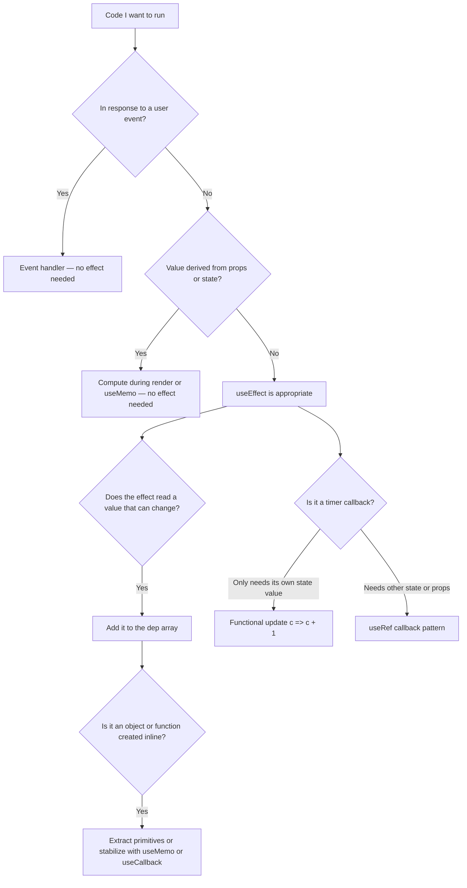

## Overview

`useEffect` runs code after React finishes rendering. The dep array tells React when to re-run that code. Timers inside effects create a separate class of bug because `setInterval` captures values at the time it was created and never sees updates, even when state has changed.

Three things come up repeatedly in React interviews:

**The dep array** — what belongs in it, what happens when something is missing, and what happens when a value is unstable.

**When not to use useEffect** — React's own docs are explicit: don't use effects for derived state, event responses, or data that can be computed during render.

**Stale closure in timers** — `setInterval` and `setTimeout` capture the values present at setup time. Any state or prop that changes afterward is invisible to the callback.

**Level 1** covers how the dep array controls when effects re-run and the most common case where `useEffect` is the wrong tool.

**Level 2** covers the dep array gotchas that produce bugs: missing deps, unstable object deps, and the infinite-loop pattern.

**Level 3** covers timers: the stale closure, the two fixes (functional update and `useRef`), and how to build a reusable `useInterval` hook.

## Core Concept & Mental Model

### How useEffect Runs

`useEffect` takes two arguments: a function that runs the side effect, and a dependency array that controls when it re-runs.

Three variants matter:

```tsx
useEffect(() => { /* ... */ });            // no array: runs after every render
useEffect(() => { /* ... */ }, []);        // empty array: runs once after mount
useEffect(() => { /* ... */ }, [count]);   // array: runs when count changes
```

React compares each dep with its previous value using `Object.is`. If any dep changed, the effect re-runs. If none changed, it is skipped.

### The Dep Array Rules

The dep array is a correctness tool, not a performance tool. Every value used inside the effect that can change between renders belongs in the dep array. Missing a value means the effect runs with a stale version of it.

Three patterns that break in interviews:

**Missing dep.** The effect uses `userId` but does not list it. React runs the effect once and skips it on every subsequent render. Inside the effect, `userId` is always the value from the first render.

**Unstable dep.** An object or function is created inline in the component body. Each render produces a new reference. React sees a different dep on every render and re-runs the effect, including after state updates the effect triggered, which causes an infinite loop.

**Derived state via effect.** Using an effect to compute a value from props or state and storing it in a separate state variable. This causes a double-render for every parent update and is always the wrong pattern.

### When NOT to Use useEffect

The most common interview signal is knowing when to reach for `useEffect` and when not to:

- If a value can be computed during render from props or state, compute it during render. No effect needed.
- If code runs in response to a user event, put it in the event handler. No effect needed.
- If code must run after the DOM updates or syncs with an external system, that is a genuine effect.

### The Timer Stale Closure

`setInterval` creates a callback at setup time. That callback closes over every variable it references. If those variables change after setup, the callback sees the old values.

```tsx
const [count, setCount] = useState(0);

useEffect(() => {
  const id = setInterval(() => {
    setCount(count + 1); // count is always 0 here — never updates
  }, 1000);
  return () => clearInterval(id);
}, []);
```

The empty dep array means the effect runs once. The callback closes over `count = 0` at that moment. Two fixes exist:

**Functional update** — when the callback only needs the current value of the state it is updating:

```tsx
setCount(c => c + 1);
```

React passes the current value as an argument at call time. No closure over `count` needed.

**`useRef` pointer** — when the callback needs to read other state or props:

```tsx
const callbackRef = useRef(callback);
useEffect(() => { callbackRef.current = callback; }); // syncs after every render

useEffect(() => {
  const id = setInterval(() => callbackRef.current(), delay);
  return () => clearInterval(id);
}, [delay]);
```

`callbackRef.current` is a mutable pointer. The second effect updates it after every render. The interval always calls the latest version of the callback without restarting.

---

## Building Blocks: Progressive Learning

### Level 1: The Dep Array and When Not to Use Effects

The dep array controls exactly when an effect re-runs. Three variants produce three behaviors: run every render (no array), run once (empty array), run when a specific value changes (listed deps). The first exercise builds that intuition. The second and third cover the most common case where `useEffect` is the wrong tool entirely.

#### **Exercise 1**

A hook tracks how many times an effect has run and exposes that count via a ref. The test mounts the hook, triggers a re-render via unrelated state, and checks whether the effect ran again. Pick the dep array that makes it run exactly once.

How to think about it:

1. The effect calls `runCount.current++`. Should this run once or on every render?
2. No dep array means "run after every render." An empty array means "run once." A list of deps means "run when those specific values change."
3. Match the dep array to the test expectation: `runCount` should still be 1 after a re-render that changes unrelated state.

:::stackblitz{file="step1-exercise1-problem.tsx" step=1 total=3 solution="step1-exercise1-solution.tsx"}

#### **Exercise 2**

A hook receives a list of items and a search string, then uses `useEffect` to compute a filtered list and stores it in state. The result renders correctly but every prop change causes two renders instead of one. Fix it by removing the effect entirely and computing the filtered list during render.

How to think about it:

1. The effect reads `items` and `query`, filters them, and calls `setFiltered`. That is derived state inside an effect — the classic anti-pattern.
2. Every time `items` or `query` changes, the effect runs, then `setFiltered` triggers another render. Two renders per change.
3. Move the filter computation directly into the hook body. No effect, no state, one render per change.

:::stackblitz{file="step1-exercise2-problem.tsx" step=1 total=3 solution="step1-exercise2-solution.tsx"}

#### **Exercise 3**

A hook handles a form save: when the user calls `handleSave`, it sets a `submitted` state flag, which an effect watches to call `onSave`. Fix it by moving the `onSave` call directly into `handleSave` and removing the flag and the effect.

How to think about it:

1. An effect that fires in response to a state flag set by a user action is always a candidate for replacement with an event handler.
2. Count the renders: the click sets `submitted`, React re-renders, then the effect runs. One extra render and a state variable that exists only to trigger the effect.
3. Call `onSave(data)` directly in `handleSave`. No state flag, no effect, no extra render.

:::stackblitz{file="step1-exercise3-problem.tsx" step=1 total=3 solution="step1-exercise3-solution.tsx"}

> **Mental anchor**: Effects are for synchronizing with something outside React — a DOM API, a timer, an external system. When the work can happen during render or in a user event handler, adding an effect only creates extra renders and extra state for no gain.

**Bridge to Level 2**: The dep array controls when effects re-run. When a dep is missing, the effect runs with stale data. When a dep is unstable, the effect runs too often. Level 2 shows both failure modes.

### Level 2: Dep Array Gotchas

Every dep array bug produces one of two visible symptoms: the effect runs with stale data (missing dep) or the effect runs too many times (unstable dep, or writing to a value that is also listed as a dep). Recognizing which symptom you are looking at tells you which fix to apply.

#### **Exercise 1**

A hook fetches user data when `userId` changes. The dep array is empty, so after `userId` changes, the hook keeps showing the old user's data. Add the missing dep and verify that the hook re-fetches when `userId` changes.

How to think about it:

1. The effect reads `userId` inside the fetch call. Is `userId` listed in the dep array? If not, the effect is frozen on the value from the first render.
2. Adding `userId` to the dep array tells React to re-run the effect whenever it changes.
3. The test changes `userId` and checks that the displayed name updates. Without the fix, it stays stale.

:::stackblitz{file="step2-exercise1-problem.tsx" step=2 total=3 solution="step2-exercise1-solution.tsx"}

#### **Exercise 2**

A hook accepts an `options` object `{ prefix: string; caseSensitive: boolean }` and lists the whole object as a dep. The effect re-runs on every render even when the values have not changed. Fix it by extracting the primitive fields as separate deps.

How to think about it:

1. `Object.is({ prefix: 'a' }, { prefix: 'a' })` is `false`. Two object literals are always different references even when their contents are identical.
2. Every render creates a new object. React sees a changed dep and re-runs the effect.
3. List `options.prefix` and `options.caseSensitive` as separate deps. Primitives compare by value.

:::stackblitz{file="step2-exercise2-problem.tsx" step=2 total=3 solution="step2-exercise2-solution.tsx"}

#### **Exercise 3**

A hook maintains a `tags` array in state and an effect that transforms it into `processed` state. Both `tags` and `processed` are listed as deps. Every update cycles back into another run. Remove `processed` from the dep array and explain why the effect does not need it.

How to think about it:

1. Ask of each dep: does the effect *read* this value, or only *write* to it? Writing to a value is not a dependency on it.
2. `setProcessed` is stable. Setter references do not change between renders and do not belong in the dep array.
3. Remove `processed`. The effect reads `tags` and writes `processed`. Only `tags` is a real dependency.

:::stackblitz{file="step2-exercise3-problem.tsx" step=2 total=3 solution="step2-exercise3-solution.tsx"}

> **Mental anchor**: Dep array bugs show up as one of two symptoms — the effect ran with the wrong data, or it ran more times than it should have. These exercises teach you to read the effect body to identify which one is happening and trace it back to the dep array as the cause.

**Bridge to Level 3**: Dep array mistakes produce stale reads or unnecessary reruns in regular effects. Timers amplify both. A stale closure inside `setInterval` runs repeatedly and can never self-correct. Level 3 covers the two fixes.

### Level 3: Timers and the Stale Closure

`setInterval` callbacks are created once at setup time. Any state or props they reference are frozen at that snapshot. The callback runs repeatedly but never sees changes. There are exactly two fixes: functional update (when the callback only needs the current value it is updating) and `useRef` (when the callback needs any other value that changes).

#### **Exercise 1**

A hook runs a counter using `setInterval`. After 3 ticks the count should be 3. Instead, it is always 1. Predict why, then fix the callback using a functional update.

How to think about it:

1. The callback calls `setCount(count + 1)`. What is `count` inside the callback? It is the value from the first render, when the interval was created. It never updates.
2. `setCount(count + 1)` always evaluates to `setCount(0 + 1)`, which sets count to 1. The next tick sees `count = 0` again.
3. Replace with `setCount(c => c + 1)`. React provides the current value as `c` at call time. No closure over `count` needed.

:::stackblitz{file="step3-exercise1-problem.tsx" step=3 total=3 solution="step3-exercise1-solution.tsx"}

#### **Exercise 2**

A hook runs a polling interval that calls an `onTick` callback prop every 500ms. When the parent replaces `onTick` with a new function, the interval keeps calling the old one. Fix it using `useRef` to hold a pointer to the latest `onTick` without restarting the interval.

How to think about it:

1. The interval was set up with `() => onTick()`. `onTick` was captured at setup. When the prop changes, the interval still holds the original reference.
2. Adding `onTick` to the interval dep array would restart the interval every time the parent re-renders with a new function reference.
3. Store `onTick` in a ref. Update the ref after every render with a separate effect (no dep array). The interval calls `callbackRef.current()` — always current, no restart.

:::stackblitz{file="step3-exercise2-problem.tsx" step=3 total=3 solution="step3-exercise2-solution.tsx"}

#### **Exercise 3**

Build `useInterval(callback, delayMs)` — the complete reusable hook that combines both patterns. The interval restarts only when `delayMs` changes. The callback always reflects the latest version passed by the caller, without causing a restart.

This hook appears in the React docs and is a direct senior-interview question. Implement it from scratch.

:::stackblitz{file="step3-exercise3-problem.tsx" step=3 total=3 solution="step3-exercise3-solution.tsx"}

> **Mental anchor**: Timers live outside React's render cycle. `setInterval` creates a callback once and runs it repeatedly, but that callback never learns about state or props that changed after it was created. Every exercise at this level is a variation of that one fact.

## Key Patterns

### Pattern 1: Dep Array Values Match What the Effect Uses

Every value from the component scope that the effect reads must appear in the dep array. Missing a value means the effect is frozen on that value from the render when it last ran.

```tsx
// Missing dep: userId is used but not listed
useEffect(() => {
  fetchUser(userId).then(setUser);
}, []); // stale on every userId change

// Correct
useEffect(() => {
  fetchUser(userId).then(setUser);
}, [userId]);
```

### Pattern 2: Extract Primitives from Object Deps

When a dep is derived from an object created inline, extract the specific primitive values the effect actually needs. Primitives compare by value. Objects compare by reference.

```tsx
// Every render creates a new options object — effect re-runs every render
useEffect(() => {
  search(query, options);
}, [query, options]);

// Extract the specific fields
useEffect(() => {
  search(query, { prefix, caseSensitive });
}, [query, prefix, caseSensitive]);
```

### Pattern 3: Functional Update Removes the State Dep

When a timer callback only needs to increment or transform the state value it is updating, the functional update form eliminates the closure over that value entirely.

```tsx
useEffect(() => {
  const id = setInterval(() => setCount(c => c + 1), 1000);
  return () => clearInterval(id);
}, []);
```

### Pattern 4: useRef for Callbacks That Read Changing Values

When a timer callback needs to read any value that changes between renders, use a ref to hold the latest callback. The ref is mutable, so the interval does not restart when the callback changes.

```tsx
function useInterval(callback: () => void, delay: number) {
  const savedCb = useRef(callback);
  useEffect(() => { savedCb.current = callback; });
  useEffect(() => {
    const id = setInterval(() => savedCb.current(), delay);
    return () => clearInterval(id);
  }, [delay]);
}
```

---

## Decision Framework



| Situation | Correct approach | Common interview mistake |
|---|---|---|
| Derived value from props | Compute during render | useEffect plus useState sync, double render |
| Fetch on ID change | `useEffect` with `[id]` | Empty dep array, stale on every change |
| Object or function in dep array | Extract primitive fields | Infinite loop or needless reruns |
| setInterval counter | Functional update `c => c + 1` | Stale closure, count stuck at 1 |
| Interval that reads a prop | useRef callback pattern | Listing prop as dep, interval restarts every render |

## Common Gotchas & Edge Cases

**Gotcha 1: Treating the dep array as a performance optimization**

The dep array is a correctness signal. React documentation says to list every value the effect reads. Intentionally omitting a dep to "prevent too many re-runs" produces stale reads. The real fix is either to compute the value outside the effect or to stabilize the reference before listing it.

**Gotcha 2: Listing `someObject` when only `someObject.id` is needed**

If the effect only reads `user.id`, listing `user` as a dep means any change to any field on `user` re-runs the effect, even when `id` did not change. List the specific fields the effect actually uses.

**Gotcha 3: Adding count to setInterval deps instead of using functional update**

When `count` is missing from the dep array, the callback is stale. The tempting fix is to add `count` to the dep array. This re-creates the interval on every state change, which resets the timer on every tick. The correct fix is the functional update form.

**Gotcha 4: Reaching for useEffect to handle an event response**

A common pattern in older codebases: a click handler sets a flag in state, and an effect watches that flag and performs work. This adds a state variable whose only job is to trigger an effect, and it causes an extra render on every interaction. Move the logic into the click handler directly.

**Gotcha 5: Using the same effect for multiple unrelated concerns**

Combining two unrelated side effects into one effect couples their dep arrays and makes each concern harder to reason about. Two separate effects with separate dep arrays make each concern independent and easier to change.
</parameter>
</invoke>