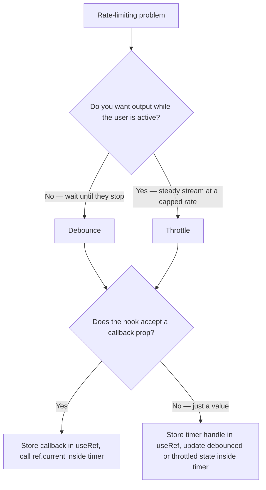

## Overview

Timing bugs in React share a root cause: a callback created inside `useEffect` closes over the state values it sees at creation time, not the values at invocation time. By the time the interval or timeout fires, those values may be stale.

**The stale closure problem:** `setInterval` and `setTimeout` hold a frozen snapshot of every value they reference. State that changes after the interval starts is invisible to it.

**The debounce pattern:** delays a callback until the caller has been quiet for a fixed period. Every new input resets the timer. Only the last call in a burst reaches the function.

**The throttle pattern:** limits how often a callback can fire. Once it fires, it ignores all subsequent calls until the cooldown expires.

**Level 1** teaches how to reproduce the stale closure, fix it with a functional updater when that is enough, and escape it with `useRef` when the callback needs to read the current value.

**Level 2** teaches debounce: building it as a plain function first, then lifting it into a hook that returns a debounced value, and finally a hook that returns a debounced callback using `useRef` to avoid re-introducing the stale closure.

**Level 3** teaches throttle: the same three-exercise arc, showing how throttle differs from debounce by firing immediately and then enforcing a cooldown.

## Core Concept & Mental Model

The Level 1 exercises share a single problem: closures capture the world as it is at the moment they are created.

### The Frozen Snapshot

When `setInterval` registers its callback, JavaScript freezes a reference to every variable the callback uses. That reference points to the variable's binding slot at creation time. It does not track future reassignments.

```ts
function useStaleExample() {
  const [count, setCount] = useState(0);

  useEffect(() => {
    const id = setInterval(() => {
      console.log(count); // always logs 0 — the value from the first render
    }, 1000);
    return () => clearInterval(id);
  }, []);

  return { count, increment: () => setCount(c => c + 1) };
}
```

React updates `count` on each re-render, but the interval callback was created during the first render. It still holds a reference to the binding slot from that render, which always reads `0`. The interval lives outside the render cycle, so it never receives the updated snapshot.

The callback took a photograph of the surrounding variables at the moment it was created. From that point on, it only ever sees what was in that photograph.

### The useRef Escape Hatch

`useRef` gives the callback a window instead of a photograph. The ref object itself never changes — it is the same box every render. Only the value inside (`ref.current`) updates.

The pattern is two lines alongside the effect:

```ts
const callbackRef = useRef(callback);
callbackRef.current = callback; // updated on every render
```

Then the interval calls `callbackRef.current()` instead of calling `callback` directly. The interval holds a stable reference to the box. Every render writes the latest callback into the box. The interval always reads whatever is currently in it.

```ts
function useInterval(callback: () => void, delay: number) {
  const callbackRef = useRef(callback);
  callbackRef.current = callback;

  useEffect(() => {
    const id = setInterval(() => {
      callbackRef.current(); // always calls the latest callback
    }, delay);
    return () => clearInterval(id);
  }, [delay]);
}
```

The effect only needs `delay` in its dependency array because `callbackRef` is a stable ref, not a value.

### When the Functional Updater Is Enough

The `useRef` pattern is necessary when the callback needs to READ current state or props. When the callback only needs to UPDATE state, the functional updater form handles it without a ref:

```ts
setCount(prev => prev + 1); // reads latest state internally — no stale closure
```

React provides the current value as the argument to the updater. The closure never needs to reference `count` directly. This only works for the specific piece of state being updated. If the callback reads any other value — a different state variable, a prop, a derived value — the ref pattern is the right fix.

### Debounce vs. Throttle

Both patterns reduce the number of times a callback fires. They are never interchangeable because they solve different problems.

**Debounce** answers the question: "Did the user stop?" It delays the callback until the input has been quiet for `delay` ms. Every new call resets the timer. A burst of calls produces exactly one invocation — the one that follows the last moment of silence.

Use debounce when you want the final state after a flurry of activity: a search input after typing pauses, form validation after the user stops editing, a resize handler after the window stops moving.

**Throttle** answers the question: "How many times per second is reasonable?" It fires immediately, then ignores all subsequent calls for `limit` ms. A burst of calls produces one invocation per `limit` window, not one invocation per burst.

Use throttle when you need continuous feedback at a controlled rate: a scroll position tracker, a mouse-move handler, an animation frame budget enforcer.

```
Debounce: burst → [reset] → [reset] → [reset] → fires once, after silence
Throttle: burst → fires → [locked] → [locked] → fires → [locked]
```

The clearest way to tell them apart: debounce never fires while the user is actively providing input. Throttle fires at the start and then limits how frequently it fires after that.

---

## Building Blocks: Progressive Learning

### Level 1: The Stale Closure and How to Escape It

The stale closure is not a React quirk — it is how closures work in JavaScript. React makes it easy to trigger because state updates cause re-renders, but existing intervals were created during an earlier render and never receive the update.

This level has three exercises. The first asks you to reproduce the bug and observe it clearly before fixing anything. The second shows when the functional updater is the right fix. The third introduces `useRef` for the cases where the functional updater is not enough.

#### **Exercise 1**

Read `useTickSnapshot`. The interval increments `count` correctly using the functional updater, then reads `count` directly into `snapshot` — that second line is the stale read. Before running the test, predict: after 3 ticks, what value will `snapshot` hold? The interval took a photograph of `count` when it was created. Run the test and confirm your prediction.

Do not fix anything. Observing the symptom is the exercise.

:::stackblitz{file="step1-exercise1-problem.ts" step=1 total=3 solution="step1-exercise1-solution.ts"}

#### **Exercise 2**

Fix a `useIncrementor` hook where `setCount(count + 1)` has been written with a direct reference to `count`. Because the interval closes over the initial value, this always evaluates to `0 + 1 = 1` — the counter never goes above 1. Switch to the functional updater form `setCount(prev => prev + 1)` so each increment reads from React's current state, not the frozen snapshot.

:::stackblitz{file="step1-exercise2-problem.ts" step=1 total=3 solution="step1-exercise2-solution.ts"}

#### **Exercise 3**

Complete `useInterval` by adding the one line that keeps `callbackRef.current` in sync with the latest `callback` on every render. The ref is already created and the interval already calls `callbackRef.current()` — the missing piece is the update that turns the photograph into a window. The functional updater from Exercise 2 cannot help here: when a prop changes, there is no state update path to ride. Only the ref gives the interval a live view of the current callback.

:::stackblitz{file="step1-exercise3-problem.ts" step=1 total=3 solution="step1-exercise3-solution.ts"}

> **Mental anchor**: "The interval took a photograph. useRef gives it a window."

**Bridge to Level 2**: Now that you can write an interval that always reads current values, the next problem is rate-limiting. Debounce delays until the caller goes quiet.

### Level 2: Debounce — Delay Until Quiet

Debounce works by scheduling a delayed invocation and canceling it every time a new call arrives before the delay expires. Only the call that is not canceled makes it through.

The timer handle lives in a ref when debounce is inside a hook. Storing it in state would cause a re-render on every call, which is unnecessary. Storing it in a plain local variable would lose it across renders. A ref is the right home: stable across renders, mutable without causing re-renders.

#### **Exercise 1**

Build a plain `debounce(fn, delay)` function. It returns a function that, when called, cancels any pending invocation and schedules a new one to fire after `delay` ms. The underlying `fn` is only called once, after the burst of rapid calls has ended.

:::stackblitz{file="step2-exercise1-problem.ts" step=2 total=3 solution="step2-exercise1-solution.ts"}

#### **Exercise 2**

Build a `useDebounce<T>(value: T, delay: number): T` hook. It accepts a raw value and returns the debounced version — the value does not update until `delay` ms after the last change. This is the hook shape used to debounce a search query: the input's `onChange` updates raw state immediately, but the debounced value only changes after the user pauses.

:::stackblitz{file="step2-exercise2-problem.ts" step=2 total=3 solution="step2-exercise2-solution.ts"}

#### **Exercise 3**

Build a `useDebouncedCallback(fn, delay)` hook. It returns a stable function that debounces calls to `fn`. Use `useRef` to hold the latest `fn` reference so the returned function never needs to change, and to hold the pending timer handle. The returned callback must be stable across renders — calling it should not re-create the debounce wrapper on every parent render.

:::stackblitz{file="step2-exercise3-problem.ts" step=2 total=3 solution="step2-exercise3-solution.ts"}

> **Mental anchor**: "Debounce cancels the pending call every time a new one arrives. Only silence lets it through."

**Bridge to Level 3**: Debounce fires once after a burst ends. Throttle fires immediately and then enforces a cooldown. The timer handle is still a ref, but what you store and check changes.

### Level 3: Throttle — Limit the Rate

Throttle works by recording the timestamp of the last successful call. Subsequent calls check how much time has passed. If less than `limit` ms has elapsed, they are ignored. If the limit has passed, the call goes through and the timestamp updates.

The timestamp lives in a ref for the same reason the timer handle did in Level 2: it needs to persist across renders without triggering them.

#### **Exercise 1**

Build a plain `throttle(fn, limit)` function. It returns a function that invokes `fn` immediately on the first call, then ignores subsequent calls until `limit` ms have elapsed since the last invocation. After the cooldown, the next call goes through.

:::stackblitz{file="step3-exercise1-problem.ts" step=3 total=3 solution="step3-exercise1-solution.ts"}

#### **Exercise 2**

Build a `useThrottle<T>(value: T, limit: number): T` hook. It accepts a raw value and returns the throttled version — the value can update at most once per `limit` ms. This is the hook shape used for scroll position or window size: the raw value changes continuously, but the hook only propagates a new value when the cooldown has passed.

:::stackblitz{file="step3-exercise2-problem.ts" step=3 total=3 solution="step3-exercise2-solution.ts"}

#### **Exercise 3**

Build a `useThrottledCallback(fn, limit)` hook. It returns a stable function that throttles calls to `fn`. Use `useRef` to hold the latest `fn` reference and the last-invocation timestamp. The returned callback must be stable across renders — it should not change when `fn` changes between renders.

:::stackblitz{file="step3-exercise3-problem.ts" step=3 total=3 solution="step3-exercise3-solution.ts"}

> **Mental anchor**: "Throttle fires immediately, records the time, and ignores everything until the cooldown expires."

## Key Patterns

### Store the Callback in a Ref, Not the Dependency Array

**When to use it:** any hook that accepts a callback and passes it to a timer or subscription. Adding the callback to the `useEffect` dependency array causes the resource to tear down and restart on every render if the caller does not memoize.

**What it prevents:** stale callback reads without the cost of constant teardown and re-creation.

```ts
const callbackRef = useRef(callback);
callbackRef.current = callback;

useEffect(() => {
  const id = setInterval(() => callbackRef.current(), delay);
  return () => clearInterval(id);
}, [delay]); // callback not in deps — ref handles freshness
```

### Use the Functional Updater for Write-Only State

**When to use it:** any time the state update depends only on the previous value and nothing else from the surrounding render.

**What it prevents:** the need for a ref when the closure only needs to write, not read.

```ts
setCount(prev => prev + 1); // no closure over count — always correct
```

### Store the Timer Handle in a Ref

**When to use it:** any custom hook that schedules a timer and needs to cancel it later, without causing a re-render when the handle changes.

**What it prevents:** the timer ID being recreated on every render (if in state) or being lost across renders (if in a plain local variable).

```ts
const timerRef = useRef<ReturnType<typeof setTimeout> | null>(null);

const debouncedFn = useCallback((...args: Parameters<T>) => {
  if (timerRef.current !== null) clearTimeout(timerRef.current);
  timerRef.current = setTimeout(() => {
    fnRef.current(...args);
    timerRef.current = null;
  }, delay);
}, [delay]);
```

### Record the Last-Invocation Timestamp in a Ref

**When to use it:** throttle implementations where you need to compare elapsed time on each call without causing a re-render.

**What it prevents:** unnecessary re-renders from storing time in state, and lost state from storing time in a plain local variable.

```ts
const lastCalledRef = useRef(0);

const throttledFn = useCallback((...args: Parameters<T>) => {
  const now = Date.now();
  if (now - lastCalledRef.current < limit) return;
  lastCalledRef.current = now;
  fnRef.current(...args);
}, [limit]);
```

---

## Decision Framework

| You need to... | Use... |
|---|---|
| Fire after the user stops providing input | Debounce |
| Fire at most once per time window | Throttle |
| Read current state or props inside an interval callback | `useRef` to hold the callback |
| Update state based only on its previous value | Functional updater `setState(prev => ...)` |
| Hold a timer ID across renders without re-rendering | `useRef` |
| Hold the last-invocation time without re-rendering | `useRef` |



## Common Gotchas & Edge Cases

**Gotcha 1: Adding a callback to the effect dependency array instead of storing it in a ref**

Why it happens: ESLint's `react-hooks/exhaustive-deps` rule flags the callback as a missing dependency. The easy fix is to add it, which looks correct.

Fix: store the callback in a ref. The ref object is always stable, so it does not need to appear in the dependency array. The effect only needs to re-run when timer configuration like `delay` or `limit` changes. The ref handles keeping the callback fresh.

**Gotcha 2: Writing `setState(count + 1)` directly in an interval callback**

Why it happens: it looks identical to code outside an effect and TypeScript does not flag it.

Fix: any state update inside a timer callback that depends on the previous value must use the functional updater form. The closure holds the value from the render where it was created. Direct reference to `count` inside the timer always reads that frozen value.

**Gotcha 3: Forgetting to cancel the debounce timer on cleanup**

Why it happens: the timer handle is in a ref, so React's cleanup tracking does not know about it. Nothing enforces a cleanup return automatically.

Fix: return a cleanup function from `useEffect` that calls `clearTimeout(timerRef.current)`. Without it, the timer can fire after the component unmounts and attempt to update state on an unmounted tree.

**Gotcha 4: Reading `Date.now()` at closure creation time instead of at call time**

Why it happens: in throttle, the comparison needs the time of the current call. If `Date.now()` is read during hook setup instead of inside the returned function's body, it captures a stale timestamp.

Fix: read `Date.now()` inside the returned function's body on each invocation. The timestamp for comparison must reflect the actual moment of the call.

**Gotcha 5: Treating debounce and throttle as interchangeable for the same use case**

Why it happens: both reduce the invocation count, so they seem equivalent at a glance.

Fix: debounce delays until silence — if the input never pauses, the callback never fires. A scroll handler using debounce will never fire while the user is actively scrolling, which is the wrong behavior. Throttle fires at a steady rate regardless of pauses. A search input using throttle will fire while the user is still typing, triggering unnecessary lookups. Pick based on whether you want the final state after quiet, or a continuous stream at a controlled rate.
