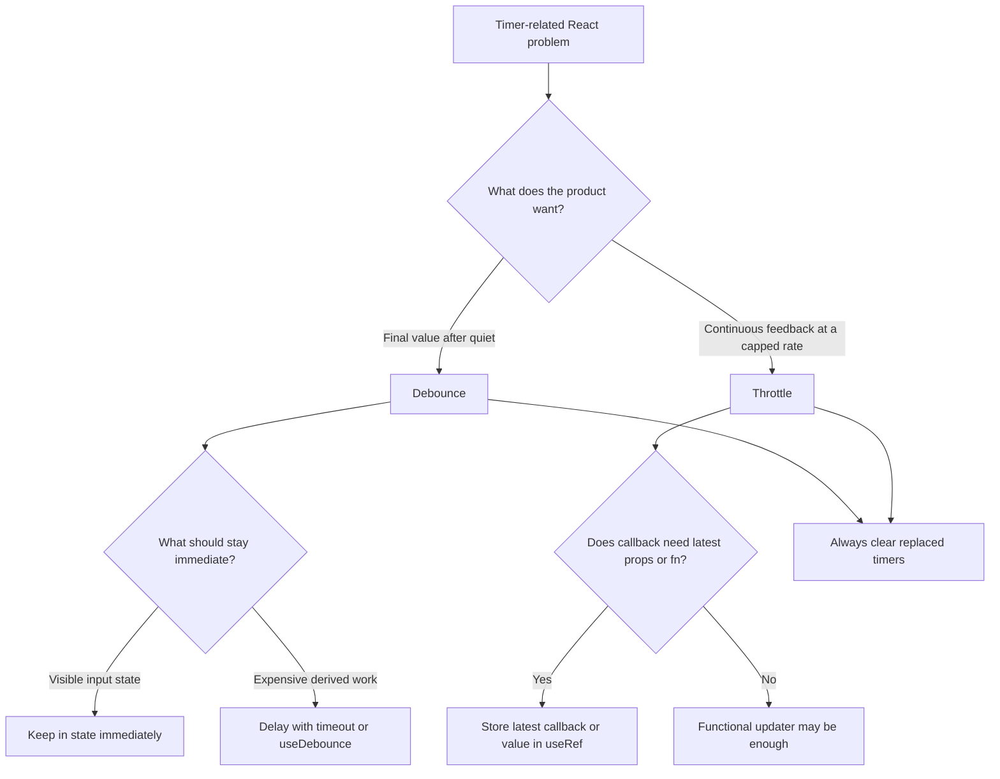

## Overview

Timing-hook bugs in React are rarely about not knowing that `setTimeout` exists. They are usually about choosing the wrong timing tool, wiring it to the wrong value, or forgetting that React re-renders while timers keep running outside that render cycle.

**The React timing problem:** timer callbacks keep whatever state, props, and functions they captured when the timer was created. If those values change later, the timer does not automatically see the update.

**The debounce problem:** debounce is for "wait until the user stops." It should delay expensive work, not delay the controlled input itself.

**The throttle problem:** throttle is for "keep reacting, but cap the rate." It is the wrong tool when you need the final settled value after typing.

**Level 1** teaches how stale closures show up in intervals and timeouts, and how to fix them with a functional updater or a ref.

**Level 2** teaches how to use debounce correctly in React: keep raw UI state immediate, debounce the derived work, and clean up pending timers.

**Level 3** teaches common interview mistakes: choosing throttle instead of debounce, cleaning up autosave timers, and keeping rate-limited callbacks stable when parent callbacks change.

## Core Concept & Mental Model

The problem in this guide is not "how do I build a timer utility from scratch?" The problem is "when a timer appears in React code, what exactly can go wrong, and what shape should the fix take?"

### The Render Snapshot vs. The Running Timer

React code runs in renders. Timers run later.

When you create a timer callback, that callback closes over the render that created it. If the callback reads `count`, `query`, or `saveDraft`, it reads the version from that render unless you deliberately route it to something current.

```ts
function useBrokenCounter(delay: number) {
  const [count, setCount] = useState(0);

  useEffect(() => {
    const id = setInterval(() => {
      setCount(count + 1); // count came from the render that created this interval
    }, delay);

    return () => clearInterval(id);
  }, [delay]);
}
```

That interval is still alive after later renders happen. The callback did not "follow along" to newer values. This is the root cause behind stale closures, old props inside timers, and debounced callbacks that call outdated functions.

### The Three Fix Shapes

Most React timing bugs reduce to one of three fixes.

**Fix shape 1: functional updater.** Use this when the timer only needs to update one piece of state from its previous value.

```ts
setCount(prev => prev + 1);
```

This works because React supplies the current state at update time. The timer no longer needs to read `count` from the closure.

**Fix shape 2: ref for the latest value or callback.** Use this when the timer must read the current prop, state, or callback at fire time.

```ts
const saveRef = useRef(saveDraft);
saveRef.current = saveDraft;
```

The timer keeps a stable reference to the ref object, and reads `saveRef.current` when it fires.

**Fix shape 3: cleanup.** Use this when a timer should no longer matter because the input changed, the component unmounted, or a new timer replaced the old one.

```ts
return () => clearTimeout(id);
```

Without cleanup, old work still runs. That is how you get duplicate autosaves, stale searches, and callbacks that fire after unmount.

### Debounce vs. Throttle

Interview questions often hide the real decision inside product language.

If the product says:

- "wait until the user pauses typing"
- "only search after input settles"
- "save after editing stops"

that is **debounce**.

If the product says:

- "keep updating during scroll"
- "report pointer movement, but not on every pixel"
- "show continuous feedback at a capped rate"

that is **throttle**.

The key difference:

- **Debounce** suppresses intermediate calls and gives you the final quiet value.
- **Throttle** allows intermediate calls, but only at a limited frequency.

Choosing the wrong one is not a micro-optimization mistake. It changes the user experience.

### What Good React Timer Design Looks Like

A solid React timer solution usually separates three concerns:

1. **Immediate UI state**
2. **Delayed or rate-limited derived work**
3. **Timer lifecycle cleanup**

For a search box, the text input should update immediately on every keystroke. Only the search query used for fetching should lag behind.

```ts
const [inputValue, setInputValue] = useState('');
const debouncedQuery = useDebounce(inputValue, 300);
```

That separation is the difference between "typing feels broken" and "the input is responsive, but the expensive work waits."

---

## Building Blocks: Progressive Learning

### Level 1: Spot the Stale Closure First

Before you worry about debounce or throttle, you need to recognize the baseline timing bug: a timer callback reads from an old render.

#### **Exercise 1**

`useIncrementor` is a classic interview trap. The interval keeps reading the first-render `count`, so `setCount(count + 1)` never progresses past `1`. Predict the broken behavior first, then fix it with the functional updater. This is the right fix because the timer only needs the previous `count`, not any other changing value.

:::stackblitz{file="step1-exercise1-problem.ts" step=1 total=3 solution="step1-exercise1-solution.ts"}

#### **Exercise 2**

`useCounterWithStep` shows where the functional updater stops being enough. The state update itself is fine, but the timer also reads `step`, and `step` is a prop that can change. Fix it with a ref that tracks the latest `step`, then read from that ref inside the interval.

:::stackblitz{file="step1-exercise2-problem.ts" step=1 total=3 solution="step1-exercise2-solution.ts"}

#### **Exercise 3**

`useInterval` packages the same fix into a reusable hook. The interval should stay mounted while always calling the latest callback. Complete the missing ref sync so the hook reads the current callback instead of the one from the first render.

:::stackblitz{file="step1-exercise3-problem.ts" step=1 total=3 solution="step1-exercise3-solution.ts"}

> **Mental anchor**: "The timer sees the render that created it unless I route it to something current."

**Bridge to Level 2**: Once you can trust what the timer reads, the next question is what work should be delayed at all. Debounce is usually about delaying expensive side effects, not delaying the visible UI.

### Level 2: Use Debounce the React Way

Debounce in React is mostly a design question: what should stay immediate, what should wait, and which pending timer should be canceled?

#### **Exercise 1**

`useDebounce` should return the latest value only after a quiet period. Right now the timeout is scheduled, but the hook does not actually commit the new value when the delay expires. Finish the update so this hook can drive a debounced search query.

:::stackblitz{file="step2-exercise1-problem.ts" step=2 total=3 solution="step2-exercise1-solution.ts"}

#### **Exercise 2**

This hook makes a common product mistake: it debounces the visible input state itself, so typing feels delayed. Fix it by keeping `inputValue` immediate and only debouncing the derived `debouncedQuery`. That is the hook shape for a search bar where the UI stays responsive while fetching waits for silence.

How to think about it:

1. Which value belongs to the controlled input right now?
2. Which value should lag behind because it drives expensive work?
3. Which one should the timeout update?

:::stackblitz{file="step2-exercise2-problem.ts" step=2 total=3 solution="step2-exercise2-solution.ts"}

#### **Exercise 3**

`useDebouncedCallback` is the React version of "delay the side effect, not the input." The wrapper should stay stable across renders, but the callback it eventually invokes must be the latest one. Fix the pending timer so the hook debounces calls correctly without recreating the wrapper every render.

:::stackblitz{file="step2-exercise3-problem.ts" step=2 total=3 solution="step2-exercise3-solution.ts"}

> **Mental anchor**: "Debounce the expensive consequence, not the user's visible typing."

**Bridge to Level 3**: After you can debounce the right thing, interview questions usually move to failure modes: cleanup, stale callbacks, and choosing throttle when the product needs continuous feedback.

### Level 3: Debug the Interview Mistakes

The last step is recognizing timing bugs in realistic hook code. The code usually looks close to correct. The mistake is in the product interpretation or lifecycle edge case.

#### **Exercise 1**

This scroll-reporting hook uses the wrong rate-limiter. The requirement says the callback should fire during movement, just not on every event. That is a throttle problem, not a debounce problem. Switch the hook to use the correct utility so the first event reports immediately and later events are capped by the cooldown.

How to think about it:

1. Does the product want the final settled value after silence, or ongoing feedback during activity?
2. Which utility matches that user experience?
3. What should happen on the very first event?

:::stackblitz{file="step3-exercise1-problem.ts" step=3 total=3 solution="step3-exercise1-solution.ts"}

#### **Exercise 2**

`useAutoSaveDraft` has the right product goal, but the timer lifecycle is wrong. When the user keeps typing, the old save should be canceled. When the component unmounts, nothing should fire later. Fix the timeout cleanup so autosave only persists the latest draft after the quiet period.

:::stackblitz{file="step3-exercise2-problem.ts" step=3 total=3 solution="step3-exercise2-solution.ts"}

#### **Exercise 3**

`useThrottledCallback` is the capstone bug. The wrapper should be stable, the callback should stay fresh, and the cooldown should be enforced from call to call. Finish the throttle logic so parent renders can change `fn` without recreating the wrapper or breaking the cooldown.

:::stackblitz{file="step3-exercise3-problem.ts" step=3 total=3 solution="step3-exercise3-solution.ts"}

> **Mental anchor**: "Most timing-hook bugs are product-shape mistakes or lifecycle mistakes disguised as small code bugs."

## Key Patterns

### Separate Immediate State from Delayed Work

**When to use it:** search inputs, autosave drafts, validation after typing pauses.

**What it prevents:** laggy controlled inputs and UI that feels broken because the visible state waits on the timer.

```ts
const [inputValue, setInputValue] = useState('');
const debouncedQuery = useDebounce(inputValue, 300);
```

### Use a Functional Updater When the Timer Only Writes State

**When to use it:** intervals or timeouts that only need the previous version of the same state value.

**What it prevents:** stale closure bugs without adding a ref that the code does not actually need.

```ts
setCount(prev => prev + 1);
```

### Use a Ref When the Timer Must Read the Current Value

**When to use it:** `useInterval`, debounced callbacks, autosave hooks, subscriptions, or any timer that must call the latest prop or callback.

**What it prevents:** firing old callbacks, saving old data, or reading a prop from the render that created the timer.

```ts
const fnRef = useRef(fn);
fnRef.current = fn;
```

### Always Clear Replaced or Abandoned Timers

**When to use it:** debounce, autosave, delayed validation, or any hook that schedules work that can become obsolete.

**What it prevents:** duplicate work, outdated requests, and callbacks firing after unmount.

```ts
useEffect(() => {
  const id = setTimeout(doWork, delay);
  return () => clearTimeout(id);
}, [doWork, delay]);
```

### Match the Utility to the Product Language

**When to use it:** whenever the prompt says "after the user stops" or "while the user keeps moving."

**What it prevents:** using debounce where the product needs continuous feedback, or using throttle where the product needs the final settled value.

```ts
// "After typing stops" -> debounce
// "During scroll, but not every event" -> throttle
```

---

## Decision Framework

| The requirement says... | Use... |
|---|---|
| "Wait until the user stops typing" | Debounce |
| "Keep updating during scroll or drag, but cap the rate" | Throttle |
| "Update based only on the previous state value" | Functional updater |
| "Read the latest prop, state, or callback when the timer fires" | `useRef` |
| "Cancel stale pending work when input changes or component unmounts" | `clearTimeout` or `clearInterval` in cleanup |



## Common Gotchas & Edge Cases

**Gotcha 1: Debouncing the controlled input value itself**

Why it happens: the developer knows searching should wait, so they put the input state update inside the timeout.

Why it is wrong: the user's typing now lags behind the keyboard. The UI feels broken even though the network traffic dropped.

The fix: update visible input state immediately, debounce only the derived query or side effect.

**Gotcha 2: Recreating a debounced or throttled callback every render**

Why it happens: the hook closes over `fn`, so `useCallback(..., [fn, delay])` looks natural.

Why it is wrong: every render resets the wrapper's internal timer or cooldown state. The rate limiter stops behaving like one consistent instance.

The fix: keep the wrapper stable and read the latest callback through a ref.

**Gotcha 3: Forgetting to cancel old timers**

Why it happens: the timeout "works" for the happy path, so cleanup feels optional.

Why it is wrong: outdated saves, searches, or validations still fire after newer input arrives or after unmount.

The fix: return cleanup from the effect, and cancel any pending timer before scheduling a replacement.

**Gotcha 4: Using throttle for a search box**

Why it happens: both throttle and debounce reduce event frequency, so they seem interchangeable.

Why it is wrong: throttle can fire while the user is still typing, which means searches happen for intermediate queries the user never intended to submit.

The fix: if the product wants the final quiet value, use debounce.
