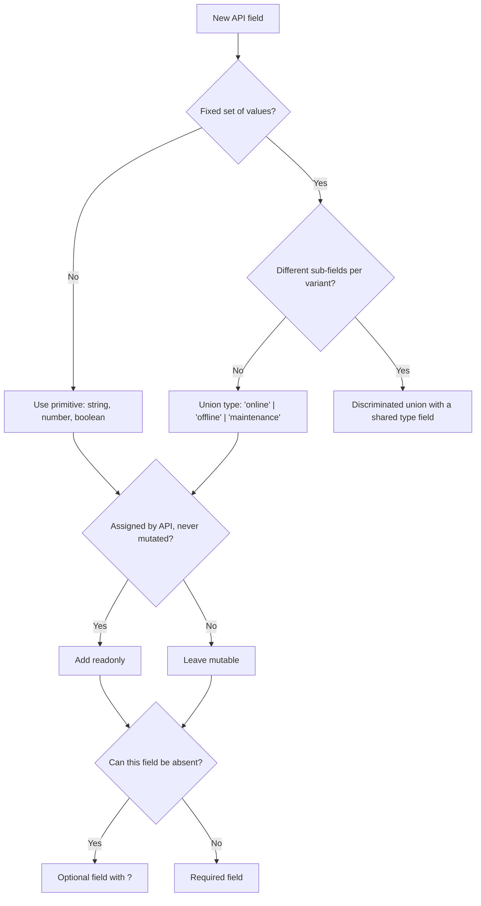

## Overview

The Plant Floor Monitor receives device data, tag assignments, and alarm events from a REST API. Before any component touches that data, the types have to be defined. A `fetch` call returns `Promise<any>` -- the JSON payload is structurally invisible to the compiler until you assert a type at the boundary. This guide builds the TypeScript modeling skills needed to define those contracts so every subsequent layer of the app -- fetch functions, hooks, components -- works against verified shapes.

**The project pressure:** The dashboard renders device names, statuses, tags, and alarms. All of those fields come from the API. Without type contracts, a renamed field in the API response is a runtime bug instead of a compile error.

**The TypeScript pressure:** String fields for status and event types let any value through. The compiler cannot catch `device.staus` or `status === 'connected'` without a precise type definition.

**Level 1** teaches basic interfaces: defining a shape, marking immutable fields with `readonly`, and handling optional API fields.

**Level 2** teaches union types: replacing unconstrained strings with exact literal values, exhaustive status switches, and discriminated unions for event payloads.

**Level 3** teaches interface composition: building the `Device`, `Tag`, and `Alarm` contracts from smaller reusable types so a change in one type propagates everywhere it is used.

## Core Concept & Mental Model

### The Spec Sheet Before the Shipment

In Plant Floor Monitor, device data comes from the API as raw JSON. Before a component renders `device.name` or checks `device.status`, that JSON is structurally invisible to TypeScript. Every field access is an assumption the compiler cannot verify.

An interface is the spec sheet the compiler uses to check those assumptions. The spec sheet is written before the first shipment arrives -- before any fetch code, before any component. It says: "a `Device` has exactly these fields with exactly these types." Once the spec exists, the compiler checks every field access, every assignment, and every function signature against it.

Think of it like a device data sheet from a hardware vendor. The sheet lists every attribute the device exposes: serial number (string, read-only), current status (one of three fixed values), list of assigned tags. No attribute outside that list is accessible. The inspector -- the TypeScript compiler -- rejects any code that references an undocumented field or assigns an invalid value.

### Two Roles, One Definition

**Role 1: Name the shape.** An interface gives a name to a collection of field contracts. That name appears in function parameters, return types, component props, and test fixtures. Every reference checks against the same definition.

**Role 2: Move errors left.** `device.staus` produces a runtime error that surfaces in testing or production. With a typed contract, the same typo fails at compile time before the code runs.

### Interfaces in Code

```ts
interface Device {
  readonly id: string;
  name: string;
  status: DeviceStatus;
  tags: Tag[];
  lastSeenAt?: string;
}
```

`readonly` marks a field that cannot be reassigned after the object is created. Optional fields (`?`) may be absent in the payload. Both constraints are enforced at compile time.

### Where Union Types Come In

An interface field typed as `string` for a status accepts any string: `'online'`, `'typo'`, `''`. A union narrows that to the exact values the API can produce:

```ts
type DeviceStatus = 'online' | 'offline' | 'maintenance';
```

After that definition, `device.status = 'typo'` is a compile error. A `switch` on `DeviceStatus` that is missing a branch is also detectable.

### Discriminated Unions for Event Payloads

API event payloads often share a `type` field but carry different sub-fields per type. A discriminated union models that directly:

```ts
type AlarmEvent =
  | { type: 'threshold'; tagId: string; threshold: number; actual: number }
  | { type: 'connection'; deviceId: string; reason: string };
```

After a check on `event.type`, TypeScript narrows automatically. Inside the `'threshold'` branch, `event.tagId` and `event.threshold` are accessible. `event.deviceId` is not.

---

## Building Blocks: Progressive Learning

### Level 1: Interfaces as Field Contracts

The first thing any Plant Floor Monitor function needs is a way to say "this parameter is a device." Without a type, a function that renders device data accepts anything and verifies nothing. An interface gives the compiler a complete picture of what fields exist and what types they hold.

Write the interface before the first function that uses it. Every field the API can send belongs in the definition. Fields that are always present are required. Fields that can be absent are optional.

```ts
interface Device {
  id: string;
  name: string;
  isOnline: boolean;
}

function formatDevice(device: Device): string {
  return `${device.name} (${device.isOnline ? 'online' : 'offline'})`;
}
```

The three exercises at this level each introduce one new addition to the basic interface shape.

#### **Exercise 1**

Define a `Device` interface with `id: string`, `name: string`, and `isOnline: boolean`. Write a `formatDevice` function that accepts a `Device` and returns a string in the form `"Device Name (online)"` or `"Device Name (offline)"`. The function signature enforces the contract: any caller that passes a non-Device or reads an unlisted field fails the compiler check.

:::stackblitz{file="step1-exercise1-problem.ts" step=1 total=3 solution="step1-exercise1-solution.ts"}

#### **Exercise 2**

Add `readonly id: string` and a required `createdAt: string` field to `Device`. Write a `createDevice` factory function that returns a `Device`. Observe that the compiler prevents reassigning `id` after creation. The goal is to internalize that `readonly` is enforced at the assignment site, not just at the declaration.

:::stackblitz{file="step1-exercise2-problem.ts" step=1 total=3 solution="step1-exercise2-solution.ts"}

#### **Exercise 3**

Add `lastSeenAt?: string` to `Device`. Write a `getLastSeen(device: Device): string` function that returns the `lastSeenAt` value when present or `'never'` when absent. The optional field forces an explicit presence check before use -- the compiler will not allow reading an optional field as if it were always defined.

:::stackblitz{file="step1-exercise3-problem.ts" step=1 total=3 solution="step1-exercise3-solution.ts"}

> **Mental anchor**: "Write the interface before the first function that uses it. Every required field is a contract. Every optional field is a choice the caller has to handle."

**Bridge to Level 2**: Level 1 interfaces can hold any `string` for fields like status. That means a typo, an invalid value, or a new status variant the code does not handle all compile without errors. Level 2 fixes that by narrowing string fields to exact literal values.

### Level 2: Union Types and Status Modeling

A bare `string` type on a status field says "this field exists and is a string." A union type says "this field is exactly one of these three values." That is a much stronger contract. It enables a class of checks the compiler can verify: exhaustive switches, type-narrowed branches, and literal comparison safety.

The pattern for defining a status union is one line:

```ts
type DeviceStatus = 'online' | 'offline' | 'maintenance';
```

After that, `device.status === 'connected'` is a compile error because `'connected'` is not a member of `DeviceStatus`. A switch statement on `DeviceStatus` can be made exhaustive with a never-check:

```ts
function getStatusLabel(status: DeviceStatus): string {
  switch (status) {
    case 'online': return 'Online';
    case 'offline': return 'Offline';
    case 'maintenance': return 'Under Maintenance';
    default: {
      const exhausted: never = status;
      throw new Error(`Unhandled status: ${exhausted}`);
    }
  }
}
```

If a new value is added to `DeviceStatus` without a corresponding `case`, the assignment `const exhausted: never = status` fails the compiler check because the new value is not assignable to `never`.

#### **Exercise 1**

Replace `isOnline: boolean` with `status: DeviceStatus` where `type DeviceStatus = 'online' | 'offline' | 'maintenance'`. Update the `Device` interface and revise `formatDevice` to use the new field. Observe that the compiler now rejects any string that is not one of the three allowed values.

:::stackblitz{file="step2-exercise1-problem.ts" step=2 total=3 solution="step2-exercise1-solution.ts"}

#### **Exercise 2**

Write a `getStatusLabel(status: DeviceStatus): string` function using an exhaustive switch. Add the never-check in the default branch. Then temporarily add a fourth value to `DeviceStatus` and observe the compile error before reverting.

:::stackblitz{file="step2-exercise2-problem.ts" step=2 total=3 solution="step2-exercise2-solution.ts"}

#### **Exercise 3**

Define an `AlarmEvent` discriminated union with `'threshold'` and `'connection'` variants. Write `describeAlarm(event: AlarmEvent): string` that returns a human-readable description. TypeScript should narrow the type inside each branch so fields exclusive to one variant are not accessible in the other.

:::stackblitz{file="step2-exercise3-problem.ts" step=2 total=3 solution="step2-exercise3-solution.ts"}

> **Mental anchor**: "A union is a named set of exact values. A discriminated union uses one shared field to distinguish shapes. Both narrow automatically when you check the value."

**Bridge to Level 3**: Level 2 types are useful individually. Level 3 connects them: `Device` references `Tag[]`, `Alarm` references `AlarmEvent`. When one sub-type changes, the compiler surfaces everywhere the change matters.

### Level 3: Composing Contracts from Smaller Types

Real API payloads are nested. A device carries its tags. An alarm carries its event details. If every interface defines all its fields inline, changing a shared sub-type means finding and updating every interface that duplicated it. Composition avoids that: each interface references the types it depends on by name, and a change to a sub-type propagates automatically through the compiler's type-check.

```ts
interface Tag {
  id: string;
  name: string;
  unit: string;
  value: number;
}

interface Device {
  readonly id: string;
  name: string;
  status: DeviceStatus;
  tags: Tag[];
  lastSeenAt?: string;
}
```

`Device` does not restate what a `Tag` looks like. It holds a reference to the `Tag` type. The compiler connects the two: a function that accepts `Device` and reads `device.tags[0].name` verifies both that `tags` is an array of `Tag` and that `Tag` has a `name: string` field.

#### **Exercise 1**

Define a `Tag` interface with `id`, `name`, `unit`, and `value` fields. Update `Device` to include `tags: Tag[]`. Write `getTagNames(device: Device): string[]` that returns the name of each tag. The compiler verifies every field access through the composed types.

:::stackblitz{file="step3-exercise1-problem.ts" step=3 total=3 solution="step3-exercise1-solution.ts"}

#### **Exercise 2**

Define an `Alarm` interface with `id`, `deviceId`, `severity` (a three-value union), `event: AlarmEvent`, and `triggeredAt`. Write `getCriticalAlarms(alarms: Alarm[]): Alarm[]` that filters to alarms where `severity === 'critical'`. The return type forces the compiler to verify the filter predicate matches the `Alarm` shape.

:::stackblitz{file="step3-exercise2-problem.ts" step=3 total=3 solution="step3-exercise2-solution.ts"}

#### **Exercise 3**

Define an `ApiPayload` type that composes all three: `{ devices: Device[]; alarms: Alarm[] }`. Write `summarizePayload(payload: ApiPayload)` that returns `{ deviceCount: number; onlineCount: number; criticalAlarmCount: number }`. All field accesses are verified through the full nested type chain.

:::stackblitz{file="step3-exercise3-problem.ts" step=3 total=3 solution="step3-exercise3-solution.ts"}

> **Mental anchor**: "Compose interfaces instead of duplicating fields. A reference to a sub-type propagates compiler verification through every level of nesting."

## Key Patterns

### Pattern 1: Readonly for Immutable Identity Fields

**When to use:** mark a field `readonly` when the application should never reassign it after the object is created. API-assigned IDs, creation timestamps, and entity slugs are common candidates.

**What it costs:** nothing at runtime. `readonly` is erased during compilation. The constraint is compile-time only.

**How to think about it:** a mutable `id` means a function can silently overwrite an entity's identity. That class of bug is typically caught late, in tests or in the database. `readonly` prevents it at the assignment site.

```ts
interface Device {
  readonly id: string;
  name: string;
}

const device: Device = { id: 'dev-001', name: 'Reactor A' };
// device.id = 'dev-002'; // Error: Cannot assign to 'id' because it is a read-only property.
```

### Pattern 2: String Literal Unions for Constrained Fields

**When to use:** use a union type instead of `string` whenever a field holds a value from a fixed set. API status codes, event types, severity levels, and category labels are all candidates.

**What it costs:** you must update the union definition when the API adds a new valid value. That is the point: the compiler forces you to handle new cases explicitly.

**How to think about it:** `string` is the type of every possible string. `'online' | 'offline' | 'maintenance'` is the type of exactly three strings. The narrower type is more information. Every comparison against a union value can be verified, and exhaustive switches become possible.

```ts
type DeviceStatus = 'online' | 'offline' | 'maintenance';

function isDeviceActive(status: DeviceStatus): boolean {
  return status === 'online';
}
```

### Pattern 3: Discriminated Unions for Variant Payloads

**When to use:** use a discriminated union when an API sends different field shapes depending on the value of one shared field. Alarm events, webhook payloads, and notification types commonly follow this pattern.

**What it costs:** every consumer of the type must handle each variant. The compiler enforces this with exhaustive checks.

**How to think about it:** a discriminated union is a type that says "this is one of N shapes, and you know which one by reading the discriminant field." After narrowing on the discriminant, the compiler knows exactly which other fields are present.

```ts
type AlarmEvent =
  | { type: 'threshold'; tagId: string; threshold: number; actual: number }
  | { type: 'connection'; deviceId: string; reason: string };

function describeAlarm(event: AlarmEvent): string {
  if (event.type === 'threshold') {
    return `Tag ${event.tagId} exceeded ${event.threshold} (actual: ${event.actual})`;
  }
  return `Device ${event.deviceId} disconnected: ${event.reason}`;
}
```

---

## Decision Framework



| Situation | What to use |
|---|---|
| Fixed set of allowed strings | String literal union |
| Different payload shapes per variant | Discriminated union |
| Field set by the API, never mutated | `readonly` |
| Field that may be absent in the response | Optional field with `?` |
| Shared sub-object across multiple interfaces | Separate named interface |

## Common Gotchas & Edge Cases

**Gotcha 1: Using `string` instead of a literal union for status fields**

Why it happens: it is quicker to write `status: string` and the code works at first. The problem is invisible until a comparison against an invalid literal compiles without error and the mismatch surfaces at runtime.

Fix: define a named union type as soon as the field has a fixed set of values. Replace `string` with the union. The compiler will surface every comparison and assignment that needs updating.

**Gotcha 2: Optional fields used as if they are always defined**

Why it happens: the API returns the field in most cases, so code is written assuming it is always present. A new device with no `lastSeenAt` produces a runtime error.

Fix: check for presence before accessing. TypeScript in strict mode rejects `device.lastSeenAt.toUpperCase()` when the field is optional. Use a guard (`if (device.lastSeenAt)`) or nullish coalescing (`device.lastSeenAt ?? 'never'`).

**Gotcha 3: Accessing variant-specific fields outside a narrowing check**

Why it happens: it seems redundant to check `event.type === 'threshold'` when you "know" the event is a threshold alarm at that call site.

Fix: TypeScript cannot verify what you know; it can only verify what the code proves. Add the discriminant check. The narrowing is free at runtime and makes the code self-documenting.

**Gotcha 4: Missing a variant in a discriminated union switch**

Why it happens: a new variant is added to the API contract and the union type is updated, but not every switch that handles the union is revisited.

Fix: add an exhaustive check in the default branch. Assigning the unhandled value to `never` makes the compiler emit an error when a case is missing. This turns a runtime gap into a compile-time failure.

**Gotcha 5: Duplicating interface fields instead of composing**

Why it happens: it is faster to copy tag fields into the device interface than to define a separate `Tag` interface and reference it.

Fix: extract shared shapes into their own named interfaces. When the API changes a field on `Tag`, one edit propagates everywhere. Duplication means updating every inline copy manually.
